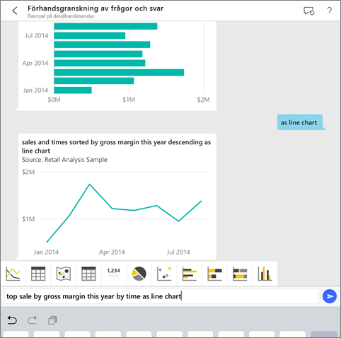
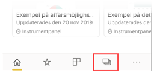
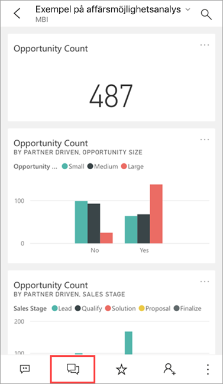
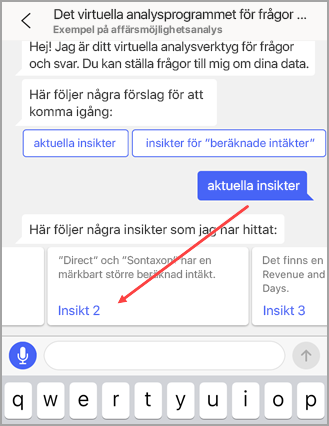
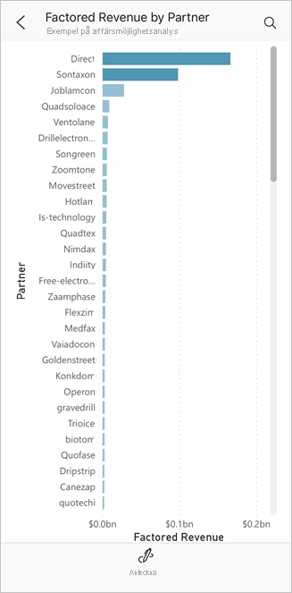
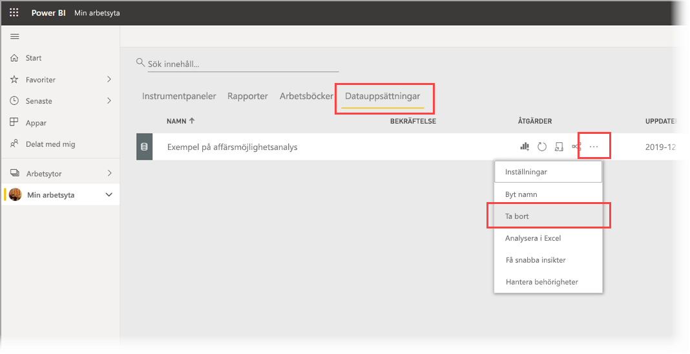

# Självstudie: Ställ frågor om dina data med det virtuella analysverktyget Frågor och svar i Power BI iOS-appar

Det enklaste sättet att lära dig om dina data är att ställa frågor om dem med dina egna ord. I den här självstudien ställer du frågor och visar aktuella insikter om exempeldata med det virtuella analysverktyget Frågor och svar i Microsoft Power BI-mobilappen på din iPad eller iPhone. 

Gäller för:

|  |  |
|:--- |:--- |
| iPhone-telefoner |iPad-surfplattor |

Det virtuella analysverktyget Frågor och svar är en konversationsbaserad BI-upplevelse som använder sig av underliggande data för frågor och svar i [Power BI-tjänsten](https://powerbi.com). Det föreslår datainsikter och du kan skriva in eller ställa egna frågor muntligt.

I den här självstudien kommer vi att:

> [!div class="checklist"]
> * Installera Power BI-mobilappen för iOS
> * Ladda ned en Power BI-exempelinstrumentpanel och -rapport
> * Se vilka aktuella insikter som mobilappen föreslår

## Förutsättningar

* **Registrera dig för Power BI**: Om du inte har registrerat dig för Power BI [registrerar du dig för en kostnadsfri utvärderingsversion](https://app.powerbi.com/signupredirect?pbi_source=web) innan du börjar.
* **Installera appen Power BI för iOS**: [Ladda ned iOS-appen](https://apps.apple.com/app/microsoft-power-bi/id929738808) från Apple App Store till din iPad, iPhone eller iPod Touch. Följande versioner stöder Power BI-appen för iOS:
  * iPad med iOS 11 eller senare.
  * iPhone 5 och senare med iOS 11 eller senare. 
  * iPod Touch med iOS 11 eller senare.
* **Ladda ned exempeldata**: Det första steget är att ladda ned **Exempel på affärsmöjlighetsanalys** till Power BI-tjänsten. Instruktioner om hur du gör detta finns i [Ladda ned exempel till Min arbetsyta i Power BI-tjänsten](./mobile-apps-download-samples.md).

När du har slutfört kraven och laddat ned exempeldata är du redo att visa exemplen på din iOS-enhet.

## Testa aktuella insikter
1. Öppna Power BI-appen på din iPhone eller iPad och logga in med dina Power BI-kontouppgifter, samma som du använde i Power BI-tjänsten i webbläsaren.

2. I navigeringsfältet på startsidan trycker du på ikonen **Arbetsytor**.

    

3. När sidan Arbetsytor öppnas trycker du på **Mina arbetsytor** och sedan på instrumentpanelen **Exempel på affärsmöjlighetsanalys** för att öppna den.

3. På instrumentpanelen Exempel på affärsmöjlighetsanalys trycker du på ikonen för det virtuella analysverktyget Frågor och svar i åtgärdsmenyn.

    

    Det virtuella analysverktyget Frågor och svar erbjuder några förslag för att komma igång.

    

3. Tryck på **aktuella insikter**.

4. Den virtuella analysen Q & A föreslår vissa insikter. Bläddra till höger och tryck på **Insikt 2**.

    

   Det virtuella analysverktyget Frågor och svar visas Insikt 2.

    

5. Tryck på diagrammet för att öppna det i fokusläge.

    

6. Tryck på pilen i det övre vänstra hörnet att gå tillbaka till Frågor och svar.

## Rensa resurser

När du är klar med självstudien kan du ta bort instrumentpanelen, rapporter och datauppsättningen för exemplet på affärsmöjlighetsanalys.

1. Öppna Power BI-tjänsten ([Power BI-tjänsten](https://app.powerbi.com)) och logga in.

2. I navigeringsfönstret väljer du **Min arbetsyta**.

3. Klicka på fliken Instrumentpaneler och sedan på papperskorgen på raden för Exempel på affärsmöjlighetsanalys.

    

    Välj nu på fliken Rapporter och gör samma sak.

4. Välj nu fliken Datamängder, klicka på **Fler alternativ** (...) och välj sedan **Ta bort**.

    

## Nästa steg

Du har nu testat den virtuella assistenten Frågor och svar i Power BI-appar för iOS. Läs mer om Frågor och svar i Power BI-tjänsten.
> [!div class="nextstepaction"]
> [Frågor och svar i Power BI-tjänsten](../end-user-q-and-a.md)