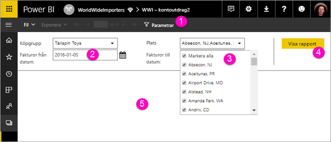

# Visa parametrar för sidnumrerade rapporter i Power BI-tjänsten

I den här artikeln lär du dig att interagera med parametrar för sidnumrerade rapporter i Power BI-tjänsten.  En rapportparameter ger ett sätt att filtrera rapportdata på. Parametrar erbjuder en lista över tillgängliga värden och du kan välja ett eller flera värden. Parametrar har ibland ett standardvärde, och ibland måste du välja ett värde innan du kan se rapporten.  

När du visar en rapport som har parametrar, visar rapportgranskarens verktygsfält varje parameter så att du kan ange värden interaktivt. Följande bild visar parameterområdet för en rapport med parametrar för **Köpa grupp**, **Plats**, ett **Datum från**, och ett **Datum till**.  

## Parameterfönstret i Power BI-tjänsten

  
1.  **Parameterfönstret** rapportgranskarens verktygsfält visar ett meddelande, till exempel ”krävs” eller ett standardvärde för varje parameter.    
  
2.  **Datumparametrar för fakturor från/till**  De två parametrarna har standardvärden. Ange ett datum i textrutan eller välj ett datum i kalendern för att ändra datum.  
  
3.  **Platsparametern** Platsparametern är inställd på att du kan välja en, flera eller alla värden. 
  
4.  **Visa rapporten** När du angett eller ändrat parametervärden, klickar du på **Visa rapport** för att köra rapporten. 

5. **Standardvärden** Om alla parametrar har standardvärden, körs rapporten automatiskt i första vyn. Vissa parametrar i den här rapporten hade inte standardvärden, så du ser inte rapporten förrän du väljer värden.  

## Nästa steg

[Sidnumrerade rapporter i Power BI-tjänsten](end-user-paginated-report.md)
