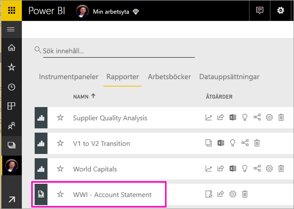
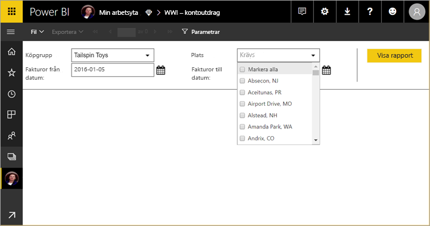
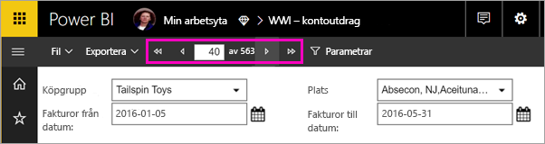
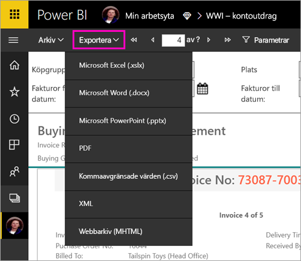

# Visa en sidnumrerad rapport i Power BI-tjänsten

I den här artikeln får du lära dig hur du visar en sidnumrerad rapport i Power BI-tjänsten. Sidnumrerade rapporter är rapporter som skapas i Report Builder och överförs till en arbetsyta i en Premium-kapacitet. Leta efter diamantikonen  bredvid arbetsytans namn. 

Sidnumrerade rapporter har en egen ikon .

Du kan också exportera sidnumrerade rapporter till flera olika format: 

- Microsoft Excel
- Microsoft Word
- Microsoft PowerPoint
- PDF
- Kommaavgränsade värden
- XML
- Webbarkiv (MHTML)

## Visa en sidnumrerad rapport

1. Välj den sidnumrerade rapporten i arbetsytan.

    

2. Om rapporten har parametrar, som den här, ser du eventuellt inte rapporten när du öppnar den. Välj parametrar och välj sedan **Visa rapport**. 

     

    Du kan också ändra parametrarna när som helst.

1. Bläddra igenom rapporten genom att välja pilarna överst på sidan eller genom att skriva ett sidnummer i rutan.
    
   

4. Välj **Exportera** för att hitta ett format för att exportera dina sidnumrerade rapporter.

    

## Nästa steg

[Sidnumrerade rapporter i Power BI-tjänsten](end-user-paginated-report.md)
