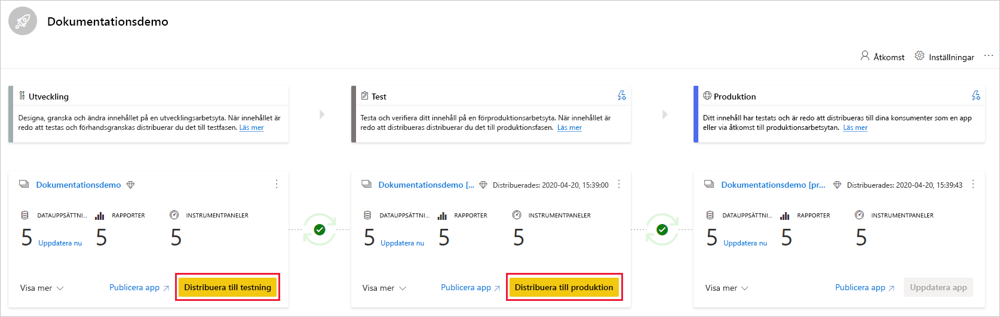
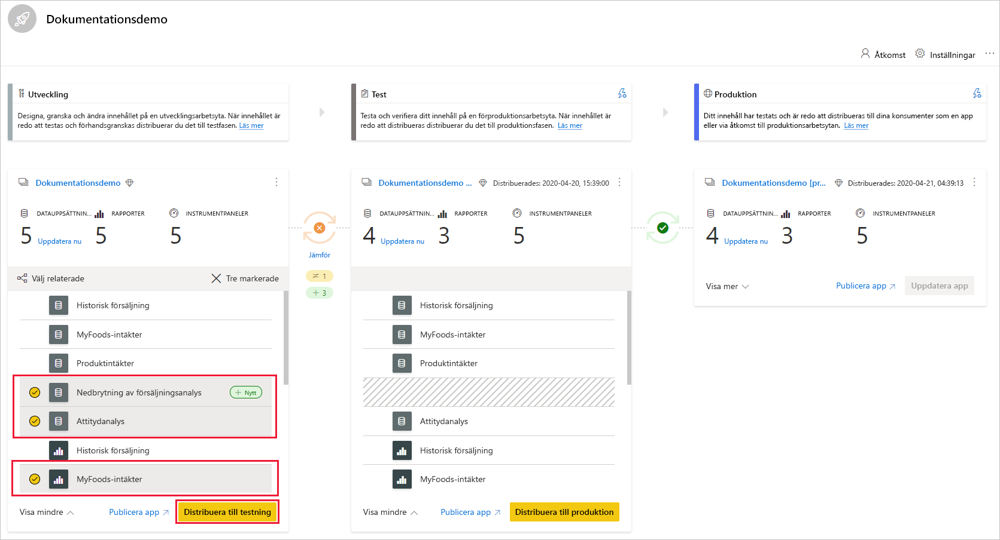
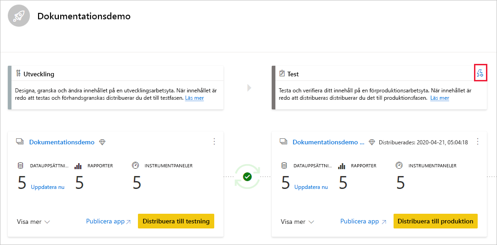
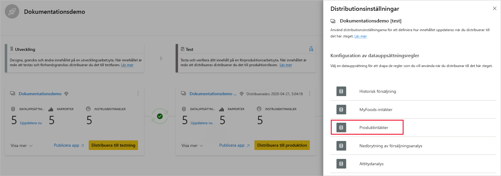
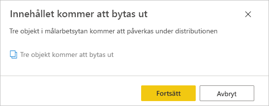

# Kom igång med distributionspipelines (förhandsversion)

Den här artikeln vägleder dig genom de grundläggande inställningarna som krävs för att använda distributionspipelines.

## Åtkomst till distributionspipelines

Du kommer att kunna komma åt distributionspipelinen om följande villkor är uppfyllda:

* Du är en Power BI [Pro användare](../admin/service-admin-purchasing-power-bi-pro.md)

* Du tillhör en organisation som har Premium-kapacitet

* Du är administratör för en [ny arbetsyta](../collaborate-share/service-create-the-new-workspaces.md)

>[!NOTE]
> Du kan också se knappen distributionspipeliner om du tidigare har skapat en pipeline eller om en pipeline har delats med dig.

## Steg 1 – Skapa en distributionspipeline

Om du vill skapa en distributionspipeline gör du följande:

1. I Power BI-tjänsten går du till navigeringsfönstret. Välj **distributionspipelines** och klicka på **Skapa pipeline**.

2. I dialogrutan *skapa en distributionspipeline* anger du ett namn och en beskrivning för pipelinen och klickar på **Skapa**.

När pipelinen har skapats kan du dela den med andra användare eller ta bort den. När du delar en pipeline med andra får de användare som du delar pipelinen med [åtkomst till pipelinen](deployment-pipelines-process.md#user-with-pipeline-access). Med pipelineåtkomst kan användarna visa, dela, redigera och ta bort pipelinen.

## Steg 2 – tilldela en arbetsyta till en distributionspipeline

När du har skapat en pipeline måste du lägga till det innehåll som du vill hantera i pipelinen. Att lägga till innehåll i pipelinen görs genom att tilldela en arbetsyta till pipelinefasen. Du kan tilldela en arbetsyta till alla faser. 

Du kan tilldela en arbetsyta till en distributionspipeline. Distributionspipelines skapar kloner av innehållet i arbetsytan som ska användas i olika steg i pipelinen.

Följ dessa steg om du vill tilldela en arbetsyta i en distributionspipeline:

1. I den nyligen skapade distributionspipelinen klickar du på **Tilldela en arbetsyta**.

2. Välj den arbetsyta som du vill tilldela pipelinen i *Välj arbetsyta* i listrutan.

3. Välj den fas som du vill tilldela arbetsytan till.

### Tilldelningsbegränsningar för arbetsytan

* Arbetsytan måste vara en [Ny funktion för arbetsytor](../collaborate-share/service-create-the-new-workspaces.md).

* Du måste vara administratör för arbetsytan.

* Arbetsytan är inte tilldelad någon annan pipeline.

* Arbetsytan måste finnas på en  [Premium-kapacitet](../admin/service-premium-what-is.md).

* Du kan inte tilldela en arbetsyta med [Power BI-exempel](../create-reports/sample-datasets.md) till en pipeline-fas.

>[!NOTE]
>Endast arbetsytor som kan användas med distributionspipelines visas i listan över arbetsytor som du kan välja från.

## Steg 3 – distribuera till en tom fas

Alla [Pro-användare](../admin/service-admin-purchasing-power-bi-pro.md) som är medlemar eller administratörer på källarbetsytan kan distribuera innehåll till en tom fas (en fas som inte innehåller innehåll). Arbetsytan måste finnas på en kapacitet för att distributionen ska kunna slutföras.

När du distribuerar innehåll till en tom fas bibehålls relationerna mellan objekten. Till exempel kommer en rapport som är kopplad till en datauppsättning i källfasen att klonas tillsammans med dess datauppsättning och klonerna är på samma sätt kopplade till målarbetsytan.

Uppdatera datauppsättningen när distributionen är klar. Mer information finns i [distribuera innehåll till en tom fas](deployment-pipelines-process.md#deploying-content-to-an-empty-stage).

### Distribuera allt innehåll

Välj den fas du vill distribuera från och klicka på distributionsknappen. Distributionsprocessen skapar en duplicerad arbetsyta i målfasen. Den här arbetsytan innehåller allt befintligt innehåll i den aktuella fasen.

### Selektiv distribution

Om du endast vill distribuera vissa objekt klickar du på länken **Visa fler** och väljer de objekt som du vill distribuera. När du klickar på knappen distribuera distribueras endast de markerade objekten till nästa steg.

Eftersom instrumentpaneler, rapporter och datauppsättningar är relaterade och har beroenden kan du använda knappen Välj relaterade för att kontrollera alla objekt som dessa objekt är beroende av. Om du till exempel vill distribuera en rapport till nästa fas kan du klicka på knappen Välj relaterad så markeras den datauppsättning som rapporten är ansluten till, så att båda ska distribueras samtidigt och rapporten inte bryts.

>[!NOTE]
> * Du kan inte distribuera en rapport eller instrumentpanel till nästa fas om objekten som den är beroende av inte finns i den fas som du distribuerar till.
> * Du kan få oväntade resultat om du väljer att distribuera en rapport eller instrumentpanel utan dess datauppsättning. Detta kan inträffa när datauppsättningen i målfasen har ändrats och inte längre är identisk med den som finns i den fas som du distribuerar från.

### Omvänd distribution

Du kan välja att distribuera till ett tidigare stadium, till exempel i ett scenario där du tilldelar en befintlig arbetsyta till en produktionsfas och sedan distribuerar den omvänt, först till testfasen och sedan till utvecklingsfasen.

Distribution till en tidigare fas fungerar bara om den föregående fasen är tomt. När du distribuerar till föregående steg kan du inte välja vissa objekt. Allt innehåll i steget kommer att distribueras.

## Steg 4 – skapa datauppsättningsregler

När du arbetar i en distributionspipeline kan olika fas ha olika konfigurationer. Varje fas kan till exempel ha olika databaser eller olika frågeparametrar. Utvecklingsfasen kan fråga exempeldata från databasen, medan test- och produktionsfaserna frågar hela databasen.

När du distribuerar innehåll mellan pipelinefaser kan du konfigurera datauppsättningsreglerna som gör det möjligt att tillåta ändringar i innehåll, samtidigt som vissa inställningar bevaras.

Datauppsättningsregler definieras på datakällor och parametrar i varje datauppsättning. De bestämmer värdena för datakällorna eller parametrarna för varje datauppsättning. Om du till exempel vill att en datauppsättning i en produktionsfas ska peka på en produktionsdatabas kan du definiera en regel för detta. Regeln definieras i produktionsfasen under motsvarande uppsättning. När regeln har definierats kommer innehåll som distribuerats från test till produktion att ärva det värde som definierats i datauppsättningsreglerna och detta gäller alltid så länge regeln är oförändrad och giltig.

>[!NOTE]
> Datauppsättningsregler fungerar bara när käll- och måldatakällan är av samma typ.

### Skapa en datauppsättningsregel

1. I pipelinesteget som du vill skapa en datauppsättningsregel för klickar du på **Distributionsinställningar**.

    

2. I fönstret distributionsinställningar väljer du den datauppsättning som du vill skapa en regel för.

    

3. Välj den typ av regel som du vill skapa, expandera listan och klicka på **Lägg till regel**.

     

### Regeltyper för datauppsättningar

Det finns två typer av regler som du kan skapa:

* **Regler för datakällor** Listan med datakällan hämtas från datauppsättningen för källans pipelinefas. I listan datakälla väljer du en datakälla som ska ersättas. Använd någon av följande metoder för att välja ett värde som ska ersätta det från källfasen:

    1. Välj från listan.

    2. Klicka på **Annan** och lägg till den nya datakällan manuellt. Du kan endast ändra till en datakälla från samma typ.

* **Parameterregler** Väljer en parameter i listan över parametrar. Det aktuella värdet visas. Redigera värdet till det värde som du vill ska gälla efter varje distribution.

### Begränsningar för datauppsättningsregler

* Du måste vara datauppsättningens ägare för att skapa en datauppsättningsregel.

* Det går inte att skapa datauppsättningsregler i utvecklingsfasen.

* När ett objekt tas bort raderas även dess regler. Det går inte att återställa dessa regler.

* Om datakällan eller parametrarna som definierats i en regel ändras eller tas bort från källdatauppsättningen är regeln inte giltig och distributionen kommer att misslyckas.

* Regler för datakällor kan bara definieras för följande datakällor:
    * Analysis Services
    * Azure SQL-server
    * Azure Analysis Services
    * OData-feed
    * Oracle
    * SapHana
    * SharePoint
    * SQL-server
    * SQL Server Analysis Services (SSAS)
    * Teradata

    För andra datakällor rekommenderar vi [att använda parametrar för att konfigurera datakällan](deployment-pipelines-best-practices.md#use-parameters-in-your-model).

## Steg 5 – Distribuera innehåll från ett steg till ett annat

När du har innehåll i en pipelinefas kan du distribuera den till nästa steg. Distributionen av innehåll till en annan fas sker vanligtvis när du har genomfört några åtgärder i pipelinen. Du kan till exempel göra utvecklingsändringar i ditt innehåll i utvecklingsfasen eller testa innehållet i testfasen. Ett typiskt arbetsflöde för att flytta innehåll från fas till fas är utveckling till test och sedan test till produktion. Du kan lära dig mer om den här processen i avsnittet [distribuera innehåll till en befintlig arbetsyta](deployment-pipelines-process.md#deploy-content-to-an-existing-workspace).

Om du vill distribuera innehåll till nästa steg i distributionspipelinen klickar du på knappen distribuera längst ned i fasen.

När du har granskat test- och produktionsfaserna kan du se den senaste distributionstiden. Detta anger det senaste tillfället då innehållet distribuerades till fasen.

Distributionstiden är användbar för att fastställa när en fas senast uppdaterades. Det kan också vara användbart om du vill spåra tiden mellan test- och produktionsdistributioner.

## Jämföra faser

När två sekventiella faser har innehåll jämförs innehållet baserat på metadata för innehållsobjekten. Jämförelsen omfattar inte jämförelse av data eller uppdateringstid mellan faser.

 

För att få en snabb visuell insyn i skillnaderna mellan två sekventiella steg visas en jämförelseikon mellan dem. Jämförelseikonen har två tillstånd:

* **Grön indikator** – Metadata för varje innehållsobjekt i båda faserna är samma.

* **Orange indikator** – visas om något av dessa villkor uppfylls:
    * Några av innehållsobjekten i varje fas har ändrats eller uppdaterats (har olika metadata).
    * Det finns en skillnad i antalet objekt mellan faserna.

När två sekventiella steg inte är identiska visas en **jämförelselänk** under den orange jämförelseikonen. När du klickar på länken öppnas innehållsobjektlistan i båda stegen i vyn Jämför. Med vyn Jämför kan du spåra ändringar eller skillnader mellan objekt, i varje pipelinefas. Ändrade objekt får en av följande etiketter:

* **Ny** – ett nytt objekt i källfasen. Detta är ett objekt som inte finns i målfasen. Efter distributionen kommer det här objektet att klonas till målfasen.

* **Olika** – ett objekt som finns både i käll- och målfasen där en av versionerna ändrades efter den senaste distributionen. Efter distributionen kommer objektet i källfasen att skriva över objektet i målfasen, oavsett var ändringen gjordes.

* **Saknas från** – den här etiketten anger att ett objekt visas i målfasen, men inte i källfasen.

    >[!NOTE]
    >Distributionen kommer inte att påverka *saknas från*-objekt.

 

## Åsidosätta innehåll

När du distribuerar efter att ha ändrat innehållet i källfasen skrivs det innehåll som du ändrade i målfasen över. När du klickar på *Distribuera*får du en varning om antalet objekt som skrivs över.

Du kan lära dig mer om [vilka objekt som kopieras till nästa fas ](deployment-pipelines-process.md#deployed-items)och [vilka objekt som inte kopieras](deployment-pipelines-process.md#unsupported-items) i [Förstå distributionsprocessen](deployment-pipelines-process.md).

## Nästa steg

>[!div class="nextstepaction"]
>[Introduktion till distributionspipelines](deployment-pipelines-overview.md)

>[!div class="nextstepaction"]
>[Förstå distributionspipelineprocessen](deployment-pipelines-process.md)

>[!div class="nextstepaction"]
>[Felsökning av distributionspipelines](deployment-pipelines-troubleshooting.md)

>[!div class="nextstepaction"]
>[Metodtips för distributionspipelines](deployment-pipelines-best-practices.md)
