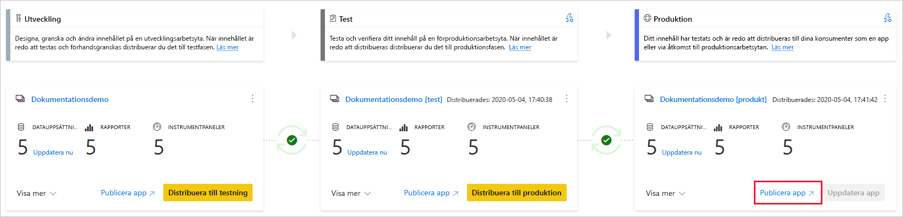
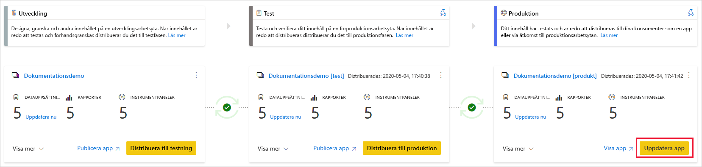

# Förstå distributionsprocessen (förhandsversion)

Med distributionsprocessen kan du klona innehåll från en fas i pipelinen till en annan, vanligtvis från utveckling till test och från test till produktion.

Under distributionen kopierar Power BI innehållet från den aktuella fasen till ett mål. Anslutningarna mellan de kopierade objekten bibehålls under kopieringsprocessen. Power BI tillämpar också de konfigurerade datauppsättningsreglerna på det uppdaterade innehållet i målfasen. Det kan ta en stund att distribuera innehållet beroende på hur många objekt som distribueras. Under den här tiden kan du navigera till andra sidor i Power BI-portalen men du kan inte använda innehållet i målfasen.

## Distribuera innehåll till en tom fas

När du distribuerar innehåll till en tom fas kopieras metadata för rapporter, instrumentpaneler och datauppsättningar i arbetsytan som du distribuerar från till den fas som du distribuerar till. En ny arbetsyta för den fas som du distribuerade till skapas på en Premium-kapacitet.

Det finns två sätt att distribuera innehåll från en fas till nästa. Du kan distribuera allt innehåll eller [välja vilka innehållsobjekt som ska distribueras](deployment-pipelines-get-started.md#selective-deployment).

Du kan också distribuera innehåll baklänges, från ett senare steg i distributionspipelinen till en tidigare version.

När distributionen är klar uppdaterar du datauppsättningarna så att du kan använda det nyligen kopierade innehållet. Datauppsättningen måste uppdateras eftersom data inte kopieras från en fas till en annan. För att förstå vilka objektegenskaper som kopieras under distributionsprocessen och vilka objektegenskaper som inte kopieras kan du läsa avsnittet [objektegenskaper som kopierats under distribution](#item-properties-copied-during-deployment).

### Skapa arbetsyta i en Premium-kapacitet

Vid första distributions tillfället kontrollerar distributionspipelinen om du har behörighet för Premium-kapacitet.  

Om du har kapacitetsbehörigheter kopieras innehållet i arbetsytan till den fas som du distribuerar till och en ny arbetsyta för fasen skapas på Premium-kapaciteten.

Om du inte har kapacitetsbehörighet skapas arbetsytan men innehållet kopieras inte. Du kan be en kapacitetsadministratör att lägga till din arbetsyta till en kapacitet eller be om tilldelningsbehörigheter för kapaciteten. Senare, när arbetsytan tilldelas till en kapacitet kan du distribuera innehåll till den här arbetsytan.

### Ägarskap för arbetsyta och innehåll

Användaren som distribuerar blir automatiskt datauppsättningsägare till de klonade datauppsättningarna och den enda administratören för den nya arbetsytan.

## Distribuera innehåll till en befintlig arbetsyta

Att distribuera innehåll i en fungerande produktionspipeline, till en fas som har en befintlig arbetsyta omfattar följande:

* Distribuera nytt innehåll som ett tillägg till en fas som redan innehåller innehåll.

* Nytt innehåll distribuerat och ersätter gammalt innehåll i en aktuell arbetsfas.

### Distributionsprocess

Innehåll från den aktuella fasen kopieras till målfasen. Power BI identifierar befintligt innehåll i målfasen och skriver över det. För att identifiera vilket innehållsobjekt som behöver skrivas över använder distributionspipelinen anslutningen mellan det överordnade objektet och dess kloner. Den här anslutningen behålls när nytt innehåll skapas. Skrivåtgärden skriver bara över innehållet i objektet. Objektets ID, URL och behörigheter förblir oförändrade.

I målfasen förblir [objektegenskaper som inte kopieras](deployment-pipelines-process.md#item-properties-that-are-not-copied) som de var innan distributionen. Nytt innehåll och nya objekt kopieras från den aktuella fasen till målfasen.

### Uppdaterar datauppsättningen

Data i måldatauppsättningen bevaras där det är möjligt. Om det inte finns några ändringar i en datauppsättning bevaras data som de var före distributionen.

Med små ändringar, som att exempelvis lägga till en tabell eller ett mått, bevarar Power BI den ursprungliga informationen och uppdateringen är optimerad för att endast uppdatera det som behövs. En fullständig uppdatering krävs brytande schemaändringar eller ändringar av datakällans anslutning.

### Krav för att distribuera till en fas med en befintlig arbetsyta

Så länge det distribuerade innehållet finns på en [Premium-kapacitet](../admin/service-premium-what-is.md) kan en användare som uppfyller följande villkor distribuera det till en fas med en befintlig arbetsyta:

* En [Pro-användare](../admin/service-admin-purchasing-power-bi-pro.md) som är medlem i båda arbetsytorna i käll- och måldistributionsfaserna.

* En ägare till alla datauppsättningar på målarbetsytan som ska distribueras.

Mer information finns i avsnittet om [behörigheter](#permissions).

## Distribuerade objekt

När du distribuerar innehåll från en pipelinefas till en annan innehåller det kopierade innehållet följande Power BI objekt:

* Datauppsättningar

* Rapporter

* Instrumentpaneler

### Objekt som inte stöds

Distributionspipelines stöder inte följande objekt:

* Datauppsättningar som inte härstammar från en .pbix

* Rapporter baserade på datauppsättningar som inte stöds

* Arbetsytan kan inte använda en mallapp

* Sidnumrerade rapporter

* Dataflöden

* PUSH-datauppsättningar

* Arbetsböcker

## Objektegenskaper som kopierats under distributionen

Under distributionen kopieras följande objektegenskaper och skriver över objektegenskaperna i målfasen:

* Datakällor ([datauppsättningsregler](deployment-pipelines-get-started.md#step-4---create-dataset-rules) stöds)

* Parametrar ([datauppsättningsregler](deployment-pipelines-get-started.md#step-4---create-dataset-rules) stöds)

* Visuella rapportobjekt

* Rapportsidor

* Paneler på instrumentpanelen

* Modellens metadata

* Objektrelationer

### Objektegenskaper som inte kopieras

Följande objektegenskaper kopieras inte under distributionen:

* Data – data kopieras inte, endast metadata kopieras

* URL

* ID

* Behörigheter – för en arbetsyta eller ett speciellt objekt

* Inställningar för arbetsyta – varje fas har sin egen arbetsyta

* Appinnehåll och inställningar – information om att distribuera appar finns i [distribuera Power BI-appar](#deploying-power-bi-apps)

Följande datauppsättningsegenskaper kopieras inte heller under distributionen:

* Rolltilldelning
    
* Uppdateringsschema
    
* Datakällans autentiseringsuppgifter
    
* Inställningar för cachelagring av frågor (kan ärvas från kapaciteten)
    
* Bekräftelseinställningar

## Distribuera Power BI-appar

[Power BI-appar](../consumer/end-user-apps.md) är det rekommenderade sättet att distribuera innehåll till kostnadsfria Power BI-konsumenter. Genom att använda distributionspipelines kan du hantera Power BI-appar i en distributionspipeline så att du får mer kontroll och flexibilitet när det kommer till appens livscykel.

Skapa en app för varje pipelinefas i distributionen så att du kan testa varje uppdatering av appen från slutanvändarens perspektiv. Med en distributionspipeline kan du enkelt hantera den här processen. Använd knappen Publicera eller Visa på arbetsytan för att publicera eller visa appen i en särskild pipelinefas.

I produktionsfasen öppnar huvudknappen för åtgärder i det nedre högra hörnet sidan Uppdatera app i Power BI, så att alla innehållsuppdateringar blir tillgängliga för appens användare.

>[!IMPORTANT]
>Distributionsprocessen omfattar inte uppdatering av appens innehåll eller inställningar. Om du vill tillämpa ändringar på innehåll eller inställningar måste du uppdatera appen manuellt i motsvarande pipelinefas.

## Behörigheter

Pipelinebehörigheter och arbetsytans behörigheter beviljas och hanteras separat. Till exempel kan en användare med pipelineåtkomst som saknar åtkomst till arbetsytan visa pipelinen och dela den med andra. Den här användaren kommer dock inte att kunna visa innehållet i arbetsytan i pipelinen eller på arbetsytans sida och kommer inte att kunna utföra distributioner.

### Användare med pipelineåtkomst

Användare med pipelineåtkomst har följande behörigheter:

* Visa pipelinen
    
* Dela pipelinen med andra
    
* Redigera och ta bort pipelinen

>[!NOTE]
>Åtkomst till pipelinen beviljar inte behörigheter för att visa eller vidta åtgärder på innehållet i arbetsytan.

### Visningsåtkomst till arbetsytan

Användare med visningsåtkomst till arbetsytor som har *pipelineåtkomst* kan också göra följande:

* Använda innehåll

>[!NOTE]
>Användare med visningsåtkomst till arbetsytan kan inte komma åt datauppsättningen eller redigera innehållet i arbetsytan.

### Arbetsytans deltagare

Arbetsytans deltagare som har *pipelineåtkomst* kan också göra följande:

* Använda innehåll

* Jämföra faser

* Visa datauppsättningar

### Medlem i arbetsyta

Medlemmar i arbetsytor som har *pipelineåtkomst* kan också göra följande:

* Visar arbetsytans innehåll
    
* Jämföra faser
    
* Distribuera rapporter och instrumentpaneler

* Ta bort arbetsytor

### Administratör för arbetsytan

Administratörer för arbetsytan med *pipelineåtkomst* kan utföra samma åtgärder som *medlemmar i arbetsytan* och dessutom göra följande:

* Tilldela arbetsytor

* Ta bort arbetsytor

### Ägare av datauppsättningen

Datauppsättningarnas ägare som är medlemmar i eller administratörer för en arbetsyta kan också göra följande:

* Uppdatera datauppsättningar
    
* Konfigurera regler

>[!NOTE]
>I det här avsnittet beskrivs användarbehörigheter i pipelinedistributioner. De behörigheter som anges i det här avsnittet kan ha olika användningar i andra Power BI funktioner.

## Begränsningar

Det här avsnittet innehåller de flesta begränsningarna i distributionspipeliner.

* Arbetsytan måste finnas på en  [Premium-kapacitet](../admin/service-premium-what-is.md).

* Power BI-objekt, till exempel rapporter och instrumentpaneler som har märkts med [känslighetsetiketter](../admin/service-security-sensitivity-label-overview.md) i Power BI kan inte distribueras.

* Det maximala antalet Power BI-objekt som kan distribueras i en enda distribution är 300.

* En lista över begränsningar för arbetsytan finns i [Tilldelningsbegränsningar för arbetsytan](deployment-pipelines-get-started.md#workspace-assignment-limitations).

* En lista över objekt som inte stöds finns i [Objekt som inte stöds](#unsupported-items).

### Begränsningar för datamängder

* Datauppsättningar som är konfigurerade med [stegvis uppdatering](../admin/service-premium-incremental-refresh.md) kan inte distribueras.

* Datamängder som använder dataanslutning i realtid kan inte distribueras.

* Om måldatamängden använder en [liveanslutning](../connect-data/desktop-report-lifecycle-datasets.md) under distributionen måste även källdatamängden använda detta anslutningsläge.

* Nedladdning av en datamängd (från fasen den har distribuerats till) efter distributionen stöds inte.

* En lista över begränsningar för datamängdsregler finns i [Begränsningar för datamängdsregler](deployment-pipelines-get-started.md#dataset-rule-limitations).

## Nästa steg

>[!div class="nextstepaction"]
>[Introduktion till distributionspipelines](deployment-pipelines-overview.md)

>[!div class="nextstepaction"]
>[Metodtips för distributionspipelines](deployment-pipelines-best-practices.md)

>[!div class="nextstepaction"]
>[Kom igång med distributionspipelines](deployment-pipelines-get-started.md)

>[!div class="nextstepaction"]
>[Felsökning av distributionspipelines](deployment-pipelines-troubleshooting.md)
