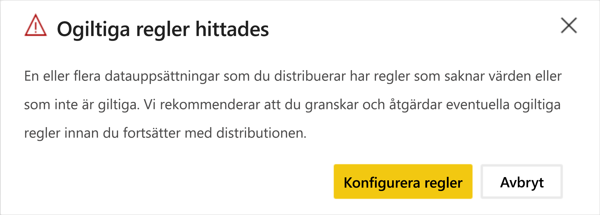

# Felsökning av distributionspipelines (förhandsversion)

Använd den här artikeln för att felsöka problem i distributionspipelines.

## Allmänt

### Vad är distributionspipelines i Power BI

Om du vill veta vad distributionspipelines i Power BI är, se [översikt över distributionspipelines](deployment-pipelines-overview.md).

### Hur kommer jag igång med distributionspipelines?

Kom igång med distributionspipelines med hjälp av [kom igång-instruktionerna](deployment-pipelines-get-started.md).

### Varför kan jag inte se knappen distributionspipelines?

Om följande villkor inte uppfylls, kommer du inte att kunna se knappen distributionspipelines.

* Du är en Power BI [Pro-användare](../admin/service-admin-purchasing-power-bi-pro.md)

* Du tillhör en organisation som har Premium-kapacitet

* En arbetsyta kan bara tilldelas till en enda pipeline

* Du är administratör för en ny arbetsyta

## Licensiering

### Vilka licenser behövs för att arbeta med distributionspipelines?

Om du vill använda distributionspipelines måste du vara [Pro-användare](../admin/service-admin-purchasing-power-bi-pro.md) med [Premium-kapacitet](../admin/service-premium-what-is.md). Mer information finns i [kom åt distributionspipelines](deployment-pipelines-get-started.md#accessing-deployment-pipelines).

### Vilken typ av kapacitet kan jag tilldela till en arbetsyta i en pipeline?

Alla arbetsytor i en distributionspipeline måste finnas i en dedikerad kapacitet för att pipelinen ska fungera. Du kan dock använda olika kapaciteter för olika arbetsytor i en pipeline. Du kan också använda olika kapacitetstyper för olika arbetsytor i samma pipeline.

För utveckling och testning kan du använda A- eller EM-kapacitet tillsammans med ett Pro Power BI-konto för varje användare.

För produktionsarbetsytor behöver du en P-kapacitet. Om du är en ISV som distribuerar innehåll via inbäddade program kan du också använda A- eller EM-kapaciteter för produktion.

## Teknik

### Varför kan jag inte se alla mina arbetsytor när jag försöker tilldela en arbetsyta till en pipeline?

Följande villkor måste vara uppfyllda för att du ska kunna tilldela en arbetsyta till en pipeline:

* Arbetsytan måste vara en [ny arbetsytemiljö](../collaborate-share/service-create-the-new-workspaces.md)

* Du är administratör för arbetsytan

* Arbetsytan är inte tilldelad någon annan pipeline

* Arbetsytan finns i en [Premium-kapacitet](../admin/service-premium-what-is.md)

Arbetsytor som inte uppfyller dessa villkor visas inte i listan över arbetsytor som du kan välja från.

### Hur kan jag tilldela arbetsytor till alla faser i en pipeline?

Du kan tilldela en arbetsyta per pipeline. När en arbetsyta har tilldelats en pipeline kan du distribuera den till nästa pipelinesteg. Under den första distributionen skapas en ny arbetsyta med kopior av objekten i källfasen. Relationerna mellan de kopierade objekten behålls. Få mer information i [så här tilldelar du en arbetsyta till en distributionspipeline](deployment-pipelines-get-started.md#step-2---assign-a-workspace-to-a-deployment-pipeline).

### Varför misslyckades min första distribution?

Din första distribution kan ha misslyckats på grund av ett antal orsaker. Några av dessa orsaker listas i tabellen nedan.

|Fel  |Åtgärd  |
|---------|---------|
|Du har inte [behörigheter för Premium-kapacitet](deployment-pipelines-process.md#creating-a-premium-capacity-workspace).     |Få behörigheter för Premium-kapacitet genom att be en kapacitetsadministratör att lägga till din arbetsyta till en kapacitet eller be om tilldelningsbehörigheter för kapaciteten. När arbetsytan är i en kapacitet distribuerar du om.        |
|Du har inte behörighet för arbetsytan.     |För att distribuera måste du vara en arbetsytemedlem. Be din arbetsytas administratör att ge dig de behörigheter som krävs.         |
|Din Power BI-administratör har inaktiverat skapandet av arbetsytor.     |Kontakta Power BI-administratören för support.         |
|Arbetsytan måste vara en [ny arbetsytemiljö](../collaborate-share/service-create-the-new-workspaces.md).     |Skapa ditt innehåll i den nya arbetsytemiljön. Om du har innehåll i en klassisk arbetsyta så kan du [uppgradera](../collaborate-share/service-upgrade-workspaces.md) den till en ny arbetsytemiljö.         |
|Du använder [selektiv distribution](deployment-pipelines-get-started.md#selective-deployment) och väljer inte ditt innehålls datauppsättning.     |Gör något av följande:   Avmarkera det innehåll som är länkat till din datauppsättning. Det omarkerade innehållet (till exempel rapporter eller instrumentpaneler) kopieras inte till nästa steg.   Välj den datauppsättning som är länkad till det valda innehållet. Din datauppsättning kommer att kopieras till nästa steg.         |

### Jag får en varning om att jag har ”artefakter som inte stöds” i min arbetsyta när jag försöker distribuera. Hur vet jag vilka artefakter som inte stöds?

En omfattande lista över objekt och artefakter som inte stöds i distributionspipelines finns i följande avsnitt:

* [Objekt som inte stöds](deployment-pipelines-process.md#unsupported-items)

* [Objektegenskaper som inte kopieras](deployment-pipelines-process.md#item-properties-that-are-not-copied)

### Varför misslyckades min distribution på grund av brutna regler?

Om du har problem med att konfigurera datauppsättningsregler går du till [datauppsättningsregler](deployment-pipelines-get-started.md#step-4---create-dataset-rules)och kontrollerar att du följer [begränsningar för datauppsättningsregler](deployment-pipelines-get-started.md#dataset-rule-limitations).

Om distributionen tidigare lyckades och nu plötsligt misslyckas med brutna regler, kan det bero på att en datauppsättning har publicerats om. Följande ändringar i källdatauppsättningen resulterar i en misslyckad distribution:

**Parameterregler**

* En borttagen parameter

* Ett ändrat parameternamn

**Datakällregler**

Datauppsättningsreglerna saknar värden. Detta kan inträffa om din datauppsättning har ändrats.

När en tidigare lyckad distribution misslyckas på grund av brutna länkar visas en varning. Du kan klicka på **Konfigurera regler** för att navigera till fönstret distributionsinställningar där den felaktiga datauppsättningen är markerad. När du klickar på datauppsättningen markeras de brutna reglerna.

För att kunna distribuera behöver du korrigera eller ta bort de brutna reglerna och distribuera om.

### Hur kan jag ändra datakällan i pipelinestegen?

Du kan inte ändra anslutningen till datakällan i Power BI-tjänsten.

Om du vill ändra datakällan i test- eller produktionsstegen kan du använda [datauppsättningsregler](deployment-pipelines-get-started.md#step-4---create-dataset-rules) eller [API:er](https://docs.microsoft.com/rest/api/power-bi/datasets/updateparametersingroup). Datauppsättningsregler kommer att börja gälla efter nästa distribution.

### Jag har åtgärdat en bugg i produktion men nu kan jag inte klicka på knappen distribuera till föregående steg. Varför är den nedtonad?

Du kan bara distribuera baklänges till ett tomt steg. Om du har innehåll i teststeget kommer du inte att kunna distribuera baklänges från produktion.

När du har skapat pipelinen använder du utvecklingssteget för att utveckla ditt innehåll och teststegen för att granska och testa det. Du kan åtgärda buggar i dessa steg och sedan distribuera den fasta miljön till produktionssteget.

>[!NOTE]
>Distribution baklänges stöder endast [fullständig distribution](deployment-pipelines-get-started.md#deploying-all-content). Det stöder inte [selektiv distribution](deployment-pipelines-get-started.md#selective-deployment)

### Stöder distributionspipelines multi-geo?

Multi-geo stöds. Det kan ta längre tid att distribuera innehåll mellan steg i olika geografiska områden.

## Behörigheter

### Vad är behörighetsmodellen för distributionspipelines?

Behörighetsmodellen för distributionspipelines beskrivs i avsnittet [behörigheter](deployment-pipelines-process.md#permissions).

### Vem kan distribuera innehåll mellan steg?

Innehåll kan distribueras till ett tomt steg eller till ett steg som har innehåll. Innehållet måste finnas på en [Premium-kapacitet](../admin/service-premium-what-is.md).

* **Distribuera till ett tomt steg** – alla [Pro-användare](../admin/service-admin-purchasing-power-bi-pro.md) som är medlem eller administratör på källarbetsytan.

* **Distribuera till ett steg med innehåll** – all [Pro-användare](../admin/service-admin-purchasing-power-bi-pro.md) som är medlem eller administratör för bägge arbetsytorna i käll- och måldistributionsstegen.

* **Åsidosätta en datauppsättning** – distributionen åsidosätter varje datauppsättning som ingår i målsteget, även om datauppsättningen inte ändrades. Användaren måste vara ägare till alla datauppsättningar för målsteget som anges i distributionen.

### Vilka behörigheter behöver jag för att konfigurera datauppsättningsregler?

Du måste vara datauppsättningens ägare för att kunna konfigurera datauppsättningsregler i distributionspipelines.

### Varför kan jag inte se arbetsytor i pipelinen?

Behörigheter för pipelines och arbetsytor hanteras separat. Du kan ha pipelinebehörigheter, men inte behörighet för arbetsytan. Mer information finns i avsnittet om [behörigheter](deployment-pipelines-process.md#permissions).

## Nästa steg

>[!div class="nextstepaction"]
>[Introduktion till distributionspipelines](deployment-pipelines-overview.md)

>[!div class="nextstepaction"]
>[Kom igång med distributionspipelines](deployment-pipelines-get-started.md)

>[!div class="nextstepaction"]
>[Förstå distributionspipelineprocessen](deployment-pipelines-process.md)

>[!div class="nextstepaction"]
>[Metodtips för distributionspipelines](deployment-pipelines-best-practices.md)