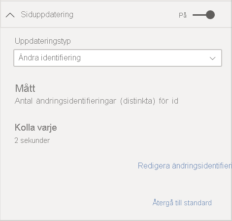
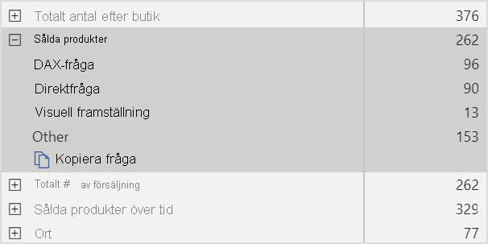

# Automatisk siduppdatering i Power BI

När du övervakar kritiska händelser är det viktigt att data uppdateras så snart som källdata uppdateras. I tillverkningsbranschen är det exempelvis viktigt att upptäcka när en maskin slutat fungera eller är nära att sluta fungera. Om du övervakar signaler som sentiment på sociala medier vill du få reda på plötsliga ändringar så fort de inträffar.

Med automatisk siduppdatering i Power BI kan din aktiva rapportsida söka efter nya data från [DirectQuery-källor](../connect-data/desktop-directquery-about.md) i en takt du anger.

## Uppdateringstyper

Det finns två typer av uppdateringar när du använder automatisk siduppdatering: fast intervall och ändringsidentifiering.

### Fast intervall

Med den här uppdateringstypen kan du uppdatera alla kontroller på en rapportsida baserat på ett fast intervall, till exempel en sekund eller fem minuter. Efter det angivna intervallet skickar alla kontroller på sidan en uppdateringsfråga till datakällan och uppdaterar eventuella ändringar.

### Ändringsidentifiering

Med den här uppdateringstypen kan du uppdatera kontroller på en sida baserat på identifierade källändringar snarare än ett visst uppdateringsintervall. Det här måttet söker efter ändringar i [DirectQuery-källan](../connect-data/desktop-directquery-about.md). Förutom att definiera måttet måste du också välja hur ofta Power BI Desktop ska söka efter ändringar. När du publicerar till tjänsten stöds bara den här uppdateringstypen för arbetsytor som ingår i en Premium-kapacitet.

## Skriva rapporter med automatisk siduppdatering i Power BI Desktop

Automatisk sid uppdatering är bara tillgängligt för [DirectQuery-källor](../connect-data/desktop-directquery-about.md), så funktionen är bara tillgänglig när du är ansluten till en DirectQuery-datakälla. Den här begränsningen gäller för båda typerna av automatisk siduppdatering.

Om du vill använda automatisk siduppdatering i Power BI Desktop väljer du den rapportsida du vill aktivera automatisk siduppdatering. Välj ikonen **Formatering** (en målarroller) i fönstret **Visualiseringar** och gå till avsnittet **Siduppdatering** längst ned i fönstret.

1. Aktiverar eller inaktiverar siduppdatering.
2. Typ av uppdatering
3. Indata och information (beroende på uppdateringstyp)

Kortet **Siduppdatering** är bara tillgängligt om du är ansluten till en [DirectQuery-källa](../connect-data/desktop-directquery-about.md). Om du vill aktivera automatisk siduppdatering måste reglaget vara i läget På. Vilka indata som behövs och vilken information som anges beror på vilken uppdateringstyp du väljer.

### Inställningar för fast intervall

När du väljer **Fast intervall** som uppdateringstyp måste du ange önskat uppdateringsintervall. Standardvärdet är 30 minuter. (Det lägsta uppdateringsintervallet är en sekund.) Rapporten kommer att börja uppdateras med det intervall som du har angett.

När du klickar på Visa information ser du ytterligare information om följande i Power BI:

- Om funktionen aktiverats av administratören (bara när du är inloggad på ditt Power BI-konto)
- Lägsta intervall som administratören tillåter (bara när du är inloggad på ditt Power BI-konto)
- Faktisk uppdateringsfrekvens (vanligtvis längre än det valda intervallet)
- Senaste uppdateringstid

### Inställningar för ändringsidentifiering

När du väljer **Ändringsidentifiering** som uppdateringstyp visas länken **Lägg till ändringsidentifiering**. Du kan också öppna fönstret **Ändringsidentifiering** från fliken Modellering i menyfliksområdet. Klicka sedan på ikonen **Ändringsidentifiering** i avsnittet **Siduppdatering**. Du kan också högerklicka eller välja listrutepilen bredvid valfritt värde i området Värde och sedan välja **Ändringsidentifiering** på menyn.

När fönstret är öppet visas alternativet **Måttyp** där du kan välja ett befintligt mått eller skapa ett nytt från grunden. När du väljer ett befintligt mått behöver du bara välja det från fältlistan eller dra och släppa det i avsnittet **Välj befintligt mått**. När du skapar ett nytt mått kan du **Välja en beräkning** för måttet. Välj mellan antal, räkna distinkta, minimum, maximum och summa. Du kan till exempel använda räkna distinkta om du vill räkna kund-ID:n och bara uppdatera när en ny kund läggs till i listan. När du har valt ett mått måste du definiera hur ofta Power BI ska **söka efter ändringar**. Det här intervallet anger hur ofta Power BI ska beräkna måttet och hämta eventuella ändringar. När du klickar på Tillämpa visas ett nytt mått med ikonen för ändringsidentifiering i fältlistan.

Sedan visas information om vilket mått som används för ändringsidentifiering och det definierade intervallet för din referens i siduppdateringsavsnittet.

> [!NOTE]
> Du kan bara använda ett mått för ändringsidentifiering per modell.

## Bestämma uppdateringsintervallet

När automatisk siduppdatering har aktiverats skickar Power BI Desktop ständigt frågor till DirectQuery-källan. När frågan har skickats uppstår en fördröjning innan data returneras. Så för korta uppdateringsintervall bör du kontrollera att frågorna returnerar den efterfrågade informationen inom det konfigurerade intervallet. Om data inte returneras inom intervallet, så uppdateras de visuella objekten mer sällan än vad de har konfigurerats för.

De här övervägandena gäller för båda typerna av uppdatering: fast intervall och ändringsidentifiering. Den största skillnaden är att för ändringsidentifiering är det bara en fråga som går tillbaka till källan med ett fast intervall, och kontrolluppdateringen utlöses bara när värdet för måttet för ändringsidentifiering ändras.

Det bästa är om uppdateringsintervallet minst matchar din förväntade nya datahastighet:

* Om nya data tas emot av källan var 20:e minut, kan uppdateringsintervallet inte vara kortare än 20 minuter.
* Om nya data tas emot varje sekund så ställ in intervallet på en sekund.

När det gäller korta uppdateringsintervall, t. ex. en sekund, så tänk på fölande faktorer:

- Typen av DirectQuery-datakälla
- Den belastning som dina frågor som skapas för den
- Avståndet mellan dina rapportvisningsprogram och kapacitetens datacenter

Du kan beräkna svarstiden med [Prestandaanalyseraren](desktop-performance-analyzer.md) i Power BI Desktop och menyn Visa information i siduppdateringsavsnittet för uppdateringstypen Fast intervall. Med Prestandaanalys kan du kontrollera om varje visuell fråga har tillräckligt med tid för att återkomma med resultatet från källan. Du kan också bestämma var tiden ska användas. Utifrån Prestandaanalys-resultatet kan du justera och göra ändringar i datakällan, eller så kan du experimentera med andra visuella objekt och mått i rapporten.

Den här bilden visar resultatet för en DirectQuery-källa i Prestandaanalyseraren:

Låt oss betrakta några andra egenskaper hos den här datakällan:

- Data tas emot varannan sekund
- Prestandaanalyseraren visar en maximal tid för fråga och visning på ungefär 4,9 sekunder (4 688 millisekunder)
- Datakällan har konfigurerats för att hantera cirka 1 000 samtidiga frågor per sekund
- Du förväntar dig att cirka 10 användare kan visa rapporten samtidigt

Detta resulterar i följande ekvation:

- **5 visuella objekt x 10 användare = cirka 50 frågor**

Den här beräkningen visar en mycket högre belastning än vad datakällan har stöd för. Data tas emot med en hastighet på två sekunder, vilket bör vara din uppdateringsfrekvens. Men eftersom frågan tar ungefär fem sekunder att slutföra, bör du ställa in den på mer än fem sekunder.

Observera också att det här resultatet kan avvika från när du publicerar rapporten till tjänsten. Skillnaden beror på att rapporten använder den Azure Analysis Services-instans som finns i molnet. Du vill kanske justera dina uppdateringshastigheter enligt detta.

För att klara av frågor och uppdateringstider kör Power BI nästa uppdateringsfråga först när alla återstående uppdateringsfrågor har slutförts. Så även om uppdateringsintervallet är kortare än den tid som dina frågor tar att bearbeta, uppdateras Power BI inte förrän återstående frågor har slutförts.

Med uppdateringstypen ändringsidentifiering gäller de här övervägandena fortfarande. Dessutom visar [Prestandaanalyseraren](desktop-performance-analyzer.md) mätresultatet för ändringsidentifieringen även om ingen kontroll i rapporten matchas. Vi har lagt till den här funktionen så att du ska kunna felsöka den här typen av mått på samma sätt som vi nämnde tidigare. Den största skillnaden för den här uppdateringstypen är att bara en fråga skickas till datakällan i stället för alla frågor från alla kontroller. Det här gäller även om flera användare visar rapporten.

I samma scenario som vi gick igenom tidigare:

- **1 fråga om måttet för ändringsidentifiering för 5 kontroller genererar bara en fråga oavsett hur många som visar rapporten**

- **När måttet för ändringsidentifiering utlöser en uppdatering i samma scenario som tidigare får vi 5 kontroller x 10 användare = cirka 50 frågor**

Sammanfattningsvis skickas bara en fråga till datakällan tills en ändring har upptäckts när du använder ändringsidentifiering. Sedan används samma logik som för uppdateringstypen fast intervall, så att lika många frågor genereras när kontrollerna uppdateras för samtliga användare. Den här metoden bör vara mer effektiv i längden.

Nu ska vi titta på hur du kan identifiera och diagnostisera prestandaproblem som kapacitetsadministratör. Du kan också läsa avsnittet [Vanliga frågor och svar om automatisk siduppdatering](#frequently-asked-questions) längre fram i den här artikeln om du vill ha mer information om prestanda och felsökning.

## Automatisk siduppdatering i Power BI-tjänsten

Du kan också ställa in automatisk siduppdatering för rapporter som har publicerats till Power BI-tjänsten så länge datakällan är av typen [DirectQuery](../connect-data/desktop-directquery-about.md).

Processen att konfigurera automatisk siduppdatering för rapporter i Power BI-tjänsten liknar den i Power BI Desktop. Automatisk siduppdatering har även stöd för [inbäddat Power BI](../developer/embedded/embedding.md)-innehåll när det konfigureras i Power BI-tjänsten. Den här bilden visar konfigurationen av **siduppdatering** för Power BI-tjänsten:

1. Aktiverar eller inaktiverar siduppdatering.
2. Typ av uppdatering
3. Indata och information (beroende på uppdateringstyp)

> [!NOTE]
> När du publicerar den aktiverade rapporten för automatisk siduppdatering från Power BI Desktop till tjänsten, måste du ange autentiseringsuppgifterna för DirectQuery-datakällan på menyn för datamängdsinställningar. Du kan ställa in autentiseringen så att rapportläsarna ansluter till datakällan med sina egna identiteter, vilket innebär att källans inställda säkerhet tillämpas. Om du använder mått för ändringsidentifiering utvärderas de alltid med författarens autentiseringsuppgifter.

### Siduppdateringsintervall

Vilka typer av siduppdateringar och intervall som tillåts i Power BI-tjänsten påverkas av rapportens arbetsyta. Det här gäller i följande situationer:

* Publicera en rapport i en arbetsyta där automatisk siduppdatering är aktiverat
* Redigera ett siduppdateringsintervall som redan finns på en arbetsyta
* Skapa en rapport direkt i tjänsten

Power BI Desktop har inga begränsningar för uppdateringsintervall, intervallet kan vara så litet som varje sekund. När rapporter publiceras till Power BI-tjänsten gäller dock vissa begränsningar, som beskrivs i följande avsnitt.

### Begränsningar för uppdateringsintervall

I Power BI-tjänsten tillämpas begränsningar för automatisk siduppdatering baserat på arbetsytan där rapporten publiceras, om du använder Premium-tjänster eller inte och Premium-kapacitetens administratörsinställningar.

Vi kan förtydliga hur dessa begränsningar fungerar kan vi börja med lite bakgrundsinformation om kapaciteter och arbetsytor.

*Kapaciteter* är ett viktigt Power BI-begrepp. De representerar en uppsättning resurser (lagring, processor och minne) som används till att vara värd för och leverera Power BI-innehåll. Kapaciteter är antingen delade eller dedikerade. En *delad kapacitet* delas med andra Microsoft-kunder. En *dedikerad kapacitet* allokeras fullt ut till en enskild kund. En introduktion till dedikerade kapaciteter hittar du i artikeln [Hantera Premium-kapaciteter](../admin/service-premium-capacity-manage.md).

I delad kapacitet körs arbetsbelastningar på dataresurser som delas med andra kunder. Eftersom kapaciteten måste dela resurser, införs begränsningar för att säkerställa ett *rättvist genomförande*, t. ex. genom att maximal modellstorlek (1 GB) och maximal daglig uppdateringsfrekvens (åtta gånger per dag) anges.

Power BI-*arbetsytor* finns i kapaciteterna. De representerar säkerhets-, samarbets- och distributionsbehållare. Varje Power BI-användare har en personlig arbetsyta som kallas **Min arbetsyta**. Du kan skapa ytterligare arbetsytor för samarbete och distribution. De kallas för *arbetsytor*. Som standard skapas arbetsytor, däribland personliga arbetsytor, i den delade kapaciteten.

Här visas information om de två scenarierna för arbetsytor:

**Delade arbetsytor**. För vanliga arbetsytor (arbetsytor som inte ingår i en Premium-kapacitet) har den automatiska siduppdateringen ett minsta intervall på 30 minuter (det lägsta tillåtna intervallet). Uppdateringstypen ändringsidentifiering är inte tillgänglig för delade kapaciteter.

**Premium-arbetsytor**. Tillgängligheten för automatisk siduppdatering på Premium-arbetsytor (både med fast intervall och ändringsidentifiering) beror på vilka arbetsbelastningsinställningar som din Premium-administratör har konfigurerat för Power BI Premium-kapaciteten. Det finns två variabler som kan påverka din möjlighet att konfigurera automatisk siduppdatering:

 - **Funktion på/av**. Om din kapacitetsadministratör har valt att inaktivera funktionen kan du inte konfigurera någon typ av siduppdatering i den publicerade rapporten. Fast intervall och ändringsidentifiering kan aktiveras och inaktiveras separat.

 - **Minsta uppdateringsintervall**. När du aktiverar automatisk siduppdatering med fast intervall måste kapacitetsadministratören konfigurera ett minsta uppdateringsintervall (standardvärdet är fem minuter). Om intervallet är lägre än minimivärdet åsidosätter Power BI-tjänsten intervallet och använder det lägsta intervall som angetts av kapacitetsadministratören.

 - **Minsta körningsintervall**. När du aktiverar ändringsidentifiering måste kapacitetsadministratören konfigurera ett minsta körningsintervall (standardvärdet är fem sekunder). Om intervallet är lägre än minimivärdet åsidosätter Power BI-tjänsten intervallet och använder det lägsta intervall som angetts av kapacitetsadministratören.

Den här tabellen innehåller mer information om var den här funktionen är tillgänglig, och vilka begränsningarna är för varje kapacitetstyp och [lagringsläge](../connect-data/service-dataset-modes-understand.md):

| Lagringsläge | Dedikerad kapacitet | Delad kapacitet |
| --- | --- | --- |
| DirectQuery | **FI stöds**: Ja  **ÄI stöds**: Ja  **Minimum**: 1 sekund  **Åsidosättning av administratör**: Ja | **FI stöds**: Ja  **ÄI stöds**: Nej  **Minimum**: 30 minuter  **Åsidosättning av administratör**: Nej |
| Importera | **FI stöds**: Nej  **ÄI stöds**: Nej  **Minimum**: Saknas  **Åsidosättning av administratör**: Saknas | **FI stöds**: Nej  **ÄI stöds**: Nej  **Minimum**: Saknas  **Åsidosättning av administratör**: Saknas |
| Blandat läge (DirectQuery + andra datakällor) | **FI stöds**: Ja  **ÄI stöds**: Ja  **Minimum**: 1 sekund  **Åsidosättning av administratör**: Ja | **FI stöds**: Ja  **ÄI stöds**: Nej  **Minimum**: 30 minuter  **Åsidosättning av administratör**: Nej |
| Live Connect AS | **FI stöds**: Nej  **ÄI stöds**: Nej  **Minimum**: Saknas  **Åsidosättning av administratör**: Saknas | **FI stöds**: Nej  **ÄI stöds**: Nej  **Minimum**: Saknas  **Åsidosättning av administratör**: Saknas |
| Live Connect PBI | **FI stöds**: Nej  **ÄI stöds**: Nej  **Minimum**: Saknas  **Åsidosättning av administratör**: Saknas | **FI stöds**: Nej  **ÄI stöds**: Nej  **Minimum**: Saknas  **Åsidosättning av administratör**: Saknas |

*Tabellförklaring:*
1. *FI: Fast intervall*
2. *ÄI: Ändringsidentifiering*

## Överväganden och begränsningar

Det finns några saker att tänka på när du använder automatisk siduppdatering i Power BI Desktop eller i Power BI-tjänsten:

* Lagringslägena Import, LiveConnect och Push stöds inte av automatisk siduppdatering.  
* Sammansatta modeller som har minst en DirectQuery-datakälla stöds.
* Power BI Desktop har inga begränsningar vad gäller uppdateringsintervall. Intervallet kan vara så litet som varje sekund för både fast intervall och ändringsidentifiering. När rapporter publiceras till Power BI-tjänsten gäller vissa begränsningar, vilket beskrevs [tidigare](#restrictions-on-refresh-intervals) i den här artikeln.
* Du kan bara ha ett mått för ändringsidentifiering per datamängd.
* Det får bara finnas högst 10 modeller med mått för ändringsidentifiering i en Power BI-klientorganisation.

### Prestandadiagnostik

Automatisk siduppdatering är användbart för att övervaka scenarier och utforska data som snabbt kan ändras. Men ibland kan detta medföra onödig belastning på kapaciteten eller datakällan.

Power BI har följande skydd för att förhindra onödig belastning på datakällorna:

- Alla automatiska siduppdateringsfrågor körs med en lägre prioritet för att säkerställa att interaktiva frågor (t.ex. sidinläsning och korsfiltrering av visuella objekt) prioriteras.
- Om en fråga inte har slutförts före nästa uppdateringscykel, utfärdar Power BI inte några nya uppdateringsfrågor förrän den föregående frågan har slutförts. Om du exempelvis har ett uppdateringsintervall på en sekund och dina frågor i genomsnitt tar fyra sekunder, så utfärdar Power BI endast en fråga var fjärde sekund.

Det finns två områden där du fortfarande kan stöta på flaskhalsar i prestandan:

1. **Kapaciteten**. Frågan träffar först Premium-kapaciteten som utvärderar DAX-frågan som genereras från rapportvisualiseringarna till källfrågorna.
2. **DirectQuery-datakällan**. De översatta frågorna i föregående steg körs sedan mot källan. Källan kan vara dina SQL Server-instanser, SAP Hana-källor och så vidare.

Genom att använda [appen för Premium-kapacitetsmått](../admin/service-admin-premium-monitor-capacity.md), som är tillgänglig för administratörer, kan du visualisera hur mycket av kapaciteten som används av frågor med låg prioritet.

Frågor med låg prioritet består av automatiska siduppdateringsfrågor och modelluppdateringsfrågor. Det finns för närvarande inget sätt att skilja mellan belastningen från automatiska uppdateringsfrågor och modelluppdateringsfrågor.

Om du märker att kapaciteten överbelastas av frågor med låg prioritet finns det några åtgärder som du kan vidta:

- Begär en större Premium-SKU.
- Be rapportens ägare att sänka uppdateringsintervallet.
- I kapacitetsadministratörsportalen kan du:
   - Inaktivera automatisk siduppdatering för den kapaciteten.
   - Höja det lägsta uppdateringsintervallet, vilket påverkar alla rapporter på den kapaciteten.

### Vanliga frågor och svar

**Jag är en rapportförfattare. Jag definierade rapportuppdateringsintervallet till en sekund i Power BI Desktop, men efter publiceringen så uppdateras inte min rapport i tjänsten.**

* Se till att automatisk siduppdatering har aktiverats för sidan. Eftersom den här inställningen gäller per sida, måste du se till att den är aktiverad för varje sida i rapporten som du vill uppdatera.
* Kontrollera om du har överfört till en arbetsyta med en ansluten Premium-kapacitet. Om du inte har gjort det låses uppdateringsintervallet vid 30 minuter för fast intervall, och du kan inte använda ändringsidentifiering.
* Om rapporten finns på en Premium-arbetsyta, så fråga din administratör om funktionen har aktiverats för den anslutna kapaciteten. Se dessutom till att det lägsta uppdateringsintervallet för kapaciteten är lägre än eller samma som intervallet för rapporten. Det här gäller separat för både fast intervall och ändringsidentifiering

**Jag är en kapacitetsadministratör. Jag ändrade inställningarna för sidans automatiska uppdateringsintervall, men ändringarna visas inte. Det innebär att rapporterna fortfarande uppdateras i felaktig takt, eller inte uppdateras alls trots att jag har aktiverat automatisk siduppdatering.**

* Det tar upp till 5 minuter innan de ändrade inställningarna av automatisk siduppdatering i användargränssnittet för kapacitetsadministratörer sprids till rapporterna.
* Förutom att aktivera automatisk siduppdatering för kapaciteten, måste du också aktivera den för de sidor i rapporten för vilka du vill aktivera den.
* Uppdateringstyperna hanteras separat, så se till att den aktuella typen av uppdatering är aktiverad.

**Min rapport körs i blandat läge. (Blandat läge innebär att rapporten har en DirectQuery-anslutning och en importdatakälla.) Vissa visuella objekt uppdateras inte.**

- Om dina visuella objekt refererar till importtabeller, så är det helt normalt. Automatisk siduppdatering stöds inte för import.
- Se den första frågan i det här avsnittet.

**Rapporten uppdaterades utan problem i tjänsten, men sedan slutade det plötsligt att fungera.**

* Försök att uppdatera sidan och se om det löser problemet.
* Kontakta din kapacitetsadministratör. Administratören kan ha inaktiverat funktionen eller höjt det minsta uppdateringsintervallet. (Se den andra frågan i det här avsnittet.)

**Jag är en rapportförfattare. Mina visuella objekt uppdateras inte i den takt jag specificerade. De uppdateras i en lägre hastighet.**

* Om dina frågor tar längre tid att köra, så fördröjs uppdateringsintervallet. Den automatiska siduppdateringen väntar tills alla frågor har slutförts innan nya påbörjas.
* Din kapacitetsadministratör kan ha angett ett minsta uppdateringsintervall som är högre än det som du angav i rapporten. Be din kapacitetsadministratör att sänka det lägsta uppdateringsintervallet.

**Hanteras automatiska siduppdateringsfrågor från cacheminnet?**

* Nej. Alla automatiska siduppdateringsfrågor kringår eventuella cachelagrade data.

**Mitt mått för ändringsidentifierings utlöser inte några uppdateringar**

* Se till att ändringsidentifiering är aktiverat för sidan. Eftersom den här inställningen gäller per sida, måste du se till att den är aktiverad för varje sida i rapporten som du vill uppdatera.
* Kontrollera om du har överfört till en arbetsyta med en ansluten Premium-kapacitet. Annars fungerar inte ändringsidentifiering.
* Om rapporten finns på en Premium-arbetsyta, så fråga din administratör om funktionen har aktiverats för den anslutna kapaciteten. Se dessutom till att det lägsta körningsintervallet för kapaciteten är lägre än eller samma som intervallet för rapporten.
* Om du har kontrollerat allt det här kontrollerar du om måttet ändras alls i Power BI Desktop eller i redigeringsläget. Det gör du genom att dra det till arbetsytan och kontrollera om värdet ändras. Annars kanske inte måttet passar så bra till att söka efter ändringar i datakällan.

## Nästa steg

Mer information finns i de här artiklarna:

* [Använd DirectQuery i Power BI](../connect-data/desktop-directquery-about.md)
* [Använda sammansatta modeller i Power BI Desktop](../transform-model/desktop-composite-models.md)
* [Använda Prestandaanalys till att undersöka prestanda för rapportelement](desktop-performance-analyzer.md)
* [Distribuera och hantera Power BI Premium-kapaciteter](../guidance/whitepaper-powerbi-premium-deployment.md)
* [Datakällor i Power BI Desktop](../connect-data/desktop-data-sources.md)
* [Forma och kombinera data i Power BI Desktop](../connect-data/desktop-shape-and-combine-data.md)
* [Anslut till Excel-arbetsböcker i Power BI Desktop](../connect-data/desktop-connect-excel.md)   
* [Ange data direkt i Power BI Desktop](../connect-data/desktop-enter-data-directly-into-desktop.md)   
