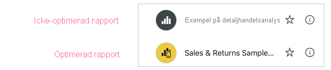
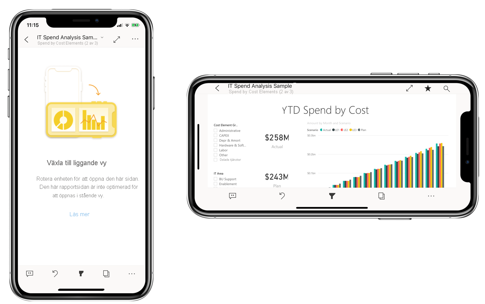

# Optimera Power BI-rapporter för mobilappen
Mobila användare kan visa alla Power BI-rapportsidor med liggande orientering. Rapportförfattarna kan dock skapa en ytterligare vy som är optimerad för mobila enheter och som visas med stående orientering. Med det här designalternativet, som är tillgängligt i både Power BI Desktop och i Power BI-tjänsten, kan författarna välja och ordna om enbart de visuella objekt som passar för mobilanvändare i farten.

.

Power BI innehåller ett antal funktioner som hjälper dig att skapa mobiloptimerade versioner av dina rapporter:
* En mobillayoutvy där du kan skapa en mobiloptimerad rapport genom att dra och släppa visuella objekt på en telefonemulators arbetsyta.
* Visuella objekt och utsnitt som kan optimeras för användning på små, mobila skärmar.

Med dessa funktioner blir det enklare att utforma och skapa snygga, interaktiva, mobiloptimerade rapporter.

## Skapa en mobiloptimerad rapportsida i stående format

Det första steget är att utforma och skapa rapporten i den vanliga webbvyn. När du har skapat rapporten kan du optimera den för telefoner och surfplattor.

Om du vill skapa en mobiloptimerad vy öppnar du vyn för mobil layout:
   * Välj menyfliksområdet **Vy** i Power BI Desktop och välj **Mobil layout**.
   * Välj **Fler alternativ (...) > Redigera rapport > Mobil layout** i Power BI-tjänsten.

   Du ser en rullningsbar arbetsyta som är formad som en telefon och fönstret **Visualiseringar** som visar alla visuella objekt som finns på den ursprungliga rapportsidan.

   .

* Varje visuellt objekt i fönstret **Visualiseringar** visas med sitt namn, så att identifieringen underlättas.
* Varje visuellt objekt har också en synlighetsindikator. Synlighetsindikatorn för ett visuellt objekt ändras beroende på det visuella objektets synlighetsstatus i webbrapportvyns aktuella tillstånd. Synlighetsindikatorn är användbar när du arbetar med bokmärken.

## Lägga till visuella objekt på den mobila layoutens arbetsyta
Om du vill lägga till ett visuellt objekt, så dra det från fönstret **Visualiseringar** till telefonens arbetsyta. När du drar det visuella objektet till arbetsytan fästs det mot rutnätet. Du kan också dubbelklicka på det visuella objektet i visualiseringsfönstret, så läggs det visuella objektet till på arbetsytan.

Du kan lägga till några eller alla av webbrapportsidans visuella objekt till den mobiloptimerade rapportsidan. Du kan lägga till varje visuellt objekt en gång, men du behöver inte inkludera alla visuella objekt.

>[!NOTE]
> Du kan dra och släppa dolda visuella objekt på arbetsytan. De placeras, men visas inte såvida deras synlighetsstatus inte ändras i den aktuella webbrapportvyn.

Du kan också lägga visuella objekt över varandra när du skapar interaktiva rapporter med bokmärken, eller skapar snygga rapporter genom att lägga visuella objekt över bilder.

När du har placerat ett visuellt objekt på arbetsytan kan du ändra storlek på det genom att dra i handtagen som visas på det visuella objektets kant när du markerar objektet. Om du vill behålla det visuella objektets proportioner under storleksändringen, så håll ned **Skift**-tangenten när du drar i storlekshandtagen.

Bilden nedan visar hur visuella objekt dras från fönstret **visualiseringar** och släpps på arbetsytan, och hur några av dem ändrar storlek och överlappas.

   

Telefonens rapportrutnät anpassas till telefoner av olika storlekar, vilket innebär att din rapport kommer att se lika bra ut på telefoner med stora och små skärmar.

## Ta bort visuella objekt från den mobila layoutens arbetsyta
Ta bort ett visuellt objekt från den mobila layouten genom att klicka på **X** i det visuella objektet övre högra hörn på telefonens arbetsyta, eller markera det visuella objektet och tryck på **Ta bort**.

Du kan ta bort alla visualiseringar från arbetsytan genom att klicka på radergummit i fönstret **Visualisering**.

Om du tar bort visuella objekt från den mobila layoutens arbetsyta tas de enbart bort från arbetsytan. De visuella objekten visas fortfarande i visualiseringsfönstret och den ursprungliga rapporten förblir opåverkad.

## Konfigurera visuella objekt och utsnitt så att de kan användas i mobiloptimerade rapporter

### Visuella objekt

Många virtuella objekt, i synnerhet visuella objekt av diagramtyp, är dynamiska.  Det innebär att de kan ändras dynamiskt så att maximal mängd data och insikter visas, oavsett skärmstorlek.

När ett visuellt objekt ändrar storlek prioriterar Power BI dess data. Det innebär t.ex. att utfyllnad kan tas bort och att förklaringen automatiskt placeras överst i det visuella objektet, så att det förblir informativt även när det förminskas.

 
Om du av någon anledning vill inaktivera dynamiken kan du göra det i avsnittet **Allmänt** i det visuella objektets formatinställningar.

### Utsnitt

Utsnitten ger filtrering av rapportdata på arbetsytan. När du utformar utsnitt i det vanliga rapportredigeringsläget kan du ändra vissa inställningar så att utsnitten blir mer användbara i mobiloptimerade rapporter:
* Du kan välja att tillåta rapportläsarna att välja ett eller flera objekt.
* Du kan göra utsnittet lodrätt, vågrätt eller dynamiskt (dynamiska utsnitt måste vara vågräta).

Om du gör utsnittet dynamiskt, visar det fler eller färre alternativ när du ändrar storleken eller formen. Det kan vara högt, kort, brett eller smalt. Om du gör det tillräckligt litet, blir det bara en filterikon på rapportsidan.

 
Läs mer om att [skapa dynamiska utsnitt](power-bi-slicer-filter-responsive.md).

## Publicera en mobiloptimerad rapport
Om du vill publicera en mobiloptimerad version av en rapport, så [publicera huvudrapporten från Power BI Desktop till Power BI-tjänsten](desktop-upload-desktop-files.md). Då publiceras den mobiloptimerade versionen samtidigt.

## Visa optimerade och icke-optimerade rapporter på en telefon eller surfplatta

I Power BI-mobilappar indikeras mobiloptimerade rapporter med en särskild ikon.

På telefoner identifierar appen automatiskt huruvida rapporten är mobiloptimerad eller inte.
* Om det finns en mobiloptimerad rapport öppnar appen automatiskt rapporten i mobiloptimerat läge.
* Om det inte finns någon mobiloptimerad rapport öppnas rapporten i en icke-optimerad liggande vy.

När du håller en mobiltelefon i liggande läge öppnas rapporten i en icke-optimerad vy med den ursprungliga rapportlayouten, oavsett huruvida rapporten är optimerad eller inte.

Om du optimerar enbart vissa sidor, så uppmanas användarna att växla till liggande vy när de kommer till sidor som inte är optimerade. Om användaren håller mobilen eller surfplattan i sidoläge kan hen se sidan i liggande läge. [Läs mer om att använda Power BI-rapporter som är optimerade för stående läge](../consumer/mobile/mobile-apps-view-phone-report.md).

## Att tänka på när du skapar mobiloptimerade layouter
* När det gäller rapporter med flera sidor kan du välja att optimera alla sidor eller enbart ett fåtal.
* Om du har definierat en bakgrundsfärg för en rapportsida får den mobiloptimerade rapporten samma bakgrundsfärg.
* Du kan inte ändra formatinställningarna enbart för den mobiloptimerade rapporten. Formateringen är likadan för huvudlayouten som för mobillayouten. Teckenstorlekarna är t.ex. desamma.
* Om du vill ändra ett visuellt objekt, exempelvis dess formatering, datauppsättning, filter eller andra attribut, återgår du till redigeringsläget för webbrapporter.

## Nästa steg
* [Skapa en telefonvy av en instrumentpanel i Power BI](service-create-dashboard-mobile-phone-view.md).
* [Visa Power BI-rapporter som är optimerade för din telefon](../consumer/mobile/mobile-apps-view-phone-report.md).
* [Power BI-dokumentation om att skapa rapporter och instrumentpaneler](https://docs.microsoft.com/power-bi/create-reports/).
* Har du fler frågor? [Fråga Power BI Community](https://community.powerbi.com/).