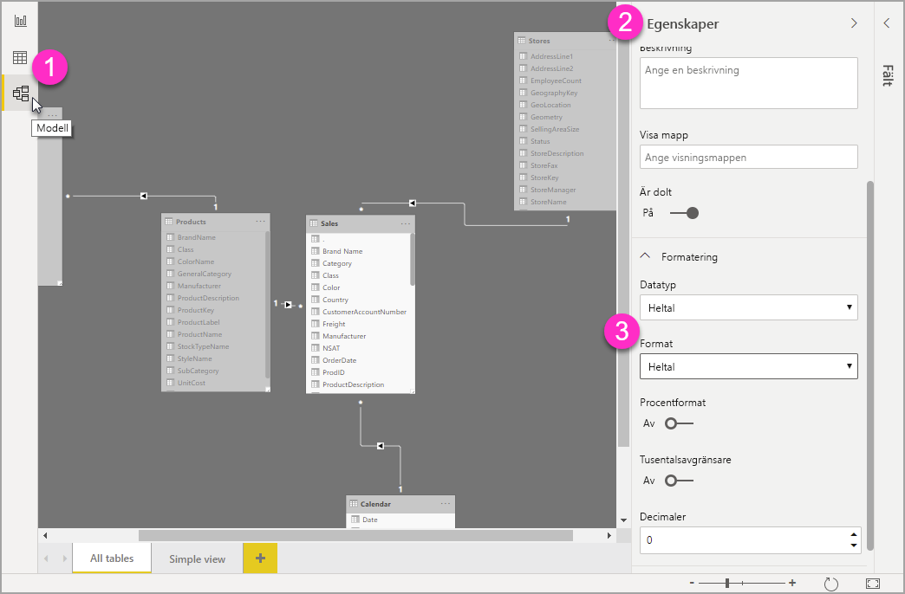

# Använd anpassade formatsträngar i Power BI Desktop

Med anpassade formatsträngar i **Power BI Desktop** kan du anpassa hur fält visas i visualiseringar och se till att dina rapporter ser ut precis som du vill att de ska se ut.

## Så här använder du anpassade formatsträngar

Om du vill skapa anpassade formatsträngar väljer du fältet i vyn **Modellering** och väljer sedan **Format** i fönstret **Egenskaper**.

När du har valt **Anpassad** från Listrutan **Format** kan du välja från en lista över formatsträngar som används ofta. 

## Syntax för anpassad formatering som stöds

Anpassade formatsträngar följer syntaxen för VBA-format som används med Excel och andra Microsoft-produkter, men de har inte stöd för all syntax som används i andra produkter. 

Följande tabeller definierar den syntax som stöds i Power BI.

Följande tabell visar **datumsymboler** som stöds:

| **Symbol** | **Intervall** |
| --- | --- |
| _d_ | 1-31 (dag i månaden, utan inledande nolla) |
| _dd_ | 01-31 (dag i månaden, med inledande nolla) |
| _m_ | 1-12 (månad, utan inledande nolla, från och med januari = 1) |
| _mm_ | 1-12 (månad, med inledande nolla, från och med januari = 1) |
| _mmm_ | Visar förkortade månadsnamn (Hijri-månadsnamn har inga förkortningar) |
| _mmmm_ | Visar fullständiga månadsnamn |
| _yy_ | 00-99 (årets två sista siffror) |
| _yyyy_ | 100-9999 (tre eller fyrsiffriga årtal) |

Följande tabell visar **tidssymboler** som stöds:

| **Symbol** | **Intervall** |
| --- | --- |
| _h_ | 0-23 (1-12 följt av &quot;AM&quot; eller &quot;PM&quot;) (timme på dygnet, utan inledande nolla) |
| _hh_ | 0-23 (1-12 följt av &quot;AM&quot; eller &quot;PM&quot;) (timme på dygnet, med inledande nolla) |
| _n_ | 0-59 (minut i timmen, utan inledande nolla) |
| _nn_ | 0-59 (minut i timmen, med inledande nolla) |
| _m_ | 0-59 (minut i timmen, utan inledande nolla). Endast om det föregås av _h_ eller _hh_ |
| _mm_ | 0-59 (minut i timmen, med inledande nolla). Endast om det föregås av _h_ eller _hh_ |
| _s_ | 0-59 (sekund i minuten, utan inledande nolla) |
| _ss_ | 0-59 (sekund i minuten, med inledande nolla) |

Du kan se ett [exempel](https://docs.microsoft.com/office/vba/language/reference/user-interface-help/format-function-visual-basic-for-applications#example) på hur du formaterar anpassade värdesträngar.

Ett användardefinierat formatuttryck för tal kan ha mellan en och tre delar som är avgränsade med semikolon. Om du inkluderar semikolon utan något mellan dem visas inte avsnittet som saknas (det kommer att vara &quot;&quot;). Om semikolon inte anges används det positiva formatet.

Här följer några exempel på olika format för olika värdesträngar:

|   | **Formatsträngar** |   |   |   |
| --- | --- | --- | --- | --- |
| **Values** | **0.00;-0.0; &quot;Zero&quot;** | **0.00;;** | **0.00;-0.0;** | **0.00;** |
| **-1.234** | -1.2 | &quot;&quot; | -1.2 | &quot;&quot; |
| **0** | &quot;Zero&quot; | &quot;&quot; | &quot;&quot; | 0,00 |
| **1.234** | 1.23 | 1.23 | 1.23 | 1.23 |

Följande tabell visar fördefinierade **namngivna datum- och tidsformat:**

| **Formatnamn** | **Beskrivning** |
| --- | --- |
| **Datum för allmän dag** | Visa ett datum och/eller tid, till exempel 4/3/93 05:34 PM. Om det inte finns någon bråkdel kan du bara visa ett datum, till exempel 4/3/93. Om det inte finns någon heltalsdel kan du bara visa tiden, till exempel 05:34 PM. Datumvisningen bestäms av systeminställningarna. |
| **Långt datum** | Visa ett datum enligt ditt systems långa datumformat. |
| **Short Date** | Visa ett datum enligt ditt systems korta datumformat. |
| **Långt klockslag** | Visa ett klockslag enligt ditt systems långa klockslagsformat, inklusive timmar, minuter och sekunder. |
| **Kort klockslag** | Visa en tid med 24-timmarsformat, till exempel 17:45. |

Namngivna numeriska format

Följande tabell visar fördefinierade **namngivna numeriska format**:

| **Formatnamn** | **Beskrivning** |
| --- | --- |
| **Allmän siffra** | Visa siffra utan tusentalsavgränsare. |
| **Valuta** | Visa siffra med tusentalsavgränsare om detta är lämpligt. Visa två siffror till höger om decimaltecknet. Utdata baseras på systemets språkinställningar. |
| **Fixed** | Visa minst en siffra till vänster och två siffror till höger om decimaltecknet. |
| **Standard** | Visa siffran med tusentalsavgränsare, minst en siffra till vänster och två siffror till höger om decimaltecknet. |
| **Procent** | Visa siffran multiplicerat med 100 med ett procenttecken ( **%** ) tillagt till höger. Visa alltid två siffror till höger om decimaltecknet. |
| **Vetenskapligt** | Använd standardnotation för vetenskaplig text. |

Följande tabell visar tecken som du kan använda för att skapa **användardefinierade datum- och tidsformat**.

| **Tecken** | **Beskrivning** |
| --- | --- |
| ( **:** ) | Klockslagsavgränsare. I vissa språk kan andra tecken användas för att representera klockslagsavgränsaren. Klockslagsavgränsaren separerar timmar, minuter och sekunder när tidsvärden formateras. Det faktiska tecknet som används som tidsavgränsare i formaterade utdata bestäms av systeminställningarna. |
| ( **/** ) | Datumavgränsare. I vissa språk kan andra tecken användas för att representera datumavgränsaren. Datumavgränsaren separerar dag, månad och år när datumvärden formateras. Det faktiska tecknet som används som datumavgränsare i formaterade utdata bestäms av systeminställningarna. |
| d | Dagen visas som ett tal utan inledande nolla (1-31). |
| dd | Dagen visas som ett tal med inledande nolla (01-31). |
| ddd | Visar dagen som en förkortning (sön-lör). Lokaliserad. |
| dddd | Visar dagens fullständiga namn (söndag–lördag). Lokaliserad. |
| m | Månaden visas som ett tal utan inledande nolla (1-12). Om m omedelbart följer h eller hh visas minuten i stället för månaden. |
| mm | Månaden visas som ett tal med inledande nolla (01-12). Om m omedelbart följer h eller hh visas minuten i stället för månaden. |
| mmm | Månaden visas som en förkortning (jan till dec). Lokaliserad. |
| mmmm | Månaden visas som ett fullständigt namn (januari–december). Lokaliserad. |
| yy | Visar året som ett tvåsiffrigt värde (00–99). |
| yyyy | Visar året som ett fyrsiffrigt värde (100–9999). |
| h | Visar timmen som ett tal utan inledande nolla (0–23). |
| hh | Visar timmen som ett tal med inledande nolla (00–23). |
| n | Minuten visas som ett tal utan inledande nolla (0–59). |
| nn | Minuten visas som ett tal med inledande nolla (00–59). |
| s | Sekunden visas som ett tal utan inledande nolla (0-59). |
| ss | Sekunden visas som ett tal med inledande nolla (00-59). |
| AM/PM | Använd 12-timmarsformat och visa AM i versaler före 12.00. Visa PM i versaler mellan 12.00 och 23.59. |

Följande tabell visar tecken som du kan använda för att skapa **användardefinierade sifferformat**.

| **Tecken** | **Beskrivning** |
| --- | --- |
| Ingen | Visa siffran utan formatering. |
| ( **0** ) | Platshållare för siffror. Visa en siffra eller noll. Om uttrycket har en siffra på den position där 0 visas i formatsträngen, visar du siffran. Annars visar du noll på den platsen. Om talet har färre siffror än det finns nollor (på någon av decimalernas sida) i formatuttrycket visas inledande eller avslutande nollor. Om talet har fler siffror till höger om decimaltecknet än det finns nollor till höger om decimaltecknet i formatuttrycket ska du avrunda talet till lika många decimaler som det finns nollor. Om talet har fler siffror till vänster om decimaltecknet än det finns nollor till vänster om decimaltecknet i formatuttrycket ska de extra siffrorna visas utan ändring. |
| ( **#** ) | Platshållare för siffror. Visa en siffra eller inget. Om uttrycket har en siffra på den position där # visas i formatsträngen, visar du siffran. Annars visar du inget på den platsen. Den här symbolen fungerar som platshållaren för siffran 10, förutom att inledande och avslutande nollor inte visas om talet har samma eller färre siffror än det finns #-tecken på endera sidan om decimaltecknet i formatuttrycket. |
| ( **.** ) | Platshållare för decimaler. I vissa språk används kommatecken som decimaltecken. Platshållaren för decimaler avgör hur många siffror som visas till vänster och höger och decimaltecknet. Om formatuttrycket endast innehåller siffervärden till vänster om den här symbolen börjar tal som är mindre än 1 med ett decimaltecken. Om du vill visa en inledande nolla med bråktal använder du 0 som platshållare för första siffran till vänster om decimaltecknet. Tecknet som i praktiken används som decimalplatshållare i formaterade utdata beror på det talformat som systemet känner igen. |
| ( **%)** | Platshållare för procent. Uttrycket multipliceras med 100. Procenttecken ( **%** ) infogas på den position där det förekommer i formatsträngen. |
| ( **,** ) | Tusentalsavgränsare. I vissa språk används en punkt som tusentalsavgränsare. Tusentalsavgränsaren skiljer tusental från hundratal i ett tal som har fyra eller fler platser till vänster om decimaltecknet. Standardavgränsningen av tusentalsavgränsaren anges om formatet innehåller en tusentalsavgränsare som omges av sifferplatshållarna ( **0** eller **#** ). Två angränsande tusentalsavgränsare eller en tusentalsavgränsare direkt till vänster om decimal tecknet (oavsett om en decimal har angetts) betyder &quot;skala talet genom att dividera det med 1000 och avrunda vid behov.&quot; Du kan till exempel använda formatsträngen &quot; #0,,&quot; för att representera 100 000 000 som 100. Tal som är mindre än 1 000 000 visas som 0. Två angränsande tusentalsavgränsare i någon annan position än direkt till vänster om decimaltecknet behandlas helt enkelt som att man anger att en tusentalsavgränsare ska användas. Tecknet som i praktiken används som tusentalsavgränsare i formaterade utdata beror på det talformat som systemet känner igen. |
| ( **:** ) | Klockslagsavgränsare. I vissa språk kan andra tecken användas för att representera klockslagsavgränsaren. Klockslagsavgränsaren separerar timmar, minuter och sekunder när tidsvärden formateras. Det faktiska tecknet som används som tidsavgränsare i formaterade utdata bestäms av systeminställningarna. |
| ( **/** ) | Datumavgränsare. I vissa språk kan andra tecken användas för att representera datumavgränsaren. Datumavgränsaren separerar dag, månad och år när datumvärden formateras. Det faktiska tecknet som används som datumavgränsare i formaterade utdata bestäms av systeminställningarna. |
| ( **E- E+ e- e+** ) | Vetenskapligt format. Om formatuttrycket innehåller minst en platshållare för siffror ( **0** eller **#** ) till höger om E-, E+, e- eller e+ visas talet i exponentiellt format och E eller e infogas mellan talet och dess exponent. Antalet platshållare för siffror till höger avgör antalet siffror i exponenten. Använd E- eller e- för att placera ett minustecken intill negativa exponenter. Använd E+ eller e+ för att placera ett minustecken intill negativa exponenter och ett plustecken intill positiva exponenter. |
| **- + $**  ( ) | Visa ett litteralt tecken. Om du vill visa ett annat tecken än de som anges i listan skriver du ett omvänt snedstreck (\) innan tecknet eller omger det med dubbla citattecken (&quot; &quot;). |
| ( * *\** ) | Visa nästa tecken i formatsträngen. Om du vill visa ett tecken som har en speciell innebörd som ett litteralt tecken skriver du ett omvänt snedstreck (\). Det omvända snedstrecket visas inte. Att använda ett omvänt snedstreck är detsamma som att omsluta nästa tecken inom dubbla citattecken. Om du vill visa ett omvänt snedstreck använder du två omvända snedstreck (\\). Exempel på tecken som inte kan visas som literaler är tecken för datum- och tidformat (a, c, d, h, m, n, p, q, s, t, w, / och :), tecken för numeriska format (#, 0, %, E, e, komma och punkt) och strängformateringstecken (@, &amp;, \&lt;, \&gt; och !). |
| (&quot;ABC&quot;) | Visa strängen inom dubbla citattecken (&quot; &quot;). |

## Nästa steg
Följande artiklar kan också vara av intresse för dig:

* [VBA-formatsträngar](https://docs.microsoft.com/office/vba/language/reference/user-interface-help/format-function-visual-basic-for-applications#example)
* [Mått i Power BI Desktop](../transform-model/desktop-measures.md)
* [Datatyper i Power BI Desktop](../connect-data/desktop-data-types.md)
* [Villkorsstyrd formatering i tabeller](desktop-conditional-table-formatting.md)
