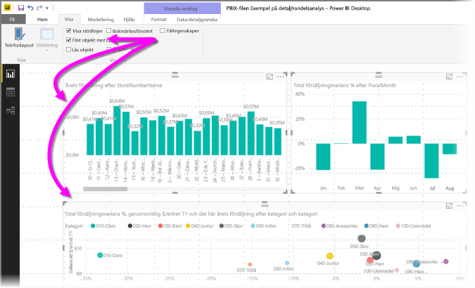
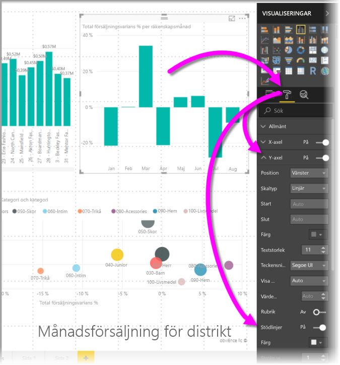
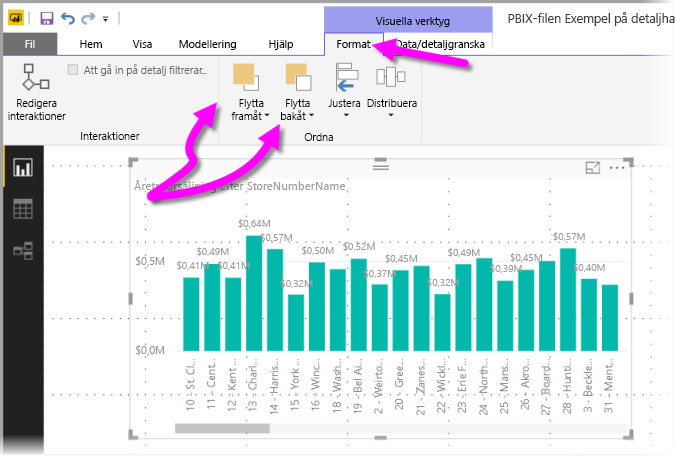
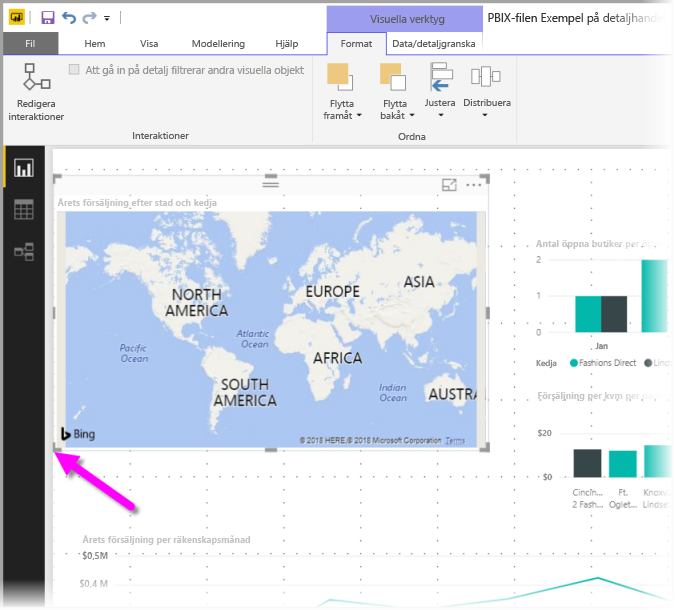
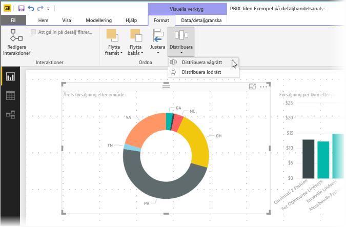

# Använd stödlinjer och fäst till rutnät i Power BI Desktop-rapporter
Rapportarbetsytan för**Power BI Desktop** erbjuder stödlinjer som gör att du smidigt kan justera visuell information på en rapportsida. Använd funktionen för att fästa till rutnät så att den visuella informationen i dina rapporter blir snyggt justerad och jämnt fördelad.

I **Power BI Desktop** kan du även justera z-ordningen (flytta framåt eller bakåt) för objekt i en rapport samt justera eller jämt fördela markerad visuell information på arbetsytan.

## Använda stödlinjer och fästa till rutnät
Om du vill aktivera stödlinjer och fäst till rutnät, väljer du menyfliken **Visa** och aktiverar kryssrutorna för **Visa stödlinjer** och **Fäst objekt till rutnät.** Du kan välja det ena eller båda alternativen. De är oberoende av varandra.

> [!NOTE]
> Om **Visa stödlinjer** och **Fäst till rutnät** är inaktiverade, kan du ansluta till någon datakälla så aktiveras de.

## Använd stödlinjer
Stödlinjerna är synliga guider som hjälper dig att justera visuell information. När du försöker fastställa om två (eller flera) visuella objekt är vågrätt eller lodrätt justerade, använder du stödlinjerna för att avgöra om deras gränser är justerade.

Använd Ctrl + klick för att markera flera visuella objekt samtidigt, vilket gör att de valda visualiseringarnas kanter visas så att du kan avgöra om de är justerade.

### Använd stödlinjer i visuell information
I Power BI finns det också stödlinjer i visuell information som hjälper dig att jämföra datapunkter och värden. Från och med lanseringen av **Power BI Desktop** september 2017, kan du nu hantera stödlinjerna inom visualiseringar med korten **x-axel** eller **y-axel** (beroende på visualiseringstyp), vilka återfinns i avsnittet **Format** i fönstret **Visualiseringar**. Du kan hantera följande stödlinjeelement i en visualisering:

* Aktivera och inaktivera stödlinjer
* Ändra färgen på stödlinjer
* Justera linjen (bredden) för stödlinjer
* Välj linjeformatet för stödlinjer i visualiseringen, till exempel fylld, streckad eller prickad

Det kan vara särskilt användbart att modifiera vissa egenskaper hos stödlinjerna för rapporter där en mörk bakgrund används för visuell information. Följande bild visar avsnittet **Stödlinjer** på kortet **Y-axel**.

## Använd fäst till rutnät
När du aktiverar **Fäst till rutnät**, justeras automatiskt all visuell information på den **Power BI Desktop**-arbetsyta som du flyttar (eller ändrar storlek på) till närmaste stödlinjeaxel, vilket gör det enklare att se till två eller flera visualiseringar justeras till samma vågräta eller lodräta plats eller storlek.

Det är inte svårare än så att använda **stödlinjer** och **fäst till rutnät** för att se till att dina rapportvisualiseringar är snyggt justerade.

## Använd z-ordning, justera och distribuera
Du kan hantera fram till bak-ordningen för visualiseringar i en rapport, vilket ofta kallas *z-ordningen* för element. Med den här funktionen kan du överlappa visuell information på valfritt sätt och sedan justera ordningen fram till bak för alla. Du anger ordningen för den visuella informationen med hjälp av knapparna **Flytta framåt** och **Flytta bakåt**, som finns i avsnittet **Ordna** i menyfliksområdet **Format**. Menyfliksområdet **Format** visas när du väljer en eller flera visualiseringar på sidan.

Med hjälp av menyfliksområdet **Format** kan du justera den visuella informationen på många olika sätt, vilket säkerställer att visualiseringarna visas på sidan med den anpassning som ser bäst ut och fungerar bäst.

Knappen **Justera** justerar en vald visualisering efter kanten (eller mitten) på rapportarbetsytan, vilken syns i följande bild.

När två eller flera visualiseringar är markerade, justeras de till varandra och använder den befintliga justerade gränsen för visualiseringarna för justering. Om du till exempel väljer två visuella objekt och väljer alternativet **Vänsterjustera** kommer de visuella objekten att justeras efter kanten längst till vänster på alla visuella objekt.

Du kan även distribuera dina visualiseringar jämt över rapportarbetsytan, antingen vågrätt eller lodrätt. Använd bara knappen **Fördela** från menyfliksområdet **Format**.

Du behöver bara göra några få val med verktygen för stödlinjer, justering och distribution för att få dina rapporter att se ut exakt som du vill.

