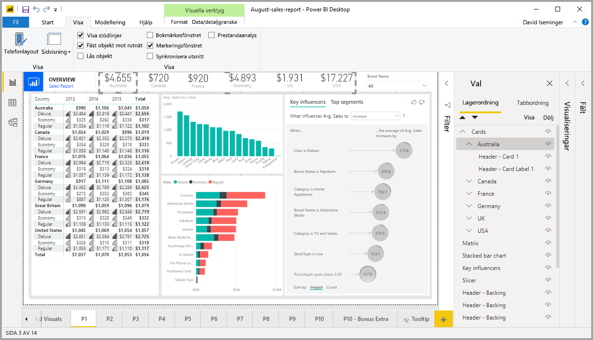
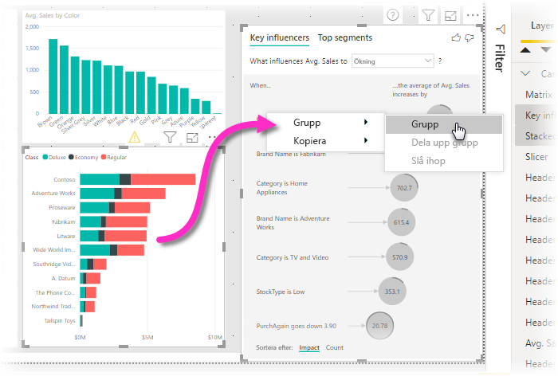
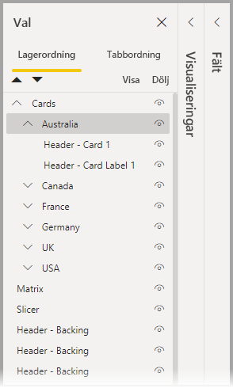
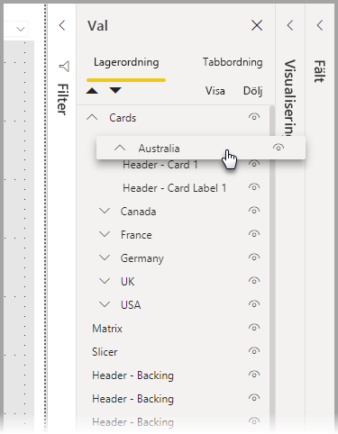
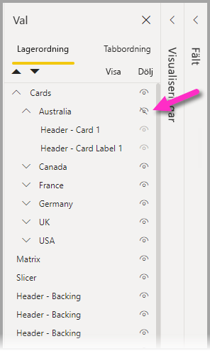
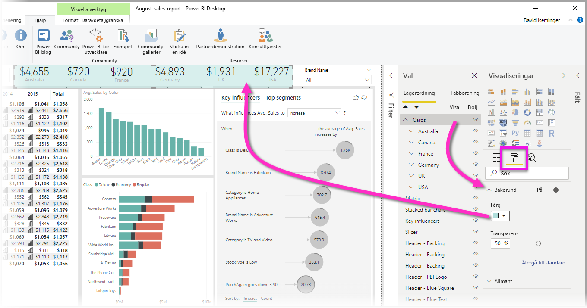

# Gruppera visuella objekt i Power BI Desktop-rapporter
Med **gruppering** i **Power BI Desktop** kan du gruppera ihop visuella objekt i rapporten, till exempel knappar, textrutor, formbilder och alla visuella objekt som du skapar, precis som du grupperar objekt i PowerPoint. Med gruppering av visuella objekt i en rapport kan du behandla gruppen som ett enda objekt, vilket gör att du kan flytta, ändra storlek på och arbeta med lager i rapporten enklare, snabbare och mer intuitivt.

## Skapa grupper

Om du vill skapa en grupp med visuella objekt i Power BI Desktop markerar du det första visuella objektet från arbetsytan, håller ned CTRL-knappen, klickar på ett eller flera ytterligare visuella objekt som du vill ha i gruppen och högerklickar sedan på samlingen med visuella objekt och väljer **Grupp** från den meny som visas.

Grupper visas i **urvalsfönstret**. Du kan ha så många grupper med visuella objekt som behövs för din rapport, och du kan även kapsla grupper med visuella objekt. I följande bild är gruppen *Australia* (Australien) kapslad under gruppen *Cards* (Kort). Du kan expandera en grupp genom att välja markören intill gruppnamnet och minimera den genom att välja markören igen. 

I **urvalsfönstret** kan du även dra och släppa enskilda visuella objekt för att inkludera dem i en grupp, ta bort dem från en grupp, kapsla en grupp eller ta bort en grupp eller ett enskilt visuellt objekt från en kapsling. Dra det visuella objekt som du vill justera och placera det där du vill. Om det finns överlappning bestäms skiktning av visuella objekt av deras ordning i listan *Lagerordning*.

Det är enkelt att byta namn på en grupp: dubbelklicka bara på gruppnamnet i rutan **Val** och skriv sedan in det nya namnet på din grupp.

Om du vill dela upp gruppen markerar du den genom att högerklicka och välja **dela upp grupp** i den meny som visas.

## Dölja och visa visuella objekt eller grupper

Du kan enkelt dölja eller visa grupper med hjälp av **urvalsfönstret**. Om du vill dölja en grupp väljer du ögonknappen intill gruppnamnet (eller ett enskilt visuellt objekt) för att växla mellan att visa eller dölja det visuella objektet eller gruppen. I följande bild är gruppen *Australia* (Australien) dold, och resten av de grupper som är kapslade i gruppen *Cards* (Kort) visas.

När du döljer en grupp döljs alla visuella objekt i den gruppen, vilket indikeras av att deras ögonknapp blir nedtonad (ej tillgänglig för att växla på eller av, eftersom hela gruppen är dold). Om du bara vill dölja vissa visuella objekt i en grupp kan du helt enkelt växla ögonknappen intill det visuella objektet. Då döljs endast det visuella objektet i gruppen.

## Välja visuella objekt i en grupp

Det finns några sätt att navigera och välja objekt i en grupp med visuella objekt. I följande lista beskrivs beteendet:

* Om du klickar på ett tomt område i en grupp (till exempel tomt utrymme mellan visuella objekt) markeras ingenting
* Om du klickar på ett visuellt objekt i en grupp markeras hela gruppen, och en andra klickning gör att det enskilda visuella objektet markeras
* Om du väljer en grupp och sedan ett annat objekt på rapportarbetsytan och sedan väljer **Gruppera** på högerklicksmenyn skapas en kapslad grupp
* Om du väljer två grupper och sedan högerklickar visas ett alternativ för att sammanslå de markerade grupperna i stället för att kapsla dem

## Tillämpa bakgrundsfärg

Du kan även tillämpa en bakgrundsfärg på en grupp med hjälp av avsnittet **Formatering** i fönstret **Visualiseringar**, vilket visas i följande bild. 

När du har tillämpat en bakgrundsfärg kan du markera gruppen genom att klicka på utrymmet mellan visuella objekt i gruppen (jämför detta med att klicka på det tomma utrymmet mellan visuella objekt i en grupp, vilket inte markerar gruppen). 

## Nästa steg
Mer information om gruppering finns i följande video:

* [Gruppering i Power BI Desktop – video](https://youtu.be/sf4n7VXoQHY?t=10)

Följande artiklar kan också vara av intresse för dig:

* [Använd visning av detaljerad information mellan rapporter i Power BI Desktop](desktop-cross-report-drill-through.md)
* [Använda utsnitt i Power BI Desktop](../visuals/power-bi-visualization-slicers.md)
