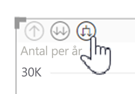
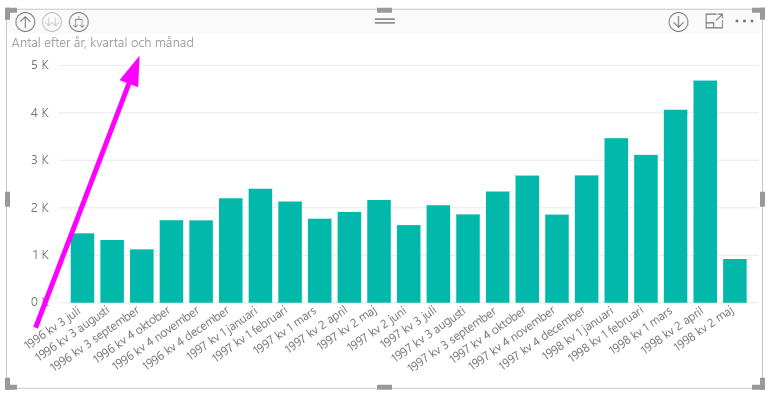
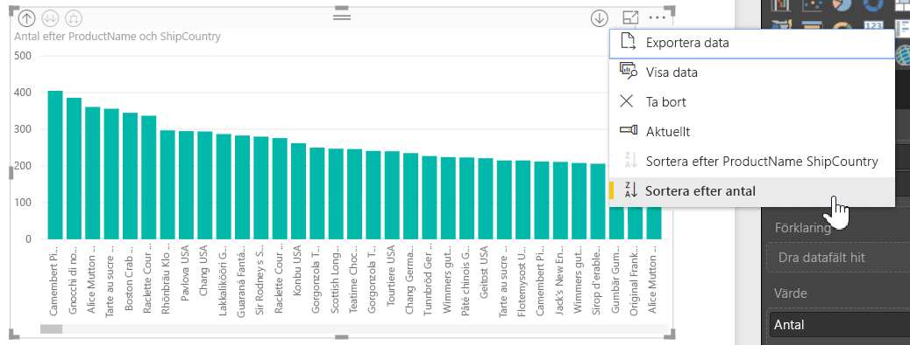

# Använd infogade hierarkietiketter i Power BI Desktop
**Power BI Desktop** stöder användning av **infogade hierarkietiketter**, vilket är den första av två funktioner som är avsedda att förbättra hierarkisk utökning av detaljnivån. Den andra funktionen, som för närvarande är under utveckling, är möjligheten att använda kapslade hierarkietiketter (håll ögonen öppna för detta – vi uppdaterar ofta).   

## Så här fungerar infogade hierarkietiketter
Med infogade hierarkietiketter visas hierarkietiketterna på samma sätt som när du expanderar visuella objekt med funktionen **Visa allt**. En fördel med att se hierarkietiketterna är att du också kan välja att **sortera** efter de olika hierarkietiketterna när du expanderar dina hierarkiska data.

### Använda funktionen Visa (utan att sortera efter hierarkietiketter)
Innan vi ser hur infogade hierarkietiketter används ska vi se standardbeteendet för funktionen **Expandera till nästa nivå**. Detta hjälper oss att förstå (och uppskatta) hur användbara infogade hierarkietiketter kan vara.

Följande bild visar ett stapeldiagram ett visuellt objekt för årlig försäljning. När du högerklickar på ett stapeldiagram kan du välja **Expandera till nästa nivå**.

> [!NOTE]
> Som ett alternativ till att högerklicka på ett stapeldiagram kan du välja knappen *Visa* längst upp till vänster i visualiseringen.

  

När **Expandera till nästa nivå** är valt expanderar det visuella objektet datumhierarkin från *År* till *Kvartal*, enligt följande bild.

Observera att etiketterna *År* och *Kvartal* visas tillsammans. Det här etikettschemat fortsätter allt eftersom du använder **Visa allt** till slutet av hierarkin.

Detta är hur den inbyggda hierarkin *Datum*, som har associerats med fält av datatypen *Datum/tid*, fungerar. Nu går vi till nästa avsnitt och ser hur den nya funktionen för infogade hierarkietiketter skiljer sig.

### Använda infogade hierarkietiketter
Nu ska vi titta på ett annat diagram – med data som innehåller informella hierarkier. I följande visuella objekt har vi ett stapeldiagram med **Quantity** som använder *ProductName* som axel. I dessa data utgör *ProductName* och *ShipCountry* en informell hierarki. Härifrån kan du återigen välja *Expandera till nästa nivå* för att gå nedåt i hierarkin.

Att välja **Expandera till nästa nivå** visar nästa nivå med infogad visning av hierarkietiketter. Som standard sorteras infogade hierarkier efter måttvärde, i det här fallet **Quantity**. När infogade hierarkietiketter är aktiverade kan du även sortera dessa data efter hierarki genom att välja ellipsen i det övre högra hörnet ( **...** ) och sedan välja **Sortera efter ProductName > ShipCountry** som visas i följande bild.

När **ShipCountry** är valt sorteras dessa data baserat på den informella hierarkimarkeringen enligt följande bild.

> [!NOTE]
> Funktionen med infogade hierarkietiketter tillåter inte ännu att den inbyggda tidshierarkin sorteras efter värde – den sorteras bara efter hierarkiordning.
> 
> 

## Felsökning
Det är möjligt att dina visuella objekt fastnar i tillståndet med den expanderade infogade hierarkinivån. I vissa fall kanske du upptäcker att en del av dina visuella objekt har fastnat i det expanderade läget och att det inte går att granska uppåt. Detta kan inträffa om du har vidtagit följande åtgärder (lösningen finns i stegen *nedan*):

Steg som kan få visuella objekt att fastna i ett expanderat tillstånd:

1. Du aktiverar funktionen **infogad hierarkietikett**
2. Du skapar vissa visuella objekt med hierarkier
3. Sedan använder du **Visa allt** och sparar filen
4. Därefter *inaktiverar* du funktionen **infogad hierarkietikett** och startar om Power BI Desktop
5. Du öppnar din fil på nytt

Om du har råkat göra detta och de visuella objekten har fastnat i expanderat läge, kan du göra följande för att felsöka dem:

1. Återaktivera funktionen **infogad hierarkietikett** och starta sedan om Power BI Desktop
2. Öppna filen igen och gå tillbaka högst upp i de visuella objekt som berörs
3. Spara filen
4. Inaktivera funktionen **infogad hierarkietikett** och starta om Power BI Desktop
5. Öppna filen igen

Du kan också ta bort ditt visuella objekt och återskapa det.

