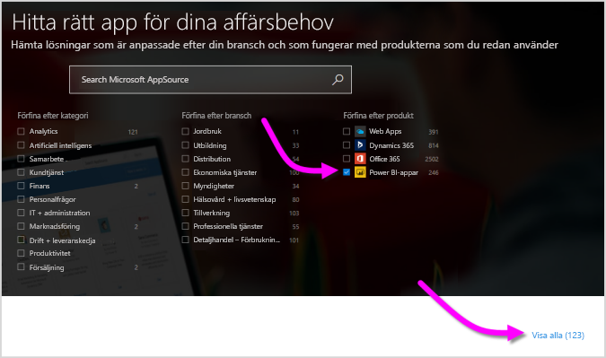
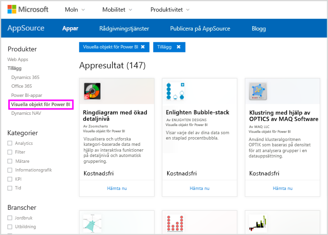
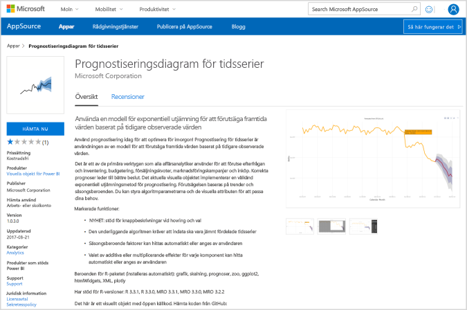
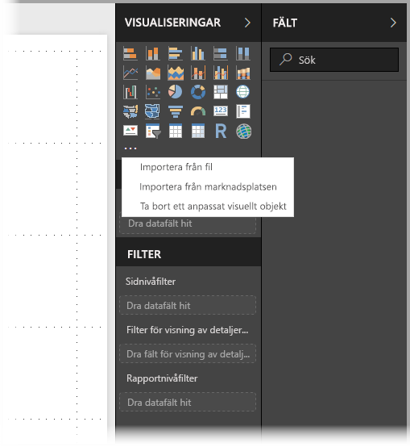
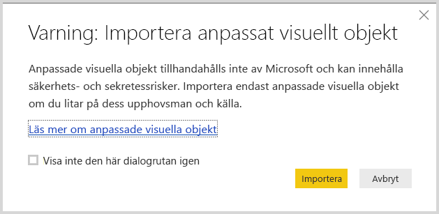
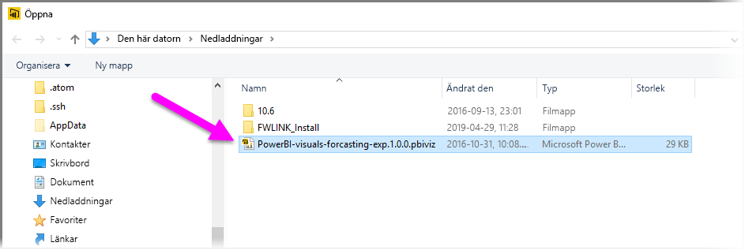
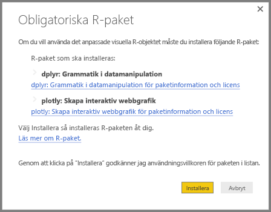
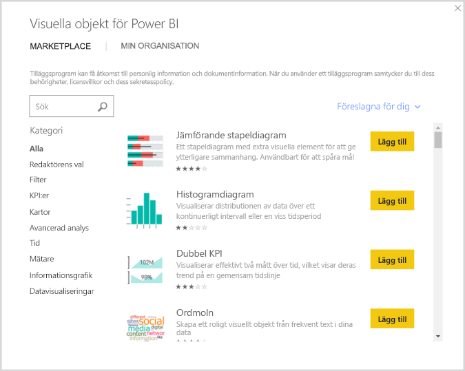
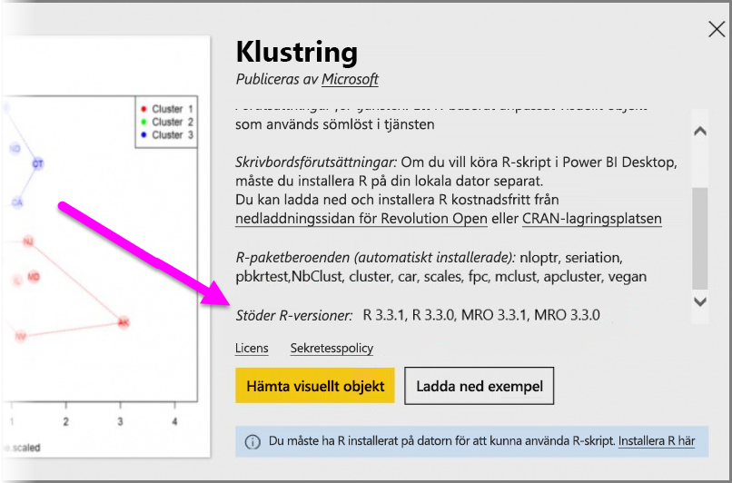

# Använd R-baserade visuella Power BI-objekt i Power BI

I **Power BI Desktop** och **Power BI-tjänsten** kan du använda R-baserade visuella Power BI-objekt utan att ha någon kunskap om R och utan några R-skript. Det innebär att du kan använda den analytiska och visuella kraften i visuella R-objekt och R-skript, utan att du behöver lära dig R eller utföra någon programmering själv.

Om du vill använda R-baserade visuella Power BI-objekt markerar och laddar du ner det anpassade visuella R-objekt som du vill använda från [**AppSource**](https://appsource.microsoft.com/marketplace/apps?product=power-bi-visuals&page=1) i galleriet med **visuella Power BI-objekt**  för Power BI.

I följande avsnitt beskrivs hur du väljer, läser in och använder R-baserade visuella objekt i **Power BI Desktop**.

## Använd visuella Power BI-objekt

Om du vill använda R-baserade visuella Power BI-objekt, ladda ner varje visuellt objekt från biblioteket med **visuella Power BI-objekt**. Därefter använder du det visuella objektet på samma sätt som andra visuella objekt i **Power BI Desktop**. Det finns två sätt att hämta visuella Power BI-objekt på: Du kan ladda ner dem från onlinewebbplatsen **AppSource**, eller bläddra och hämta dem inifrån **Power BI Desktop**. 

### Hämta visuella Power BI-objekt från AppSource

Här följer stegen för att bläddra efter och välja visuella objekt från onlinewebbplatsen **AppSource**:

1. Gå till Power BI:s bibliotek för visuella objekt, som finns på [https://appsource.microsoft.com](https://appsource.microsoft.com/). Markera kryssrutan *Power BI-appar* under *Förfina efter produkt*  och välj sedan länken **Visa alla**.

   

2. På bibliotekssidan för [Visuella objekt för Power BI](https://appsource.microsoft.com/marketplace/apps?product=power-bi-visuals&page=1) väljer du **Visuella objekt för Power BI** i listan över tillägg i den vänstra rutan.

   

3. Välj det **visuella objekt** som du vill använda i galleriet, så kommer du till en sida som beskriver det visuella objektet. Välj knappen **Hämta nu** för att ladda ned det.

   > [!NOTE]
    > Om du ska redigera det i **Power BI Desktop** måste du ha R installerat på din lokala dator. Men när användarna vill se ett R-baserat visuellt objekt i **Power BI-tjänsten** behöver de inte ha R installerat lokalt.

   

   Du behöver inte installera R för att använda R-baserade visuella Power BI-objekt i **Power BI-tjänsten**, men om du vill använda R-baserade visuella Power BI-objekt i **Power BI Desktop** *måste* du installera R på den lokala datorn. Du kan hämta R från följande platser:

   * [CRAN](https://cran.r-project.org/)
   * [MRO](https://mran.microsoft.com/)

4. När det visuella objektet har hämtats (vilket görs på samma sätt som med andra filer från webbläsaren) går du till **Power BI Desktop**, klickar på **Fler alternativ** (...) i fönstret **Visualiseringar** och väljer **Importera från fil**.

   
5. Du får en varning om att importera ett anpassat visuellt objekt enligt följande bild:

   
6. Gå till den plats där den visuella filen sparades och välj sedan filen. Anpassade visualiseringar i **Power BI Desktop** har tillägget .pbiviz.

   
7. När du återgår till Power BI Desktop kan du se den nya visuella typen i fönstret **Visualiseringar**.

   
8. När du importerar det nya visuella objektet (eller öppnar en rapport som innehåller ett R-baserat anpassat visuellt objekt), installerar **Power BI Desktop** de R-paket som krävs.

   

9. Därifrån kan du lägga till data till det visuella objektet på samma sätt som du skulle göra med vilket annat visuellt **Power BI Desktop**-objekt som helst. När du är klar visas det slutförda visuella objektet på arbetsytan. I följande visuella objekt har det R-baserade visuella objektet **Prognostisering** använts med födelsetal för FN (det visuella objektet till vänster).

    

    Precis som med andra **Power BI Desktop**-objekt kan du publicera rapporten med dess R-baserade visuella objekt till **Power BI-tjänsten** och dela den med andra.

    Kontrollera biblioteket ofta eftersom nya visuella objekt läggs till hela tiden.

### Hämta visuella Power BI-objekt från **Power BI Desktop**

1. Du kan också hämta visuella Power BI-objekt inifrån **Power BI Desktop**. I **Power BI Desktop** klickar du på ellipsen (...) i fönstret **Visualiseringar** och väljer **Importera från marketplace**.

   

2. När du gör detta visas dialogrutan **Visuella objekt för Power BI** där du kan bläddra genom tillgängliga visuella Power BI-objekt och välja det du vill ha. Du kan söka efter namn, välja en kategori eller bara bläddra igenom tillgängliga visuella objekt. När du är klar väljer du **Lägg till** för att lägga till det anpassade visuella objektet i **Power BI Desktop**.

   

## Bidra med R-baserade visuella Power BI-objekt

Om du skapar dina egna visuella R-objekt för användning i rapporter, kan du dela dem med omvärlden genom att lägga till ditt anpassade visuella objekt i **Power BI Visuals Gallery**. Bidrag görs via GitHub och processen beskrivs på följande plats:

* [Bidra till galleriet med R-baserade Power BI Visuals Gallery](https://github.com/Microsoft/PowerBI-visuals#building-r-powered-custom-visual-corrplot)

## Felsöka R-baserade visuella Power BI-objekt

R-baserade visuella Power BI-objekt har vissa beroenden som måste uppfyllas för att de visuella objekten ska fungera korrekt. Om R-baserade visuella Power BI-objekt inte körs eller läses in korrekt, är problemet vanligtvis något av följande:

* R-motorn saknas
* Fel i R-skriptet som det visuella objektet baseras på
* R-paket saknas eller är inaktuella

I följande avsnitt beskrivs de felsökningssteg som du kan vidta för att åtgärda problem du kanske stöter på.

### Saknade eller inaktuella R-paket

När du försöker installera ett R-baserat anpassat objekt, kan du stöta på problem om R-paket saknas eller är inaktuella. Detta beror på någon av följande orsaker:

* R-installationen är inte kompatibel med R-paketet
* En bandvägg, ett antivirusprogram eller proxyinställningar förhindrar att R ansluter till Internet
* Internetanslutningen är långsam eller också är det problem med Internetanslutningen

Power BI-teamet arbetar aktivt med att åtgärda dessa problem innan de når dig och i nästa Power BI Desktop kommer det att finnas uppdateringar som löser problemen. Fram tills dess kan du vidta ett eller flera av följande steg för att åtgärda problemen:

1. Ta bort det anpassade objektet och installera det sedan igen. Detta initierar en ominstallation av R-paketen.
2. Om din installation av R inte är aktuell uppgraderar du R-installationen och tar sedan bort och ominstallerar det anpassade visuella objektet enligt föregående steg.

   R-versioner som stöds visas i listan i beskrivningen för varje R-baserat anpassat objekt enligt följande bild.

     
    > [!NOTE]
    > Du kan behålla den ursprungliga R-installationen och endast associera Power BI Desktop med den aktuella version som du installerar. Gå till **Arkiv > Alternativ och inställningar > Alternativ > R-skript**.

3. Installera R-paketen manuellt med valfri R-konsol. Stegen för den här metoden är:

   a.  Ladda ned installationsskriptet för det R-baserade visuella objektet och spara filen på en lokal enhet.

   b.  Från R-konsolen kör du följande:

       source("C:/Users/david/Downloads/ScriptInstallPackagesForForecastWithWorkarounds.R")

   Vanliga standardinstallationsplatser är:

       c:\Program Files\R\R-3.3.x\bin\x64\Rterm.exe (for CRAN-R)
       c:\Program Files\R\R-3.3.x\bin\x64\Rgui.exe (for CRAN-R)
       c:\Program Files\R\R-3.3.x\bin\R.exe (for CRAN-R)
       c:\Program Files\Microsoft\MRO-3.3.x\bin\R.exe (for MRO)
       c:\Program Files\Microsoft\MRO-3.3.x\bin\x64\Rgui.exe (for MRO)
       c:\Program Files\RStudio\bin\rstudio.exe (for RStudio)
4. Om föregående steg inte fungerar kan du testa med följande:

   a. Använd **R Studio** och följ steget i 3.b. ovan (kör skriptraden från R-konsolen).

   b. Om föregående steg inte fungerar ändrar du **Verktyg > Globala alternativ > Paket** i **R Studio** och markerar kryssrutan **Använd Internet Explorer-bibliotek/proxy för HTTP**. Upprepa sedan steg 3.b. från ovanstående steg.

## Nästa steg

Ta en titt på följande extra information om R i Power BI.

* [Power BI Visuals Gallery](https://app.powerbi.com/visuals/)
* [Köra R-skript i Power BI Desktop](../connect-data/desktop-r-scripts.md)
* [Skapa visuella R-objekt i Power BI Desktop](desktop-r-visuals.md)
* [Använd en extern R IDE med Power BI](../connect-data/desktop-r-ide.md)
