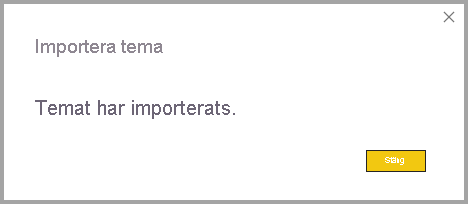
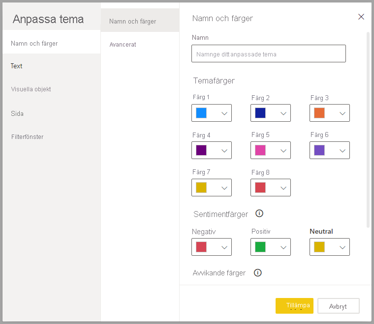
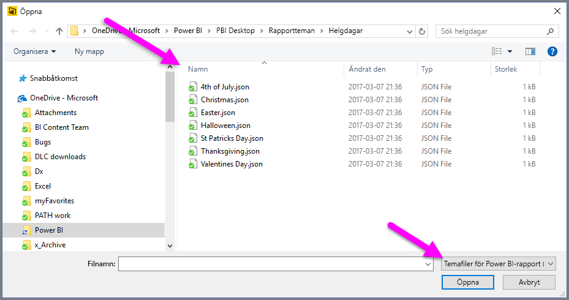
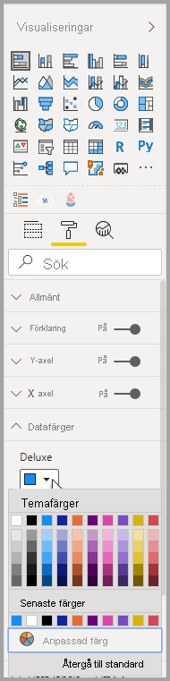
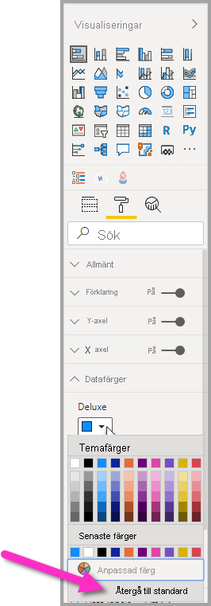

# <a name="use-report-themes-in-power-bi-desktop"></a>Använda rapportteman i Power BI Desktop

Med *rapportteman* i Power BI Desktop kan du tillämpa designändringar i hela rapporten, till exempel genom att använda företagsfärger, ändra ikonuppsättningar eller använda ny förvald visuell formatering. När du tillämpar ett rapporttema kommer färgerna och formateringen från det valda temat att användas för alla visuella objekt i rapporten som standardvärden. Några undantag finns, vilka beskrivs längre fram i den här artikeln.

Du kan välja rapportteman genom att gå till menyfliken **Visa** och välja listrutepilen i avsnittet **Teman** i menyfliksområdet. Välj sedan det tema du vill använda. Tillgängliga teman liknar teman som finns i andra Microsoft-produkter, till exempel Microsoft PowerPoint.


Det finns två typer av rapportteman: inbyggda rapportteman och anpassade rapporttemafiler.

- **Inbyggda** rapportteman ger olika typer av fördefinierade färgscheman som installeras med Power BI Desktop. Du väljer inbyggda rapportteman direkt från Power BI Desktop-menyn.

- **Anpassade** rapportteman skapas genom att justera ett aktuellt tema och sedan spara det som ett anpassat tema, eller genom att skapa ett eget anpassat tema med hjälp av en JSON-fil. Med JSON-filen får du detaljerad kontroll över många delar av ett rapporttema. Det här beskrivs senare i den här artikeln. 

Vi tar först en titt på hur rapportteman fungerar och går sedan vidare till hur du skapar anpassade rapportteman.


## <a name="how-report-themes-work"></a>Så här fungerar rapportteman

Om du vill använda ett rapporttema i en Power BI Desktop-rapport kan du välja bland följande alternativ:

* Välj bland [tillgängliga inbyggda rapportteman](#built-in-report-themes) i Power BI Desktop
* Anpassa ett tema med dialogrutan **Anpassa tema**
* [Importera en JSON-fil för ett anpassat tema](#import-custom-report-theme-files).

Vi tar en titt på vart och ett av dessa alternativ.

> [!NOTE]
> Du kan bara använda teman när du använder Power BI Desktop. Du kan inte använda teman i befintliga rapporter i Power BI-tjänsten. 

### <a name="built-in-report-themes"></a>Inbyggda rapportteman

Så här väljer du bland tillgängliga inbyggda rapportteman:

1. Gå till **Teman** och välj listrutepilen **Växla Tema** på menyfliken **Visa**.

   

2. Välj bland de teman som finns på den nedrullningsbara menyn som visas.

   

   Ditt rapporttema används nu i rapporten.

    I följande tabell visas de inbyggda rapportteman som är tillgängliga.
    
    | Inbyggt rapporttema | Standardfärgsekvens |
    |------ |---------- |
    | Default | |
    | Highrise | |
    | Chef | |
    | Gräns| |
    | Förnya | |
    | Blomning | |
    | Tidvattenenergi| |
    | Temperatur | |
    | Solenergi| |
    | Avvikande | |
    | Storm | |
    | Klassisk | |
    | Stadsparken | |
    | Klassrum | |
    | Färgblindssäker | |
    | Elektrisk | |
    | Högkontrast | |
    | Solnedgång | |
    | Skymning | |
    
3. Du kan också bläddra i samlingen med teman som skapats av medlemmar i Power BI Community genom att välja **Temagalleri** från listrutan för Teman.

   

    I galleriet kan du välja ett tema som du gillar och ladda ned dess associerade JSON-fil. 

    Installera den nedladdade filen genom att välja **Bläddra efter Teman** från listrutan för **Teman**. Gå till platsen där du laddade ned JSON-filen och välj den, så importeras temat till Power BI Desktop som ett nytt tema.

    Om importen lyckas visar Power BI en dialogruta om att importen har slutförts.

   

## <a name="customize-report-themes"></a>Anpassa rapportteman

Du kan anpassa och standardisera nästan alla element som visas i avsnittet **Formatering** i fönstret **Visualiseringar**, antingen via anpassningar som görs direkt i Power BI Desktop eller via en JSON-fil med rapporttemat. Målet är att ge dig full kontroll över rapportens standardutseende på en detaljerad nivå.

Det finns två sätt att anpassa rapportteman:

- [Skapa och anpassa ett tema i Power BI Desktop](#create-and-customize-a-theme-in-power-bi-desktop)
- [Skapa och anpassa en JSON-fil för anpassat rapporttema](#introduction-to-report-theme-json-files)

Vi tar en titt på var och en av dessa metoder i de följande avsnitten.

### <a name="create-and-customize-a-theme-in-power-bi-desktop"></a>Skapa och anpassa ett tema i Power BI Desktop

Om du vill anpassa ett tema direkt i Power BI Desktop kan du välja ett tema som liknar det du vill använda och göra några justeringar. Välj först ett liknande tema (eller sätt igång med vilket tema som helst och anpassa det) och utför följande steg:

1. På menyfliken **Visa** väljer du knappen för listrutan **Teman** och väljer **Anpassa det aktuella temat**.

   

2. En dialogruta visas där du kan göra alla typer av ändringar i det aktuella temat, och sedan spara dina inställningar som ett nytt tema.

   

Temainställningar som kan anpassas finns i följande kategorier, som visas i dialogrutan **Anpassa tema**:

- **Namn och färger**: Temats namn och färginställningar omfattar [temafärger](#how-report-theme-colors-stick-with-your-reports), sentimentfärger, avvikande färger och [strukturella färger (Avancerat)](#setting-structural-colors).
- **Text**: I textinställningarna finns teckensnittsfamilj, storlek och färg, som anger [standardvärdena för primär textklass](#setting-formatted-text-defaults) för etiketter, rubriker, kort och KPI:er samt flikrubriker.
- **Visuella objekt**: Inställningar för visuella objekt omfattar bakgrund, kantlinje, rubrik och knappbeskrivningar.
- **Sida**: Sidelementsinställningarna inkluderar skrivbordsunderlägg och bakgrund.
- **Filterfönster**: Inställningar för filterfönstret avser bakgrundsfärg, transparens, teckensnitts- och ikonfärg, storlek och filterkort.

När du har gjort ändringarna väljer du **Använd och spara** för att spara ditt tema. Ditt tema kan nu användas i den aktuella rapporten och exporteras.

Genom att anpassa det aktuella temat på det här sättet kan du snabbt och enkelt anpassa teman. Du kan också göra finjusteringar av teman, vilket kräver att du ändrar temats [JSON-fil](#report-theme-json-file-format).

> [!TIP]
> Du kan anpassa de vanligaste alternativen för rapporttema med hjälp av kontrollerna i dialogrutan **Anpassa tema**. Om du vill ha ytterligare kontroll kan du exportera JSON-filen för ett tema och göra finjusteringar genom att manuellt ändra inställningarna i den filen. Du kan byta namn på den finjusterade JSON-filen och importera den senare.

### <a name="import-custom-report-theme-files"></a>Importera anpassade rapporttemafiler

Du kan också importera en anpassad rapporttemafil genom att utföra följande steg:

1. Välj menyfliken **Visa**, och välj sedan från knappen för listrutan **Teman** alternativet **Bläddra efter teman**.

   

   Ett fönster visas där du kan gå till platsen för JSON-temafilen.

2. I följande bild finns ett par stycken filer med helgteman. Vi ska välja ett helgtema för mars, *St Patricks Day.json*.

   

   När temafilen har lästs in visar Power BI Desktop ett meddelande om det.

   

## <a name="introduction-to-report-theme-json-files"></a>Introduktion till JSON-filer med rapporttema

 När du öppnar den grundläggande JSON-filen som nämns i föregående avsnitt (S:t Patricks Day.json) visas den så här:

 ```json
    {
        "name": "St Patrick's Day",
        "dataColors": ["#568410", "#3A6108", "#70A322", "#915203", "#D79A12", "#bb7711", "#114400", "#aacc66"],
        "background":"#FFFFFF",
        "foreground": "#3A6108",
        "tableAccent": "#568410"
    }
```

Den här JSON-filen med rapporttema innehåller följande rader:

- **name**: Namnet på rapporttemat. Det här fältet är det enda obligatoriska fältet.
- **dataColors**: Listan med hexadecimala färgkoder som ska användas för data i visuella objekt i Power BI Desktop. Den här listan kan innehålla så många eller så få färger som du vill.
- **background**, **firstLevelElements** och **tableAccent** (och så vidare): Färgklasser. Med färgklasser kan du ange många strukturella färger i rapporten på samma gång.

Du kan använda den här JSON-filen som bas för att skapa en egen anpassad rapporttemafil som ska importeras. Om du bara vill justera de grundläggande färgerna i rapporten ändrar du namn och hex-koder i filen.

I en JSON-fil med rapporttema definierar du bara den formatering som du vill ändra. Allt som du inte anger i JSON-filen återgår till standardinställningarna i Power BI Desktop.

Det finns många fördelar med att skapa en JSON-fil. Du kan till exempel ange att alla diagram ska använda teckenstorleken 12, att vissa visuella objekt ska använda en viss teckensnittsfamilj, eller att dataetiketter ska vara inaktiverade för specifika diagramtyper. Genom att använda en detaljerad JSON-fil kan du skapa en rapporttemafil som standardiserar dina diagram och rapporter, vilket gör organisationens rapporter konsekventa.

Mer information om JSON-filens format finns i [Rapporttema i JSON-filformat](#report-theme-json-file-format).

> [!NOTE]
> Det är säkert att ändra ett anpassat JSON-rapporttema med dialogrutan [**Anpassa tema**](#create-and-customize-a-theme-in-power-bi-desktop).  Dialogrutan ändrar inte temainställningar som den inte kan kontrollera och uppdaterar de ändringar som har gjorts på plats i rapporttemat.

## <a name="how-report-theme-colors-stick-with-your-reports"></a>Så här använder du rapporttemafärger i dina rapporter

När du publicerar rapporten till Power BI-tjänsten kommer den att behålla temafärgerna. Avsnittet **Datafärger** i panelen **Format** speglar ditt rapporttema.

Så här visar du tillgängliga färger i ett rapporttema:

1. Välj ett visuellt objekt.

2. I avsnittet **Format** i fönstret **Visualisering** väljer du **Datafärger**.

3. Välj listrutan för ett objekt om du vill visa information om **Temafärger** i rapporttemat.

   

I vårt exempel tillämpar vi först de många gröna och bruna färgerna från St. Patrick's Day-temat och visar sedan temafärgerna. Ser du allt det gröna? Det beror på att färgerna ingick i det rapporttema som vi importerade och använde.

Färgerna på färgpaletten styrs av det aktuella temat. Anta till exempel att du väljer den tredje färgen på den översta raden för en datapunkt. Om du senare byter till ett annat tema uppdateras datapunktens färg automatiskt till den tredje färgen på den översta raden i det nya temat, precis som när du ändrar teman i Microsoft Office.

Om du anger en rapporttema ändras standardfärgerna som används i visuella objekt i rapporten. Power BI har en lista med hundratals färger, så att de visuella objekten har massor av unika färger att visa i en rapport. När Power BI tilldelar färger till en serie för ett visuellt objekt väljs färger enligt en först till kvarn-princip när seriefärger tilldelas. När du importerar ett tema återställs mappningen av färger för dataserien. 

Power BI spårar färgen för en dynamisk serie och använder samma färg för värdet i andra visuella objekt. I en *dynamisk serie* kan antalet serier som presenteras i visuella objekt ändras baserat på mått, värden eller andra aspekter. Om du till exempel visar *vinst per region* i en rapport kan antalet säljregioner du har vara fem eller så kan det vara nio. Antalet regioner är dynamiskt, så det anses vara en dynamiska serie. 

Och för *statiska serier* är antalet serier känt. Till exempel är *vinst* och *intäkter* statiska serier. I statiska serier tilldelar Power BI färger efter index i temapaletterna. Du kan åsidosätta den standardinställda färgtilldelningen genom att välja en färg i formateringsrutan under **Datafärger**. Du kanske måste ändra utsnittsmarkeringarna för att se alla potentiella serievärden, och även ange deras färger. Om du uttryckligen anger en färg för ett enstaka visuellt objekt med rutan **Egenskaper** gäller inte det importerade temat för några av dessa uttryckligen definierade färger. 

Om du vill tillåta att temat används för dessa uttryckligen valda färger använder du **Återgå till standard** i **Datafärger** för det visuella objekt som färger uttryckligen har angetts för, för att ångra den uttryckliga färganvändningen och låta temat användas.


### <a name="situations-when-report-theme-colors-wont-stick-to-your-reports"></a>Situationer när rapportens temafärger inte behålls i rapporterna

Anta att du använder en anpassad färguppsättning (eller enskilda färger) på en viss datapunkt i ett visuellt objekt med hjälp av alternativet **Anpassad färg** i färgväljaren. När du använder ett rapporttema kommer detta *inte* att åsidosätta den anpassade datapunktsfärgen.

Kanske vill du ange en datapunktsfärg manuellt med hjälp av avsnittet **Temafärger**. När du installerar ett nytt rapporttema kommer färgerna *inte* att uppdateras. För att återgå till dina standardfärger, så att de uppdateras när du använder ett nytt rapporttema, kan du välja **Återgå till standard** eller välja en färg i paletten **Temafärger** i färgväljaren.



Många visuella Power BI-objekt kommer inte att använda rapportteman.

## <a name="custom-report-theme-files-you-can-use-right-now"></a>Anpassade rapporttemafiler som du kan använda direkt

Vill du komma igång med rapportteman? Kolla in anpassade rapportteman i [temagalleriet](https://community.powerbi.com/t5/Themes-Gallery/bd-p/ThemesGallery) eller prova följande färdiga anpassade JSON-filer för anpassade rapportteman, som du kan hämta och importera till din Power BI Desktop-rapport:

- [Vågformstema](https://community.powerbi.com/t5/Themes-Gallery/Waveform/m-p/140536). Det här rapporttemat introducerades i [blogginlägget](https://powerbi.microsoft.com/blog/power-bi-desktop-march-feature-summary/) som presenterade den första versionen av rapportteman. [Hämta Waveform.json](https://go.microsoft.com/fwlink/?linkid=843924).

  

- [Eget tema för färgblinda](https://community.powerbi.com/t5/Themes-Gallery/Color-Blind-Friendly/m-p/140597).
Det här rapporttemat är lättare att läsa för synskadade. [Hämta ColorblindSafe Longer.json](https://go.microsoft.com/fwlink/?linkid=843923).

  .

- Power View-teman med Apothecary.json. [Hämta Power View teman i en zip-fil](https://go.microsoft.com/fwlink/?linkid=843925).

  

- Alla hjärtans dag-tema.

  

  Här är koden för Alla hjärtans dag-temats JSON-fil:

   ```json
       {
           "name": "Valentine's Day",
           "dataColors": ["#990011", "#cc1144", "#ee7799", "#eebbcc", "#cc4477", "#cc5555", "#882222", "#A30E33"],
           "background":"#FFFFFF",
           "foreground": "#ee7799",
           "tableAccent": "#990011"
       }
   ```

Här följer några fler rapportteman som du kan använda för att komma igång:

- [Sunflower-twilight](https://community.powerbi.com/t5/Themes-Gallery/Sunflower-Twilight/m-p/140749)
- [Plum](https://community.powerbi.com/t5/Themes-Gallery/Plum/m-p/140711)
- [Autumn](https://community.powerbi.com/t5/Themes-Gallery/Autumn/m-p/140746)
- [High contrast](https://community.powerbi.com/t5/Themes-Gallery/Color-Blind-Friendly/m-p/140597)

Med rapportteman blir dina Power BI Desktop-rapporter en färgstark återspegling av dig, din organisation eller till och med av aktuell säsong eller helgdag.

## <a name="export-report-themes"></a>Exportera rapportteman

Du kan exportera det rapporttema som används just nu direkt från Power BI Desktop till en JSON-fil. När du har exporterat ett rapporttema kan du återanvända det i andra rapporter. Med det här alternativet kan du exportera JSON-filen för de flesta inbyggda teman. De enda undantagen är grundläggande teman, klassisk och standard, som andra teman bygger på när de importeras.

Så här exporterar du det tema som används just nu från Power BI Desktop:

1. Välj **Arkiv** > **Alternativ och inställningar** > **Alternativ**.

2. I avsnittet **Förhandsversionsfunktioner** väljer du **Anpassa aktuellt tema** och väljer sedan **OK**.

   Du kan uppmanas att starta om Power BI Desktop för att förhandsgranskningsfunktionen ska aktiveras. När du har startat om kan du börja exportera det tema som används.

3. I menyfliksområdet **Start** väljer du **Växla tema** > **Exportera aktuellt tema**.

4. I dialogrutan **Spara som** bläddrar du till en katalog där du vill spara JSON-filen och väljer sedan **Spara**.

## <a name="report-theme-json-file-format"></a>Rapporttema i JSON-filformat

På den mest grundläggande nivån har tema-JSON-filen bara en nödvändig rad: **namn.**

```json
{
    "name": "Custom Theme"
}
```

Förutom **namn** är allt annat valfritt, vilket innebär att du kan lägga till de egenskaper som du vill formatera i temafilen och fortsätta använda standardvärden för Power BI för de övriga.

### <a name="setting-theme-colors"></a>Ange temafärger

Under **namn** kan du lägga till följande grundläggande datafärgegenskaper:

- **dataColors**: Listan med hexadecimala färgkoder som används för att färglägga former som representerar visuella objekt i Power BI Desktop. Den här listan kan innehålla så många eller så få färger som du vill. Om alla färger från den här listan har använts och det visuella objektet fortfarande behöver fler färger, återgår det till standardfärgpaletten för Power BI.
- **bra**, **neutralt**, **dåligt**: Dessa egenskaper anger de statusfärger som används av vattenfallsdiagrammet och det visuella KPI-objektet.
- **maximi**, **medel**, **minimi**, **noll**: Dessa färger anger de olika tonade färgerna i dialogrutan villkorsstyrd formatering.

Ett grundläggande tema som definierar dessa färger kan visas enligt följande:

```json
{
    "name": "Custom Theme",
    "dataColors": [
        "#118DFF",
        "#12239E",
        "#E66C37",
        "#6B007B",
        "#E044A7",
        "#744EC2",
        "#D9B300",
        "#D64550",
        "#197278",
        "#1AAB40"
    ],
    "good": "#1AAB40",
    "neutral": "#D9B300",
    "bad": "#D64554",
    "maximum": "#118DFF",
    "center": "#D9B300",
    "minimum": "#DEEFFF",
    "null": "#FF7F48"
}
```

### <a name="setting-structural-colors"></a>Ange strukturella färger

Sedan kan du lägga till olika färgklasser, till exempel **background** och **firstLevelElements**. Dessa färgklasser anger strukturella färger för element i rapporten, till exempel axelstödlinjer, markeringsfärger och bakgrundsfärger för visuella element.

Följande tabell visar de sex färgklasser som du kan formatera.  Namnen för **Färgklass** motsvarar namnen i underavsnittet "Avancerat" i avsnittet "Namn och färger" i dialogrutan [**Anpassa tema** ](#create-and-customize-a-theme-in-power-bi-desktop).

|Färgklass  |Det som formateras  |
|---------|---------|
| **firstLevelElements** <br> **foreground**    (inaktuell) | Bakgrundsfärg för etiketter (när de är utanför datapunkter) <br> Trendlinjefärg <br>  Standardfärg för textruta <br> Tabell- och matrisvärdefärger och summeringsteckenfärger Datastaplarnas axelfärg <br> Kortdataetiketter <br> Värde för pratbubbla <br> Målfärg för KPI <br>  Textfärg för KPI <br> Utsnittsobjektets färg (i fokusläge)  <br> Teckenfärg för listrutobjekt i utsnitt <br> Teckenfärg för numerisk indatamängd i utsnitt <br> Teckenfärg för utsnittsrubrik <br> Linjefärg för punktdiagram <br> Prognoslinjefärg för linjediagram <br> Färg för ledande linje på karta <br> Filterfönster- och korttextfärg|
| **secondLevelElements** <br> **foregroundNeutralSecondary** (inaktuell) | "ljusa" [sekundära text klasser](#setting-formatted-text-defaults) <br> Etikettfärger  <br> Teckenförklaringsfärg <br> Axelförklaringsfärg <br> Teckenfärg för tabell- och matrisrubrik <br> Linjefärg för mätarmål och målriktningslinje <br>  Axelfärg för KPI-trend <br> Skjutreglagefärg <br> Teckenfärg för utsnittsobjekt <br> Färg på utsnittskonturen <br> Linjediagrammets hovringsfärg <br> Flerradskortsrubrikfärg <br> Linjefärg för banddiagram <br> Kantlinjefärg för formkarta <br> Teckenfärg för knapptext <br> Linjefärg för knappikon <br> Kantfärg för knapp |
| **thirdLevelElements** <br >**backgroundLight** (inaktuell) | Axelrutnätsfärg <br> Rutnätsfärger för tabeller och matriser <br> Bakgrundsfärg för utsnittsrubrik (i fokusläge)  <br> Kantfärg för multiradskort  <br> Formfyllningsfärg <br> Bakgrundsfärg för mätarbåge <br> Bakgrundsfärg för tillämpat filterkort <br> När Bakgrund = FFFFFF: <br> Inaktiverad knappfyllningsfärg <br> Inaktiverad knappkonturfärg <br> |
| **fourthLevelElements** <br> **foregroundNeutralTertiary** (inaktuell) | förklaring nedtonad färg <br> Kortkategorietikettfärg <br> Etikettfärg för flerradskortkategorier <br> Fältfärg för flerradskortkategorier <br> Snittfärg för konverteringsgrad för trattdiagram <br> Inaktiverad knapptextfärg <br> Inaktiverad knappikonlinjefärg <br> |
| **background** | Bakgrundsfärg för etiketter (när de är innanför datapunkter) <br> Bakgrundsfärg för listruteobjekt för utsnitt  <br> Linjefärg för ringdiagram <br> Linjefärg för trädkarta <br> Bakgrundsfärg för kombinationsdiagram <br> Knappfyllningsfärg <br> Filterfönstret och det tillgängliga filterkortets bakgrundsfärg |
| **secondaryBackground** <br> **backgroundNeutral** (inaktuell) | Rutnätskantfärg för tabeller och matriser <br> Standardfärg för formkarta <br> Fyllnadsfärg för band i banddiagram(när alternativet matcha serie är inaktiverat) <br> När bakgrund != FFFFFF: <br> Inaktiverad knappfyllningsfärg <br> Inaktiverad knappkonturfärg <br> |
| **tableAccent** | Åsidosätter tabell- och matrisrutnätets dispositionsfärg vid visning |

Här är ett exempeltema som anger färgklasser:

```json
{
    "name": "Custom Theme",
    "firstLevelElements": "#252423",
    "secondLevelElements": "#605E5C",
    "thirdLevelElements": "#F3F2F1",
    "fourthLevelElements": "#B3B0AD",
    "background": "#FFFFFF",
    "secondaryBackground": "#C8C6C4",
    "tableAccent": "#118DFF"
}
```

> [!TIP]
> Om du skapar ett "mörkt tema" eller ett annat färgtema som avviker från det vanliga formatet "svarta" **firstLevelElements** på "vit" **background** ska du även ange värdena för andra strukturella färger samt [färger för primär textklass](#setting-formatted-text-defaults).  Detta säkerställer att (till exempel) dataetiketter i diagram med en etikettbakgrund matchar det förväntade formatet och blir läsbart samt att axelstödlinjer visas.

### <a name="setting-formatted-text-defaults"></a>Ange standardinställningar för formaterad text

Härnäst kan du lägga till textklasser i JSON-filen. Textklasser liknar färgklasser, men är utformade för att du ska kunna uppdatera teckenstorlek, färg och familj för grupper av text i rapporten.

Det finns 12 textklasser, men du behöver bara ange fyra klasser, som kallas*primära klasser*, för att ändra all textformatering i rapporten.  Dessa fyra primära klasser kan anges i dialogrutan [**Anpassa tema** ](#create-and-customize-a-theme-in-power-bi-desktop) under avsnittet "Text": "Allmänt" motsvarar **etikett**, "Rubrik" motsvarar **rubrik**, "Kort och KPI:er" motsvarar **bildtext** och "Flikrubriker" motsvarar **rubrik**.

Andra textklasser, som betraktas som *sekundära klasser*, härleder automatiskt egenskaperna från deras associerade primära klasser. En sekundär klass väljer ofta en ljusare färgton för textfärgen eller en större eller mindre textstorlek jämfört med den primära klassen.

Ta klassen **etikett** som exempel. Standardformateringen för **etikett**-klassen är Segoe UI, #252423 (en mörkgrå färg) och 12 punkter. Den här klassen används för att formatera värdena i tabellen och matrisen. Vanligtvis kommer summan i en tabell eller matris att ha liknande formatering, men med **fet stil** så att den syns bättre. Men du behöver inte ange klassen i temats JSON, det gör Power BI automatiskt. Om du senare bestämmer dig för att ange etiketter som har ett teckensnitt på 14 punkter i ditt tema behöver du inte också uppdatera klassen **fet etikett**, eftersom den ärver textformatering från **etikett**-klassen.

I följande tabell visas denna information:

- Var och en av de fyra primära textklasserna, vad de formaterar och deras standardinställningar
- Varje sekundär klass, vad de formaterar och deras standardinställningar, som är unika i förhållande till primärklassen

|Primärklass  |Sekundära klasser  |JSON-klassnamn  | Standardinställningar  |Associerade visuella objekt  |
|---------|---------|---------|---------|---------|
| Bildtext | Ej tillämpligt | bildtext | DIN <br> #252423 <br> 45pt |Kortdataetiketter <br> KPI-indikatorer|
|Sidhuvud|Saknas|sidhuvud|Segoe UI Semibold <br> #252423 <br> 12 pt |Sidhuvud med viktiga påverkare |
| Rubrik || rubrik |DIN <br> #252423 <br> 12 pt |Rubrik för kategoriaxel <br> Rubrik för värdeaxel <br> Flerradskortsrubrik * <br> Sidhuvud för utsnitt|
|-| Stor rubrik | stor rubrik |14pt |Visuell rubrik |
|Etikett ||etikett |Segoe UI<br>#252423<br>10pt |Rubriker för tabell- och matrisrubriker <br> Matrisradrubriker<br>Tabeller och matriser<br>Tabell- och matrisvärden |
|-|Semibold |semiboldLabel| Segoe UI Semibold | Profiltext för viktiga påverkare
|-|Stor |largeLabel |12 pt | Dataetiketter för multiradkort |
|-|Liten |smallLabel |9pt |Referenslinjeetiketter * <br>Datumintervallsetiketter för utsnitt<br> Teckenfärg för numerisk indatamängd i utsnitt<br>Utsnittssökruta<br>Text om viktiga påverkares påverkan|
|-|Ljus |lightLabel |#605E5C |Förklaringstext<br>Knapptext<br>Etikett för kategoriaxel<br>Dataetiketter för trattdiagram<br>Konverteringstaktsetiketter för trattdiagram<br>Mätarmål<br>Kategorietikett för punktdiagram<br>Utsnittsobjekt|
|-|Fetstil |boldLabel |Segoe UI Bold |Matrisdelsummor<br>Matrissummor<br>Tabellsummor |
|-|Stor och lätt |largeLightLabel |#605E5C<br>12 pt |Kortkategorietiketter<br>Mätaretiketter<br>Kortkategorietiketter med flera rader |
|-|Liten och lätt |smallLightLabel |#605E5C<br>9pt |Dataetiketter<br>Värdeaxeletiketter|

*\* Stjärnmärkta objekt färgas också baserat på den första datafärgen i rapporttemat.*

> [!TIP]
> De *ljusa* variationerna av textklasser hämtar den ljusa färgen från de [strukturella färger](#setting-structural-colors) som definierats ovan.  Om du skapar ett "mörkt tema" bör du även ange färgerna "firstLevelElements" (som matchar den primära textfärgen), "secondLevelElements" (som matchar den förväntade "ljusa" färgen för text) samt "background" (med tillräcklig kontrast mot färgerna för element på både första och andra nivån).

Här är ett exempel på ett tema som endast anger de primära textklasserna:

```json
{
    "name": "Custom Theme",
    "textClasses": {
        "callout": {
            "fontSize": 45,
            "fontFace": "DIN",
            "color": "#252423"
        },
        "title": {
            "fontSize": 12,
            "fontFace": "DIN",
            "color": "#252423"
        },
        "header": {
            "fontSize": 12,
            "fontFace": "Segoe UI Semibold",
            "color": "#252423"
        },
        "label": {
            "fontSize": 10,
            "fontFace": "Segoe UI",
            "color": "#252423"
        }
    }
}
```

Eftersom sekundära klasser ärver från primära klasser behöver du inte ange dem i temafilen. Om du inte gillar arvsreglerna (till exempel om du inte vill att dina summor ska vara en fet version av värdena i en tabell) kan du uttryckligen formatera de sekundära klasserna i temafilen, precis som du kan formatera de primära klasserna.

### <a name="setting-visual-property-defaults-visualstyles"></a>Ange standardinställningar för egenskap för visuellt objekt (`visualStyles`)

Slutligen gäller att om du vill skapa en JSON-fil med ett utökat format och mer detaljerad kontroll över all visuell formatering i en rapport lägger du till ett **visualStyles**-avsnitt i JSON-filen för att kapsla formateringsegenskaperna. Här är ett mallexempel på avsnittet **visualStyles**:

```json
    "visualStyles": {
        "<visualName>": {
            "<styleName>": {
                "<cardName>": [{
                    "<propertyName>": <propertyValue>
                }]
            }
        }
    }
```

För avsnitten **visualName** och **cardName** använder du ett specifikt visuellt objekt och cardName. För närvarande är **styleName** alltid en asterisk (*), men i en framtida version kan du skapa olika format för dina visuella objekt och ge dem namn (liknar funktionen tabell- och matris-stil). **propertyName** är namnet på formateringsalternativet och **propertyValue** är värdet på det formateringsalternativet.

För **visualName** och **cardName** kan du använda en asterisk om du vill att inställningen ska gälla för alla visuella objekt eller kort som har en egenskap. Om du använder en asterisk för både det visuella objektet och kortnamnet kommer du att tillämpa en inställning globalt i rapporten, till exempel en teckenstorlek eller en speciell teckensnittsfamilj för all text i alla visuella objekt.

Här är ett exempel som anger ett par egenskaper via de visuella formaten:

```json
{
   "name":"Custom Theme",
   "visualStyles":{
      "*": {
         "*": {
            "*": [{
                "wordWrap": true
            }],
            "categoryAxis": [{
                "gridlineStyle": "dotted"
            }],
            "filterCard": [
              {
                "$id": "Applied",
                "foregroundColor": {"solid": {"color": "#252423" } }
              },
              {
                "$id":"Available",
                "border": true
              }
            ]
         }
      },
      "scatterChart": {
         "*": {
            "bubbles": [{
                  "bubbleSize": -10
            }]
         }
      }
   }
}
```

Det här exemplet gör följande inställningar:

- Aktiverar radbyte överallt
- Anger formatet som prickad för alla visuella objekt med en kategoriaxel
- Anger formatering för de tillgängliga och använda filterkorten (Observera formatet med "$id" för att ange olika versioner av filterkorten)
- Anger bubblans storlek för punktdiagram till -10.

> [!NOTE]
> Du behöver bara ange de formateringselement som du vill ändra. De formateringselement som inte ingår i JSON-filen återgår till sina standardvärden och inställningar.

### <a name="visualstyles-definition-list"></a>Definitionslista för `visualStyles`

Tabellerna i det här avsnittet definierar namn på visuella objekt (**visualName**), kortnamn (**cardName**), egenskapsnamn (**propertyName**) samt uppräkningar som krävs för skapande av JSON-filen.

| visualName-värden |
| --- |
| areaChart |
| barChart |
| basicShape |
| card |
| clusteredBarChart |
| clusteredColumnChart |
| columnChart |
| comboChart |
| donutChart |
| filledMap |
| tratt |
| gauge |
| hundredPercentStackedBarChart |
| hundredPercentStackedColumnChart |
| image |
| kpi |
| lineChart |
| lineClusteredColumnComboChart |
| lineStackedColumnComboChart |
| map |
| multiRowCard |
| pieChart |
| pivotTable |
| ribbonChart |
| scatterChart |
| shapeMap |
| slicer |
| stackedAreaChart |
| tableEx |
| treemap |
| waterfallChart |

I följande tabell definieras **cardName**-värden. Det första värdet i varje cell är JSON-filtermen. Det andra värdet är namnet på kortet så som det visas i Power BI Desktop-användargränssnittet.

| cardName-värden |
| --- |
| axis: Mätaxel |
| breakdown: Detaljnivå |
| bubbles: Bubblor |
| calloutValue: Värde för pratbubbla |
| card: Kort |
| cardTitle: Kortrubrik |
| categoryAxis: X-axel |
| categoryLabels: Kategorietiketter |
| columnFormatting: Fältformatering |
| columnHeaders: Kolumnrubriker |
| dataLabels: Dataetiketter |
| fill: Fyllning |
| fillPoint: Fyllningspunkt |
| forecast: Prognos |
| general: Allmänt |
| goals: Mål |
| grid: Rutnät |
| header: Sidhuvud |
| imageScaling: Skalning |
| indicator: Indikator |
| items: Poster |
| labels: Dataetiketter |
| legend: Förklaring |
| lineStyles: Former |
| mapControls: Kartkontroller |
| mapStyles: Mappningsformat |
| numericInputStyle: Numeriska indata |
| percentBarLabel: Konverteringstaktsetikett |
| plotArea: Rityta |
| plotAreaShading: Symmetrifyllning |
| ratioLine: Ratiolinje |
| referenceLine: Konstant linje |
| ribbonChart: Band |
| rotation: Rotering |
| rowHeaders: Radrubriker |
| selection: Markeringskontroller |
| sentimentColors: Sentimentsfärger |
| shape: Form |
| slider: Skjutreglage |
| status: Färgkodning |
| subTotals: Delsummor |
| target: Mål |
| total: Totalsumma |
| trend: Trendlinje |
| trendline: Trendaxel |
| valueAxis: Y-axel |
| values: Värden |
| wordWrap: Automatiskt radbyte |
| xAxisReferenceLine: X-axel konstant linje |
| y1AxisReferenceLine: Konstant linje |
| zoom: Zooma |

### <a name="properties-within-each-card"></a>Egenskaper inom varje kort

I nedanstående avsnitt definieras egenskaperna inom varje kort. Kortnamnet följs av varje egenskapsnamn. För varje egenskap: det namn du ser om formateringsfönstret visas, en beskrivning av vad formateringsalternativet gör och typen av formateringsalternativ. Med den här metoden kan du se vilka typer av värden som du kan använda i din temafil.

När du använder **dateTime** måste datumet vara ett ISO-datum med enkla citattecken med datetime i början. Se följande exempel:

  "datetime'2011-10-05T14:48:00.000Z'"

Booleska värden är antingen sanna eller falska. Strängar måste vara inom dubbla citattecken, som i "den här strängen". Siffrorna är endast värdet, utan citattecken.

Färgerna använder följande format, där din anpassade hexadecimala kod ersätter ”FFFFFF” i följande exempel:

    { "solid": { "color": "#FFFFFF" } }

En uppräkning, som oftast används för listrutealternativ, innebär att den kan ställas in på något av de alternativ som visas i fönstret, till exempel ”RightCenter” för förklaringens placering eller ”datavärde, procent av total” för en cirkeldiagrametikett. Uppräkningsalternativen visas under egenskapslistan.

```json
{
      "general":{
        "responsive": {
          "type": [
            "bool"
          ],
          "displayName": [
            "(Preview) Responsive"
          ],
          "description": [
            "The visual will adapt to size changes"
          ]
        },
        "legend": {
        "show": {
          "type": [
            "bool"
          ],
          "displayName": [
            "Show"
          ]
        },
        "position": {
          "type": [
            "enumeration"
          ],
          "displayName": [
            "Position"
          ],
          "description": [
            "Select the location for the legend"
          ]
        },
        "showTitle": {
          "type": [
            "bool"
          ],
          "displayName": [
            "Title"
          ],
          "description": [
            "Display a title for legend symbols"
          ]
        },
        "labelColor": {
          "type": [
            "fill"
          ],
          "displayName": [
            "Color"
          ]
        },
        "fontFamily": {
          "type": [
            "formatting"
          ],
          "displayName": [
            "Font family"
          ]
        },
        "fontSize": {
          "type": [
            "formatting"
          ],
          "displayName": [
            "Text Size"
          ]
        }
      },
      "categoryAxis": {
        "show": {
          "type": [
            "bool"
          ],
          "displayName": [
            "Show"
          ]
        },
        "axisScale": {
          "type": [
            "enumeration"
          ],
          "displayName": [
            "Scale type"
          ]
        },
        "start": {
          "type": [
            "numeric",
            "dateTime"
          ],
          "displayName": [
            "Start"
          ],
          "description": [
            "Enter a starting value (optional)"
          ]
        },
        "end": {
          "type": [
            "numeric",
            "dateTime"
          ],
          "displayName": [
            "End"
          ],
          "description": [
            "Enter an ending value (optional)"
          ]
        },
        "axisType": {
          "type": [
            "enumeration"
          ],
          "displayName": [
            "Type"
          ]
        },
        "showAxisTitle": {
          "type": [
            "bool"
          ],
          "displayName": [
            "Title"
          ],
          "description": [
            "Title for the X-axis",
            "Title for the Y-axis"
          ]
        },
        "axisStyle": {
          "type": [
            "enumeration"
          ],
          "displayName": [
            "Style"
          ]
        },
        "labelColor": {
          "type": [
            "fill"
          ],
          "displayName": [
            "Color"
          ]
        },
        "fontFamily": {
          "type": [
            "formatting"
          ],
          "displayName": [
            "Font family"
          ]
        },
        "fontSize": {
          "type": [
            "formatting"
          ],
          "displayName": [
            "Text Size"
          ]
        },
        "labelDisplayUnits": {
          "type": [
            "formatting"
          ],
          "displayName": [
            "Display units"
          ],
          "description": [
            "Select the units (millions, billions, etc.)"
          ]
        },
        "labelPrecision": {
          "type": [
            "numeric"
          ],
          "displayName": [
            "Value decimal places"
          ],
          "description": [
            "Select the number of decimal places to display for the values"
          ]
        },
        "concatenateLabels": {
          "type": [
            "bool"
          ],
          "displayName": [
            "Concatenate labels"
          ],
          "description": [
            "Always concatenate levels of the hierarchy instead of drawing the hierarchy."
          ]
        },
        "preferredCategoryWidth": {
          "type": [
            "numeric"
          ],
          "displayName": [
            "Minimum category width"
          ]
        },
        "titleColor": {
          "type": [
            "fill"
          ],
          "displayName": [
            "Title color"
          ]
        },
        "titleFontFamily": {
          "type": [
            "formatting"
          ],
          "displayName": [
            "Font family"
          ]
        },
        "titleFontSize": {
          "type": [
            "formatting"
          ],
          "displayName": [
            "Title text size"
          ]
        },
        "position": {
          "type": [
            "enumeration"
          ],
          "displayName": [
            "Position"
          ],
          "description": [
            "Select left or right"
          ]
        },
        "color": {
          "type": [
            "fill"
          ],
          "displayName": [
            "Color"
          ],
          "description": [
            "Select color for data labels"
          ]
        },
        "duration": {
          "type": [
            "numeric"
          ]
        }
      },
      "valueAxis": {
        "show": {
          "type": [
            "bool"
          ],
          "displayName": [
            "Show"
          ]
        },
        "position": {
          "type": [
            "enumeration"
          ],
          "displayName": [
            "Position"
          ],
          "description": [
            "Select left or right"
          ]
        },
        "axisScale": {
          "type": [
            "enumeration"
          ],
          "displayName": [
            "Scale type"
          ]
        },
        "start": {
          "type": [
            "numeric",
            "dateTime"
          ],
          "displayName": [
            "Start"
          ],
          "description": [
            "Enter a starting value (optional)"
          ]
        },
        "end": {
          "type": [
            "numeric",
            "dateTime"
          ],
          "displayName": [
            "End"
          ],
          "description": [
            "Enter an ending value (optional)"
          ]
        },
        "showAxisTitle": {
          "type": [
            "bool"
          ],
          "displayName": [
            "Title"
          ],
          "description": [
            "Title for the Y-axis",
            "Title for the X-axis"
          ]
        },
        "axisStyle": {
          "type": [
            "enumeration"
          ],
          "displayName": [
            "Style"
          ]
        },
        "labelColor": {
          "type": [
            "fill"
          ],
          "displayName": [
            "Color"
          ]
        },
        "fontFamily": {
          "type": [
            "formatting"
          ],
          "displayName": [
            "Font family"
          ]
        },
        "fontSize": {
          "type": [
            "formatting"
          ],
          "displayName": [
            "Text Size"
          ]
        },
        "labelDisplayUnits": {
          "type": [
            "formatting"
          ],
          "displayName": [
            "Display units"
          ],
          "description": [
            "Select the units (millions, billions, etc.)"
          ]
        },
        "labelPrecision": {
          "type": [
            "numeric"
          ],
          "displayName": [
            "Value decimal places"
          ],
          "description": [
            "Select the number of decimal places to display for the values"
          ]
        },
        "titleColor": {
          "type": [
            "fill"
          ],
          "displayName": [
            "Title color"
          ]
        },
        "titleFontFamily": {
          "type": [
            "formatting"
          ],
          "displayName": [
            "Font family"
          ]
        },
        "titleFontSize": {
          "type": [
            "formatting"
          ],
          "displayName": [
            "Title text size"
          ]
        },
        "axisLabel": {
          "type": [
            "none"
          ],
          "displayName": [
            "Y-Axis (Column)"
          ]
        },
        "secShow": {
          "type": [
            "bool"
          ],
          "displayName": [
            "Show secondary"
          ]
        },
        "alignZeros": {
          "type": [
            "bool"
          ],
          "displayName": [
            "Align zeros"
          ],
          "description": [
            "Align the zero tick marks for both value axes"
          ]
        },
        "secAxisLabel": {
          "type": [
            "none"
          ],
          "displayName": [
            "Y-Axis (Line)"
          ]
        },
        "secPosition": {
          "type": [
            "enumeration"
          ],
          "displayName": [
            "Position"
          ],
          "description": [
            "Select left or right"
          ]
        },
        "secAxisScale": {
          "type": [
            "enumeration"
          ],
          "displayName": [
            "Scale type"
          ]
        },
        "secStart": {
          "type": [
            "numeric"
          ],
          "displayName": [
            "Start"
          ],
          "description": [
            "Enter a starting value (optional)"
          ]
        },
        "secEnd": {
          "type": [
            "numeric"
          ],
          "displayName": [
            "End"
          ],
          "description": [
            "Enter an ending value (optional)"
          ]
        },
        "secShowAxisTitle": {
          "type": [
            "bool"
          ],
          "displayName": [
            "Title"
          ],
          "description": [
            "Title for the Y-axis"
          ]
        },
        "secAxisStyle": {
          "type": [
            "enumeration"
          ],
          "displayName": [
            "Style"
          ]
        },
        "secLabelColor": {
          "type": [
            "fill"
          ],
          "displayName": [
            "Color"
          ]
        },
        "secFontFamily": {
          "type": [
            "formatting"
          ],
          "displayName": [
            "Font family"
          ]
        },
        "secFontSize": {
          "type": [
            "formatting"
          ],
          "displayName": [
            "Text Size"
          ]
        },
        "secLabelDisplayUnits": {
          "type": [
            "formatting"
          ],
          "displayName": [
            "Display units"
          ],
          "description": [
            "Select the units (millions, billions, etc.)"
          ]
        },
        "secLabelPrecision": {
          "type": [
            "numeric"
          ],
          "displayName": [
            "Value decimal places"
          ],
          "description": [
            "Select the number of decimal places to display for the values"
          ]
        },
        "secTitleColor": {
          "type": [
            "fill"
          ],
          "displayName": [
            "Title color"
          ]
        },
        "secTitleFontFamily": {
          "type": [
            "formatting"
          ],
          "displayName": [
            "Font family"
          ]
        },
        "secTitleFontSize": {
          "type": [
            "formatting"
          ],
          "displayName": [
            "Title text size"
          ]
        }
      },
      "dataPoint": {
        "defaultColor": {
          "type": [
            "fill"
          ],
          "displayName": [
            "Default color",
            "Default Column Color"
          ]
        },
        "fill": {
          "type": [
            "fill"
          ],
          "displayName": [
            "Fill"
          ]
        },
        "defaultCategoryColor": {
          "type": [
            "fill"
          ],
          "displayName": [
            "Default color",
            "Default Column Color"
          ]
        },
        "showAllDataPoints": {
          "type": [
            "bool"
          ],
          "displayName": [
            "Show all"
          ]
        }
      },
      "labels": {
        "show": {
          "type": [
            "bool"
          ],
          "displayName": [
            "Show"
          ]
        },
        "showSeries": {
          "type": [
            "bool"
          ],
          "displayName": [
            "Show"
          ]
        },
        "color": {
          "type": [
            "fill"
          ],
          "displayName": [
            "Color"
          ],
          "description": [
            "Select color for data labels"
          ]
        },
        "labelDisplayUnits": {
          "type": [
            "formatting"
          ],
          "displayName": [
            "Display units"
          ],
          "description": [
            "Select the units (millions, billions, etc.)"
          ]
        },
        "labelPrecision": {
          "type": [
            "numeric"
          ],
          "displayName": [
            "Value decimal places"
          ],
          "description": [
            "Select the number of decimal places to display for the values"
          ]
        },
        "showAll": {
          "type": [
            "bool"
          ],
          "displayName": [
            "Customize series"
          ]
        },
        "fontSize": {
          "type": [
            "formatting"
          ],
          "displayName": [
            "Text Size"
          ]
        },
        "fontFamily": {
          "type": [
            "formatting"
          ],
          "displayName": [
            "Font family"
          ]
        },
        "labelDensity": {
          "type": [
            "formatting"
          ],
          "displayName": [
            "Label density"
          ]
        },
        "labelOrientation": {
          "type": [
            "enumeration"
          ],
          "displayName": [
            "Orientation"
          ]
        },
        "labelPosition": {
          "type": [
            "enumeration"
          ],
          "displayName": [
            "Position"
          ]
        },
        "percentageLabelPrecision": {
          "type": [
            "numeric"
          ],
          "displayName": [
            "% decimal places"
          ],
          "description": [
            "Select the number of decimal places to display for the percentages"
          ]
        },
        "labelStyle": {
          "type": [
            "enumeration"
          ],
          "displayName": [
            "Label style"
          ]
        }
      },
      "lineStyles": {
        "strokeWidth": {
          "type": [
            "numeric"
          ],
          "displayName": [
            "Stroke width"
          ]
        },
        "strokeLineJoin": {
          "type": [
            "enumeration"
          ],
          "displayName": [
            "Join type"
          ]
        },
        "lineStyle": {
          "type": [
            "enumeration"
          ],
          "displayName": [
            "Line style"
          ]
        },
        "showMarker": {
          "type": [
            "bool"
          ],
          "displayName": [
            "Show marker"
          ]
        },
        "markerShape": {
          "type": [
            "enumeration"
          ],
          "displayName": [
            "Marker shape"
          ]
        },
        "markerSize": {
          "type": [
            "numeric"
          ],
          "displayName": [
            "Marker size"
          ]
        },
        "markerColor": {
          "type": [
            "fill"
          ],
          "displayName": [
            "Marker color"
          ]
        },
        "showSeries": {
          "type": [
            "bool"
          ],
          "displayName": [
            "Customize series",
            "Show"
          ]
        },
        "shadeArea": {
          "type": [
            "bool"
          ],
          "displayName": [
            "Shade area"
          ]
        }
      },
      "plotArea": {
        "transparency": {
          "type": [
            "numeric"
          ],
          "displayName": [
            "Transparency"
          ],
          "description": [
            "Set transparency for background color"
          ]
        }
      },
      "trend": {
        "show": {
          "type": [
            "bool"
          ],
          "displayName": [
            "Show"
          ]
        },
        "displayName": {
          "type": [
            "text"
          ],
          "displayName": [
            "Name"
          ],
          "description": [
            "Set trend line name"
          ]
        },
        "lineColor": {
          "type": [
            "fill"
          ],
          "displayName": [
            "Color"
          ],
          "description": [
            "Set trend line color"
          ]
        },
        "transparency": {
          "type": [
            "numeric"
          ],
          "displayName": [
            "Transparency"
          ],
          "description": [
            "Set transparency for trend line color"
          ]
        },
        "style": {
          "type": [
            "enumeration"
          ],
          "displayName": [
            "Style"
          ],
          "description": [
            "Set trend line style"
          ]
        },
        "combineSeries": {
          "type": [
            "bool"
          ],
          "displayName": [
            "Combine Series"
          ],
          "description": [
            "Show one trend line per series or combine"
          ]
        }
      },
      "y1AxisReferenceLine": {
        "show": {
          "type": [
            "bool"
          ],
          "displayName": [
            "Show"
          ]
        },
        "value": {
          "type": [
            "numeric"
          ],
          "displayName": [
            "Value"
          ],
          "description": [
            "Set reference line numeric value"
          ]
        },
        "lineColor": {
          "type": [
            "fill"
          ],
          "displayName": [
            "Color"
          ],
          "description": [
            "Set reference line color"
          ]
        },
        "transparency": {
          "type": [
            "numeric"
          ],
          "displayName": [
            "Transparency"
          ],
          "description": [
            "Set transparency for reference line color"
          ]
        },
        "style": {
          "type": [
            "enumeration"
          ],
          "displayName": [
            "Line style"
          ]
        },
        "position": {
          "type": [
            "enumeration"
          ],
          "displayName": [
            "Position"
          ],
          "description": [
            "Arrange relative to chart data points"
          ]
        },
        "dataLabelShow": {
          "type": [
            "bool"
          ],
          "displayName": [
            "Data label"
          ],
          "description": [
            "Display a data label for the reference line"
          ]
        },
        "dataLabelColor": {
          "type": [
            "fill"
          ],
          "displayName": [
            "Color"
          ],
          "description": [
            "Set the reference line data label color"
          ]
        },
        "dataLabelDecimalPoints": {
          "type": [
            "numeric"
          ],
          "displayName": [
            "Decimal Places"
          ]
        },
        "dataLabelHorizontalPosition": {
          "type": [
            "enumeration"
          ],
          "displayName": [
            "Horizontal Position"
          ],
          "description": [
            "Set the horizontal position for the reference line data label"
          ]
        },
        "dataLabelVerticalPosition": {
          "type": [
            "enumeration"
          ],
          "displayName": [
            "Vertical Position"
          ],
          "description": [
            "Set the vertical position for the reference line data label"
          ]
        },
        "dataLabelDisplayUnits": {
          "type": [
            "formatting"
          ],
          "displayName": [
            "Display units"
          ],
          "description": [
            "Select the units (millions, billions, etc.)"
          ]
        }
      },
      "referenceLine": {
        "show": {
          "type": [
            "bool"
          ],
          "displayName": [
            "Show"
          ]
        },
        "displayName": {
          "type": [
            "text"
          ],
          "displayName": [
            "Name"
          ],
          "description": [
            "Set reference line name"
          ]
        },
        "value": {
          "type": [
            "numeric"
          ],
          "displayName": [
            "Value"
          ],
          "description": [
            "Set reference line numeric value"
          ]
        },
        "lineColor": {
          "type": [
            "fill"
          ],
          "displayName": [
            "Color"
          ],
          "description": [
            "Set reference line color"
          ]
        },
        "transparency": {
          "type": [
            "numeric"
          ],
          "displayName": [
            "Transparency"
          ],
          "description": [
            "Set transparency for reference line color"
          ]
        },
        "style": {
          "type": [
            "enumeration"
          ],
          "displayName": [
            "Line style"
          ]
        },
        "position": {
          "type": [
            "enumeration"
          ],
          "displayName": [
            "Position"
          ],
          "description": [
            "Arrange relative to chart data points"
          ]
        },
        "dataLabelShow": {
          "type": [
            "bool"
          ],
          "displayName": [
            "Data label"
          ],
          "description": [
            "Display a data label for the reference line"
          ]
        },
        "dataLabelColor": {
          "type": [
            "fill"
          ],
          "displayName": [
            "Color"
          ],
          "description": [
            "Set the reference line data label color"
          ]
        },
        "dataLabelDecimalPoints": {
          "type": [
            "numeric"
          ],
          "displayName": [
            "Decimal Places"
          ]
        },
        "dataLabelHorizontalPosition": {
          "type": [
            "enumeration"
          ],
          "displayName": [
            "Horizontal Position"
          ],
          "description": [
            "Set the horizontal position for the reference line data label"
          ]
        },
        "dataLabelVerticalPosition": {
          "type": [
            "enumeration"
          ],
          "displayName": [
            "Vertical Position"
          ],
          "description": [
            "Set the vertical position for the reference line data label"
          ]
        },
        "dataLabelDisplayUnits": {
          "type": [
            "formatting"
          ],
          "displayName": [
            "Display units"
          ],
          "description": [
            "Select the units (millions, billions, etc.)"
          ]
        }
      },
      "line": {
        "lineColor": {
          "type": [
            "fill"
          ],
          "displayName": [
            "Line color"
          ]
        },
        "transparency": {
          "type": [
            "numeric"
          ],
          "displayName": [
            "Transparency"
          ],
          "description": [
            "Set transparency for background color"
          ]
        },
        "weight": {
          "type": [
            "numeric"
          ],
          "displayName": [
            "Weight"
          ]
        },
        "roundEdge": {
          "type": [
            "numeric"
          ],
          "displayName": [
            "Round edges"
          ]
        }
      },
      "fill": {
        "show": {
          "type": [
            "bool"
          ],
          "displayName": [
            "Show"
          ]
        },
        "fillColor": {
          "type": [
            "fill"
          ],
          "displayName": [
            "Fill color"
          ]
        },
        "transparency": {
          "type": [
            "numeric"
          ],
          "displayName": [
            "Transparency"
          ],
          "description": [
            "Set transparency for background color"
          ]
        }
      },
      "rotation": {
        "angle": {
          "type": [
            "numeric"
          ],
          "displayName": [
            "Rotation"
          ]
        }
      },
      "categoryLabels": {
        "show": {
          "type": [
            "bool"
          ],
          "displayName": [
            "Show"
          ]
        },
        "color": {
          "type": [
            "fill"
          ],
          "displayName": [
            "Color"
          ],
          "description": [
            "Select color for data labels"
          ]
        },
        "fontSize": {
          "type": [
            "formatting"
          ],
          "displayName": [
            "Text Size"
          ]
        },
        "fontFamily": {
          "type": [
            "formatting"
          ],
          "displayName": [
            "Font family"
          ]
        }
      },
      "wordWrap": {
        "show": {
          "type": [
            "bool"
          ],
          "displayName": [
            "Show"
          ]
        }
      },
      "dataLabels": {
        "color": {
          "type": [
            "fill"
          ],
          "displayName": [
            "Color"
          ],
          "description": [
            "Select color for data labels"
          ]
        },
        "fontSize": {
          "type": [
            "formatting"
          ],
          "displayName": [
            "Text Size"
          ]
        },
        "fontFamily": {
          "type": [
            "formatting"
          ],
          "displayName": [
            "Font family"
          ]
        }
      },
      "cardTitle": {
        "color": {
          "type": [
            "fill"
          ],
          "displayName": [
            "Color"
          ],
          "description": [
            "Select color for data labels"
          ]
        },
        "fontSize": {
          "type": [
            "formatting"
          ],
          "displayName": [
            "Text Size"
          ]
        },
        "fontFamily": {
          "type": [
            "formatting"
          ],
          "displayName": [
            "Font family"
          ]
        }
      },
      "card": {
        "outline": {
          "type": [
            "enumeration"
          ],
          "displayName": [
            "Outline"
          ]
        },
        "outlineColor": {
          "type": [
            "fill"
          ],
          "displayName": [
            "Outline color"
          ],
          "description": [
            "Color of the outline"
          ]
        },
        "outlineWeight": {
          "type": [
            "numeric"
          ],
          "displayName": [
            "Outline weight"
          ],
          "description": [
            "Thickness of the outline in pixels"
          ]
        },
        "barShow": {
          "type": [
            "bool"
          ],
          "displayName": [
            "Show bar"
          ],
          "description": [
            "Display a bar to the left side of the card as an accent"
          ]
        },
        "barColor": {
          "type": [
            "fill"
          ],
          "displayName": [
            "Bar color"
          ]
        },
        "barWeight": {
          "type": [
            "numeric"
          ],
          "displayName": [
            "Bar thickness"
          ],
          "description": [
            "Thickness of the bar in pixels"
          ]
        },
        "cardPadding": {
          "type": [
            "numeric"
          ],
          "displayName": [
            "Padding"
          ],
          "description": [
            "Background"
          ]
        },
        "cardBackground": {
          "type": [
            "fill"
          ],
          "displayName": [
            "Background"
          ]
        }
      },
      "percentBarLabel": {
        "show": {
          "type": [
            "bool"
          ],
          "displayName": [
            "Show"
          ]
        },
        "color": {
          "type": [
            "fill"
          ],
          "displayName": [
            "Color"
          ],
          "description": [
            "Select color for data labels"
          ]
        },
        "fontSize": {
          "type": [
            "formatting"
          ],
          "displayName": [
            "Text Size"
          ]
        },
        "fontFamily": {
          "type": [
            "formatting"
          ],
          "displayName": [
            "Font family"
          ]
        }
      },
      "axis": {
        "min": {
          "type": [
            "numeric"
          ],
          "displayName": [
            "Min"
          ]
        },
        "max": {
          "type": [
            "numeric"
          ],
          "displayName": [
            "Max"
          ]
        },
        "target": {
          "type": [
            "numeric"
          ],
          "displayName": [
            "Target"
          ]
        }
      },
      "target": {
        "show": {
          "type": [
            "bool"
          ],
          "displayName": [
            "Show"
          ]
        },
        "color": {
          "type": [
            "fill"
          ],
          "displayName": [
            "Color"
          ],
          "description": [
            "Select color for data labels"
          ]
        },
        "labelDisplayUnits": {
          "type": [
            "formatting"
          ],
          "displayName": [
            "Display units"
          ],
          "description": [
            "Select the units (millions, billions, etc.)"
          ]
        },
        "labelPrecision": {
          "type": [
            "numeric"
          ],
          "displayName": [
            "Value decimal places"
          ],
          "description": [
            "Select the number of decimal places to display for the values"
          ]
        },
        "fontSize": {
          "type": [
            "formatting"
          ],
          "displayName": [
            "Text Size"
          ]
        },
        "fontFamily": {
          "type": [
            "formatting"
          ],
          "displayName": [
            "Font family"
          ]
        }
      },
      "calloutValue": {
        "show": {
          "type": [
            "bool"
          ],
          "displayName": [
            "Show"
          ]
        },
        "color": {
          "type": [
            "fill"
          ],
          "displayName": [
            "Color"
          ],
          "description": [
            "Select color for data labels"
          ]
        },
        "labelDisplayUnits": {
          "type": [
            "formatting"
          ],
          "displayName": [
            "Display units"
          ],
          "description": [
            "Select the units (millions, billions, etc.)"
          ]
        },
        "labelPrecision": {
          "type": [
            "numeric"
          ],
          "displayName": [
            "Value decimal places"
          ],
          "description": [
            "Select the number of decimal places to display for the values"
          ]
        }
      },
      "forecast": {
        "show": {
          "type": [
            "bool"
          ],
          "displayName": [
            "Show"
          ]
        },
        "displayName": {
          "type": [
            "text"
          ],
          "displayName": [
            "Name"
          ],
          "description": [
            "Set forecast name"
          ]
        },
        "confidenceBandStyle": {
          "type": [
            "enumeration"
          ],
          "displayName": [
            "Confidence band style"
          ],
          "description": [
            "Set forecast confidence band style"
          ]
        },
        "lineColor": {
          "type": [
            "fill"
          ],
          "displayName": [
            "Color"
          ],
          "description": [
            "Set forecast line color"
          ]
        },
        "transparency": {
          "type": [
            "numeric"
          ],
          "displayName": [
            "Transparency"
          ],
          "description": [
            "Set transparency for background color"
          ]
        },
        "style": {
          "type": [
            "enumeration"
          ],
          "displayName": [
            "Line style"
          ]
        },
        "transform": {
          "type": [
            "queryTransform"
          ]
        }
      },
      "bubbles": {
        "bubbleSize": {
          "type": [
            "formatting"
          ],
          "displayName": [
            "Size"
          ]
        }
      },
      "mapControls": {
        "autoZoom": {
          "type": [
            "bool"
          ],
          "displayName": [
            "Auto zoom"
          ]
        },
        "zoomLevel": {
          "type": [
            "numeric"
          ]
        },
        "centerLatitude": {
          "type": [
            "numeric"
          ]
        },
        "centerLongitude": {
          "type": [
            "numeric"
          ]
        }
      },
      "mapStyles": {
        "mapTheme": {
          "type": [
            "enumeration"
          ],
          "displayName": [
            "Theme"
          ]
        }
      },
      "shape": {
        "map": {
          "type": [
            "geoJson"
          ]
        },
        "projectionEnum": {
          "type": [
            "enumeration"
          ],
          "displayName": [
            "Projection"
          ],
          "description": [
            "Projection"
          ]
        }
      },
      "zoom": {
        "autoZoom": {
          "type": [
            "bool"
          ],
          "displayName": [
            "Auto zoom"
          ],
          "description": [
            "Zoom in on shapes with available data"
          ]
        },
        "selectionZoom": {
          "type": [
            "bool"
          ],
          "displayName": [
            "Selection zoom"
          ],
          "description": [
            "Zoom in on selected shapes"
          ]
        },
        "manualZoom": {
          "type": [
            "bool"
          ],
          "displayName": [
            "Manual zoom"
          ],
          "description": [
            "Allow user to zoom and pan"
          ]
        }
      },
      "xAxisReferenceLine": {
        "show": {
          "type": [
            "bool"
          ],
          "displayName": [
            "Show"
          ]
        },
        "value": {
          "type": [
            "numeric"
          ],
          "displayName": [
            "Value"
          ],
          "description": [
            "Set reference line numeric value"
          ]
        },
        "lineColor": {
          "type": [
            "fill"
          ],
          "displayName": [
            "Color"
          ],
          "description": [
            "Set reference line color"
          ]
        },
        "transparency": {
          "type": [
            "numeric"
          ],
          "displayName": [
            "Transparency"
          ],
          "description": [
            "Set transparency for reference line color"
          ]
        },
        "style": {
          "type": [
            "enumeration"
          ],
          "displayName": [
            "Line style"
          ]
        },
        "position": {
          "type": [
            "enumeration"
          ],
          "displayName": [
            "Position"
          ],
          "description": [
            "Arrange relative to chart data points"
          ]
        },
        "dataLabelShow": {
          "type": [
            "bool"
          ],
          "displayName": [
            "Data label"
          ],
          "description": [
            "Display a data label for the reference line"
          ]
        },
        "dataLabelColor": {
          "type": [
            "fill"
          ],
          "displayName": [
            "Color"
          ],
          "description": [
            "Set the reference line data label color"
          ]
        },
        "dataLabelDecimalPoints": {
          "type": [
            "numeric"
          ],
          "displayName": [
            "Decimal Places"
          ]
        },
        "dataLabelHorizontalPosition": {
          "type": [
            "enumeration"
          ],
          "displayName": [
            "Horizontal Position"
          ],
          "description": [
            "Set the horizontal position for the reference line data label"
          ]
        },
        "dataLabelVerticalPosition": {
          "type": [
            "enumeration"
          ],
          "displayName": [
            "Vertical Position"
          ],
          "description": [
            "Set the vertical position for the reference line data label"
          ]
        },
        "dataLabelDisplayUnits": {
          "type": [
            "formatting"
          ],
          "displayName": [
            "Display units"
          ],
          "description": [
            "Select the units (millions, billions, etc.)"
          ]
        }
      },
      "fillPoint": {
        "show": {
          "type": [
            "bool"
          ],
          "displayName": [
            "Show"
          ]
        }
      },
      "colorByCategory": {
        "show": {
          "type": [
            "bool"
          ],
          "displayName": [
            "Show"
          ]
        }
      },
      "plotAreaShading": {
        "show": {
          "type": [
            "bool"
          ],
          "displayName": [
            "Show"
          ]
        },
        "upperShadingColor": {
          "type": [
            "fill"
          ],
          "displayName": [
            "Upper shading"
          ],
          "description": [
            "Shading color of the upper region"
          ]
        },
        "lowerShadingColor": {
          "type": [
            "fill"
          ],
          "displayName": [
            "Lower shading"
          ],
          "description": [
            "Shading color of the lower region"
          ]
        },
        "transparency": {
          "type": [
            "numeric"
          ],
          "displayName": [
            "Transparency"
          ],
          "description": [
            "Set transparency for background color"
          ]
        }
      },
      "ratioLine": {
        "show": {
          "type": [
            "bool"
          ],
          "displayName": [
            "Show"
          ]
        },
        "lineColor": {
          "type": [
            "fill"
          ],
          "displayName": [
            "Color"
          ],
          "description": [
            "Set reference line color"
          ]
        },
        "transparency": {
          "type": [
            "numeric"
          ],
          "displayName": [
            "Transparency"
          ],
          "description": [
            "Set transparency for line color"
          ]
        },
        "style": {
          "type": [
            "enumeration"
          ],
          "displayName": [
            "Line style"
          ]
        }
      },
      "grid": {
        "outlineColor": {
          "type": [
            "fill"
          ],
          "displayName": [
            "Outline color"
          ],
          "description": [
            "Color of the outline"
          ]
        },
        "outlineWeight": {
          "type": [
            "numeric"
          ],
          "displayName": [
            "Outline weight"
          ],
          "description": [
            "Thickness of the outline in pixels"
          ]
        },
        "gridVertical": {
          "type": [
            "bool"
          ],
          "displayName": [
            "Vert grid"
          ],
          "description": [
            "Show/Hide the vertical gridlines"
          ]
        },
        "gridVerticalColor": {
          "type": [
            "fill"
          ],
          "displayName": [
            "Vert grid color"
          ],
          "description": [
            "Color for the vertical gridlines"
          ]
        },
        "gridVerticalWeight": {
          "type": [
            "numeric"
          ],
          "displayName": [
            "Vert grid thickness"
          ],
          "description": [
            "Thickness of the vertical gridlines in pixels"
          ]
        },
        "gridHorizontal": {
          "type": [
            "bool"
          ],
          "displayName": [
            "Horiz grid"
          ],
          "description": [
            "Show/Hide the horizontal gridlines"
          ]
        },
        "gridHorizontalColor": {
          "type": [
            "fill"
          ],
          "displayName": [
            "Horiz grid color"
          ],
          "description": [
            "Color for the horizontal gridlines"
          ]
        },
        "gridHorizontalWeight": {
          "type": [
            "numeric"
          ],
          "displayName": [
            "Horiz grid thickness"
          ],
          "description": [
            "Thickness of the horizontal gridlines in pixels"
          ]
        },
        "rowPadding": {
          "type": [
            "numeric"
          ],
          "displayName": [
            "Row padding"
          ],
          "description": [
            "Padding in pixels applied to top and bottom of every row"
          ]
        },
        "imageHeight": {
          "type": [
            "numeric"
          ],
          "displayName": [
            "Image height"
          ],
          "description": [
            "The height of images in pixels"
          ]
        },
        "textSize": {
          "type": [
            "numeric"
          ],
          "displayName": [
            "Text Size"
          ]
        }
      },
      "columnHeaders": {
        "outline": {
          "type": [
            "enumeration"
          ],
          "displayName": [
            "Outline"
          ]
        },
        "fontColor": {
          "type": [
            "fill"
          ],
          "displayName": [
            "Font color"
          ],
          "description": [
            "Font color of the cells"
          ]
        },
        "backColor": {
          "type": [
            "fill"
          ],
          "displayName": [
            "Background color"
          ],
          "description": [
            "Background color of the cells"
          ]
        },
        "wordWrap": {
          "type": [
            "bool"
          ],
          "displayName": [
            "Word wrap"
          ]
        },
        "fontFamily": {
          "type": [
            "formatting"
          ],
          "displayName": [
            "Font family"
          ]
        },
        "fontSize": {
          "type": [
            "formatting"
          ],
          "displayName": [
            "Text Size"
          ]
        },
        "autoSizeColumnWidth": {
          "type": [
            "bool"
          ],
          "displayName": [
            "Auto-size column width"
          ]
        },
        "urlIcon": {
          "type": [
            "bool"
          ],
          "displayName": [
            "URL icon"
          ],
          "description": [
            "Show an icon instead of the full URL"
          ]
        }
      },
      "values": {
        "outline": {
          "type": [
            "enumeration"
          ],
          "displayName": [
            "Outline"
          ]
        },
        "backColor": {
          "type": [
            "fill"
          ],
          "displayName": [
            "Color scales"
          ]
        },
        "fontColorPrimary": {
          "type": [
            "fill"
          ],
          "displayName": [
            "Font color"
          ],
          "description": [
            "Font color of the odd rows"
          ]
        },
        "backColorPrimary": {
          "type": [
            "fill"
          ],
          "displayName": [
            "Background color"
          ],
          "description": [
            "Background color of the odd rows"
          ]
        },
        "fontColorSecondary": {
          "type": [
            "fill"
          ],
          "displayName": [
            "Alternate font color"
          ],
          "description": [
            "Font color of the even rows"
          ]
        },
        "backColorSecondary": {
          "type": [
            "fill"
          ],
          "displayName": [
            "Alternate background color"
          ],
          "description": [
            "Background color of the even rows"
          ]
        },
        "urlIcon": {
          "type": [
            "bool"
          ],
          "displayName": [
            "URL icon"
          ],
          "description": [
            "Show an icon instead of the full URL"
          ]
        },
        "fontFamily": {
          "type": [
            "formatting"
          ],
          "displayName": [
            "Font family"
          ]
        },
        "fontSize": {
          "type": [
            "formatting"
          ],
          "displayName": [
            "Text Size"
          ]
        },
        "wordWrap": {
          "type": [
            "bool"
          ],
          "displayName": [
            "Word wrap"
          ]
        },
        "bandedRowHeaders": {
          "type": [
            "bool"
          ],
          "displayName": [
            "Banded row style"
          ],
          "description": [
            "Apply banded row style to the last level of the row group headers, using the colors of the values."
          ]
        },
        "valuesOnRow": {
          "type": [
            "bool"
          ],
          "displayName": [
            "Show on rows"
          ],
          "description": [
            "Show values in row groups rather than columns"
          ]
        }
      },
      "total": {
        "outline": {
          "type": [
            "enumeration"
          ],
          "displayName": [
            "Outline"
          ]
        },
        "fontColor": {
          "type": [
            "fill"
          ],
          "displayName": [
            "Font color"
          ],
          "description": [
            "Font color of the cells"
          ]
        },
        "backColor": {
          "type": [
            "fill"
          ],
          "displayName": [
            "Background color"
          ],
          "description": [
            "Background color of the cells"
          ]
        },
        "applyToHeaders": {
          "type": [
            "bool"
          ],
          "displayName": [
            "Apply to labels"
          ]
        },
        "totals": {
          "type": [
            "bool"
          ],
          "displayName": [
            "Totals"
          ]
        },
        "fontFamily": {
          "type": [
            "formatting"
          ],
          "displayName": [
            "Font family"
          ]
        },
        "fontSize": {
          "type": [
            "formatting"
          ],
          "displayName": [
            "Text Size"
          ]
        }
      },
      "columnFormatting": {
        "fontColor": {
          "type": [
            "fill"
          ],
          "displayName": [
            "Font color"
          ],
          "description": [
            "Font color of the cells"
          ]
        },
        "backColor": {
          "type": [
            "fill"
          ],
          "displayName": [
            "Background color"
          ],
          "description": [
            "Background color of the cells"
          ]
        },
        "styleHeader": {
          "type": [
            "bool"
          ],
          "displayName": [
            "Color header"
          ]
        },
        "styleValues": {
          "type": [
            "bool"
          ],
          "displayName": [
            "Color values"
          ]
        },
        "styleTotal": {
          "type": [
            "bool"
          ],
          "displayName": [
            "Color total"
          ]
        },
        "styleSubtotals": {
          "type": [
            "bool"
          ],
          "displayName": [
            "Color subtotals"
          ]
        }
      },
      "rowHeaders": {
        "outline": {
          "type": [
            "enumeration"
          ],
          "displayName": [
            "Outline"
          ]
        },
        "fontColor": {
          "type": [
            "fill"
          ],
          "displayName": [
            "Font color"
          ],
          "description": [
            "Font color of the cells"
          ]
        },
        "backColor": {
          "type": [
            "fill"
          ],
          "displayName": [
            "Background color"
          ],
          "description": [
            "Background color of the cells"
          ]
        },
        "wordWrap": {
          "type": [
            "bool"
          ],
          "displayName": [
            "Word wrap"
          ]
        },
        "fontFamily": {
          "type": [
            "formatting"
          ],
          "displayName": [
            "Font family"
          ]
        },
        "fontSize": {
          "type": [
            "formatting"
          ],
          "displayName": [
            "Text Size"
          ]
        },
        "stepped": {
          "type": [
            "bool"
          ],
          "displayName": [
            "Stepped layout"
          ],
          "description": [
            "Render row headers with stepped layout"
          ]
        },
        "steppedLayoutIndentation": {
          "type": [
            "numeric"
          ],
          "displayName": [
            "Stepped layout indentation"
          ],
          "description": [
            "Set the indentation, in pixels, applied to row headers"
          ]
        },
        "urlIcon": {
          "type": [
            "bool"
          ],
          "displayName": [
            "URL icon"
          ],
          "description": [
            "Show an icon instead of the full URL"
          ]
        }
      },
      "subTotals": {
        "outline": {
          "type": [
            "enumeration"
          ],
          "displayName": [
            "Outline"
          ]
        },
        "fontColor": {
          "type": [
            "fill"
          ],
          "displayName": [
            "Font color"
          ],
          "description": [
            "Font color of the cells"
          ]
        },
        "backColor": {
          "type": [
            "fill"
          ],
          "displayName": [
            "Background color"
          ],
          "description": [
            "Background color of the cells"
          ]
        },
        "fontFamily": {
          "type": [
            "formatting"
          ],
          "displayName": [
            "Font family"
          ]
        },
        "fontSize": {
          "type": [
            "formatting"
          ],
          "displayName": [
            "Text Size"
          ]
        },
        "rowSubtotals": {
          "type": [
            "bool"
          ],
          "displayName": [
            "Total row"
          ]
        },
        "columnSubtotals": {
          "type": [
            "bool"
          ],
          "displayName": [
            "Total column"
          ]
        },
        "applyToHeaders": {
          "type": [
            "bool"
          ],
          "displayName": [
            "Apply to labels"
          ]
        }
      },
      "selection": {
        "selectAllCheckboxEnabled": {
          "type": [
            "bool"
          ],
          "displayName": [
            "Select All"
          ]
        },
        "singleSelect": {
          "type": [
            "bool"
          ],
          "displayName": [
            "Single Select"
          ]
        }
      },
      "header": {
        "show": {
          "type": [
            "bool"
          ],
          "displayName": [
            "Show"
          ]
        },
        "fontColor": {
          "type": [
            "fill"
          ],
          "displayName": [
            "Font color"
          ],
          "description": [
            "Font color of the cells"
          ]
        },
        "background": {
          "type": [
            "fill"
          ],
          "displayName": [
            "Background"
          ]
        },
        "outline": {
          "type": [
            "enumeration"
          ],
          "displayName": [
            "Outline"
          ]
        },
        "textSize": {
          "type": [
            "numeric"
          ],
          "displayName": [
            "Text Size"
          ]
        },
        "fontFamily": {
          "type": [
            "formatting"
          ],
          "displayName": [
            "Font family"
          ]
        }
      },
      "items": {
        "fontColor": {
          "type": [
            "fill"
          ],
          "displayName": [
            "Font color"
          ],
          "description": [
            "Font color of the cells"
          ]
        },
        "background": {
          "type": [
            "fill"
          ],
          "displayName": [
            "Background"
          ]
        },
        "outline": {
          "type": [
            "enumeration"
          ],
          "displayName": [
            "Outline"
          ]
        },
        "textSize": {
          "type": [
            "numeric"
          ],
          "displayName": [
            "Text Size"
          ]
        },
        "fontFamily": {
          "type": [
            "formatting"
          ],
          "displayName": [
            "Font family"
          ]
        }
      },
      "numericInputStyle": {
        "fontColor": {
          "type": [
            "fill"
          ],
          "displayName": [
            "Font color"
          ],
          "description": [
            "Font color of the cells"
          ]
        },
        "textSize": {
          "type": [
            "numeric"
          ],
          "displayName": [
            "Text Size"
          ]
        },
        "fontFamily": {
          "type": [
            "formatting"
          ],
          "displayName": [
            "Font family"
          ]
        },
        "background": {
          "type": [
            "fill"
          ],
          "displayName": [
            "Background"
          ]
        }
      },
      "slider": {
        "show": {
          "type": [
            "bool"
          ],
          "displayName": [
            "Show"
          ]
        },
        "color": {
          "type": [
            "fill"
          ],
          "displayName": [
            "Color"
          ]
        }
      },
      "dateRange": {
        "includeToday": {
          "type": [
            "bool"
          ],
          "displayName": [
            "Include today"
          ]
        }
      },
      "sentimentColors": {
        "increaseFill": {
          "type": [
            "fill"
          ],
          "displayName": [
            "Increase"
          ]
        },
        "decreaseFill": {
          "type": [
            "fill"
          ],
          "displayName": [
            "Decrease"
          ]
        },
        "totalFill": {
          "type": [
            "fill"
          ],
          "displayName": [
            "Total"
          ]
        },
        "otherFill": {
          "type": [
            "fill"
          ],
          "displayName": [
            "Other"
          ]
        }
      },
      "breakdown": {
        "maxBreakdowns": {
          "type": [
            "integer"
          ],
          "displayName": [
            "Max breakdowns"
          ],
          "description": [
            "The number of individual breakdowns to show (rest grouped into Other)"
          ]
        }
      },
      "indicator": {
        "indicatorDisplayUnits": {
          "type": [
            "formatting"
          ],
          "displayName": [
            "Display units"
          ],
          "description": [
            "Select the units (millions, billions, etc.)"
          ]
        },
        "indicatorPrecision": {
          "type": [
            "numeric"
          ],
          "displayName": [
            "Value decimal places"
          ],
          "description": [
            "Select the number of decimal places to display for the values"
          ]
        },
        "kpiFormat": {
          "type": [
            "text"
          ],
          "displayName": [
            "Format"
          ]
        }
      },
      "trendline": {
        "show": {
          "type": [
            "bool"
          ],
          "displayName": [
            "Show"
          ]
        }
      },
      "goals": {
        "showGoal": {
          "type": [
            "bool"
          ],
          "displayName": [
            "Goal"
          ]
        },
        "showDistance": {
          "type": [
            "bool"
          ],
          "displayName": [
            "Distance"
          ]
        }
      },
      "status": {
        "direction": {
          "type": [
            "enumeration"
          ],
          "displayName": [
            "Direction"
          ]
        },
        "goodColor": {
          "type": [
            "fill"
          ],
          "displayName": [
            "Good Color"
          ]
        },
        "neutralColor": {
          "type": [
            "fill"
          ],
          "displayName": [
            "Neutral Color"
          ]
        },
        "badColor": {
          "type": [
            "fill"
          ],
          "displayName": [
            "Bad Color"
          ]
        }
      }
```


### <a name="enumerations-in-the-json-file"></a>Uppräkningar i JSON-filen
Följande avsnitt definierar de uppräkningar som du kan använda i JSON-filen.

```json
    {
        "legend": {
            "position": [
                {
                    "value": "Top",
                    "displayName": "Top"
                },
                {
                    "value": "Bottom",
                    "displayName": "Bottom"
                },
                {
                    "value": "Left",
                    "displayName": "Left"
                },
                {
                    "value": "Right",
                    "displayName": "Right"
                },
                {
                    "value": "TopCenter",
                    "displayName": "Top Center"
                },
                {
                    "value": "BottomCenter",
                    "displayName": "Bottom Center"
                },
                {
                    "value": "LeftCenter",
                    "displayName": "Left Center"
                },
                {
                    "value": "RightCenter",
                    "displayName": "Right center"
                }
            ],
            "legendMarkerRendering": [
                {
                    "value": "markerOnly",
                    "displayName": "Markers only"
                },
                {
                    "value": "lineAndMarker",
                    "displayName": "Line and markers"
                },
                {
                    "value": "lineOnly",
                    "displayName": "Line only"
                }
            ]
        },
        "categoryAxis": {
            "axisScale": [
                {
                    "value": "linear",
                    "displayName": "Linear"
                },
                {
                    "value": "log",
                    "displayName": "Log"
                }
            ],
            "axisType": [
                {
                    "value": "Scalar",
                    "displayName": "Continuous"
                },
                {
                    "value": "Categorical",
                    "displayName": "Categorical"
                }
            ],
            "axisStyle": [
                {
                    "value": "showTitleOnly",
                    "displayName": "Show title only"
                },
                {
                    "value": "showUnitOnly",
                    "displayName": "Show unit only"
                },
                {
                    "value": "showBoth",
                    "displayName": "Show both"
                }
            ],
            "gridlineStyle": [
                {
                    "value": "dashed",
                    "displayName": "Dashed"
                },
                {
                    "value": "solid",
                    "displayName": "Solid"
                },
                {
                    "value": "dotted",
                    "displayName": "Dotted"
                }
            ],
            "position": [
                {
                    "value": "Left",
                    "displayName": "Left"
                },
                {
                    "value": "Right",
                    "displayName": "Right"
                }
            ]
        },
        "valueAxis": {
            "position": [
                {
                    "value": "Left",
                    "displayName": "Left"
                },
                {
                    "value": "Right",
                    "displayName": "Right"
                }
            ],
            "axisScale": [
                {
                    "value": "linear",
                    "displayName": "Linear"
                },
                {
                    "value": "log",
                    "displayName": "Log"
                }
            ],
            "axisStyle": [
                {
                    "value": "showTitleOnly",
                    "displayName": "Show title only"
                },
                {
                    "value": "showUnitOnly",
                    "displayName": "Show unit only"
                },
                {
                    "value": "showBoth",
                    "displayName": "Show both"
                }
            ],
            "gridlineStyle": [
                {
                    "value": "dashed",
                    "displayName": "Dashed"
                },
                {
                    "value": "solid",
                    "displayName": "Solid"
                },
                {
                    "value": "dotted",
                    "displayName": "Dotted"
                }
            ],
            "secPosition": [
                {
                    "value": "Left",
                    "displayName": "Left"
                },
                {
                    "value": "Right",
                    "displayName": "Right"
                }
            ],
            "secAxisScale": [
                {
                    "value": "linear",
                    "displayName": "Linear"
                },
                {
                    "value": "log",
                    "displayName": "Log"
                }
            ],
            "secAxisStyle": [
                {
                    "value": "showTitleOnly",
                    "displayName": "Show title only"
                },
                {
                    "value": "showUnitOnly",
                    "displayName": "Show unit only"
                },
                {
                    "value": "showBoth",
                    "displayName": "Show both"
                }
            ]
        },
        "lineStyles": {
            "strokeLineJoin": [
                {
                    "value": "miter",
                    "displayName": "Miter"
                },
                {
                    "value": "round",
                    "displayName": "Round"
                },
                {
                    "value": "bevel",
                    "displayName": "Bevel"
                }
            ],
            "lineStyle": [
                {
                    "value": "dashed",
                    "displayName": "Dashed"
                },
                {
                    "value": "solid",
                    "displayName": "Solid"
                },
                {
                    "value": "dotted",
                    "displayName": "Dotted"
                }
            ],
            "markerShape": [
                {
                    "value": "circle",
                    "displayName": "●"
                },
                {
                    "value": "square",
                    "displayName": "■"
                },
                {
                    "value": "diamond",
                    "displayName": "◆"
                },
                {
                    "value": "triangle",
                    "displayName": "▲"
                },
                {
                    "value": "x",
                    "displayName": "☓"
                },
                {
                    "value": "shortDash",
                    "displayName": " -"
                },
                {
                    "value": "longDash",
                    "displayName": "—"
                },
                {
                    "value": "plus",
                    "displayName": "+"
                }
            ]
        },
        "trend": {
            "style": [
                {
                    "value": "dashed",
                    "displayName": "Dashed"
                },
                {
                    "value": "solid",
                    "displayName": "Solid"
                },
                {
                    "value": "dotted",
                    "displayName": "Dotted"
            }
        ]
    },
    "y1AxisReferenceLine": {
        "style": [
            {
                "value": "dashed",
                "displayName": "Dashed"
            },
            {
                "value": "solid",
                "displayName": "Solid"
            },
            {
                "value": "dotted",
                "displayName": "Dotted"
            }
        ],
        "position": [
            {
                "value": "back",
                "displayName": "Behind"
            },
            {
                "value": "front",
                "displayName": "In Front"
            }
        ],
        "dataLabelText": [
            {
                "value": "Value",
                "displayName": "Value"
            },
            {
                "value": "Name",
                "displayName": "Name"
            },
            {
                "value": "ValueAndName",
                "displayName": "Name and Value"
            }
        ],
        "dataLabelHorizontalPosition": [
            {
                "value": "left",
                "displayName": "Left"
            },
            {
                "value": "right",
                "displayName": "Right"
            }
        ],
        "dataLabelVerticalPosition": [
            {
                "value": "above",
                "displayName": "Above"
            },
            {
                "value": "under",
                "displayName": "Under"
            }
        ]
    },
    "referenceLine": {
        "style": [
            {
                "value": "dashed",
                "displayName": "Dashed"
            },
            {
                "value": "solid",
                "displayName": "Solid"
            },
            {
                "value": "dotted",
                "displayName": "Dotted"
            }
        ],
        "position": [
            {
                "value": "back",
                "displayName": "Behind"
            },
            {
                "value": "front",
                "displayName": "In Front"
            }
        ],
        "dataLabelText": [
      {
        "value": "Value",
        "displayName": "Value"
      },
      {
        "value": "Name",
        "displayName": "Name"
      },
      {
        "value": "ValueAndName",
        "displayName": "Name and Value"
      }
    ],
    "dataLabelHorizontalPosition": [
      {
        "value": "left",
        "displayName": "Left"
      },
      {
        "value": "right",
        "displayName": "Right"
      }
    ],
    "dataLabelVerticalPosition": [
      {
        "value": "above",
        "displayName": "Above"
      },
      {
        "value": "under",
        "displayName": "Under"
      }
    ]
    },
    "labels": {
    "labelOrientation": [
      {
        "value": "vertical",
        "displayName": "Vertical"
      },
      {
        "value": "horizontal",
        "displayName": "Horizontal"
      }
    ],
    "labelPosition": [
      {
        "value": "Auto",
        "displayName": "Auto"
      },
      {
        "value": "InsideEnd",
        "displayName": "Inside End"
      },
      {
        "value": "OutsideEnd",
        "displayName": "Outside End"
      },
      {
        "value": "InsideCenter",
        "displayName": "Inside Center"
      },
      {
        "value": "InsideBase",
        "displayName": "Inside Base"
      }
    ],
    "labelStyle": [
      {
        "value": "Category",
        "displayName": "Category"
      },
      {
        "value": "Data",
        "displayName": "Data value"
      },
      {
        "value": "Percent of total",
        "displayName": "Percent of total"
      },
      {
        "value": "Both",
        "displayName": "Category, data value"
      },
      {
        "value": "Category, percent of total",
        "displayName": "Category, percent of total"
      },
      {
        "value": "Data value, percent of total",
        "displayName": "Data value, percent of total"
      },
      {
        "value": "Category, data value, percent of total",
        "displayName": "All detail labels"
      }
     ]
    },
    "card": {
        "outline": [
          {
            "value": "None",
            "displayName": "None"
          },
          {
            "value": "BottomOnly",
            "displayName": "Bottom only"
          },
          {
            "value": "TopOnly",
            "displayName": "Top only"
          },
          {
            "value": "LeftOnly",
            "displayName": "Left only"
          },
          {
            "value": "RightOnly",
            "displayName": "Right only"
          },
          {
            "value": "TopBottom",
            "displayName": "Top + bottom"
          },
          {
            "value": "LeftRight",
            "displayName": "Left + right"
          },
          {
            "value": "Frame",
            "displayName": "Frame"
          }
         ]
    },
    "imageScaling": {
        "imageScalingType": [
          {
            "value": "Normal",
            "displayName": "Normal"
          },
          {
            "value": "Fit",
            "displayName": "Fit"
          },
          {
            "value": "Fill",
            "displayName": "Fill"
          }
        ]
    },
    "forecast": {
        "confidenceBandStyle": [
          {
            "value": "fill",
            "displayName": "Fill"
          },
          {
            "value": "line",
            "displayName": "Line"
          },
          {
            "value": "none",
            "displayName": "None"
          }
        ],
        "style": [
          {
            "value": "dashed",
            "displayName": "Dashed"
          },
          {
            "value": "solid",
            "displayName": "Solid"
          },
          {
            "value": "dotted",
            "displayName": "Dotted"
          }
        ]
        },
        "mapStyles": {
        "mapTheme": [
          {
            "value": "aerial",
            "displayName": "Aerial"
          },
          {
            "value": "canvasDark",
            "displayName": "Dark"
          },
          {
            "value": "canvasLight",
            "displayName": "Light"
          },
          {
            "value": "grayscale",
            "displayName": "Grayscale"
          },
          {
            "value": "road",
            "displayName": "Road"
          }
        ]
    },
    "shape": {
        "projectionEnum": [
          {
            "value": "albersUsa",
            "displayName": "Albers USA"
          },
          {
            "value": "equirectangular",
            "displayName": "Equirectangular"
          },
          {
            "value": "mercator",
            "displayName": "Mercator"
          },
          {
            "value": "orthographic",
            "displayName": "Orthographic"
          }
        ]
        },
        "xAxisReferenceLine": {
        "style": [
          {
            "value": "dashed",
            "displayName": "Dashed"
          },
          {
            "value": "solid",
            "displayName": "Solid"
          },
          {
            "value": "dotted",
            "displayName": "Dotted"
          }
        ],
        "position": [
          {
            "value": "back",
            "displayName": "Behind"
          },
          {
            "value": "front",
            "displayName": "In Front"
          }
        ],
        "dataLabelText": [
          {
            "value": "Value",
            "displayName": "Value"
          },
          {
            "value": "Name",
            "displayName": "Name"
          },
          {
            "value": "ValueAndName",
            "displayName": "Name and Value"
          }
        ],
        "dataLabelHorizontalPosition": [
          {
            "value": "left",
            "displayName": "Left"
          },
          {
            "value": "right",
            "displayName": "Right"
          }
        ],
        "dataLabelVerticalPosition": [
          {
            "value": "above",
            "displayName": "Above"
          },
          {
            "value": "under",
            "displayName": "Under"
          }
        ]
        },
        "ratioLine": {
        "style": [
          {
            "value": "dashed",
            "displayName": "Dashed"
          },
          {
            "value": "solid",
            "displayName": "Solid"
          },
          {
            "value": "dotted",
            "displayName": "Dotted"
          }
        ]
        },
        "columnHeaders": {
        "outline": [
          {
            "value": "None",
            "displayName": "None"
          },
          {
            "value": "BottomOnly",
            "displayName": "Bottom only"
          },
          {
            "value": "TopOnly",
            "displayName": "Top only"
          },
          {
            "value": "LeftOnly",
            "displayName": "Left only"
          },
          {
            "value": "RightOnly",
            "displayName": "Right only"
          },
          {
            "value": "TopBottom",
            "displayName": "Top + bottom"
          },
          {
            "value": "LeftRight",
            "displayName": "Left + right"
          },
          {
            "value": "Frame",
            "displayName": "Frame"
          }
        ]
        },
        "values": {
        "outline": [
          {
            "value": "None",
            "displayName": "None"
          },
          {
            "value": "BottomOnly",
            "displayName": "Bottom only"
          },
          {
            "value": "TopOnly",
            "displayName": "Top only"
          },
          {
            "value": "LeftOnly",
            "displayName": "Left only"
          },
          {
            "value": "RightOnly",
            "displayName": "Right only"
          },
          {
            "value": "TopBottom",
            "displayName": "Top + bottom"
          },
          {
            "value": "LeftRight",
            "displayName": "Left + right"
          },
          {
            "value": "Frame",
            "displayName": "Frame"
          }
        ]
        },
        "total": {
        "outline": [
          {
            "value": "None",
            "displayName": "None"
          },
          {
            "value": "BottomOnly",
            "displayName": "Bottom only"
          },
          {
            "value": "TopOnly",
            "displayName": "Top only"
          },
          {
            "value": "LeftOnly",
            "displayName": "Left only"
          },
          {
            "value": "RightOnly",
            "displayName": "Right only"
          },
          {
            "value": "TopBottom",
            "displayName": "Top + bottom"
          },
          {
            "value": "LeftRight",
            "displayName": "Left + right"
          },
          {
            "value": "Frame",
            "displayName": "Frame"
          }
        ]
        },
        "rowHeaders": {
        "outline": [
          {
            "value": "None",
            "displayName": "None"
          },
          {
            "value": "BottomOnly",
            "displayName": "Bottom only"
          },
          {
            "value": "TopOnly",
            "displayName": "Top only"
          },
          {
            "value": "LeftOnly",
            "displayName": "Left only"
          },
          {
            "value": "RightOnly",
            "displayName": "Right only"
          },
          {
            "value": "TopBottom",
            "displayName": "Top + bottom"
          },
          {
            "value": "LeftRight",
            "displayName": "Left + right"
          },
          {
            "value": "Frame",
            "displayName": "Frame"
          }
        ]
        },
        "subTotals": {
        "outline": [
          {
            "value": "None",
            "displayName": "None"
          },
          {
            "value": "BottomOnly",
            "displayName": "Bottom only"
          },
          {
            "value": "TopOnly",
            "displayName": "Top only"
          },
          {
            "value": "LeftOnly",
            "displayName": "Left only"
          },
          {
            "value": "RightOnly",
            "displayName": "Right only"
          },
          {
            "value": "TopBottom",
            "displayName": "Top + bottom"
          },
          {
            "value": "LeftRight",
            "displayName": "Left + right"
          },
          {
            "value": "Frame",
            "displayName": "Frame"
          }
        ],
        "rowSubtotalsPosition": [
          {
            "value": "Top",
            "displayName": "Top"
          },
          {
            "value": "Bottom",
            "displayName": "Bottom"
          }
        ]
        },
        "general": {
        "orientation": [
          {
            "value": "vertical",
            "displayName": "Vertical"
          },
          {
            "value": "horizontal",
            "displayName": "Horizontal"
          }
        ]
        },
        "data": {
        "relativeRange": [
          {
            "value": "Last",
            "displayName": "Last"
          },
          {
            "value": "Next",
            "displayName": "Next"
          },
          {
            "value": "This",
            "displayName": "This"
          }
        ],
        "relativePeriod": [
          {
            "value": "None",
            "displayName": "Select"
          },
          {
            "value": "Days",
            "displayName": "Days"
          },
          {
            "value": "Weeks",
            "displayName": "Weeks"
          },
          {
            "value": "Calendar Weeks",
            "displayName": "Weeks (Calendar)"
          },
          {
            "value": "Months",
            "displayName": "Months"
          },
          {
            "value": "Calendar Months",
            "displayName": "Months (Calendar)"
          },
          {
            "value": "Years",
            "displayName": "Years"
          },
          {
            "value": "Calendar Years",
            "displayName": "Years (Calendar)"
          }
        ],
        "mode": [
          {
            "value": "Between",
            "displayName": "Between"
          },
          {
            "value": "Before",
            "displayName": "Before"
          },
          {
            "value": "After",
            "displayName": "After"
          },
          {
            "value": "Basic",
            "displayName": "List"
          },
          {
            "value": "Dropdown",
            "displayName": "Dropdown"
          },
          {
            "value": "Relative",
            "displayName": "Relative"
          },
          {
            "value": "Single",
            "displayName": "Single Value"
          }
        ]
        },
        "header": {
        "outline": [
          {
            "value": "None",
            "displayName": "None"
          },
          {
            "value": "BottomOnly",
            "displayName": "Bottom only"
          },
          {
            "value": "TopOnly",
            "displayName": "Top only"
          },
          {
            "value": "LeftOnly",
            "displayName": "Left only"
          },
          {
            "value": "RightOnly",
            "displayName": "Right only"
          },
          {
            "value": "TopBottom",
            "displayName": "Top + bottom"
          },
          {
            "value": "LeftRight",
            "displayName": "Left + right"
          },
          {
            "value": "Frame",
            "displayName": "Frame"
          }
        ]
        },
        "items": {
        "outline": [
          {
            "value": "None",
            "displayName": "None"
          },
          {
            "value": "BottomOnly",
            "displayName": "Bottom only"
          },
          {
            "value": "TopOnly",
            "displayName": "Top only"
          },
          {
            "value": "LeftOnly",
            "displayName": "Left only"
          },
          {
            "value": "RightOnly",
            "displayName": "Right only"
          },
          {
            "value": "TopBottom",
            "displayName": "Top + bottom"
          },
          {
            "value": "LeftRight",
            "displayName": "Left + right"
          },
          {
            "value": "Frame",
            "displayName": "Frame"
          }
        ]
        },
        "status": {
        "direction": [
          {
            "value": "Positive",
            "displayName": "High is good"
          },
          {
            "value": "Negative",
            "displayName": "Low is good"
          }
         ]
       }
    }
  }
}
```

## <a name="limitations-and-considerations"></a>Begränsningar och överväganden

Om du använder något av våra originalteman, temat ”Klassiskt” eller ett anpassat tema som du har importerat ovanpå något av dessa är textavsnittet i dialogrutan för tema inte tillgängligt för konfigurering.

De inbyggda teman som påverkas av den här begränsningen omfattar följande teman:
* Klassisk
* Stadsparken
* Klassrum
* Färgblindssäker
* Elektrisk
* Högkontrast
* Solnedgång
* Skymning

Om du använder något av de påverkade temana och inte behöver ändra textinställningarna kan du på ett säkert sätt använda de andra flikarna i dialogrutan utan problem. Om du däremot vill använda textklasser med ett av de påverkade temana finns det några alternativ:

- Det snabbaste och enklaste sättet att aktivera textklasserna är att välja standardalternativen för tema.
- Om du vill behålla ditt aktuella anpassade tema aktiverar du textfliken så här:
  1. Exportera ditt aktuella tema.
  1. Välj standardtemat.
  1. Importera det anpassade tema som du exporterade i det första steget.

Texten i rapporten kommer att se annorlunda ut, men du kan komma åt textfliken i dialogrutan för tema.


