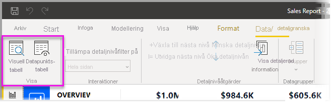

# Använd se Data och se poster i Power BI Desktop
I **Power BI Desktop** kan du visa detaljer om en visualisering och se textrepresentationer av underliggande data eller enskilda dataelement för den valda visualiseringen. De här funktionerna kallas ibland för *klicka igenom*, *detaljerad information* eller *gå in på detaljnivå*.

Du kan använda **Se data** för att visa en textversion av de värden som används av den valda visualiseringen eller använda **Se poster** för att visa alla data för en markerad post eller datapunkt. 

>[!IMPORTANT]
>**Se data** och **Se poster** har endast stöd för följande visualiseringstyper:
>  - Stapeldiagram
>  - Kolumndiagram
>  - Ringdiagram
>  - Ifylld karta
>  - Tratt
>  - Karta
>  - Cirkeldiagram
>  - Treemap

## Använd Se data i Power BI Desktop

**Se data** visar data som är underliggande en visualisering. **Se data** visas i fliken **Data/detaljgranska** i avsnittet **Visuella verktyg** i menyfliksområdet när en visualisering väljs.

Du kan också visa data genom att högerklicka på en visualisering och sedan välja **Visa data** från menyn som visas, eller genom att välja **Fler alternativ** (...) uppe till höger i en visualisering och sedan **Visa data**.

&nbsp;&nbsp;

> [!NOTE]
> Du måste hovra över en datapunkt i visualiseringen för att snabbmenyn ska vara tillgänglig.

När du väljer **Se data** eller **Visa data**, visar Power BI Desktop-arbetsytan både visuella och textrepresentation av data. I *vågrät vy* visas visualiseringen på den övre delen av arbetsytan och data visas på den nedre halvan. 

Du kan växla mellan vågrät vy och *lodrät vy* genom att välja ikonen i det övre högra hörnet av arbetsytan.

Gå tillbaka till rapporten genom att markera **< Tillbaka till rapporten** i det övre vänstra hörnet på arbetsytan.

## Använd Se poster i Power BI Desktop

Du kan också fokusera på en datapost i en visualisering och gå in på detaljnivå på bakomliggande data. För att använda **Se poster**, välj en visualisering och sedan **Se poster** i fliken **Data/detaljgranska** i avsnittet **Visuella verktyg** i menyfliksområdet och välj sedan en datapunkt eller raden på visualiseringen. 

> [!NOTE]
> Om knappen **Se poster** i menyfliksområdet är inaktiverad och nedtonad, betyder det att den valda visualiseringen inte stöder **Se poster**.

Du kan också högerklicka på ett dataelement och välja **Se poster** från menyn som visas.

När du väljer **Se poster** för ett dataelement visar Power BI Desktop-arbetsytan alla data som är associerade med det valda elementet. 

Gå tillbaka till rapporten genom att markera **< Tillbaka till rapporten** i det övre vänstra hörnet på arbetsytan.

> [!NOTE]
>**Se poster** har följande begränsningar:
> - Du kan inte ändra data i vyn **Se poster** och spara tillbaka dem till rapporten.
> - Du kan inte använda **Se poster** när din visualisering använder ett beräknat mått.
> - Du kan inte använda **Se poster** när du är ansluten till en flerdimensionell livemodell (MD).

## Nästa steg
Det finns en massa sorters rapportformatering och funktioner för datahantering i **Power BI Desktop**. Kolla in följande resurser för några exempel:

* [Använd gruppering och diskretisering i Power BI Desktop](desktop-grouping-and-binning.md)
* [Använd stödlinjer, fäst till rutnät, z-ordning, justering och distribution i Power BI Desktop-rapporter](desktop-gridlines-snap-to-grid.md)

