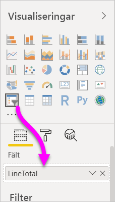
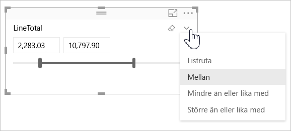
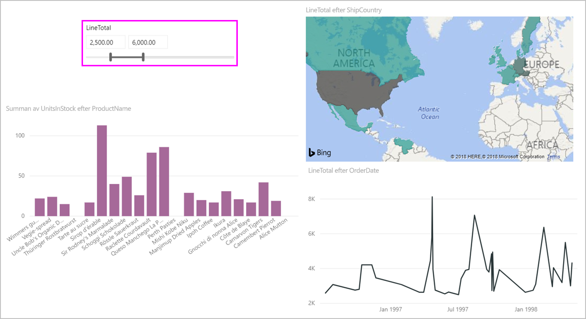
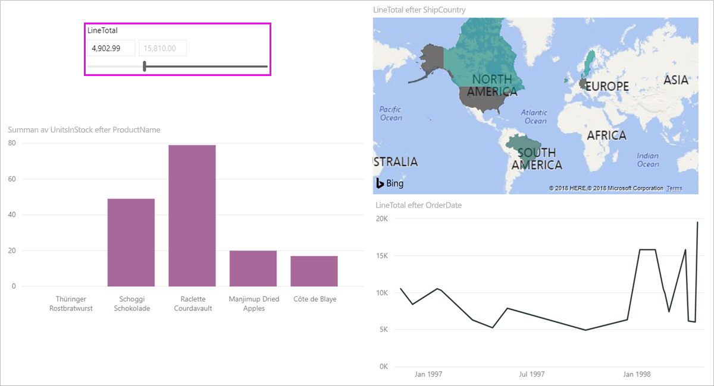

# Använd numeriska intervallutsnitt i Power BI

[!INCLUDE [applies-to](../includes/applies-to.md)] [!INCLUDE [yes-desktop](../includes/yes-desktop.md)] [!INCLUDE [yes-service](../includes/yes-service.md)]

Med numeriska intervallutsnitt kan du använda alla typer av filter på en numerisk kolumn i datamodellen. Det finns tre alternativ för att filtrera numeriska data: mellan tal, mindre än eller lika med ett tal eller större än eller lika med ett tal. Den här enkla tekniken är ett kraftfullt sätt att filtrera data.

## Video

I den här videon går vi igenom hur du skapar ett numeriskt intervallutsnitt.

> [!NOTE]
> Den här videon använder en äldre version av Power BI Desktop.

<iframe width="560" height="315" src="https://www.youtube.com/embed/zIZPA0UrJyA" frameborder="0" allowfullscreen></iframe> 

## Lägga till ett numeriskt intervallutsnitt

Du kan använda det numeriska intervallutsnittet precis som andra utsnitt. Skapa bara en **utsnittsvisualisering** för rapporten och välj sedan ett numeriskt värde för värdet **Fält**. I följande bild har vi markerat fältet **LineTotal**.

Välj nedåtpilen i det övre högra hörnet i utsnittet för numeriska intervall för att visa en meny.

För det numeriska intervallet kan du välja bland följande tre alternativ:

* **Mellan**
* **Mindre än eller lika med**
* **Större än eller lika med**

När du väljer **Mellan** från menyn visas ett skjutreglage. Du kan använda skjutreglaget för att välja numeriska värden som infaller mellan talen. Ibland gör kornigheten när du flyttar utsnittets skjutreglage att det är svårt att hamna på exakt det talet. Du kan även använda skjutreglaget och markera antingen rutan för att skriva in de värden som vi vill ha. Det här alternativet är praktiskt när du vill göra utsnitt med vissa tal.

I följande bild filtrerar rapportsidan för **LineTotal**-värden i intervallet 2500,00 till 6000,00.

När du väljer **Mindre än eller lika med** försvinner den vänstra kontrollen (lägre värde) för skjutreglaget, och du kan då endast justera den övre gränsen för skjutreglaget. I följande bild ställer vi in max för skjutreglaget på 5928,19.

Om du väljer **Större än eller lika med** försvinner skjutreglagets högra kontroll (högre värde). Du kan då justera det lägre värdet såsom det visas i följande bild. Nu visas enbart objekt med ett **LineTotal** som är större än eller lika med 4902,99 i visualiseringarna på rapportsidan.

## Fäst till heltal med utsnitt med numeriska intervall

Ett utsnitt för ett numeriskt intervall hoppar till heltal om datatypen för det underliggande fältet är *Heltal*. Den här funktionen gör att utsnittet justeras korrekt till heltal. I fälten för *Decimaltal* kan du skriva in eller välja decimaler för ett tal. Den formatering som används anges i textrutan matchar den formatering som definierats för fältet, men du kan skriva in eller välja mer exakta siffror.

## Visa formatering med datumintervallutsnittet

När du använder ett utsnitt för att visa eller ange ett datumintervall visas datumen i formatet *Kort datum*. De nationella inställningarna i användarens webbläsare eller operativsystem avgör datumformatet. Därmed blir det visningsformatet oavsett vad vilka datatypsinställningar som gäller för underliggande data eller modell.

Du kan till exempel ha ett långt datum format för den underliggande datatypen. I det här fallet skulle ett dataformat som *dddd, MMMM d, åååå* formatera ett datum i andra visuella objekt eller kontexter till *Onsdag 14 mars 2001*. Men i datumintervallets utsnitt visas det datumet i utsnittet som *03/14/2001*.

Om du visar formatet Kort datum i utsnittet ser du till att längden på strängen är konsekvent och kompakt i utsnittet.

## Begränsningar och överväganden

Följande begränsningar och överväganden gäller för utsnittet för numeriska intervall:

* Utsnittet för numeriska intervall filtrerar varje underliggande rad i data, inte aggregerade värden. Anta till exempel att du använder ett fält som heter *Försäljningsbelopp*. Utsnittet filtrerar sedan varje transaktion baserat på försäljningsbeloppet, inte summan av försäljningsbeloppet för varje datapunkt i ett visuellt objekt.
* Det fungerar för närvarande inte med mått.
* Du kan ange valfritt tal i ett numeriskt utsnitt, även om det ligger utanför den underliggande kolumnens värdeintervall. Med det här alternativet kan du ange filter om du vet att dina data kan komma att ändras i framtiden.
