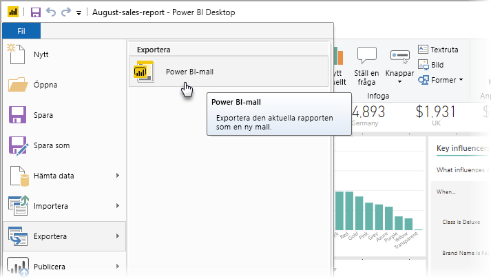
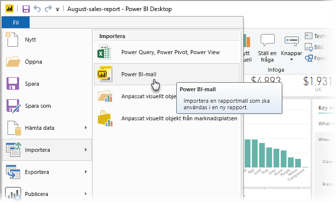
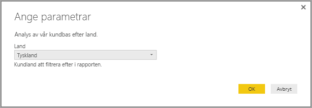
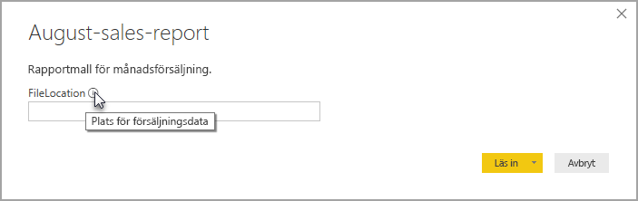

# Skapa rapportmallar för Power BI Desktop

Med **Power BI Desktop** kan du skapa övertygande rapporter som delar insikter i hela organisationen. Med **mallar** i Power BI Desktop kan du effektivisera ditt arbete genom att skapa en rapportmall, baserat på en befintlig mall, som du eller andra användare i din organisation kan använda som utgångspunkt för en ny rapports layout, datamodell och frågor. Mallar i **Power BI Desktop** hjälper dig att komma igång och standardisera rapportskapandet.

## Skapa mallar

Power BI-rapportmallar innehåller följande information från den rapport som de genererades från:

* **Sidor**, visuella objekt och andra visuella element i rapporten
* **Datamodellens definition**, inklusive schemat, relationer, mått och andra modelldefinitionsartefakter
* Alla **frågedefinitioner**, till exempel frågor, frågeparametrar och andra frågeelement

Det som *inte* ingår i mallarna är rapportens data. 

Rapportmallar använder filnamnstillägget .PBIT (jämför med Power BI Desktop-rapporter, som använder filnamnstillägget .PBIX). 

Om du vill skapa en rapportmall väljer du **Arkiv > Exportera > Power BI-mall** i menyn. Då öppnas följande fönster, där du uppmanas att ange en beskrivning av mallen. I det här exemplet är vår beskrivning av mallen *Monthly sales report template* (Rapportmall för månatlig försäljning).

Välj **OK** så uppmanas du att ange en filsökväg för att lagra .PBIT-mallfilen.

Det var allt – Power BI-rapportmallen skapas på den filplats som du angav, med .PBIT-tillägget.

> [!NOTE]
> Power BI-rapportmallfiler är vanligtvis mycket mindre än Power BI Desktop-rapporter eftersom mallar inte innehåller några data, utan bara själva rapportdefinitionerna. 

## Använda mallar

För att använda en Power BI-rapportmall öppnar du den helt enkelt i Power BI Desktop och börjar använda den. Du kan öppna Power BI-rapportmallar på två sätt:

* Dubbelklicka på valfri .PBIT-fil för att automatiskt starta Power BI Desktop och läsa in mallen
* Välj **Arkiv > Importera > Power BI-mall** i Power BI Desktop

När du öppnar en rapportmall visas en dialogruta med värden för alla parametrar som definieras i den rapport som mallen baseras på. Om en rapport till exempel analyserar kunder baserat på land eller region och har en *Land*-parameter för att ange kundbasen visas ett meddelande där du kan välja ett *Land*-värde i listan med de värden som angavs när parametern definierades. 

När alla obligatoriska parametrar har angetts uppmanas du att ange platsen för de underliggande data som är associerade med rapporten. Den aktuella rapportskaparen kan sedan ansluta till data baserat på sina autentiseringsuppgifter.

När parametrar och data har angetts skapas en rapport som innehåller alla sidor, visuella objekt, datamodellsartefakter och frågor som ingick i den rapport som mallen baseras på. 

Och sedan är du klar. Att skapa och använda rapportmallar i Power BI Desktop är enkelt, så du kan enkelt reproducera övertygande layouter och andra rapportaspekter och dela dem med andra.

## Nästa steg
Du kanske också är intresserad av att lära dig mer om **frågeparametrar**:
* [Använder du frågeparametrar i Power BI Desktop?](https://docs.microsoft.com/power-query/power-query-query-parameters)

Det finns dessutom olika typer av saker som du kan göra med Power BI Desktop. Läs följande resurser för mer information om dess möjligheter:

* [Vad är Power BI Desktop?](../fundamentals/desktop-what-is-desktop.md)
* [Frågeöversikt med Power BI Desktop](../transform-model/desktop-query-overview.md)
* [Datatyper i Power BI Desktop](../connect-data/desktop-data-types.md)
* [Forma och kombinera data i Power BI Desktop](../connect-data/desktop-shape-and-combine-data.md)
* [Vanliga frågeuppgifter i Power BI Desktop](../transform-model/desktop-common-query-tasks.md)    
