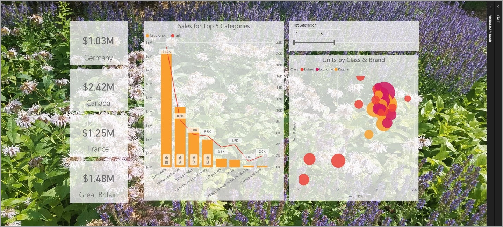
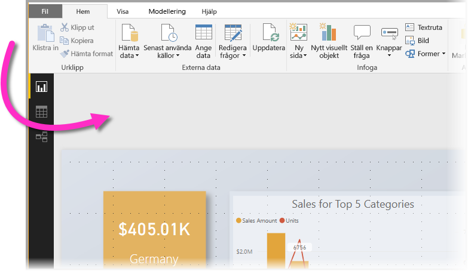
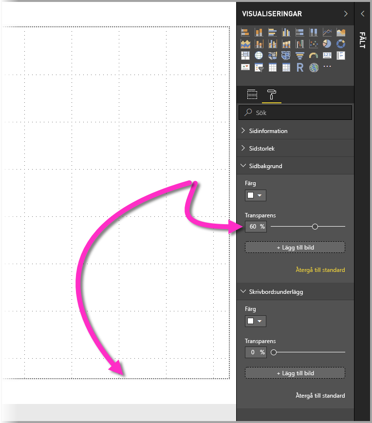
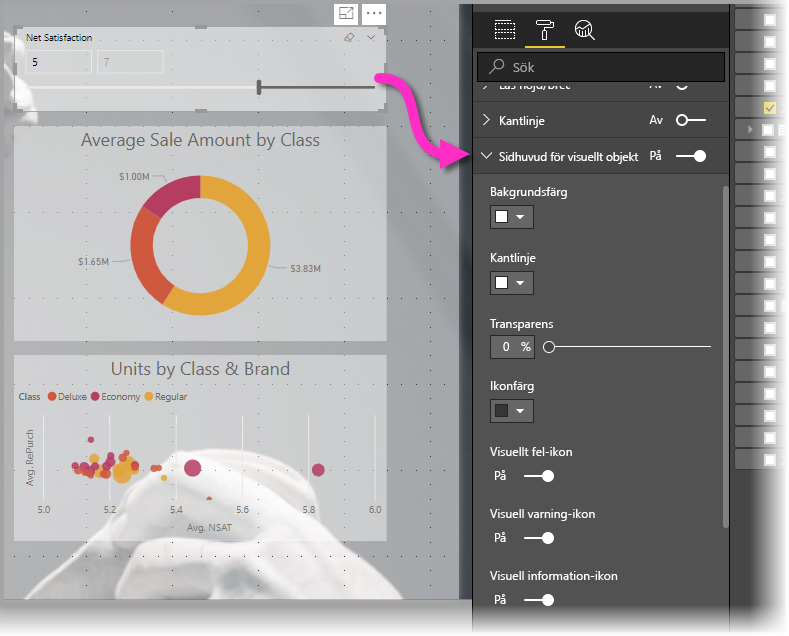
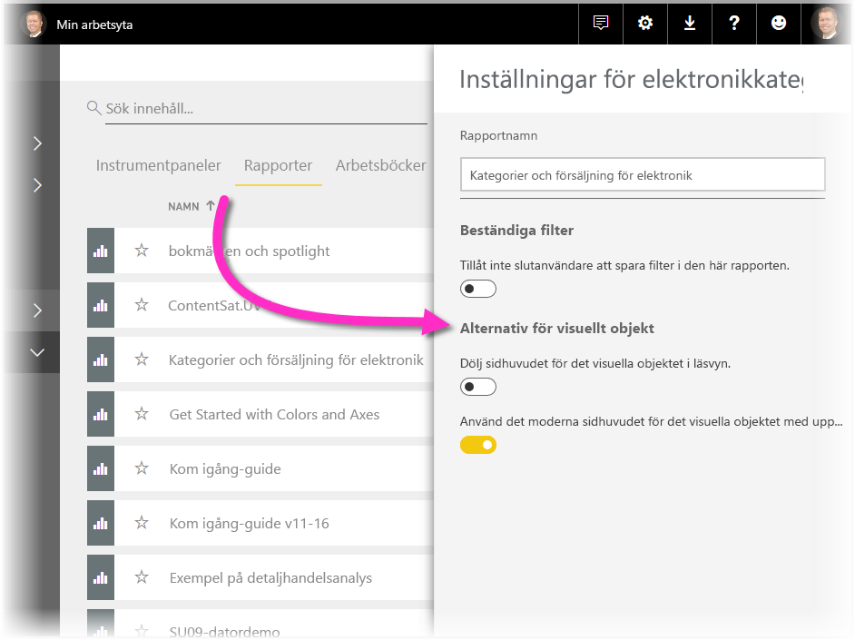
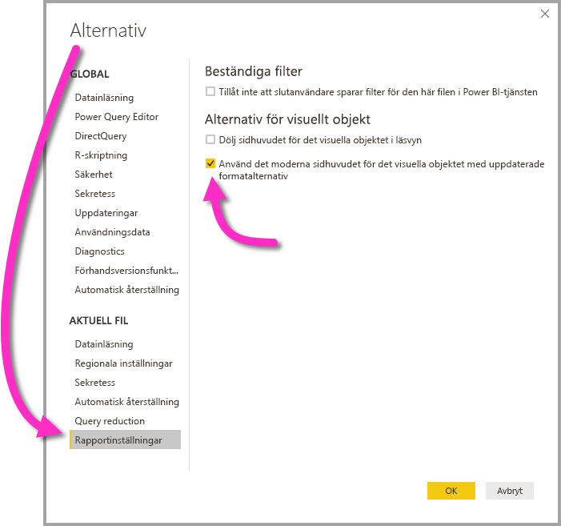

# Använd visuella element för att förbättra Power BI-rapporter

Med **Power BI Desktop** kan du använda visuella element, till exempel skrivbordsunderlägg och förbättrade visuella rubriker för visuella objekt för att förbättra utseendet på dina rapporter.

Från och med juli 2018-versionen av **Power BI Desktop** kan du lägga till förbättringar för att använda i dina rapporter och göra dina analyser och rapporter ännu mer tilltalande än innan. De förbättringar som beskrivs i den här artikeln inkluderar följande: 

* Använd **skrivbordsunderlägg** i dina rapporter så att din bakgrund kan förbättra eller förstärka de element i din berättelse som du vill förmedla med dina data
* Använd förbättrade **visuella rubriker** för enskilda visualiseringar för att skapa perfekt justerade visuella objekt på rapportarbetsytan. 

Följande avsnitt beskriver hur du använder dessa förbättringar och hur du tillämpar dem på dina rapporter.

## Använd skrivbordsunderlägg i Power BI-rapporter

Du kan formatera det grå området utanför din rapportsida med **skrivbordsunderlägg**. Följande bild har en pil som klargör var skrivbordsunderläggsområdet gäller. 

Du kan antingen ställa in skrivbordsunderlägg per rapportsida eller ha samma skrivbordsunderlägg för varje sida i din rapport. Om du vill ange skrivbordsunderlägg trycker eller klickar du på ikonen **formatering** när inget visuellt objekt har valts i din rapport och **skrivbordsunderlägg** visas i fönstret.

Du kan välja en färg som ska användas som **skrivbordsunderlägg** genom att välja listrutan **Färg** eller så kan du välja knappen **Lägg till bild** för att välja en bild att använda som skrivbordsunderlägg. Du kan också använda transparens för ditt skrivbordsunderlägg, oavsett om det är en färg eller en bild, med hjälp av skjutreglaget **Transparens**.

Det är bra att tänka på följande definitioner som hör till **skrivbordsunderlägg**:

* Det grå området utanför ditt rapportområde är **skrivbordsunderlägg**-området
* Området på arbetsytan där du kan placera visuella objekt kallas för rapport**sidan** och kan ändras i **Format-fönstret** med hjälp av listmenyn **Sidbakgrund**.

Rapport**sidan** är alltid i förgrunden (jämfört med skrivbordsunderlägget), samtidigt som **skrivbordsunderlägget** ligger bakom den och det element på rapportsidan som är längst bak. När du använder genomskinlighet för sidan har de visuella objekten i din rapport också transparensen tillämpat, vilket låter ditt skrivbordsunderlägg visas i bakgrunden genom dina visuella objekt.

För alla nya rapporter är standardinställningarna följande:

* Rapport**sidan** är inställd på **vit** och dess transparens är inställd på **100 %**
* **Skrivbordsunderlägget** är inställt på **vit** och dess transparens är inställd på **0 %**

När du ställer in din sidas bakgrund till mer än 50 % transparens så visas en prickad linje medan du skapar eller redigerar din rapporten för att visa gränsen för rapportens arbetsyta. 

Det är viktigt att notera att den prickade gränsen *endast* visas när du redigerar rapporten och *inte* visas för personer som ser din publicerade rapport, till exempel när den visas i **Power BI-tjänsten**.

> [!NOTE]
> Om du använder mörka bakgrunder för skrivbordsunderlägg och använder en vit eller en väldigt ljus textfärg måste du ha i åtanke att funktionen **Exportera till PDF** inte tar med skrivbordsunderlägg vid exporten. Det betyder att en export med vit text kommer att vara praktiskt taget osynlig i den exporterade PDF-filen. Mer information om [Exportera till PDF](desktop-export-to-pdf.md) finns i avsnittet **Exportera till PDF**.

## Använd förbättrade visuella rubriker i Power BI-rapporter

Från och med juli 2018-versionen av **Power BI Desktop**, har rubrikerna för visuella objekt i rapporter förbättrats avsevärt. De primära förbättringarna är att rubriken har kopplats bort från det visuella objektet så att placeringen kan justeras beroende på dina layout- och placeringspreferenser och rubriken visas nu i det visuella objektet istället för flytande ovanför. 

Som standard visas rubriken inuti det visuella objektet i linje med rubriken. I följande bild kan du se sidhuvudet (fäst-ikonen, expandera-ikonen och ellips-ikonen) inom det visuella objektet och justerat till höger, längs samma vågräta position som det visuella objektets rubrik.

Om ditt visuella objekt inte har en rubrik, flyter rubriken ovanför det visuella objektet justerad till höger, enligt följande bild. 

Om ditt visuella objekt placeras högst upp i din rapport, fäster sidhuvudet för det visuella objektet istället längst ner på det visuella objektet. 

Varje visuellt objekt har också ett kort i **Formatering**-avsnittet i **Visualiseringar**-fönstret som kallas **Sidhuvud för visuellt objekt**. I det kortet så kan du justera alla typer av egenskaper för sidhuvudet för visuella objekt

> [!NOTE]
> Synligheten för knappar påverkar inte din rapport när du skapar eller redigerar rapporten. Du måste publicera rapporten och visa den i läsläge för att se effekten. Det här beteendet garanterar att de många alternativen i rubriker för visuella objektrubriker är viktiga när du redigerar, särskilt varningsikoner som informerar om problem när du redigerar.

För rapporter som bara visas i **Power BI-tjänsten**, kan du justera användningen av visuella rubriker genom att gå till **Min arbetsyta > Rapporter** och sedan välja ikonen **Inställningar**. Där ser du inställningar för rapporten som du valde **Inställningar** för och du kan justera inställningarna därifrån, enligt följande bild.

### Aktivera förbättrade visuella rubriker för befintliga rapporter

Det nya sidhuvudet för visuella objekt är standardbeteendet för alla nya rapporter. För befintliga rapporter måste det här beteendet aktiveras i **Power BI Desktop** genom att gå till **Arkiv > Alternativ och inställningar > Alternativ** och sedan aktivera kryssrutan **Använd det moderna sidhuvudet för visuella objekt med uppdaterade formatalternativ** i **Rapportinställningar**.

## Nästa steg
För mer information om **Power BI Desktop**, och hur du kommer igång, ta en titt i följande artiklar.

* [Vad är Power BI Desktop?](../fundamentals/desktop-what-is-desktop.md)
* [Frågeöversikt med Power BI Desktop](../transform-model/desktop-query-overview.md)
* [Datakällor i Power BI Desktop](../connect-data/desktop-data-sources.md)
* [Anslut till data i Power BI Desktop](../connect-data/desktop-connect-to-data.md)
* [Forma och kombinera data i Power BI Desktop](../connect-data/desktop-shape-and-combine-data.md)
* [Vanliga frågeuppgifter i Power BI Desktop](../transform-model/desktop-common-query-tasks.md)   
