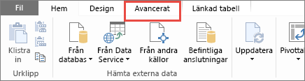
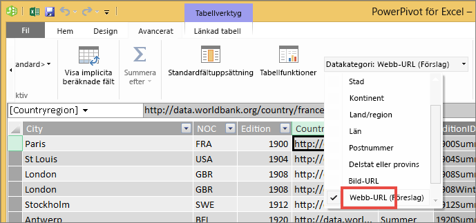

# Lägga till hyperlänkar (URL) i en tabell eller matris
I det här avsnittet lär du dig lägga till hyperlänkar (URL:er) i en tabell. Du använder Power BI Desktop för att lägga till hyperlänkar (URL:er) i en datamängd. Du kan lägga till hyperlänkarna i dina rapporttabeller och matriser, antingen i Power BI Desktop eller Power BI-tjänsten. Sedan kan du visa URL-adressen eller en länkikon, eller formatera en annan kolumn som länktext.

Du kan också skapa hyperlänkar i [textrutor i rapporter](service-add-hyperlink-to-text-box.md) med hjälp av Power BI-tjänsten och Power BI Desktop. Med Power BI-tjänsten kan du också lägga till hyperlänkar till [paneler på instrumentpaneler](service-dashboard-edit-tile.md) och [textrutor på instrumentpaneler](service-dashboard-add-widget.md). 

## Formatera en URL som en hyperlänk i Power BI Desktop

Du kan formatera ett fält med URL:er som hyperlänkar i Power BI Desktop, men inte i Power BI-tjänsten. Dessutom kan du [formatera hyperlänkar i Excel Power Pivot](#create-a-table-or-matrix-hyperlink-in-excel-power-pivot) innan du importerar arbetsboken till Power BI.

1. Om ett fält med en hyperlänk inte redan finns i din datamängd lägger du till det som en [anpassad kolumn](../transform-model/desktop-common-query-tasks.md) i Power BI Desktop.

    > [!NOTE]
    > Du kan inte skapa en kolumn i DirectQuery-läge.  Men om dina data redan innehåller URL:er, kan du förvandla dem till hyperlänkar.

2. Välj kolumnen i vyn Data eller Rapport. 

3. På fliken **Modellering** väljer du **Datakategori** > **Webb-URL**.
   
    

    > [!NOTE]
    > Webbadresser måste börja med särskilda prefix. Du hittar hela listan i [Överväganden och felsökning](#considerations-and-troubleshooting) i den här artikeln.

## Skapa en tabell eller matris med en hyperlänk

1. När du har [formaterat en hyperlänk som en URL](#format-a-url-as-a-hyperlink-in-power-bi-desktop)växlar du till rapportvyn.
2. Skapa en tabell eller matris med det fält som du kategoriserade som webb-URL. Hyperlänkarna är blå och understrukna.

    

## Visa en hyperlänkikon i stället för en URL

Om du inte vill visa en lång URL i en tabell, kan du visa en hyperlänkikon  i stället. 

> [!NOTE]
> Du kan inte visa ikoner i en matris.
   
1. Först ska du [skapa först en tabell med en hyperlänk](#create-a-table-or-matrix-with-a-hyperlink).

2. Välj tabellen för att aktivera den.

    Välj **Format**-ikonen  för att öppna formateringsfönstret.

    Expandera **Värden**, leta upp **URL-ikonen** och **aktivera** den.

    

1. (Valfritt) [Publicera rapporten](desktop-upload-desktop-files.md) från Power BI Desktop till Power BI-tjänsten. När du öppnar rapporten i Power BI-tjänsten fungerar hyperlänkarna där också.

## Formatera länktext som en hyperlänk

Du kan också formatera ett annat fält i en tabell som hyperlänk och inte ha någon kolumn för URL: en. I det fallet formaterar du inte kolumnen som en webb-URL.

> [!NOTE]
> Det går inte att formatera ett annat fält som hyperlänk i en matris.

1. Om det inte redan finns ett fält med en hyperlänk i datamängden använder du Power BI Desktop för att lägga till det som en [anpassad kolumn](../transform-model/desktop-common-query-tasks.md). Kom ihåg att du inte kan skapa en ny kolumn i DirectQuery-läge.  Men om dina data redan innehåller URL:er, kan du förvandla dem till hyperlänkar.

2. Välj kolumnen som innehåller webbadressen i vyn Data eller Rapport. 

3. På fliken **Modellering** väljer du **Datakategori**. Se till att kolumnen är formaterad som **Okategoriserad**.

2. I rapportvyn skapar du en tabell eller matris med adresskolumnen och kolumnen du ska formatera som länktext.

3. Med tabellen markerad väljer du **Format**-ikonen  för att öppna formateringsfönstret.

4. Expandera **Villkorsstyrd formatering** och se till att namnet i rutan är den kolumn som du vill använda som länktext. Leta rätt på **Webb-URL** och **aktivera** den.

    

    > [!NOTE]
    > Om du inte ser alternativet **Webb-URL** kontrollerar du att kolumnen som innehåller hyperlänkarna *inte* är formaterad som **Webb-URL** i listrutan **Datakategori**.

5. I dialogrutan **Webb-URL** väljer du det fält som innehåller URL: en i rutan **Baserat på fält** > **OK**.

    

    Nu är texten i kolumnen formaterad som länk.

    

1. (Valfritt) [Publicera rapporten](desktop-upload-desktop-files.md) från Power BI Desktop till Power BI-tjänsten. När du öppnar rapporten i Power BI-tjänsten fungerar hyperlänkarna där också.

## Skapa en tabell- eller en matrishyperlänk i Excel Power Pivot

Ett annat sätt för att lägga till hyperlänkar till dina Power BI-tabeller och -matriser är att skapa hyperlänkarna i datauppsättningen innan du importerar/ansluter till datauppsättningen från Power BI. I det här exemplet används en Excel-arbetsbok.

1. Öppna arbetsboken i Excel.
2. Välj fliken **PowerPivot** och sedan **Hantera**.
   
   
1. När PowerPivot öppnas väljer du fliken **Avancerat**.
   
   
4. Placera markören i den kolumn som innehåller de URL:er som du vill förvandla till hyperlänkar i Power BI-tabeller.
   
   > [!NOTE]
   > Webbadresser måste börja med särskilda prefix. Du hittar hela listan i [Överväganden och felsökning](#considerations-and-troubleshooting).
   > 
   
5. I gruppen **Rapporteringsegenskaper** väljer du listrutan **Datakategori** och sedan **Webbadress**. 
   
   

6. Anslut till eller importera den här arbetsboken från Power BI-tjänsten eller Power BI Desktop.
7. Skapa en tabellvisualisering som innehåller URL-fältet.
   
   

## Överväganden och felsökning

Webbadresser måste börja med något av följande:
- http
- https
- -mailto
- file
- ftp
- news
- telnet

F: Kan jag använda en anpassad URL som en hyperlänk i en tabell eller matris?    
S: Nej. Du kan använda en länkikon. Om du behöver anpassad text för hyperlänkarna och listan över URL:er är kort kan du använda en textruta i stället.

## Nästa steg
[Visualiseringar i Power BI-rapporter](../visuals/power-bi-report-visualizations.md)

[Grundläggande begrepp för designers i Power BI-tjänsten](../fundamentals/service-basic-concepts.md)

Fler frågor? [Prova Power BI Community](https://community.powerbi.com/)
