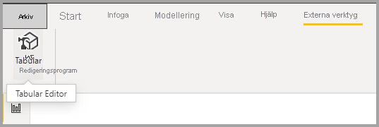

# Låt användarna anpassa visuella objekt i en rapport

[!INCLUDE [applies-to](../includes/applies-to.md)] [!INCLUDE [yes-desktop](../includes/yes-desktop.md)] [!INCLUDE [yes-service](../includes/yes-service.md)]

När du delar en rapport med en bred publik kan en del av dina användare vilja se något annorlunda vyer av specifika visuella objekt. Kanske vill de byta ut vad som finns på axeln, ändra typ av visuellt objekt eller lägga till något i knappbeskrivningen. Det är svårt att göra ett visuellt objekt som uppfyller allas krav. Med den här nya funktionen kan du göra det möjligt för dina användare att utforska och anpassa visuella objekt, allt i rapportens läsvy. De kan justera det visuella objektet på det sätt de önskar och spara det som ett bokmärke att komma tillbaka till. De behöver inte ha redigeringsbehörighet för rapporten eller gå tillbaka till rapportens författare för att få en ändring.

:::image type="content" source="media/power-bi-personalize-visuals/power-bi-personalize-visual.png" alt-text="Anpassa ett visuellt objekt":::
 
## Vilken rapport konsumenter kan ändra

Med den här funktionen kan användarna få ytterligare insikter via ad hoc-utforskning av visuella objekt på en Power BI-rapport. Information om hur du använder den här funktionen som konsument finns i [Anpassa visuella objekt i dina rapporter](../consumer/end-user-personalize-visuals.md). Funktionen är idealisk för rapportförfattare som vill aktivera grundläggande utforskningsscenarier för rapportläsarna. Följande är ändringar som kan utföras av rapportläsare:

- Ändra visualiseringstyp
- Byta ut ett mått eller en dimension
- lägga till eller ta bort en förklaring,
- Jämföra två eller flera mått
- ändra sammansättningar osv.

Den här funktionen tillåter inte bara nya utforskningsfunktioner. Det omfattar också sätt för konsumenter att samla in och dela sina ändringar:

- Avbilda deras ändringar
- Dela deras ändringar
- Återställ alla ändringar för en rapport
- Återställ alla ändringar för ett visuellt objekt
- Ta bort de senaste ändringarna

## Använda perspektiv för att få en mer fokuserad vy

I anpassade visuella objekt kan du använda **perspektiv** till att välja ut en delmängd av en modell som ger en mer fokuserad vy. Det kan vara bra att välja ut en delmängd när du arbetar med en stor datamodell, så att du kan fokusera på en hanterbar andel av fälten och inte överbelasta rapportläsarna genom att presentera alla fält från den stora modellen. 

Tänk på följande när du arbetar med perspektiv:

* Perspektiv är inte avsedda att användas som säkerhetsmekanism, de är ett verktyg för att ge slutanvändarna en bättre upplevelse. Säkerheten för ett perspektiv ärvs från den underliggande modellen.

* Du kan använda perspektiv i både tabellbaserade och flerdimensionella modeller. För perspektiv i flerdimensionella modeller kan du dock bara ange att perspektivet ska vara samma som rapportens baskub.

* Innan du tar bort ett perspektiv från en modell ska du kontrollera att perspektivet inte används till anpassning av visuella objekt. 

Om du vill använda perspektiv måste du aktivera Anpassa visuella objekt för rapporten. Du måste också skapa minst ett perspektiv som innehåller de dimensioner och mått du vill att slutanvändarna ska interagera med i Anpassa visuella objekt.

Du skapar perspektivet med [Tabular Editor](https://tabulareditor.com/) som du kan ladda ned från följande plats: Ladda ned Tabular Editor

När du har installerat **Tabular Editor** öppnar du rapporten i **Power BI Desktop** och startar **Tabular Editor** från fliken **Externa verktyg** i menyfliksområdet. Se följande bild.

Högerklicka på mappen **Perspectives** i Tabular Editor för att skapa ett nytt perspektiv.

Du kan dubbelklicka på texten för att byta namn på perspektivet.

Lägg sedan till fält i perspektivet genom att öppna mappen **Tables** i Tabular Editor. Högerklicka sedan på de fält du vill visa i perspektivet.

Upprepa processen för varje fält du vill lägga till i perspektivet. Du kan inte lägga till dubbletter av fält i ett perspektiv, så alternativet att lägga till fältet inaktiveras för de fält du redan har lagt till i perspektivet.

När du har lagt till de fält du vill använda sparar du dina inställningar, både i Tabular Editor och i Power BI Desktop.

När du har sparat det nya perspektivet i modellen och sparat Power BI Desktop-rapporten går du till fönstret **Format** för sidan, där du ser ett nytt avsnitt för **Anpassa visuellt objekt**.

Alternativet *Rapportläsarperspektiv* är som standard inställt på *Standardfält*. När du väljer listrutepilen ser du de andra perspektiv du har skapat.

När du har angett perspektivet för rapportsidan filtreras upplevelsen Anpassa visuella objekt på sidan enligt det valda perspektivet. Om du väljer **Använd på alla sidor** kan du tillämpa perspektivinställningen på alla befintliga sidor i rapporten.

## Aktivera förhandsgranskningsfunktionen

Eftersom den här funktionen finns i förhandsversion måste du först aktivera funktionsväxeln. Gå till **Arkiv** > **Alternativ och inställningar** > **Alternativ**. Under **Globala inställningar** > **Förhandsgranskningsfunktioner** ser du till att **Anpassa visuella objekt** är markerat.

:::image type="content" source="media/power-bi-personalize-visuals/power-bi-preview-personalize-visual.png" alt-text="Aktivera Anpassa visuella objekt":::

Du kan behöva starta om Power BI Desktop för att se det i inställningarna för den aktuella filen.

## Aktivera anpassning i en rapport

När du har aktiverat förhandsgranskningsväxeln måste du särskilt aktivera den för de rapporter som du vill att användarna ska kunna anpassa visuella objekt för.

Du kan antingen aktivera den här funktionen i Power BI Desktop eller i Power BI-tjänsten.

### I Power BI Desktop

Om du vill aktivera funktionen i Power BI Desktop går du till **Arkiv** > **Alternativ och inställningar** > **Alternativ** > **Aktuell fil** > **Rapportinställningar**. Se till att **Anpassa visuella objekt (förhandsversion)** är aktiverat.

:::image type="content" source="media/power-bi-personalize-visuals/power-bi-report-settings-personalize-visual.png" alt-text="Aktivera anpassning i en rapport":::

### I Power BI-tjänsten

Om du vill aktivera funktionen i Power BI-tjänsten i stället går du till **Inställningar** för rapporten.

:::image type="content" source="media/power-bi-personalize-visuals/power-bi-report-service-settings-personalize-visual.png" alt-text="Rapportinställningar i Power BI-tjänsten":::

Aktivera **Anpassa visuella objekt (förhandsversion)**  > **Spara**.

:::image type="content" source="media/power-bi-personalize-visuals/power-bi-report-service-personalize-visual.png" alt-text="Aktivera Anpassa visuella objekt i tjänsten":::

## Välj visuella objekt som kan anpassas

När du aktiverar den här inställningen för en specifik rapport kan du som standard anpassa alla visuella objekt i rapporten. Om du inte vill att alla visuella objekt ska anpassas kan du aktivera eller inaktivera inställningen per visuellt objekt.

Välj det visuella objektet > välj **Formatera** i fönstret **Visualiseringar** > expandera **Sidhuvud för visuellt objekt**.

:::image type="content" source="media/power-bi-personalize-visuals/power-bi-format-visual-header-personalize.png" alt-text="Välj sidhuvud för visuellt objekt":::
 
Växla **Anpassa visuella objekt** >  till **På** eller **Av**.

:::image type="content" source="media/power-bi-personalize-visuals/power-bi-format-visual-personalize-on-off.png" alt-text="Ange på eller av för skjutreglaget för anpassning av visuellt objekt":::

## Begränsningar och kända problem

För närvarande har funktionen några begränsningar som du bör vara medveten om.

- Den här funktionen stöds inte för inbäddade scenarier, som att publicera på webben.
- Användares utforskningar sparas inte automatiskt. Du måste spara vyn som ett personligt bokmärke för att kunna samla in dina ändringar.
- Den här funktionen stöds i mobilappar för Power BI för iOS och Android-surfplattor och i Power BI Windows-appen. Det finns inte stöd för Power BI-appar för telefoner. Men eventuella ändringar av visuella objekt som du sparar i ett personligt bokmärke i Power BI-tjänsten sparas i alla Power BI-mobilappar.

Det finns även några kända problem som vi ska lösa:

- Det finns inte stöd för att lägga till hierarki. Du måste lägga till de enskilda underordnade objekten.
- Du kan inte ändra en datumhierarki till ett datum eller vice versa. 
- Med personliga bokmärken kan du få resultat som skiljer sig något från de sekvenser du väljer. Avvikelser är möjliga eftersom vi inte fångar upp rapportens fullständiga status, utan bara de ändringar som har gjorts. Du löser det genom att välja **Återställ till standard** och sedan välja det bokmärke som du vill visa. 

## Nästa steg

[Anpassa visuella objekt i dina rapporter](../consumer/end-user-personalize-visuals.md).     

Testa den nya anpassningen av visuella objekt. Lämna gärna feedback om den här funktionen och hur vi kan fortsätta att förbättra den på [Power BI:s webbplats för idéer](https://ideas.powerbi.com/forums/265200-power-bi). 

Har du fler frågor? [Prova Power BI Community](https://community.powerbi.com/)
