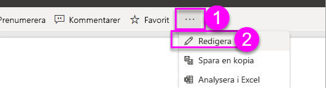
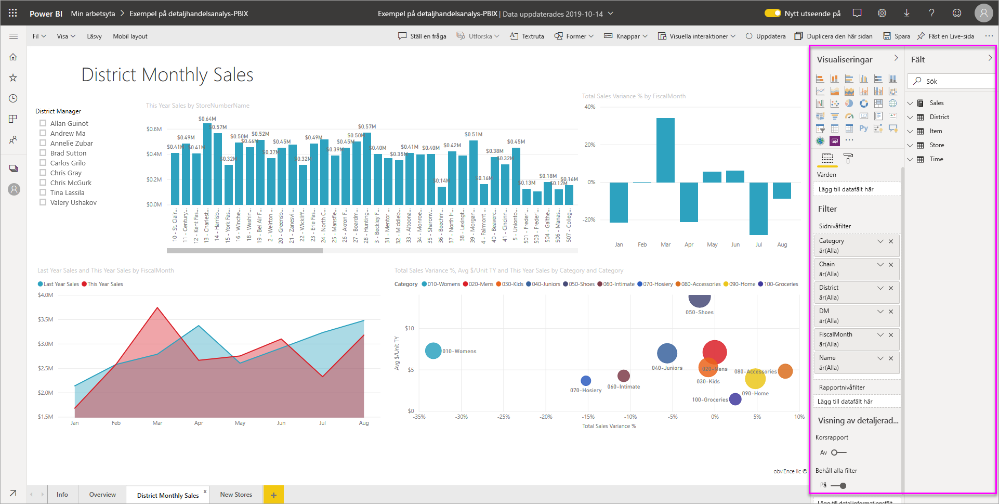
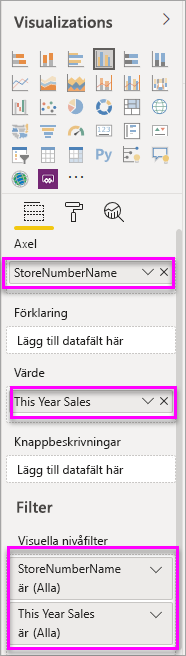
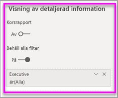
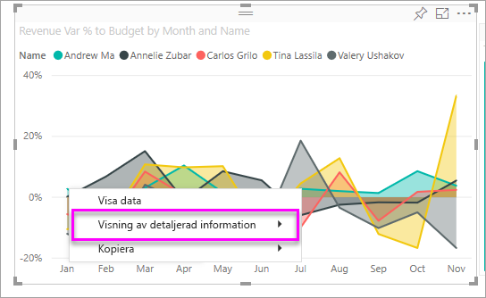
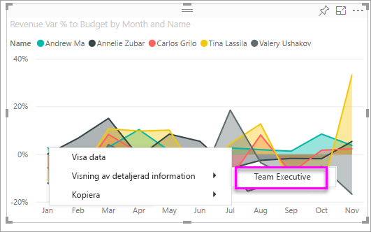

# Lägga till ett filter i en Power BI-rapport

[!INCLUDE [power-bi-service-new-look-include](../includes/power-bi-service-new-look-include.md)]

Den här artikeln förklarar hur du lägger till ett sidfilter, ett visualiseringsfilter, ett rapportfilter eller detaljerad information i en rapport i Power BI. Exemplen i den här artikeln finns i Power BI-tjänsten. Men stegen är nästan identiska i Power BI Desktop.

**Visste du att?** Power BI har en ny filterupplevelse. Läs mer om [den nya filterupplevelsen i Power BI-rapporter](power-bi-report-filter.md).

Power BI erbjuder ett antal olika typer av filter, både manuella och automatiska samt för visning av detaljerad information och för genomströmning. Läs mer om de [olika typerna av filter](power-bi-report-filter-types.md).

## Filter i redigeringsvyn jämfört med läsvyn
Du kan interagera med rapporter i två olika vyer: läsvyn och redigeringsvyn. Vilka filtreringsfunktioner som är tillgängliga beror på vilket läge du befinner dig i. Läs allt [om filter och markeringar i Power BI-rapporter](power-bi-reports-filters-and-highlighting.md) för mer information.

Den här artikeln beskriver hur du skapar filter i rapportens **Redigeringsvy**.  Mer information om filter i läsvyn finns i [Interagera med filter i rapportens läsvy](../consumer/end-user-report-filter.md).

Eftersom filter *bevaras* sparas filtren, utsnitten och andra datavisningsändringar som du gjort när du lämnar Power BI. På så sätt kan du fortsätta där du slutade när du återvänder till rapporten. Om du inte vill att filterändringarna ska sparas väljer du **Återställ till standard** från den översta menyraden.

## Filternivåer i fönstret Filter
Oavsett om du använder Desktop eller Power BI-tjänsten visas fönstret Filter till höger i rapportarbetsytan. Om inte fönstret Filter visas kan du öppna det genom att välja ikonen ">" längst upp till höger.

Du kan ange filter på tre olika nivåer för rapporten: visuell nivå, sidnivå och rapportnivå. Du kan också ställa in filter för visning av detaljerad information. I den här artikeln beskrivs de olika nivåerna.

## Lägga till ett filter i ett visuellt objekt
Du kan lägga till ett filter på visuell nivå för ett specifikt visuellt objekt på två olika sätt. 

* Filtrera ett fält som redan används av visualiseringen.
* Identifiera ett fält som inte redan används av visualiseringen och lägga till fältet direkt till bucketen **Visuella nivåfilter**.

Den här proceduren använder förresten, detaljhandelsanalys om du vill ladda ned och följa den. Ladda ned innehållspaketet med [exempel på detaljhandelsanalys](sample-retail-analysis.md#get-the-content-pack-for-this-sample).

### Filtrera fälten i det visuella objektet

1. Välj **Fler alternativ (...)**  > **Redigera rapport** om du vill öppna rapporten i redigeringsvyn.
   
   

2. Öppna panelerna Visualiseringar och Filter samt Fält (om de inte redan är öppna).
   
   
3. Välj ett visuellt objekt för att aktivera det. Alla fält som används av det visuella objektet finns på panelen **Fält** och anges även på panelen **Filter** under rubriken **Visuella nivåfilter**.
   
   
4. Nu ska vi lägga till ett filter till ett fält som redan används av visualiseringen. 
   
    Rulla ned till området **Visuella nivåfilter** och välj pilen för att expandera fältet som du vill filtrera. I det här exemplet ska vi filtrera **StoreNumberName**.
     
     
    
    Välj någon av filtreringskontrollerna **Grundläggande**, **Avancerade** eller **Top N**. I det här exemplet ska vi söka i grundläggande filtrering för **cha** och välja de fem butikerna.
     
     
   
    Det visuella objektet ändras för att återspegla det nya filtret. Om du sparar rapporten med filtret kan rapportens läsare se det filtrerade innehållet från början och interagera med filtret i läsvyn genom att välja eller rensa värden.
     
    
    
    När du använder filtret för ett fält som används i det visuella objekt där fältet aggregeras (till exempel en summa, ett medelvärde eller ett antal) filtrerar du på det *aggregerade* värdet i varje datapunkt. Om du filtrerar det visuella objektet ovan där **Försäljning det här året > 500000** innebär att du endast skulle se datapunkten **13 – Charleston Fashion Direct** i resultatet. Filter på [modellmått](../transform-model/desktop-measures.md) gäller alltid för datapunktens aggregerade värde.

### Filtrera med ett fält som inte finns i det visuella objektet

Nu ska vi lägga till ett helt nytt fält som ett filter på visuell nivå i vårt visuella objekt.
   
1. På panelen Fält väljer du det fält som du vill lägga till som ett nytt visuellt nivåfilter och drar det till **området för visuella nivåfilter**.  I det här exemplet ska vi dra **Distriktschef** till bucketen **Visuella nivåfilter**, söka efter **an** och välja dessa tre chefer.
     
    

    Observera att **Distriktschef***inte* läggs till i själva visualiseringen. Visualiseringen består fortfarande av **StoreNumberName** som axel och **This Year Sales (Årets försäljning)** som värde.  
     
    

    Själva visualiseringen filtreras nu för att bara visa dessa chefers försäljning i år för de angivna butikerna.
     
    

    Om du sparar rapporten med filtret kan rapportens läsare interagera med filtret **Distriktschef** i läsvyn genom att välja eller rensa värden.
    
    Om du drar en *numerisk kolumn* till filterfönstret för att skapa ett filter på visualiseringsnivå tillämpas filtret på de *underliggande raderna med data*. Om du till exempel skulle lägga till ett filter i fältet **Enhetskostnad** och ange det så att **Enhetspris** > 20 skulle endast data för de produktrader där enhetskostnaden var större än 20 visas, oavsett den totala enhetskostnaden för de datapunkter som visas i det visuella objektet.

## Lägg till ett filter för en hel sida

Du kan även lägga till ett filter på sidnivå för att filtrera en hel sida.

1. Öppna detaljhandelsanalysrapporten i Power BI-tjänsten och gå sedan till sidan **Månadsförsäljning för distrikt**. 

2. Välj **...**  > **Redigera rapport** för att öppna rapporten i redigeringsvyn.
   
   
2. Öppna panelerna Visualiseringar och Filter samt Fält (om de inte redan är öppna).
3. På panelen Fält väljer du det fält som du vill lägga till som ett nytt sidnivåfilter och drar det till **området för sidnivåfilter**.  
4. Välj de värden som du vill filtrera och ange **Grundläggande** eller **Avancerade** filtreringskontroller.
   
   Alla visualiseringar på sidan ritas om för att avspegla ändringen.
   
   

    Om du sparar rapporten med filtret kan rapportens läsare interagera med filtret i läsvyn genom att välja eller rensa värden.

## Lägga till ett filter för detaljerad information
Med visning av detaljerad information i Power BI-tjänsten och Power BI Desktop kan du skapa en *målrapportsida* som fokuserar på en specifik enhet – som en leverantör, kund eller tillverkare. Användarna kan nu från övriga rapportsidor högerklicka på en datapunkt för denna entitet och gå in i detalj på fokussidan.

### Skapa ett filter för detaljerad information
Om du vill följa med laddar du ned [Exempel på kundlönsamhet](sample-customer-profitability.md#get-the-content-pack-for-this-sample). Anta att du vill skapa en sida som fokuserar på affärsområden för chefer.

1. Öppna detaljhandelsanalysrapporten i Power BI-tjänsten och gå sedan till sidan **Månadsförsäljning för distrikt**.

2. Välj **Fler alternativ (...)**  > **Redigera rapport** om du vill öppna rapporten i redigeringsvyn.
   
   

1. Lägg till en ny sida i rapporten och döp den till **Team Executive (Teamchef)** . Den här sidan blir *målet* för den detaljerade informationen.
2. Lägg till visualiseringar som spårar nyckelvärden för teamchefernas affärsområden.    
3. Dra **Chef** till filtret för visning av detaljerad information i tabellen **Chefer**.    
   
    
   
    Observera att Power BI lägger till en bakåtpil på rapportsidan.  Om du väljer bakåtpilen returneras du till den *ursprungliga* rapportsidan, den sida där du befann dig när du valde alternativet för visning av detaljerad information. I redigeringsvyn håller du ned CTRL-tangenten för att välja bakåtpilen
   
     

### Använda filter för detaljerad information
Nu ska vi se hur filtret för detaljerad information fungerar.

1. Starta på rapportsidan **Teamresultatkort**.    
2. Låt oss anta att du är Andrew Ma och du vill se rapportsidan för teamchefer filtrerad bara för dina data.  Högerklicka på valfri grön datapunkt i det övre vänstra ytdiagrammet för att öppna menyalternativet Visning av detaljerad information.
   
    
3. Välj **Visning av detaljerad information > Team Executive (Teamchef)** för att komma till rapportsidan med namnet **Team Executive (Teamchef)** . Sidan filtreras för att visa information om datapunkten som du högerklickade på, i det här fallet Andrew Ma. Eventuella filter på den ursprungliga sidan tillämpas på rapportsidan med visning av detaljerad information.  
   
    

## Lägga till ett filter på rapportnivå för att filtrera en hel rapport

1. Välj **Redigera rapport** för att öppna rapporten i redigeringsvyn.
   
   

2. Öppna fönstren Visualiseringar och Filter samt Fält, om de inte redan är öppna.
3. På panelen Fält väljer du det fält som du vill lägga till som ett nytt rapportnivåfilter och drar det till **området för rapportnivåfilter**.  
4. Välj de värden du vill filtrera.

    Visualiseringarna på den aktiva sidan, och på alla sidor i rapporten, ändras för att återspegla det nya filtret. Om du sparar rapporten med filtret kan rapportens läsare interagera med filtret i läsvyn genom att välja eller rensa värden.

1. Välj bakåtpilen för att återgå till den föregående rapportsidan.

## Överväganden och felsökning

- Kontrollera att du är i rapportens [Redigeringsvy](service-interact-with-a-report-in-editing-view.md) om du inte ser panelen Fält.    
- Om du har gjort många filterändringar och vill återgå till standardinställningarna som rapportförfattaren använde väljer du **Återställ till standard** från den översta menyraden.

## Nästa steg
[Ta en titt på panelen för rapportfilter](../consumer/end-user-report-filter.md)

[Filtrera och markera i rapporter](power-bi-reports-filters-and-highlighting.md)

[Olika typer av filter i Power BI](power-bi-report-filter-types.md)

Fler frågor? [Prova Power BI Community](https://community.powerbi.com/)
