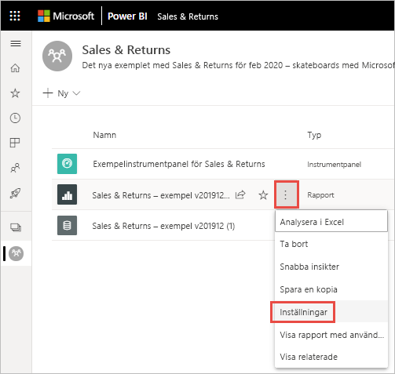
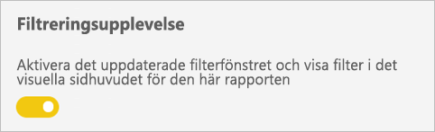
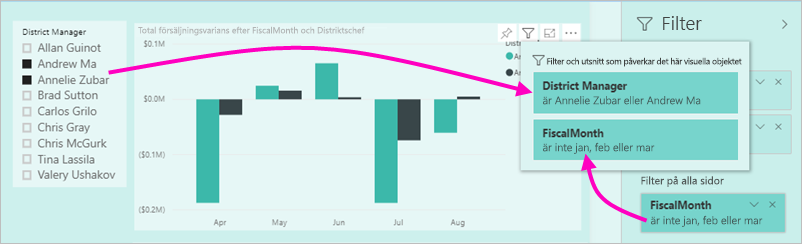
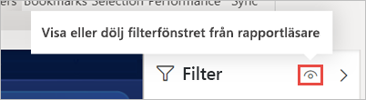
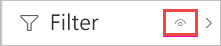
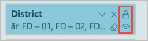
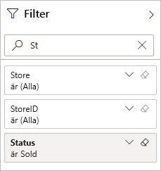
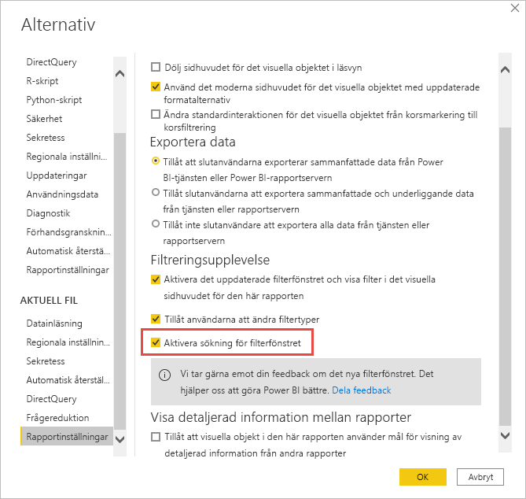
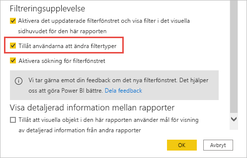

# <a name="design-filters-in-power-bi-reports"></a>Designfilter i Power BI-rapporter

[!INCLUDE [applies-to](../includes/applies-to.md)] [!INCLUDE [yes-desktop](../includes/yes-desktop.md)] [!INCLUDE [yes-service](../includes/yes-service.md)]

Med den nya filterupplevelsen får du stor kontroll över rapportfiltrens design och funktionalitet. Du kan formatera filterfönstret så att det ser ut som resten av rapporten. Du kan låsa och till och med dölja filter. När du skapar din rapport, visas inte längre det gamla filterfönstret alls i fönstret Visualiseringar. Du kan göra all din filterredigering och -formatering i ett enda filterfönster. 


Det här är vad du kan göra i det nya fönstret för filter som rapportdesigner:

- Lägga till och ta bort fält att filtrera på. 
- Ändra filterstatusen.
- Formatera och anpassa filterfönstret så att det känns som en del av din rapport.
- Definiera om Filter-fönstret är öppet eller minimerat som standard när en användare öppnar rapporten.
- Dölj hela filterfönstret eller specifika filter som du inte vill att rapportanvändarna ska se.
- Styra och till och med bokmärka synlighet och öppet och minimerat tillstånd för filterfönstret.
- Lås filter som du inte vill att användarna ska kunna redigera.

När användarna läser en rapport kan de hovra över valfritt visuellt objekt för att visa en skrivskyddad lista över alla filter eller utsnitt som påverkar det aktuella visuella objektet.


## <a name="turn-on-new-filters-in-existing-reports"></a>Aktivera nya filter i en befintlig rapport 

Den nya filterupplevelsen är aktiverad som standard för nya rapporter. Du kan aktivera den nya upplevelsen för befintliga rapporter i Power BI Desktop eller Power BI-tjänsten.

### <a name="turn-on-new-filters-for-an-existing-report-in-power-bi-desktop"></a>Aktivera nya filter för en befintlig rapport i Power BI Desktop

1. I Power BI Desktop i en befintlig rapport väljer du **Arkiv** > **Alternativ och inställningar** > **Alternativ**
2. I navigeringsfönstret under **Aktuell fil** väljer du **Rapportinställningar**.
3. Under **Filtreringsupplevelse** väljer du **Aktivera det uppdaterade filterfönstret och visa filter i det visuella sidhuvudet för den här rapporten**.

### <a name="turn-on-new-filters-for-an-existing-report-in-the-service"></a>Aktivera nya filter för en befintlig rapport i tjänsten

Om du har aktiverat **Nytt utseende** i Power BI-tjänsten , aktiveras den nya filterupplevelsen automatiskt. Läs mer om det [nya utseendet i Power BI-tjänsten](../consumer/service-new-look.md).

Om du inte har aktiverat det nya utseendet kan du fortfarande se den nya filterupplevelsen genom att följa nedanstående steg.

1. I Power BI-tjänsten öppnar du innehållslistan för en arbetsyta.
2. Leta upp den rapport du vill aktivera, välj **Fler alternativ (...)** och välj sedan **Inställningar** för rapporten.

    

3. Under **Filtreringsupplevelse** väljer du **Aktivera det uppdaterade filterfönstret och visa filter i det visuella sidhuvudet för den här rapporten**.

    

## <a name="view-filters-for-a-visual-in-reading-mode"></a>Visa filter för ett visuellt objekt i Läsläge

I Läsläge kan du hovra över filterikonen för att se en popup-filterlista med alla filter, sektorer och så vidare som påverkar det visuella objektet. Formateringen av popup-filterlistan är densamma som för filterfönstret. 



Här är de typer av filter som den här vyn visar: 
- Grundläggande filter
- Utsnitt
- Korsmarkering 
- Korsfiltrering
- Avancerad filtrering
- Högsta N-filter
- Relativa datumfiltrer
- Synkroniseringsutsnitt
- Inkludera/exkludera filter
- Filter som skickas via en URL

## <a name="build-the-filters-pane"></a>Skapa filterfönstret

När du aktiverar det nya filterfönstret så ser du det till höger på rapportsidan, som standard formaterat baserat på dina aktuella rapportinställningar. I filterfönstret kan du konfigurera vilka filter som ska ingå och uppdatera befintliga filter. Filterfönstret ser likadant ut för dina rapportanvändare när du publicerar rapporten. 

1. Dina rapportkonsumenter kan se filterfönstret som standard. Om du inte vill att de ska se det, väljer du ögonikonen bredvid **Filter**.

    

2. Börja bygga ditt filterfönster genom att dra fält av intresse till filterfönstret som filter för visuellt objekt, sida eller rapport.

När du lägger till ett visuellt objekt på en rapportarbetsyta lägger Power BI automatiskt till ett filter i filterfönstret för varje fält i det visuella objektet. 

## <a name="hide-the-filters-pane-while-editing"></a>Dölj filterfönstret när du redigerar

Power BI Desktop har ett nytt menyfliksområde i förhandsversionen. På fliken **Visa** kan du visa eller dölja filterfönstret med växlingsknappen för **Filter**. Den här funktionen är användbar när du inte använder filterfönstret och behöver extra utrymme på skärmen. Detta tillägg justerar filterfönstret mot de andra fönstren som du kan öppna och stänga, till exempel bokmärken och markeringsfönstret. 


Den här inställningen döljer endast filterfönstret i Power BI Desktop. Om du vill dölja filterfönstret för dina slutanvändare väljer du i stället **ögonikonen** bredvid **Filter**.

 

## <a name="lock-or-hide-filters"></a>Låsa eller dölja filter

Du kan låsa eller dölja enskilda filterkort. Om du låser ett filter, kan dina rapportanvändare se men inte ändra det. Om du döljer det så kan de inte ens se det. Det är användbart att dölja filterkort om du vill dölja datarensningsfilter som exkluderar nullvärden eller oväntade värden. 

- I filterfönstret markerar eller avmarkerar du ikonerna **Låsfilter** eller **Dölj filter** på ett filterkort.

   

När du aktiverar eller inaktiverar de här inställningarna i filterfönstret, så ser du ändringarna i rapporten. Dolda filter visas inte i popup-filterlistan för ett visuellt objekt.

Du kan även konfigurera statusen för filterfönstret så att den stämmer överens med dina rapportbokmärken. Fönstrets status för öppna, stäng och synlighet går alla att bokmärka.
 
## <a name="format-the-filters-pane"></a>Formatera filterfönstret

En stor del av filterupplevelsen är att du kan formatera filterfönstret för att matcha utseendet och känslan i din rapport. Du kan också formatera filterfönstret på olika sätt för varje sida i rapporten. Här följer element som du kan formatera: 

- Bakgrundsfärg
- Bakgrundstransparens
- Kantlinje på eller av
- Färg på kantlinje
- Teckensnitt, färg och textstorlek för rubrik och huvud

Du kan också formatera de här elementen för filterkort, beroende på om de används (är inställda på något) eller tillgängliga (rensade): 

- Bakgrundsfärg
- Bakgrundstransparens
- Kantlinje: på eller av
- Färg på kantlinje
- Teckensnitt, färg och textstorlek
- Färg på textruta

### <a name="format-the-filters-pane-and-cards"></a>Formatera filterfönstret och korten

1. I rapporten klickar du på själva rapporten eller på bakgrunden (*skrivbordsunderlägget*) därefter går du till **Visualiseringar** och väljer **Format**. 
    Du ser alternativ för att formatera rapportsidan, skrivbordsunderlägget och även filterfönstret och filterkort.

1. Expandera **Filterfönster** för att ange färg för bakgrund, ikon och vänster kantlinje så att de matchar rapportsidan.

    

1. Expandera **Filterkort** för att ange färg och kantlinje för **Tillgänglig** och **Använd**. Om du gör korten tillgänglig och använd olika färger så blir det uppenbart vilka filter som används. 
  
    

## <a name="theming-for-filters-pane"></a>Teman för filterfönstret
Du kan nu ändra standardinställningarna för filterfönstret med temafilen. Här är ett avsnitt ur ett exempeltema som du kan använda för att komma igång:

 
```
"outspacePane": [{ 

"backgroundColor": {"solid": {"color": "#0000ff"}}, 

"foregroundColor": {"solid": {"color": "#00ff00"}}, 

"transparency": 50, 

"titleSize": 35, 

"headerSize": 8, 

"fontFamily": "Georgia", 

"border": true, 

"borderColor": {"solid": {"color": "#ff0000"}} 

}], 

"filterCard": [ 

{ 

"$id": "Applied", 

"transparency": 0, 

"backgroundColor": {"solid": {"color": "#ff0000"}}, 

"foregroundColor": {"solid": {"color": "#45f442"}}, 

"textSize": 30, 

"fontFamily": "Arial", 

"border": true, 

"borderColor": {"solid": {"color": "#ffffff"}}, 

"inputBoxColor": {"solid": {"color": "#C8C8C8"}} 

}, 

{ 

"$id": "Available", 

"transparency": 40, 

"backgroundColor": {"solid": {"color": "#00ff00"}}, 

"foregroundColor": {"solid": {"color": "#ffffff"}}, 

"textSize": 10, 

"fontFamily": "Times New Roman", 

"border": true, 

"borderColor": {"solid": {"color": "#123456"}}, 

"inputBoxColor": {"solid": {"color": "#777777"}} 

}] 
```

## <a name="sort-the-filters-pane"></a>Sortera filterfönstret

En anpassad sorteringsfunktion är tillgänglig i filterfönstret. När du skapar en rapport, kan du dra och släppa filter för att ordna om dem i den ordning som du önskar.


Standardordningen för sortering är alfabetisk för filter. För att börja anpassa sorteringsläget drar du bara ett filter till en ny plats. Du kan bara sortera filter inom den nivå som de gäller för, till exempel visuell nivå, sidnivå eller rapportnivå.

## <a name="improved-filters-pane-accessibility"></a>Förbättrad åtkomst till filterfönstret

Vi har förbättrat tangentbordsnavigeringen för filterfönstret. Du kan växla mellan alla delar i filterfönstret och använda snabbtangenten på tangentbordet eller Shift + F10 för att öppna snabbmenyn.


## <a name="rename-filters"></a>Byta namn på filter
När du redigerar filterfönstret kan du dubbelklicka på rubriken för att redigera den. Att kunna byta namn är användbart om du vill uppdatera filterkortet så att det verkar mer logiskt för dina slutanvändare. Tänk på att namnbytet för filterkortet *inte* medför att namnet på visningsnamnet för fältet i fältlistan ändras. Det ändrar bara det visningsnamn som används på filterkortet.


## <a name="filters-pane-search"></a>Söka i filterfönstret

Med sökfunktionen i filterfönstret kan du söka bland filterkorten efter rubrik. Den här funktionen är användbar om du har flera olika filterkort i filterfönstret och behöver hjälp att hitta dem du är intresserad av.



Du kan också formatera sökrutan, precis som du kan formatera andra element i filterfönstret.


Även om filterfönstrets sökfunktion är aktiv som standard, kan du välja att aktivera eller inaktivera den genom att välja **Aktivera sökning för filterfönstret** i rapportinställningarna för dialogrutan Alternativ.



## <a name="restrict-changes-to-filter-type"></a>Begränsa ändringar efter filtertyp

Under avsnittet **Filtreringsupplevelse** i rapportinställningarna har du möjlighet att ange om användarna ska kunna ändra filtertypen.



## <a name="apply-filters-button-preview"></a>Knappen Använd filter (förhandsversion)

Du kan lägga till en enskild **Använd**-knapp i filterfönstret så att du och slutanvändarna kan använda alla filtermodifieringar samtidigt. Den här knappen kan vara praktisk om du vill skjuta upp användningen av filterändringar. Du behöver bara vänta en gång, efter att du är redo att använda alla filterändringarna på rapporten eller de visuella objekten.

:::image type="content" source="media/power-bi-report-filter/apply-filter-button.png" alt-text="Använd filter-knappen":::

### <a name="turn-on-apply"></a>Aktivera Använd

Du kan ställa in den här funktionen på rapportnivå. Funktionen är dock avstängd som standard.

1. Gå till **Arkiv** > **Alternativ och inställningar** > **Alternativ** > **Frågereduktion**.

1. Välj **Lägg till en enkel Tillämpa-knapp i filterpanelen för att tillämpa ändringarna direkt**.

    :::image type="content" source="media/power-bi-report-filter/turn-on-apply-filter-button.png" alt-text="Aktivera Använd filter-knappen":::

### <a name="format-the-apply-button"></a>Formatera Använd-knappen

För närvarande kan du styra en del av formateringen för texten **Använd** för knappen. I **filterfönstersavsnittet** i **formatfönstret** anger du följande alternativ:

- **Teckensnitts- och ikonfärg** som styr textfärgen.
- **Sidhuvudets textstorlek** som styr textstorleken.
- **Teckensnittsfamilj** som styr teckensnittet.

    :::image type="content" source="media/power-bi-report-filter/format-apply-filter.gif" alt-text="Formatera texten för knappen Använd filter":::

## <a name="considerations-and-limitations"></a>Överväganden och begränsningar

Filterfönstret visas inte för publicering till webben. Om du planerar att publicera en rapport på webben kan du överväga att lägga till utsnitt för filtrering.

## <a name="next-steps"></a>Nästa steg

- [Så här använder du rapportfilter](../consumer/end-user-report-filter.md)
- [Filtrera och markera i rapporter](power-bi-reports-filters-and-highlighting.md)
- [Olika typer av filter i Power BI](power-bi-report-filter-types.md)

Har du fler frågor? [Prova Power BI Community](https://community.powerbi.com/)
