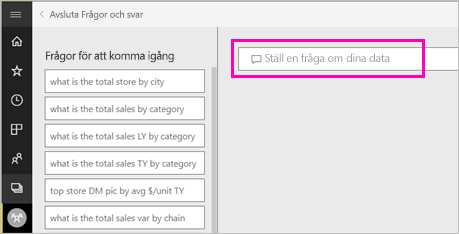
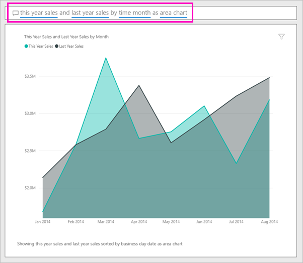
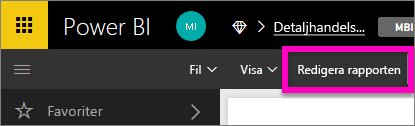
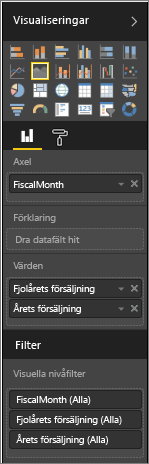

# Skapa ett visuellt objekt med Frågor och svar i Power BI

Ibland är det snabbaste sättet att få svar från dina data att ställa en fråga med hjälp av naturligt språk.  I den här artikeln ska vi titta på två olika sätt att skapa samma visualisering: först genom att ställa en fråga med Frågor och svar och därefter genom att skapa den i en rapport. Vi använder Power BI-tjänsten till att skapa det visuella objektet i rapporten, men processen är nästan identisk om man använder Power BI Desktop.

Om du vill följa med, måste du använda en rapport som du kan redigera så vi använder ett av de exempel som finns tillgängliga i Power BI.

## Skapa ett visuellt objekt med frågor och svar

Hur skapar vi linjediagrammet med Frågor och svar?

1. Från din Power BI-arbetsytan väljer du **Hämta data** \> **Exempel** \> **Exempel på detaljhandelsanalys** > **Anslut**.

1. Öppna instrumentpanelen i exemplet på detaljhandelsanalys och placera markören i rutan Frågor och svar, **Ställ en fråga om dina data**.

    

2. Skriv en fråga som liknar nedanstående i rutan Frågor och svar:
   
    **årets försäljning och fjolårets försäljning per månad som ytdiagram**
   
    När du skriver din fråga väljer Frågor och svar den bästa visualiseringen för att visa ditt svar och visualiseringen ändras dynamiskt när du ändrar frågan. Frågor och svar hjälper dig också formatera din fråga med förslag, automatisk komplettering och stavningskorrigeringar. Frågor och svar rekommenderar en liten ändring av texten till ”årets försäljning och fjolårets försäljning per *tid månad* som ytdiagram”.  

    

4. Välj meningen för att acceptera förslaget. 
   
   När du har skrivit klart frågan visas samma diagram som du ser i instrumentpanelen.
   
   

4. Välj fästikonen för att fästa diagrammet på din instrumentpanel  i det övre högra hörnet.

## Skapa ett visuellt objekt i rapportredigeraren

1. Gå tillbaka till instrumentpanelen för Exempel på detaljhandelsanalys.
   
2. Instrumentpanelen innehåller samma panel med ytdiagrammet för ”Fjolårets försäljning och årets försäljning”.  Välj den här panelen. Välj inte den panel som du skapade med Frågor och svar. När du väljer den öppnas Frågor och svar. Den ursprungliga panelen för ytdiagrammet skapades i en rapport, så rapporten öppnas på sidan med visualiseringen.

    

1. Öppna rapporten i redigeringsvyn genom att välja **Redigera rapport**.  Om du inte är ägare till en rapport kan du inte öppna den i redigeringsvyn.
   
    
4. Välj ytdiagrammet och granska inställningarna i **Fält**-fönstret.  Rapportskaparen gjorde diagrammet genom att välja dessa tre värden (**Fjolårets försäljning** och **Årets försäljning > Värde** från tabellen **Försäljning** och **FiscalMonth** från tabellen **Tid**) och organiserade dem i områdena för **Axel** och **Värden**.
   
    

    Som du ser resulterade det i samma visuella objekt. Det var inte särskilt svårt att skapa det på det här sättet. Men det var ännu enklare att göra det med Frågor och svar!

## Nästa steg

- [Använda Frågor och svar på instrumentpaneler och i rapporter](power-bi-tutorial-q-and-a.md)  
- [Frågor och svar för konsumenter](../consumer/end-user-q-and-a.md)
- [Få dina data att fungera bra med Frågor och svar i Power BI](service-prepare-data-for-q-and-a.md)

Fler frågor? [Prova Power BI Community](https://community.powerbi.com/)
