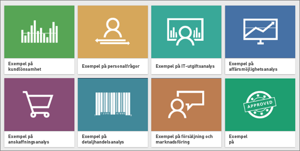
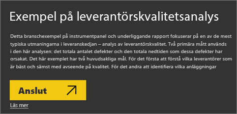

# Hämta exempel för Power BI
Säg att du har använt Power BI och vill prova men inte har några data.  Eller så kanske du vill se rapporter som illustrerar några av funktionerna i Power BI. Det har vi.

Power BI erbjuder olika typer av exempel för olika syften: 
- En **[Power BI rapport](#sales--returns-sample-pbix-file) (. pbix-fil)** som du kan visa i galleriet för dataartiklar, öppna och utforska i Power BI Desktop eller ladda upp till Power BI-tjänsten.
- En **[exempelapp](#sample-app-from-appsource)** som du hämtar från AppSource, även direkt i Power BI-tjänsten. Appar inkluderar instrumentpaneler, rapporter och datauppsättningar. Du kan ändra dem och sedan distribuera dem till dina kollegor.
- **[Åtta ursprungliga inbyggda exempel](#eight-original-samples)** i Power BI-tjänsten som *innehållspaket*, med instrumentpaneler, rapporter och datauppsättningar. Du installerar dem direkt i Power BI-tjänsten. De inbyggda exemplen är också tillgängliga som Power BI-rapporter (.pbix) och Excel-arbetsböcker (.xlsx).
- **[Excel-arbetsbok](#download-sample-excel-files)** versioner av de inbyggda exemplen som innehåller datamodellen och Power View-blad. Du kan utforska eller redigera datamodellen i Excel, använda Excel-arbetsboken som en datakälla för en Power BI-rapport. Du kan också ladda upp arbetsboken som en Excel-fil och visa Excel-visualiseringar och pivottabeller i Power BI-rapporter. 
- En **[exempelarbetsbokmed finansiella data](sample-financial-download.md)** . en enkel platt tabell i en Excel-fil som är tillgänglig för nedladdning. Den innehåller anonymiserade data med fiktiva produkter där försäljningen delas upp enligt segment och länder/regioner. Den är en användbar grundläggande datakälla för en Power BI-rapport.

Vår onlinedokumentation använder samma exempel i självstudier och demonstrationer så att du kan följa processen.

## Exempelfilen Sales & Returns.pbix

:::image type="content" source="media/sample-datasets/sales-returns-sample-pbix.png" alt-text="Exempelfilen Sales & Returns.pbix":::

*Exempelrapporten Sales & Returns*

Power BI-rapportutvecklarna Miguel Myers och Christer Hamill skapade .pbix-filen Sales & Returns för att demonstrera många nya funktioner i Power BI, inklusive knappar, detaljvisning, villkorsstyrd formatering, eventualiteter och anpassade knappbeskrivningar. 

Scenariot för den här rapporten är ett företag som säljer skateboards med Microsoft-teman. De vill se statusen för deras försäljning och intäkter och analysera hur de bör ändra sin verksamhet. 

Du kan utforska det på följande sätt:

- Visa och interagera med den i Power BI Community [Galleri med databerättelser](https://community.powerbi.com/t5/Data-Stories-Gallery/Sales-amp-Returns-Sample-Report/m-p/876607).
- Hämta .pbix-filen och utforska den på djupet. Se hur Miguel gjorde det genom att titta "bakom kulisserna". När du väljer den här länken hämtas filen automatiskt: [Exempelrapporten Sales & Returns](https://go.microsoft.com/fwlink/?linkid=2113239).
- Läs om rapporten i blogginlägget Power BI [Ta en titt på den nya exempelrapporten Sales & Returns](https://powerbi.microsoft.com/blog/take_a_tour_of_the_new_sales_returns_sample_report/).

## Exempelapp från AppSource

Marknadsförings- och försäljnings*appen* är tillgänglig från Microsoft AppSource. En app är en Power BI-innehållstyp som kombinerar relaterade instrumentpaneler och rapporter. En app kan ha en eller flera instrumentpaneler och en eller flera rapporter, alla samlade. Du kan hämta appen Marknadsföring och försäljning från **appar** i Power BI-tjänsten eller genom att gå till AppSource i webbläsaren.

- Artikeln [Installera och använda appar](../consumer/end-user-app-view.md) förklarar hur du laddar ned en app från Power BI-tjänsten.
- Med den här länken går du till [Försäljning- marknadsföringsappen](https://appsource.microsoft.com/product/power-bi/microsoft-retail-analysis-sample.salesandmarketingsample?tab=Overview) i AppSource.

När du har installerat den kan du se den i din appsamling.

:::image type="content" source="media/sample-datasets/power-bi-sales-marketing-app.png" alt-text="Appanelen Försäljning och marknadsföring":::

När du öppnar den väljer du **Utforska med exempeldata**. 

:::image type="content" source="media/sample-datasets/power-bi-explore-app.png" alt-text="Utforska appen":::

Appvyn visas med instrumentpanelen och enskilda rapportsidor i navigeringsfönstret. 

:::image type="content" source="media/sample-datasets/power-bi-sales-marketing-app-navigation.png" alt-text="Appnavigeringsfönster":::

Eftersom du installerade den kan du också öppna *arbetsytan* och redigera appens beståndsdelar. Välj pennikonen **Redigera** för att öppna arbetsytan.

:::image type="content" source="media/sample-datasets/power-bi-app-edit-pencil.png" alt-text="Redigera appen":::

Nu ser du instrumentpanelen, rapporten och datauppsättnignen från appen i arbetsytans listvy. Här i arbetsytan kan du redigera dem var för sig.

:::image type="content" source="media/sample-datasets/power-bi-sales-marketing-workspace.png" alt-text="Arbetsytan Försäljning och marknadsföring":::

Om du vill kan du distribuera den här appen till någon i din organisation. Välj **Uppdatera app**.

:::image type="content" source="media/sample-datasets/power-bi-update-app.png" alt-text="Uppdatera app-knappen":::

Slutför fliken **Konfiguration**, inklusive att välja en **App-temafärg**. 

:::image type="content" source="media/sample-datasets/power-bi-app-setup.png" alt-text="Välj appresurs":::

Fyll i flikarna **Navigering** och **Behörigheter** och välj **Uppdatera app**.

:::image type="content" source="media/sample-datasets/power-bi-select-update-app.png" alt-text="Välj Uppdatera app för att publicera den":::

Läs mer om att [publicera appar i Power BI](../collaborate-share/service-create-distribute-apps.md).

## Åtta originalexempel
Åtta originalexempel är tillgängliga som du kan använda. Vart och ett representerar olika branscher. Du kan kommunicera med vart och ett i olika format:

- Installera [inbyggda innehållspaket](#install-built-in-content-packs) i Power BI-tjänsten.
- Ladda ned [Power BI-rapportfilen](#download-original-sample-power-bi-files) (.pbix).
- Hämta [Excel-arbetsboksfiler](#download-sample-excel-files) (.xlsx) och ladda upp dem till Power BI-tjänsten.
- Utforska [Excel-filer i Excel](#explore-excel-samples-inside-excel) separat.

Företagets obviEnce ([www.obvience.com](http://www.obvience.com/)) och Microsoft samarbetar för att skapa exempel som du kan använda med Power BI.  Dessa data är anonyma och representerar olika branscher: ekonomi, HR, försäljning med mera. 

Vart och ett av de här exemplen finns i olika format: som ett innehållspaketet, som en enskild Excel-arbetsbok och som en Power BI .pbix-fil. Om du inte vet vad dessa saker är eller hur du skaffa dem, oroa dig inte. Den här artikeln förklarar allt. För vart och ett av dessa exempel har vi skapat en *visning*. Visningar är artiklar som berättar om historien bakom exemplet och vägleder dig genom olika scenarier. Ett scenario kanske besvarar frågor för din chef, ett annat kanske söker efter konkurrenskraftiga insikter eller skapar rapporter och instrumentpaneler att dela eller förklarar en företagsförändring.

Innan vi sätter igång kan du läsa de juridiska riktlinjerna för användning av exemplen. Efter det presenterar vi exemplen och visar hur de används.

### Riktlinjer för användning av Excel-arbetsböckerna för exemplen

&copy;2015 Microsoft Corporation. All rights reserved. Dokument och arbetsböcker tillhandahålls ”i befintligt skick”. Information och åsikter som uttrycks i arbetsböcker, inklusive webbadresser och andra webbplatsreferenser, kan ändras utan föregående meddelande. Du ansvarar för risken med att använda den. Några exempel är enbart för illustration och är fiktiva. Ingen verklig företeelse är avsedd eller härledd. Microsoft lämnar inga garantier, uttryckliga eller underförstådda, avseende informationen som visas här.

Arbetsböckerna ger dig inga juridiska rättigheter till någon immateriell egendom i någon Microsoft-produkt. Du kan kopiera och använda den här arbetsboken som intern referens.

Arbetsböcker och relaterade data tillhandahålls av obviEnce. [www.obvience.com](http://www.obvience.com)

ObviEnce är en inkubator för ISV och immateriell egendom (IP) som fokuserar på Microsoft Business Intelligence. ObviEnce fungerar i nära samarbete med Microsoft för att utveckla bästa praxis och överväganden för ledarskap för snabbstart och distribution av Microsoft Business Intelligence-lösningar.

Arbetsböcker och data tillhör obviEnce, LLC och har delats enbart för demonstration av Power BI-funktioner med branschspecifika exempeldata.

Användningsområden för arbetsböckerna och/eller data måste innefatta ovan tillskrivningar (även innefattade på informationskalkylbladet i varje arbetsbok). Arbetsboken och alla visualiseringar måste åtföljas av följande upphovsrättsmeddelande: obviEnce &copy;.

Genom att klicka på någon av länkarna nedan för att hämta Excel-arbetsböcker eller PBIX-filer, accepterar du villkoren ovan.

### Exempel på kundlönsamhet  
[Ta en rundtur i exemplet för kundlönsamhet](sample-customer-profitability.md)

Det här branschexemplet analyserar en ekonomichefs nyckelmått för företagets ledning, produkter och kunder. Du kan undersöka vilka faktorer som påverkar företagets lönsamhet.

### Exempel på personalfrågor 
[Ta en rundtur i exemplet för personalfrågor](sample-human-resources.md)

Det här branschexemplet fokuserar på anställningsstrategin för ett företag genom att analysera nyanställda, aktiva medarbetare och anställda som har slutat.  Genom att utforska data kan du hitta trender i frivilliga separeringar och eventuella fördomar i anställningsstrategin.

### Exempel på IT-utgiftsanalys 
[Ta en rundtur i exemplet för IT-utgiftsanalys](sample-it-spend.md)

I det här branschexemplet analyserar vi planerade kontra faktiska kostnader för ett företags IT-avdelning. Den här jämförelsen hjälper oss att förstå hur väl företaget planerat för året och undersöka områden med stora avvikelser från planen. Företaget i det här exemplet går igenom en årlig planeringscykel och skapar kvartalsvis en ny senaste uppskattning (LE) för att analysera förändringar i IT-utgifter över räkenskapsåret.

### Exempel på affärsmöjlighetsanalys 
[Ta en rundtur i exemplet för analys av affärsmöjligheter](sample-opportunity-analysis.md)

Det här branschexemplet utforskar ett programvaruföretags försäljningskanaler. Säljare övervaka sina direkta och partnerförsäljningskanaler genom spårning av affärsmöjligheter och intäkter efter region, avtalsstorlek och kanal.

### Exempel på anskaffningsanalys  
[Ta en rundtur i exemplet för anskaffningsanalys](sample-procurement.md)

Det här branschexemplet analyserar en ekonomichefs nyckelmått för företagets ledning, produkter och kunder. Du kan undersöka vilka faktorer som påverkar företagets lönsamhet.

### Exempel på detaljhandelsanalys  
[Ta en rundtur i exemplet för detaljhandelsanalys](sample-retail-analysis.md)

Det här branschexemplet analyserar försäljningsdata för sålda artiklar över flera butiker och distrikt. Måtten jämför årets resultat med förra årets inom följande områden: försäljning, enheter, bruttomarginal och skillnader, samt lagringsanalys.

### Exempel på försäljning och marknadsföring  
[Ta en rundtur i exemplet för försäljning och marknadsföring](sample-sales-and-marketing.md)

Det här branschexemplet analyserar ett tillverkningsföretag, VanArsdel Ltd. Det tillåter marknadschefen att titta på branschen och VanArsdels marknadsandel.  Genom att utforska exemplet hittar du företagets marknadsandel, produktvolym, försäljning och omdöme.

### Exempel på leverantörskvalitet  
[Ta en rundtur i exemplet för leverantörskvalitet](sample-supplier-quality.md)

Branschexemplet fokuserar på en av de mest typiska utmaningarna i leveranskedjan – analys av leverantörskvalitet. Två primära mått används i den här analysen: det totala antalet defekter och den totala nedtiden som dessa defekter har orsakat. Det här exemplet har två huvudmål: förstå vilka som är de bästa respektive sämsta leverantörerna med avseende på kvalitet, och identifiera vilka anläggningar som är bäst på att hitta och avvisa fel, för att minimera driftavbrotten.

### Installera inbyggda innehållspaket

Vi börjar med *innehållspaketen*. De inbyggda exemplen är tillgängliga i Power BI-tjänsten. Du behöver inte lämna Power BI för att hitta dem. Ett innehållspaket är ett paket med en eller flera instrumentpaneler, datamängder och rapporter som någon har skapat och som kan användas med Power BI-tjänsten. Varje innehållspaket för Power BI-exemplen innehåller en datauppsättning, en rapport och en instrumentpanel.  Innehållspaket är fortfarande tillgängliga, men är inaktuella. De är inte tillgängliga för Power BI Desktop.

1. Öppna Power BI-tjänsten (app.powerbi.com) och logga in.
2. Navigera till min arbetsyta eller till en annan arbetsyta där du vill installera exemplet. 
2. Längst ned i vänster hörn väljer du **Hämta data**.

    
3. På sidan Hämta data väljer du **Exempel**.

   
4. Välj ett av exemplen för att öppna en beskrivning av exemplet och välj **Anslut**.  

   
5. Power BI importerar innehållspaketet och lägger till en ny instrumentpanel, rapport och datauppsättning till din aktuella arbetsyta. Använd exemplen för att ta en testtur i Power BI.  

   

Nu när du har dessa data är du på god väg.  Prova några av våra självstudier med exemplen på innehållspaket eller öppna helt enkelt Power BI-tjänsten och utforska den.

### Hämta ursprungliga Power BI-exempelfiler
Varje exempel på innehållspaket är också tillgängligt som en Power BI PBIX-fil. PBIX-filerna är avsedda att användas med Power BI Desktop.  

1. Hämta filer en och en via länkarna nedan. När du väljer de här länkarna sparas filerna automatiskt i mappen med nedladdningar. 

   - [PBIX-filen Exempel på kundlönsamhet](https://download.microsoft.com/download/6/A/9/6A93FD6E-CBA5-40BD-B42E-4DCAE8CDD059/Customer%20Profitability%20Sample%20PBIX.pbix)
   - [PBIX-filen Exempel på personalfrågor](https://download.microsoft.com/download/6/9/5/69503155-05A5-483E-829A-F7B5F3DD5D27/Human%20Resources%20Sample%20PBIX.pbix)
   - [PBIX-filen Exempel på anskaffningsanalys](https://download.microsoft.com/download/D/5/3/D5390069-F723-413B-8D27-5888500516EB/Procurement%20Analysis%20Sample%20PBIX.pbix)
   - [PBIX-filen Exempel på detaljhandelsanalys](https://download.microsoft.com/download/9/6/D/96DDC2FF-2568-491D-AAFA-AFDD6F763AE3/Retail%20Analysis%20Sample%20PBIX.pbix)
   - [PBIX-filen Exempel på försäljning och marknadsföring](https://download.microsoft.com/download/9/7/6/9767913A-29DB-40CF-8944-9AC2BC940C53/Sales%20and%20Marketing%20Sample%20PBIX.pbix)
   - [PBIX-filen Exempel på leverantörskvalitetsanalys](https://download.microsoft.com/download/8/C/6/8C661638-C102-4C04-992E-9EA56A5D319B/Supplier-Quality-Analysis-Sample-PBIX.pbix)

1. Från Power BI Desktop väljer du **Arkiv > Öppna** och navigerar till den plats där du sparade exemplets .pbix-fil.

4. Välj PBIX-filen för att öppna den i Power BI Desktop.

### Hämta Excel-exempelfiler
Varje exempel på innehållspaket är också tillgängligt som en Excel-arbetsbok. Excel-arbetsböcker är avsedda att användas med Power BI-tjänsten.  

1. Hämta filer en och en med länkarna nedan, eller [hämta en zip-fil med alla exempelfilerna](https://go.microsoft.com/fwlink/?LinkId=535020). Om du är en avancerad användare kanske du vill hämta Excel-arbetsböcker för att utforska eller redigera datamodellerna.

   - [Exempel på kundlönsamhet](https://go.microsoft.com/fwlink/?LinkId=529781)
   - [Exempel på personalfrågor](https://go.microsoft.com/fwlink/?LinkId=529780)
   - [Exempel på spårning av affärsmöjligheter](https://go.microsoft.com/fwlink/?LinkId=529782)
   - [Exempel på anskaffningsanalys](https://go.microsoft.com/fwlink/?LinkId=529784)
   - [Exempel på detaljhandelsanalys](https://go.microsoft.com/fwlink/?LinkId=529778)
   - [Exempel på försäljning och marknadsföring](https://go.microsoft.com/fwlink/?LinkId=529785)
   - [Exempel på leverantörskvalitetsanalys](https://go.microsoft.com/fwlink/?LinkId=529779)

2. Spara den hämtade filen. Det har betydelse var du sparar filen.

     **Lokalt** – om du sparar din fil från Power BI till en lokal enhet i datorn eller en annan plats i organisationen så kan du importera den till Power BI. Filen kommer att finnas kvar på den lokala enheten, så hela filen importeras inte till Power BI. Det som händer är att en ny datamängd skapas på din Power BI-webbplats samt att data och i vissa fall datamodellen läses in i datamängden. Om din fil innehåller rapporter kommer de rapporterna att visas på din Power BI-webbplats under Rapporter.
    
     **OneDrive – företag** – om du har OneDrive för företag och loggar in med samma konto som du loggar in i Power BI med är OneDrive för företag det överlägset effektivaste sättet att hålla ditt arbete i Excel, Power BI eller en CSV-fil synkroniserat med din datamängd, dina rapporter och dina instrumentpaneler i Power BI. Eftersom både Power BI och OneDrive finns i molnet, ansluter Power BI till din fil på OneDrive ungefär en gång per timme. Om det finns ändringar uppdateras dina datauppsättningar, rapporter och instrumentpaneler i Power BI automatiskt.
    
     **SharePoint-gruppwebbplatser** Att spara dina Power BI-filer på SharePoint-gruppwebbplatser fungerar på ungefär samma sätt som i OneDrive för företag. Den största skillnaden är hur du ansluter till filen från Power BI. Du kan ange en URL eller ansluta till rotmappen.
1. Öppna Power BI-tjänsten (app.powerbi.com) och logga in.

1. Navigera till min arbetsyta eller till en annan arbetsyta eller skapa en arbetsyta för exemplet.

4. Välj **Hämta data** i navigeringsfönstrets nedre vänstra hörn.

    
5. På sidan **Hämta data** väljer du **Filer > Hämta**.

    
6. Välj den plats där du laddade ned och sparade exemplet.

    
7. Välj filen. Beroende på var du sparade filen väljer du **Anslut** eller **Öppna**.

8. Välj om du vill importera data eller ta arbetsboken till Power BI och se den exakt som den är i Excel online.

    
9. Om du väljer **Importera**, importerar Power BI exempelarbetsboken och lägger till den som en ny instrumentpanel, rapport och datauppsättning, i det här fallet har samtliga namnet **Exempel på anskaffningsanalys**.

    - Eftersom arbetsboken har Power View-blad skapar Power BI en rapport med en sida för varje Power BI-blad. 
    - Power BI skapar en ny instrumentpanel med en ny tom panel.  Om du väljer panelen hamnar du på rapporten som du precis lade till.

10. Öppna rapporten. Välj olika element i rapporten för att utforska deras interaktioner. 

    

### Utforska Excel-exempel i Excel

(Valfritt) Vill du förstå hur data i en Excel-arbetsbok konverteras till Power BI-datauppsättningar och -rapporter? Öppna Excel-exemplen *i Excel* och utforska kalkylbladen som innehåller några av svaren.

- När du först öppnar en exempelarbetsbok i Excel kan två varningar visas. Den första varningen anger att arbetsboken är i Skyddad vy. Välj **Aktivera redigering**. Den andra varningen kan ange att arbetsboken har externa dataanslutningar. Välj **Aktivera innehåll**.
- Varje arbetsbok innehåller flera Power View-blad. Om du vill se Power View-bladet i Excel behöver du [aktivera Power View-tillägget](https://support.office.com/article/flash-silverlight-and-shockwave-controls-blocked-in-microsoft-office-55738f12-a01d-420e-a533-7cef1ff6aeb1) genom att ladda ned ett paket med registernycklar.
- Så var är de faktiska data? De är i Power Pivot-datamodellen. Du behöver inte Power View-blad för att se data. På **PowerPivot**-fliken väljer du **Hantera**.

    Ser du inte **Power Pivot**-fliken? [Aktivera tillägget Power Pivot](https://support.office.com/article/Start-Power-Pivot-in-Microsoft-Excel-2013-add-in-A891A66D-36E3-43FC-81E8-FC4798F39EA8).

    I Power Pivot kan du se data i alla de underliggande tabellerna plus alla DAX-formler. 

- Informationsfliken innehåller information om obviEnce, det företag som skapat exemplet.

## Nästa steg
[Grundläggande begrepp för designers i Power BI-tjänsten](../fundamentals/service-basic-concepts.md)

[Självstudie: Ansluta till Power BI-exempel](sample-tutorial-connect-to-the-samples.md)

[Datakällor för Power BI](../connect-data/service-get-data.md)

Har du fler frågor? [Prova Power BI Community](https://community.powerbi.com/)
