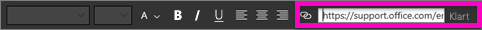
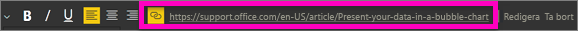
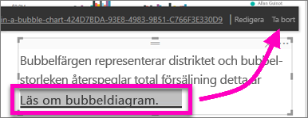

# Lägga till en hyperlänk i en textruta i en rapport
Du kan lägga till en textruta i en rapport i Power BI Desktop eller Power BI-tjänsten. Du kan fästa en textruta från en rapport på en instrumentpanel eller lägga till en direkt på en instrumentpanel. Oavsett var textrutan finns kan du alltid lägga till en hyperlänk till den. Den här artikeln beskriver hur du lägger till en hyperlänk i en textruta i en rapport. 

Se hur Will Thompson skapar en textruta och lägger till en hyperlänk till den. 

<iframe width="560" height="315" src="https://www.youtube.com/embed/_3q6VEBhGew#t=0m55s" frameborder="0" allowfullscreen></iframe>

Information om hyperlänkar i Power BI-tabeller och -matriser finns i [Lägga till hyperlänkar i en tabell](power-bi-hyperlinks-in-tables.md). Mer information om att lägga till textrutor på instrumentpanelen finns i [Lägg till bild, text, video och mer till din instrumentpanel](service-dashboard-add-widget.md). 

## Lägga till en hyperlänk i en textruta
1. Öppna en rapport, [skapa en textruta](power-bi-reports-add-text-and-shapes.md) och lägg till lite text. 
2. Markera den befintliga texten eller lägg till ny text som ska användas som en hyperlänk. 

   Textrutemenyn visas.
   
   
3. Välj hyperlänkikonen  på textrutemenyn.

   Hyperlänksfältet visas på textrutemenyn.

4. Skriv eller klistra in URL:en i hyperlänksfältet och välj **Klar**.
   
   
5. Testa länken:  

   a. Placera markören var som helst i den nya hyperlänken i textrutan för att visa URL:en i hyperlänksfältet.  
     
      
   
      

   b. Välj URL:en i hyperlänksfältet för att öppna sidan i ett nytt webbläsarfönster.

## Ta bort hyperlänken
1. I textrutan väljer du hyperlänken för att markera den.
   
     
2. Välj **Ta bort** på textrutemenyn. 

   Power BI Desktop tar bort hyperlänken men lämnar texten.

## Nästa steg
[Textrutor och figurer i Power BI-rapporter](power-bi-reports-add-text-and-shapes.md)

Fler frågor? [Testa Power BI Community](https://community.powerbi.com/).

