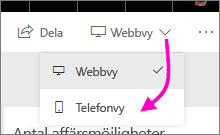
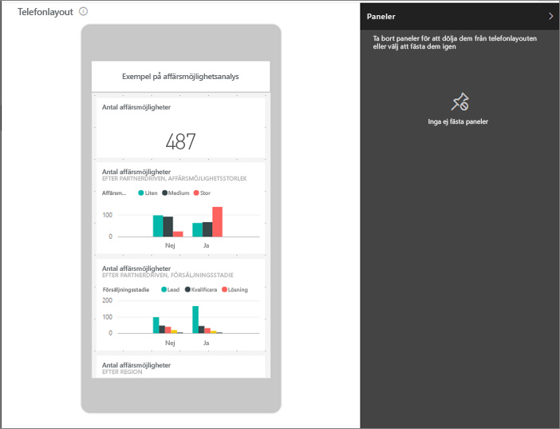
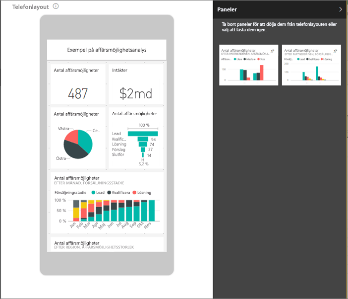

# Optimera en instrumentpanel för mobiltelefoner – Power BI 
När du visar instrumentpaneler i stående läge på en telefon märker du att instrumentpanelens paneler placeras ut en i taget, alla i samma storlek. I Power BI-tjänsten kan du skapa en anpassad vy av en instrumentpanel särskilt för stående läge på mobiltelefoner. Även om du skapar en telefonvy ser du instrumentpanelen som den ser ut i tjänsten när du vänder telefonen i sidled.

Letar du efter information om visning av instrumentpaneler på en mobil enhet? Prova den här snabbstarten [Utforska instrumentpaneler och rapporter i Power BI-mobilappar](../consumer/mobile/mobile-apps-quickstart-view-dashboard-report.md) i stället.

> [!NOTE]
> När du redigerar telefonvyn kan alla som ser instrumentpanelen på en telefon se de ändringar du gör i realtid. Om du till exempel plockar bort alla paneler i instrumentpanelens telefonvy, kommer instrumentpanelen på telefonen plötsligt inte ha några paneler. 
> 
> 

## Skapa en telefonvy av en instrumentpanel
1. Öppna en instrumentpanel i Power BI-tjänsten.
2. Välj pilen bredvid **webbvy** i det övre högra hörnet > välj **telefonvy**.

    

    Om du inte äger instrumentpanelen visas inte det här alternativet.

    

    Telefonredigeringsvyn för instrumentpanelen öppnas. Här kan du ta bort, ändra storlek på och flytta paneler för att passa telefonvyn. Webbversionen av instrumentpanelen ändras inte.

1. Välj en panel för att dra, ändra storlek på eller tas bort. Du ser hur panelerna flyttar undan när du drar en panel.
   
    
   
    De borttagna panelerna åker till fönstret borttagna paneler där de blir kvar om du inte lägger till dem igen.
   
    
2. Om du ändrar dig, väljer du **återställ paneler** för att få tillbaks dem med den storlek och placering som de hade innan.
   
    
   
    Bara att öppna telefonredigeringsvyn i Power BI-tjänsten ändrar storleken och formen på panelerna lite på en telefon. Om du vill återställa instrumentpanelen till exakt samma tillstånd som innan du öppnade telefonredigeringsvyn, väljer du **återställ paneler**.
3. När du är nöjd med telefonens instrumentpanelslayout, väljer du pilen bredvid **telefonvy** i det övre högra hörnet > väljer **webbvy**.
   
    Power BI sparar telefonlayouten automatiskt.

## Nästa steg
* [Skapa rapporter som är optimerade för Power BI-telefonapopar](desktop-create-phone-report.md)
* [Skapa dynamiska visuella objekt som optimerats för alla storlekar](../visuals/power-bi-report-visualizations.md)
* Har du fler frågor? [Fråga Power BI Community](https://community.powerbi.com/)
