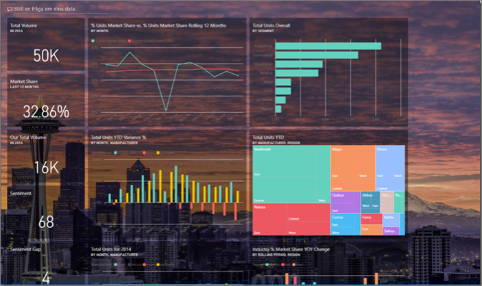
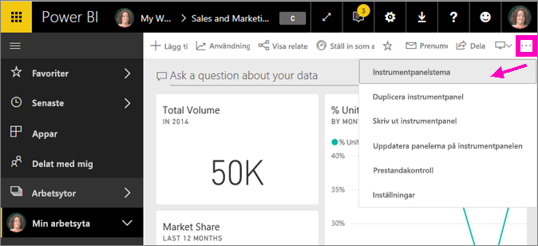
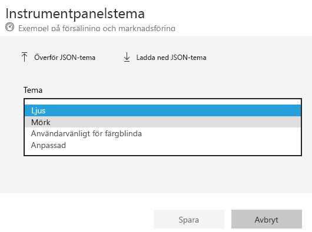
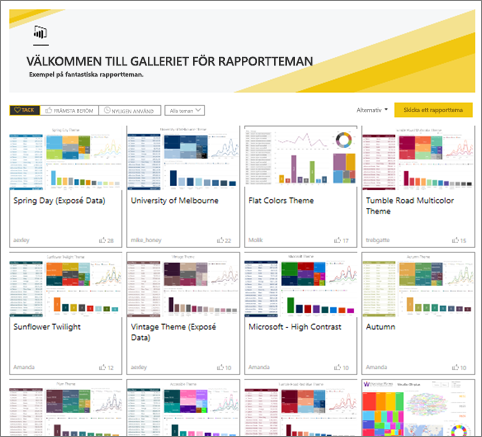
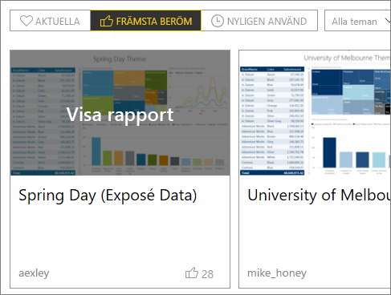
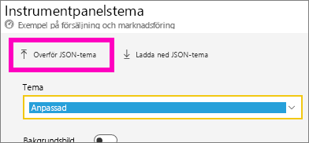
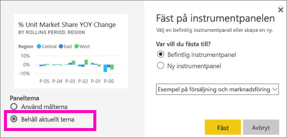

# Använda instrumentpanelsteman i Power BI-tjänsten
Med **instrumentpanelsteman** kan du använda ett färgtema på hela instrumentpanelen, till exempel företagets färger, säsongsfärger eller andra färgteman som du vill använda. När du tillämpar ett **instrumentpanelstema** används färgerna från det tema du valt på alla visuella objekt på instrumentpanelen (med några få undantag, som beskrivs längre ned i den här artikeln).

De visuella objekten i en rapport påverkas inte om du ändrar färgen för rapportvisualiseringar på instrumentpanelen. Och om du fäster paneler från en rapport som redan har ett [rapporttema](desktop-report-themes.md) kan du välja mellan att behålla det aktuella temat eller att använda instrumentpanelstemat.

## Förutsättningar
* Om du vill följa med i demonstrationen [öppnar du exempelinstrumentpanelen Försäljning och marknadsföring](sample-datasets.md).

## Så här fungerar instrumentpanelsteman
Börja med att öppna en instrumentpanel som du har skapat (eller har behörighet att redigera) och som du vill anpassa. Välj **Fler alternativ** (...) och sedan **Instrumentpanelstema**. 

Välj ett fördefinierat teman i instrumentpanelsfönstret.  I exemplet nedan har vi valt **Mörkt**.

## Skapa ett anpassat tema

Standardtemat för Power BI-instrumentpaneler är **Ljust**. Om du vill anpassa färgerna eller skapa ett eget tema väljer du **Anpassat** i listrutan. 

Använd anpassade alternativ om du vill skapa ett eget instrumentpanelstema. Om du vill lägga till en bakgrundsbild rekommenderar vi att bilden har en upplösning på minst 1 920 × 1 080. Om du vill använda en bild som bakgrund överför du den bilden till en offentlig webbplats, kopierar URL:en och klistrar in den i fältet **Bild-URL**. 

### Använda JSON-teman
Ett annat sätt att skapa ett anpassat tema är att ladda upp en JSON-fil som innehåller inställningar för alla färger som du vill använda på instrumentpanelen. I Power BI Desktop använder rapportförfattare JSON-filer för att [skapa teman för rapporter](desktop-report-themes.md). Dessa JSON-filer kan laddas upp till instrumentpaneler. Du kan också söka efter och ladda upp JSON-filer från [temagalleriet](https://community.powerbi.com/t5/Themes-Gallery/bd-p/ThemesGallery) i Power BI-communityn 

Du kan också spara ditt anpassade tema som en JSON-fil och sedan dela det med andra som skapar instrumentpaneler. 

### Använda ett tema från temagalleriet

Precis som med alternativen för inbyggda och anpassade teman tillämpas färgerna automatiskt på alla paneler på instrumentpanelen. 

1. Hovra över ett tema och välj **Visa rapport**.

    

2. Bläddra nedåt tills du ser länken till JSON-filen.  Välj ikonen för nedladdning och spara filen.

    

3. När du är tillbaka i Power BI-tjänsten väljer du **Överför JSON-tema** i fönstret Custom Dashboard theme (Anpassat instrumentpanelstema).

    

4. Gå till den plats där du sparade JSON-temafilen och välj **Öppna**.

5. Välj **Spara** på sidan Instrumentpanelstema. Det nya temat tillämpas på instrumentpanelen.

    

## Överväganden och begränsningar

* Om din rapport använder ett annat tema än instrumentpanelen kan du välja om det visuella objektet ska behålla sitt ursprungstema eller använda instrumentpanelstemat för en mer konsekvent upplevelse. När du fäster en panel på en instrumentpanel väljer du **Behåll aktuellt tema** om du vill behålla rapporttemat. Rapporttemat bevaras för det visuella objektet på instrumentpanelen, inklusive inställningar för genomskinlighet. 

    Alternativen för **panelteman** visas bara om du skapade rapporten i Power BI Desktop, [lade till ett rapporttema](desktop-report-themes.md) och sedan publicerade rapporten till Power BI-tjänsten. 

    

    Fäst panelen igen men välj **Use dashboard theme** (Använd instrumentpanelstema) den här gången.

    

* Instrumentpanelsteman kan inte tillämpas på live-rapportsidor, iframe-paneler, SSRS-paneler, arbetsbokspaneler eller bilder.
* Instrumentpanelsteman kan visas på mobila enheter, men det går bara att skapa instrumentpanelsteman i Power BI-tjänsten. 
* Anpassade instrumentpanelsteman fungerar bara med paneler som fästs från rapporter. 

