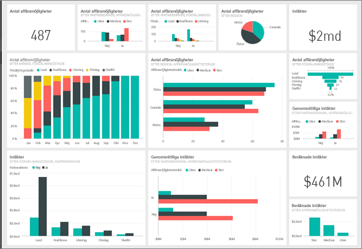
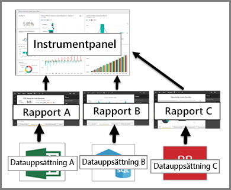

# Introduktion till instrumentpaneler för Power BI-designers

En Power BI-*instrumentpanel* är en enda sida, som ofta kallas för arbetsyta, som har ett budskap via visualiseringar. Eftersom den är begränsad till en sida, innehåller en väl utformad instrumentpanel endast höjdpunkterna i detta budskap. Läsare kan visa relaterade rapporter för att få information.

Instrumentpaneler är en funktion som endast ingår i Power BI-tjänsten. De finns inte tillgängliga i Power BI Desktop. Du kan inte skapa instrumentpaneler på mobila enheter, men du kan [visa och dela](../consumer/mobile/mobile-apps-view-dashboard.md) dem.

## Grunderna i instrumentpanelen 

De visualiseringar som visas i instrumentpanelen kallas *paneler*. Du *fäster* paneler på en instrumentpanel från rapporter. Om du är nybörjare på Power BI kan du få en bra grund genom att läsa [Grundläggande begrepp för designers i Power BI-tjänsten](../fundamentals/service-basic-concepts.md).

Visualiseringarna på en instrumentpanel kommer från rapporter och varje rapport baseras på en datamängd. Man skulle kunna se på en instrumentpanel som en entré till de underliggande rapporterna och datamängderna. Om du väljer en visualisering tas du till rapporten (och datamängden) som den är baserad på.

## Fördelarna med instrumentpaneler
Instrumentpaneler är fantastiska för att övervaka affärsverksamheten och för att få en snabb översikt över era viktigaste mått. Visualiseringarna på en instrumentpanel kan komma från en underliggande datauppsättning eller flera, eller från en underliggande rapport eller flera. En instrumentpanel kombinerar lokala och molndata, vilket ger en samlad vy oavsett var dessa data finns.

En instrumentpanel är inte bara en fin bild. Den är i hög grad interaktiv. Panelerna uppdateras när underliggande data ändras.

## Vem kan skapa en instrumentpanel?
Möjligheten att skapa en instrumentpanel är en funktion för *skapare* och kräver behörighet att redigera i rapporten. Behörigheter att redigera är tillgängliga för rapportskapare av och de medarbetare skaparen beviljar åtkomst till. Om David till exempel skapar en rapport på arbetsytan ABC och sedan lägger till dig som medlem i den arbetsytan kommer både du och David att ha redigeringsbehörighet. Om en rapport å andra sidan har delats med dig direkt eller som en del av en [Power BI-app](../collaborate-share/service-create-distribute-apps.md) så *använder* du rapporten. Du kanske inte kan fästa paneler på en instrumentpanel. 

> [!IMPORTANT]
> Du behöver en [Power BI Pro](../fundamentals/service-features-license-type.md)-licens för att skapa instrumentpaneler i arbetsytor. Du kan skapa instrumentpaneler i din egen min arbetsyta utan en Power BI Pro-licens.

## Instrumentpaneler kontra rapporter
[Rapporter](../consumer/end-user-reports.md) och instrumentpaneler kan verka lika eftersom de båda är arbetsytor som är fyllda av visualiseringar. Men det finns stora skillnader, som du kan se i följande tabell.

| **Kapacitet** | **Instrumentpaneler** | **Rapporter** |
| --- | --- | --- |
| Sidor |En sida |En eller flera sidor |
| Datakällor |En eller flera rapporter och en eller flera datauppsättningar per instrumentpanel |En enskild datauppsättning per rapport |
| Tillgängliga i Power BI Desktop |Nej | Ja. Kan skapa och visa rapporter i Power BI Desktop |
| Prenumerera |Ja. Kan prenumerera på en instrumentpanel |Ja. Det går att prenumerera på en rapportsida |
| Filtrering |Nej. Det går inte att filtrera eller dela upp |Ja. Det finns många olika sätt att filtrera, markera och dela upp |
| Aktuella |Ja. Det går att ange en instrumentpanel som din *aktuella* instrumentpanel |Nej |
| Favorit | Ja. Det går att ange flera instrumentpaneler som *favoriter* | Ja. Det går att ange flera rapporter som *favoriter*
| Ställa in avisering |Ja. Tillgänglig för instrumentpaneler i vissa fall |Nej |
| Frågor med naturligt språk (Frågor och svar) |Ja | Ja, under förutsättning att du har redigeringsbehörighet för rapporten och dess underliggande datauppsättning |
| Det går att visa tabeller och fält från den underliggande datauppsättningen |Nej. Det går att exportera data men tabeller och fält visas inte i själva instrumentpanelen |Ja |

## Nästa steg
* Bekanta dig med instrumentpaneler genom att ta en titt på ett av våra [exempel](sample-tutorial-connect-to-the-samples.md).
* Läs om [panelerna på instrumentpanelen](service-dashboard-tiles.md).
* Vill du spåra en enskild panel på instrumentpanelen och får ett e-postmeddelande när den når ett visst tröskelvärde? [Skapa en avisering på en panel](service-set-data-alerts.md).
* Lär dig hur du använder [Power BI:s frågor och svar](power-bi-tutorial-q-and-a.md) för att ställa en fråga om dina data och få ett svar i form av en visualisering.
