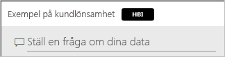
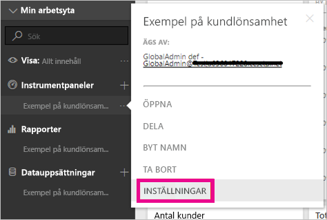
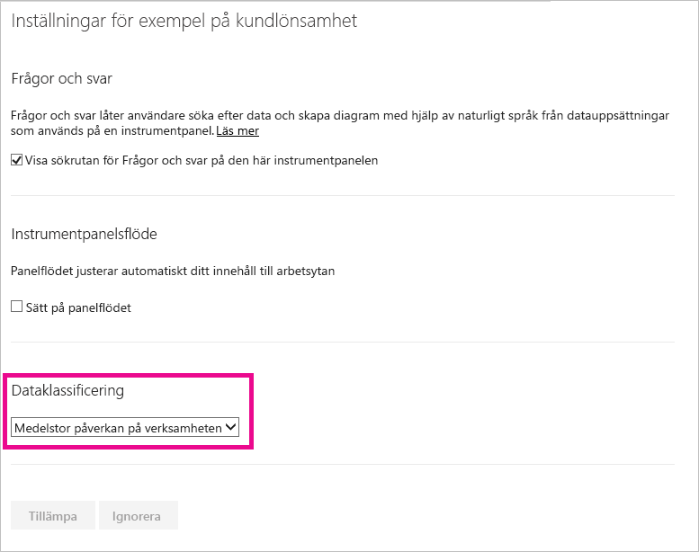
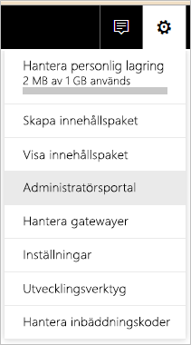
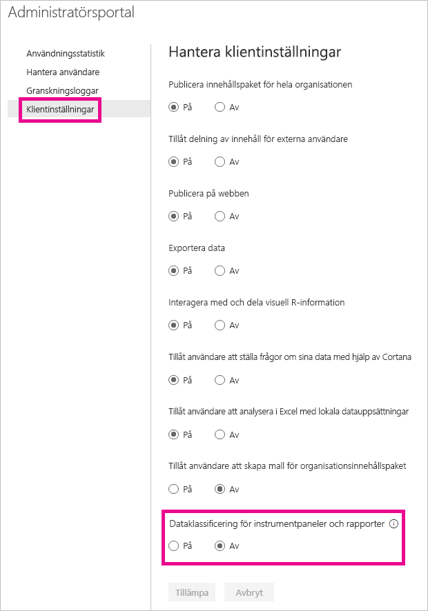
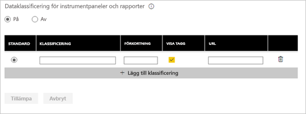

# Klassificering av instrumentpanelsdata
Varje instrumentpanel är olika och beroende på vilka data du är ansluten till kommer du att finna att du och de kollegor du delar data med måste vidta olika säkerhetsåtgärder beroende på hur känsliga dina data är. Vissa instrumentpaneler bör aldrig delas utanför företaget eller skrivas ut, medan andra kan delas fritt. Med hjälp av klassificering av instrumentpanelen kan du öka medvetenheten hos de som använder dina instrumentpaneler om vilken säkerhetsnivå som ska användas. Du kan tagga dina instrumentpaneler med klassificeringar som har definierats av ditt företags IT-avdelning så att alla som ser innehållet har samma förståelse för datans känslighet.

## Taggar för dataklassificering
Dataklassificeringstaggar visas bredvid namnet på instrumentpanelen för att låta alla som visar den veta vilken säkerhetsnivå som ska tillämpas på instrumentpanelen och de data som den innehåller.

Det kommer också att visas intill instrumentpanelen i favoritlistan.

När du håller muspekaren över etiketten visas det fullständiga namnet på klassificeringen.

Administratörer kan också ange en URL till en tagg som innehåller ytterligare information.

> [!NOTE]
> Beroende på klassificeringsinställningarna som har ställts in av administratören kommer vissa klassificeringstyper inte att visas som en tagg på instrumentpanelen. Om du äger en instrumentpanel kan du alltid kontrollera din instrumentpanels klassificeringstyp under inställningar för instrumentpanel.
> 
> 

## Ange en instrumentpanels klassificering
Om dataklassificeringen är aktiverad för ditt företag börjar alla instrumentpaneler med en standardklassificering, men du kan ändra klassificeringen för att matcha dina instrumentpanelers säkerhetsnivå som instrumentpanelens ägare.

Gör följande om du vill ändra typen av klassificering:

1. Gå till inställningar för instrumentpanelen genom att välja de **tre punkterna** bredvid instrumentpanelens namn och därefter **Inställningar**.
   
    
2. Du kommer att kunna se den aktuella klassificeringen för din instrumentpanel och använda rullgardinsmenyn för att ändra klassificeringstypen.
   
    
3. Välj **Använd** när du är klar.

När du har tillämpat ändringen kan alla som du har delat med se uppdateringen nästa gång de hämtar instrumentpanelen.

## Arbeta med dataklassificeringstaggar som administratör
Dataklassificering har ställts in av den globala administratören för din organisation. Gör följande om du vill aktivera dataklassificering:

1. Välj kugghjulet för Inställningar och välj **Administrationsportal**.
   
    
2. Växla **Dataklassificering för instrumentpaneler och rapporter** till *på* på fliken **Klientinställningar**.
   
    

Där detta har aktiverats kommer du att se ett formulär där du kan skapa olika klassificeringar i din organisation.

Varje klassificering har ett **namn** och en **förkortning** som visas på instrumentpanelen. För varje klassificering kan du bestämma om taggen visas på instrumentpanelen eller inte genom att välja **Visa taggen**. Om du inte väljer att visa klassificeringstyp på instrumentpanelen kommer ägaren fortfarande att kunna se typen genom att kontrollera inställningarna för instrumentpanelen. Dessutom kan du kan du lägga till en **URL** som innehåller mer information om din organisations riktlinjer för klassificering och användarkrav.  

Det sista måste du bestämma är vilken klassificeringstyp som är standard.  

När du har fyllt i formuläret med klassificeringtyper väljer du **Tillämpa** för att spara ändringarna.

I det här läget tilldelas alla instrumentpaneler standardklassificeringen. Instrumentpanelens ägare kan nu uppdatera klassificeringstypen till den som passar innehållet. Du kan komma tillbaka hit i framtiden för att lägga till och ta bort klassificeringstyper eller ändra standarden.  

> [!NOTE]
> Det finns några viktiga saker att komma ihåg när du kommer tillbaka för att göra ändringar:
> 
> * Om du inaktiverar dataklassificering kommer ingen av taggarna sparas. Du måste börja om från början om du vill aktivera det igen senare.  
> * Om du tar bort en klassificeringstyp kommer instrumentpanelerna som tilldelades den borttagna klassificeringstypen att återgå till standard tills ägaren ställer in en ny typ.  
> * Om du ändrar standardvärdet ändras alla instrumentpaneler som inte redan har tilldelats en klassificeringstyp av ägaren till den nya standarden.
> 
> 

