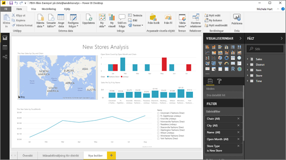

# Hämta en rapport från Power BI-tjänsten till Power BI Desktop (förhandsversion)
I Power BI Desktop kan du publicera en rapport (en *.pbix*-fil) från den lokala datorn till Power BI-tjänsten. Power BI-rapporter kan även gå åt det andra hållet: Du kan ladda ned en rapport från Power BI-tjänsten till Power BI Desktop. Filnamnstillägget för en Power BI-rapport är i båda fallen .pbix.

Det finns några begränsningar och saker du bör tänka på, vilket beskrivs längre fram avsnittet [Överväganden och felsökning](#considerations-and-troubleshooting) i den här artikeln.

## Ladda ned rapporten som en .pbix-fil

Du kan endast ladda ned rapporter som har [skapats med Power BI Desktop](/learn/modules/publish-share-power-bi/2-publish-reports) efter den 23 november 2016 och uppdaterats därefter. Om den skapades före det är menyalternativet **Ladda ned rapport** i Power BI-tjänsten nedtonat.

Hämta .pbx-filen genom att följa dessa steg:

1. I Power BI-tjänsten öppnar du den rapport som du vill ladda ned i [redigeringsvyn](https://docs.microsoft.com/power-bi/service-interact-with-a-report-in-editing-view).

2. I det översta navigeringsfönstret väljer du **Arkiv > Hämta rapport**.
   
3. Medan rapporten laddas ned visar en statusbanderoll förloppet. När filen är klar ombeds du att välja var .pbix-filen ska sparas. Filens standardnamn matchar rapportens rubrik.
   
4. Om du inte redan har [installerat Power BI Desktop](../fundamentals/desktop-get-the-desktop.md) gör du det och öppnar sedan .pbix-filen i Power BI Desktop.
   
    När du öppnar rapporten i Power BI Desktop visas kanske ett varningsmeddelande om att vissa funktioner som är tillgängliga i rapporten i Power BI-tjänsten inte är tillgängliga i Power BI Desktop.
   
    

5. Rapportredigeraren i Power BI Desktop liknar rapportredigeraren i Power BI-tjänsten.  
   
    

## Överväganden och felsökning
Det finns några viktiga överväganden och begränsningar att ta hänsyn till vid nedladdning av en .pbix-fil från Power BI-tjänsten.

* Du måste ha redigeringsåtkomst till rapporten för att kunna ladda ned filen.
* Rapporten måste ha skapats med Power BI Desktop och *publicerats* till Power BI-tjänsten, eller så måste .pbix-filen ha *laddats upp* till Power BI-tjänsten.
* Rapporter måste ha publicerats eller uppdaterats efter den 23 november 2016. Rapporter som publicerats tidigare är inte nedladdningsbara.
* Den här funktionen fungerar inte med rapporter och innehållspaket som ursprungligen skapades i Power BI-tjänsten.
* Använd alltid den senaste versionen av Power BI Desktop när du öppnar nedladdade filer. Nedladdade .pbix-filer öppnas kanske inte i inaktuella versioner av Power BI Desktop.
* Om administratören har stängt av möjligheten att ladda ned data visas den här funktionen inte i Power BI-tjänsten.
* Datamängder med inkrementell uppdatering kan inte laddas ned till en .pbix-fil.
* Om du skapar en Power BI-rapport som baseras på en datauppsättning i en arbetsyta och publicerar till en annan arbetsyta kan du och dina användare inte ladda ned den. Nedladdningsfunktionen stöds för närvarande inte i det här scenariot.

## Nästa steg
Visa enminutsvideon **Kille i en kub** om den här funktionen:

<iframe width="560" height="315" src="https://www.youtube.com/embed/ymWqU5jiUl0" frameborder="0" allowfullscreen></iframe>

Här följer ytterligare artiklar som kan hjälpa dig att lära dig Power BI-tjänsten:

* [Rapporter i Power BI](../consumer/end-user-reports.md)
* [Grundläggande begrepp för designers i Power BI-tjänsten](../fundamentals/service-basic-concepts.md)

När du har installerat Power BI Desktop kan du komma igång snabbt med hjälp av följande artikel:

* [Komma igång med Power BI Desktop](../fundamentals/desktop-getting-started.md)

Har du fler frågor? [Testa Power BI Community](https://community.powerbi.com/).
