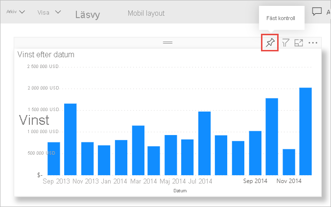

# Självstudie: Från Excel-arbetsbok till en rapport i Power BI-tjänsten till Microsoft Teams
Chefen vill se en rapport om dina senaste försäljningar och vinstsiffror i slutet av dagen. Men senaste data finns i olika tredjepartssystem och i filer på din bärbara dator. Tidigare har det tagit timmar att skapa visuella objekt och formatera en rapport, och du börjar bli nervös.

Inga problem. Med Power BI kan du skapa en otrolig rapport och dela den i Microsoft Teams på nolltid!

:::image type="content" source="media/service-from-excel-to-stunning-report/power-bi-financial-report-service.png" alt-text="Skärmbild av rapporten Finansiellt exempel":::

I den här självstudien laddar vi upp en Excel-fil, skapar en ny rapport och delar den med kollegor i Microsoft Teams – allt från Power BI. Du lär dig följande:

> [!div class="checklist"]
> * Förbered dina data i Excel.
> * Ladda ned exempeldata.
> * Skapa en rapport i Power BI-tjänsten.
> * Fäst rapportobjekten på en instrumentpanel.
> * Dela en länk till instrumentpanelen.
> * Dela instrumentpanelen i Microsoft Teams

## Förbereda data i Excel
Låt oss ta en enkel Excel-fil som exempel. 

1. Innan du kan läsa in din Excel-fil till Power BI, måste du organisera dina data i en platt tabell. I en platt tabell innehåller varje kolumn samma datatyp, till exempel text, datum, tal eller valuta. Tabellen ska ha en rubrikrad men inga kolumner eller rader som visar summor.

   

2. Därefter formaterar du dina data som en tabell. I Excel går du till fliken **Start** och gruppen **Format**. Välj **Formatera som tabell**. 

3. Välj ett tabellformat för kalkylbladet. 

   Excel-kalkylbladet är nu redo att läsas in till Power BI.

   

## Ladda upp din Excel-fil till Power BI-tjänsten
Power BI-tjänsten kan ansluta till flera datakällor, däribland Excel-filer som finns på din dator. 

 > [!NOTE] 
 > Om du vill följa resten av självstudierna laddar du ned [arbetsboken med finansiella exempel](https://go.microsoft.com/fwlink/?LinkID=521962).

1. Kom igång genom att logga in på Power BI-tjänsten. Om du inte har registrerat dig, [kan du göra det gratis](https://powerbi.com).
1. I **Min arbetsyta** väljer du **Ny** > **Ladda upp en fil**.

    :::image type="content" source="media/service-from-excel-to-stunning-report/power-bi-new-upload.png" alt-text="En skärmbild av panelen Ladda upp en fil.":::

1. Välj **Lokal fil**, bläddra till den plats där du sparade Excel-filen med finansexemplet och välj **öppna**.
7. På sidan **Lokal fil** väljer du **Importera**.

    Nu har du datauppsättningen Finansiellt exempel. Power BI skapade också en tom instrumentpanel automatiskt. Om du inte ser instrumentpanelen uppdaterar du webbläsaren.

    :::image type="content" source="media/service-from-excel-to-stunning-report/power-bi-financial-dataset.png" alt-text="Skärmbild av Min arbetsyta med datauppsättningen Finansiellt exempel.":::

2. Du vill skapa en rapport. I **Min arbetsyta** väljer du **Ny** > **Rapport**.

   

3. I dialogrutan **Välj en data uppsättning för att skapa en rapport** väljer du **Finansiellt exempel** datauppsättning > **Skapa**.

   

## Bygga upp din rapport
 
Rapporten öppnas i redigeringsvyn och visar den tomma rapportarbetsytan. På höger sida visas fönstren **Visualiseringar**, **Filter** och **Fält**. Din Excel-arbetsboks tabelldata visas i fönstret **Fält**. Överst är namnet på tabellen, **financials**. Under det visar Power BI kolumnrubrikerna som enskilda fält.

Ser du Sigma-symbolerna i fältlistan? Power BI har identifierat att dessa fält är numeriska. Power BI anger också ett geografiskt fält med en jordglob.

1. Om du vill ha mer plats för rapportarbetsytan väljer du **Minimera navigeringsrutan** och minimerar fönstret **Filter**.

    :::image type="content" source="media/service-from-excel-to-stunning-report/power-bi-hide-nav-pane.png" alt-text="Skärmbild av fönstret Minimera navigeringsrutan."::: 

1. Nu kan du börja skapa visualiseringar. Anta att chefen vill se vinsten över tid. I fönstret **Fält** drar du **Vinst** till rapportarbetsytan. 

   Som standard visas ett stapeldiagram med en kolumn i Power BI. 

    :::image type="content" source="media/service-from-excel-to-stunning-report/power-bi-profit-column.png" alt-text="Skärmbild av ett kolumndiagram med en kolumn.":::

3. Dra **Datum** till rapportarbetsytan. 

   Power BI uppdaterar stapeldiagrammet för att visa vinst per datum.

   

    December 2014 var den mest lönsamma månaden.
   
    > [!TIP]
    > Kontrollera dina aggregeringar om diagramvärdena ser inte ut som du förväntar dig. Till exempel kan du i källan **Värde** välja fältet **Vinst** som du just lade till och kontrollera att data aggregeras på det sätt du vill. I det här exemplet använder vi **Summa**.
    > 

### Skapa en karta

Chefen vill veta vilka länder som är mest lönsamma. Imponera på chefen med en kartvisualisering. 

1. Välj ett tomt område på rapportarbetsytan. 

2. Från fönstret **Fält** drar du fältet **Land** till rapportarbetsytan och drar sedan fältet **Vinst** till kartan.

   Power BI skapar ett visuellt kartobjekt med bubblor som representerar den relativa vinsten för varje plats.

   

    Det verkar som om de europeiska länderna slår de nordamerikanska länderna.

### Skapa ett visuellt objekt som visar försäljning

Vad sägs om att visa ett visuell objekt där man kan avläsa försäljning per produkt och marknadssegment? Enkelt. 

1. Välj den tomma arbetsytan.

1. I fönstret **Fält** markerar du fälten **Försäljning**, **Produkt** och **Segment**. 
   
   Power BI skapar ett grupperat kolumndiagram. 

2. Ändra diagramtypen genom att välja en av ikonerna i menyn **Visualiseringar**. Ändra till exempel till ett **stående stapeldiagram**. 

   

3. Om du vill sortera diagrammet väljer du **Fler alternativ** (…) > **Sortera efter**.

### Förbättra visualiseringarna

Gör följande ändringar på fliken **Format** i fönstret Visualiseringar.

:::image type="content" source="media/desktop-excel-stunning-report/power-bi-format-tab-visualizations.png" alt-text="Skärmbild som visar fliken Format i fönstret Visualiseringar.":::

1. Välj stapeldiagrammet **Vinst efter datum**. I avsnittet  **Rubrik** ändrar du **textstorleken** till **16 punkter**. Växla **Skugga** till **På**. 

1. Välj det stående stapeldiagrammet **Försäljning efter produkt och segment**. Ändra rubrikens **textstorlek** till **16 punkter** i avsnittet **Rubrik**. Växla **Skugga** till **På**.

1. Välj kartan **Vinst efter land**. Ändra **Tema** till **Gråskala** i avsnittet **Mappningsformat**. Ändra rubrikens **textstorlek** till **16 punkter** i avsnittet **Rubrik**. Växla **Skugga** till **På**.

## Fästa vid en instrumentpanel

Nu kan du fästa alla dina visuella objekt på den tomma instrumentpanel som Power BI skapat som standard. 

1. Håll muspekaren över visualiseringen och välj ikonen **Fäst visuell**.

   

1. Du måste spara din rapport innan du kan fästa visuell information på instrumentpanelen. Ge rapporten ett namn och välj **Spara**.
1. Fäst varje visuellt objekt på instrumentpanelen som Power BI skapade, **Finansiellt exempel.xlsx**.
1. När du fäster det sista visuella objektet väljer du **Gå till instrumentpanelen**.
1. Power BI har lagt till en platshållarpanel, Finansiellt exempel.xlsx, på instrumentpanelen automatiskt. Välj **Fler alternativ (...)**  > **Ta bort panel**.

    :::image type="content" source="media/service-from-excel-to-stunning-report/power-bi-tile-more-options.png" alt-text="Skärmbild av Fler alternativ för en panel.":::

1. Arrangera om och ändra storlek på panelerna hur du vill.

Instrumentpanelen och rapporten är klar.

## Dela en länk till instrumentpanelen

Nu är det dags att dela din instrumentpanel med chefen. Du kan dela din instrumentpanel och dess underliggande rapport med alla kollegor som har ett Power BI-konto. De kan interagera med rapporten men kan inte spara ändringar. Om du tillåter det kan de dela med andra eller bygga en ny rapport baserat på den underliggande datauppsättningen.

1. Om du vill dela din rapport väljer du **Dela** överst på instrumentpanelen.

   

2. På sidan **Dela instrumentpanel** anger du mottagarnas e-postadresser i rutan **Ange e-postadresser** och lägger till ett meddelande i rutan under den. 

3. Bestäm vilket av de här alternativen du vill ha, om några alls:

    - **Tillåt mottagare att dela din instrumentpanel**. 
    - **Låt mottagare skapa nytt innehåll från de underliggande datauppsättningarna**.
    - **Skicka en e-postavisering till mottagare.**

   

1. Välj **Dela**.

## Dela till Microsoft Teams

Du kan också dela rapporter och instrumentpaneler direkt till dina kollegor i Microsoft Teams.

1. Om du vill dela i Teams **Dela till Teams** överst på instrumentpanelen.

   

2. Power BI visar sidan dialogrutan **Dela till Teams**. Ange namnet på en person, grupp eller kanal och välj **Dela**. 
   
    :::image type="content" source="media/service-from-excel-to-stunning-report/power-bi-share-teams-dialog.png" alt-text="Skärmbild av dialogrutan Dela till Teams":::

3. Länken visas i **Inlägg** för den personen, gruppen eller kanalen.

   

## Nästa steg

* [Komma igång med Power BI-tjänsten](../fundamentals/service-get-started.md)
* [Kom igång med Power BI Desktop](../fundamentals/desktop-getting-started.md)
* [Grundläggande begrepp för designers i Power BI-tjänsten](../fundamentals/service-basic-concepts.md)

Har du fler frågor? [Testa Power BI Community](https://community.powerbi.com/).
