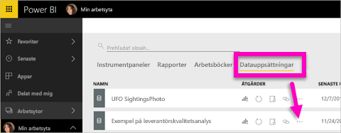
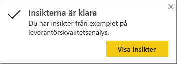
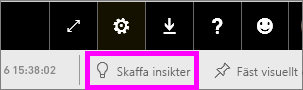
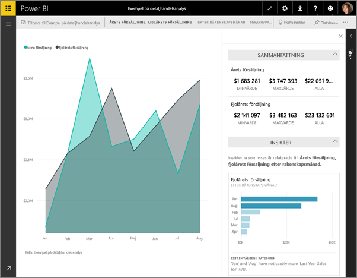

# Skapa datainsikter automatiskt med Power BI
Har du en ny datamängd och vet inte riktigt var du ska börja?  Behöver du skapa en instrumentpanel snabbt?  Vill du leta efter insikter som du kan ha missat?

Kör Quick Insights om du vill generera intressanta interaktiva visualiseringar utifrån dina data. Quick Insights kan köras på en hel datauppsättning (Quick Insights) eller på en specifik instrumentpanel (Scoped Insights). Du kan även köra insikter på en insikt!

> [!NOTE]
> Insights fungerar inte med DirectQuery – det fungerar bara med data som laddats upp till Power BI.
> 

Funktionen insikter bygger på en växande [uppsättning avancerade analytiska algoritmer](../consumer/end-user-insight-types.md) utvecklade tillsammans med Microsoft Research som vi kommer att fortsätta att använda så att flera användare kan söka efter insikter i sina data på nya och intuitiv sätt.

## Kör Quick Insights på en datauppsättning
Titta på när Amanda kör insikter på en datauppsättning, öppnar en insikt i Fokusläge, fäster en av dessa snabba insikter som en panel på sin instrumentpanel och sedan får insikter om en panel på instrumentpanelen.

<iframe width="560" height="315" src="https://www.youtube.com/embed/et_MLSL2sA8" frameborder="0" allowfullscreen></iframe>

Nu är din tur. Utforska insikter med hjälp av [exemplet för analys av leverantörskvalitet](sample-supplier-quality.md).

1. På fliken **Datamängder** väljer du **Fler alternativ** (…) och sedan **Få snabba insikter**.
   
    
   
    
2. Power BI använder [olika algoritmer](../consumer/end-user-insight-types.md) för att söka efter trender i datauppsättningen.
   
    
3. Dina insikter är klara inom några sekunder.  Välj **Visa insikter** för att visa visualiseringar.
   
    
   
    > [!NOTE]
    > Vissa datauppsättningar kan inte generera insikter eftersom data inte är statistiskt signifikanta.  Läs mer i [Optimera dina data för insikter](service-insights-optimize.md).
    > 
    
4. Visualiseringar visas i en särskild arbetsyta för **Quick Insights** med upp till 32 separata insiktskort. Varje kort har ett diagram eller graf samt en kort beskrivning.
   
    

## Interagera med Insight-korten

1. Hovra över ett kort och välj stiftikonen för att lägga till visualiseringen på en instrumentpanel.

2. Hovra över ett kort, välj **Fler alternativ** (…) och sedan **Visa insikter**. 

    Insiktsskärmen öppnas i fokusläge.
   
    
3. I Fokusläge kan du:
   
   * Filtrera visualiseringarna. Om fönstret **Filter** inte redan är öppet expanderar du det genom att välja pilen till höger i fönstret.

       
   * Fäst insiktskortet på en instrumentpanel genom att välja **Fäst visuell**.
   * Kör insikter på själva kortet, vilket ofta kallas för *omfångsbegränsade insikter*. I det övre högra hörnet väljer du glödlampsikonen  eller **Skaffa insikter**.
     
       
     
     Insikten visas till vänster och nya kort som endast baseras på data i denna enda insikt visas till höger.
     
       
4. Om du vill återgå till den ursprungliga arbetsytan för insikter väljer du **Avsluta Fokusläge** i det övre vänstra hörnet.

## Kör insikter på en panel på instrumentpanelen
I stället för att söka efter insikter mot en hel datamängd kan du begränsa sökningen till en omfångsbegränsad insikt om de data som används för att skapa en enskild instrumentpanelspanel. 

1. Öppna en instrumentpanel.
2. Hovra över en panel. Välj **Fler alternativ** (...) och sedan **Visa insikter**. Panelen öppnas i [Fokusläge](../consumer/end-user-focus.md) med detta insiktskort visat längst till höger.    
   
        
3. Fångar ett insiktskort ditt intresse? Välj insiktskortet för att gå djupare. Vald insikt visas till vänster och nya insiktskort som endast baseras på data i denna enda insikt visas till höger.    
4. Fortsätt utforska dina data och när du har hittat en intressant insikt fäster du den på instrumentpanelen genom att välja **Fäst visualisering** från det övre högra hörnet.

## Nästa steg
- Om du äger en datamängd [optimerar du den för Quick Insights](service-insights-optimize.md).
- Lär dig mer om [tillgängliga typer av Quick Insights](../consumer/end-user-insight-types.md).

Fler frågor? [Testa Power BI Community](https://community.powerbi.com/).
