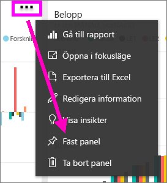
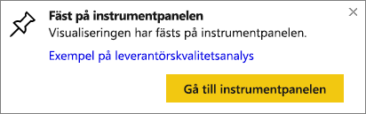

# Fästa en panel från en instrumentpanel till en annan instrumentpanelen
Ett sätt att lägga till en ny [instrumentpanel](../consumer/end-user-tiles.md) är genom att kopiera den från en annan instrumentpanel. Var och en av de här panelerna, när de klickas på, länkar tillbaka till där de skapades – antingen i frågor och svar eller i en rapport. 

> [!NOTE]
> Du kan inte fästa paneler från delade instrumentpaneler.

## Fäst en panel till en annan instrumentpanel
1. [Hämta data](../connect-data/service-get-data.md). Det här exemplet använder sig av [exemplet för IT-utgiftsanalys](sample-it-spend.md).
2. Öppna en [instrumentpanel](../consumer/end-user-dashboards.md).
3. Hovra över den panel du vill fästa, välj **Fler alternativ** (...) och sedan **Fäst panel**.  
   
   
4. Fäst panelen på en befintlig eller ny instrumentpanel. 
   
   * **Befintlig instrumentpanel**: Markera instrumentpanelens namn i listrutan.
   * **Ny instrumentpanel**: Skriv instrumentpanelens namn.
   
   
5. Välj **Fäst**.
   Genom ett meddelande (nära det övre högra hörnet) får du reda på att visualiseringen har lagts till, som en panel på den valda instrumentpanelen.
   
   
6. Välj **gå till instrumentpanel** för att se den fästa panelen. Härifrån kan du [byta namn, ändra storlek, länka och flytta](service-dashboard-edit-tile.md) den fästa visualiseringen.

## Nästa steg
[Paneler i Power BI](../consumer/end-user-tiles.md)  
[Instrumentpaneler i Power BI](../consumer/end-user-dashboards.md)  
Fler frågor? [Prova Power BI Community](https://community.powerbi.com/)
