# Skapa en rapport i Power BI-tjänsten genom att importera en datamängd
Du har läst [Rapporter i Power BI](../consumer/end-user-reports.md) och nu vill du skapa en egen. Det finns olika sätt att skapa en rapport. I den här artikeln börjar vi med att skapa en grundläggande rapport i Power BI-tjänsten från en Excel-datamängd. När du förstår grunderna för att skapa en rapport kan du gå igenom [Nästa steg](#next-steps) längst ned för att få mer avancerade rapportämnen.  

## Förutsättningar
- [Registrera dig för Power BI-tjänsten](../fundamentals/service-self-service-signup-for-power-bi.md). Information om att skapa rapporter med hjälp av Power BI Desktop finns i [Desktop-rapportvy](desktop-report-view.md). 
- [Ladda ned exempeldatamängden Försäljningsanalys för Excel](https://go.microsoft.com/fwlink/?LinkId=529778) och spara den till OneDrive för företag eller lokalt.

## Importera datauppsättningen
Den här metoden för att skapa en rapport som börjar med en datauppsättning och en tom rapportarbetsyta. Du kan följa exempeldatamängden Försäljningsanalys för Excel.

1. Vi kommer att skapa rapporten på en arbetsyta för Power BI-tjänsten, så välj en befintlig arbetsyta eller skapa en.
   
   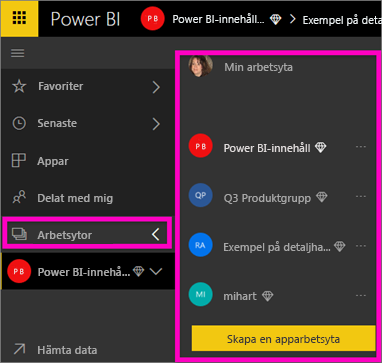
2. Välj **Hämta data** längst ned i navigeringsfönstret.
   
   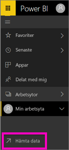
3. Välj **Arkiv**  och navigera till den plats där du sparade exemplet Säljanalys.
   
    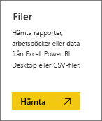
4. För den här övningen väljer vi **Importera**.
   
   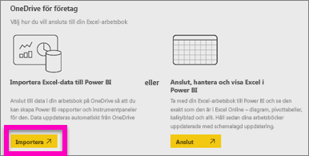
5. När du har importerat datauppsättningen väljer du **Visa datauppsättning**.
   
   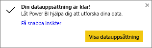
6. När du visar en datauppsättning öppnas rapportredigeraren.  Du ser en tom arbetsyta och rapportredigeringsverktygen.
   
   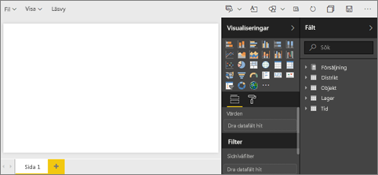

> [!TIP]
> Om du inte är bekant med rapportarbetsytan eller behöver gå igenom den igen kan du [Ta en rundtur i rapportredigeraren](service-the-report-editor-take-a-tour.md) innan du fortsätter.> 
> 

## Lägg till en radiell mätare i rapporten
Nu när vi har importerat vår datauppsättning kan vi börja svara på frågor.  Vår marknadschef (CMO) vill veta hur nära vi kommer att vara till att uppfylla det här årets försäljningsmål. En mätare är ett [bra visualiseringsval](../visuals/power-bi-report-visualizations.md) för att visa den här typen av information.

1. Välj **Sales (Försäljning)**  > **This Year Sales (Årets försäljning)**  > **Value (Värde)** i fönstret Fält.
   
    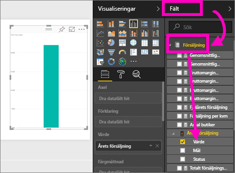
2. Omvandla det visuella objektet till en mätare genom att välja mätarmallen  från fönstret **Visualiseringar**.
   
    
3. Dra **försäljning** > **Årets försäljning** > **Mål** till brunnen **Målvärde**. Vi verkar vara mycket nära vårt mål.
   
    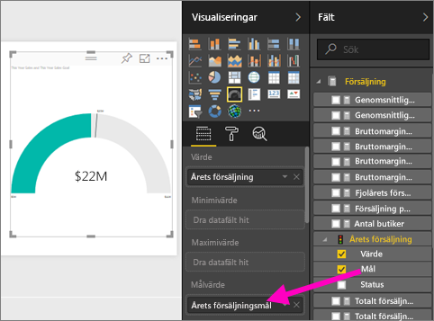
4. Det här är ett bra tillfälle att spara rapporten.
   
   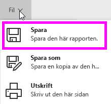

## Lägg till ett ytdiagram och utsnitt i rapporten
Vår marknadschef har några ytterligare frågor för oss att besvara. Hon vill veta hur försäljningen i år ser ut jämfört med förra året. Dessutom vill hon se resultatet per distrikt.

1. Först ska vi skapa lite utrymme på arbetsytan. Välj mätaren och flytta den till det övre högra hörnet. Tryck och dra ett av hörnet så att den blir mindre.
2. Avmarkera mätaren. Gå till rutan Fält och välj **Försäljning** > **Försäljning detta år** > **värdet** och välj **Försäljning** > **Försäljning förra året**.
   
    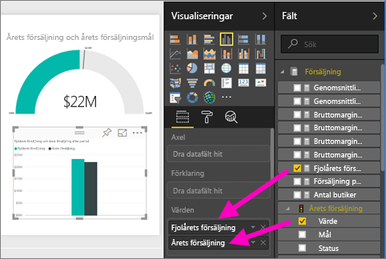
3. Omvandla det visuella objektet till ett ytdiagram genom att välja ytdiagrammallen  från fönstret **Visualiseringar**.
4. Välj **Tid** > **Period** till brunnen **Axel**.
   
    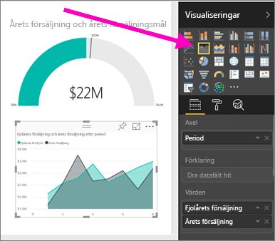
5. Om du vill sortera visualiseringen enligt tidsperiod, väljer du ellipserna och därefter **Sortera efter period**.
6. Nu ska vi lägga till utsnittet. Markera ett tomt område på arbetsytan och välj mallen Utsnitt  . Nu har vi ett tomt utsnitt på arbetsytan.
   
        
7. Välj **Distrikt** > **Distrikt** på fönstret Fält. Flytta och ändra storlek på utsticket.
   
      
8. Använd utsnittet för att leta efter mönster och insikter enligt distrikt.
   
     

Fortsätt att utforska dina data och lägga till visualiseringar. När du har hittat särskilt intressanta insikter [fäst dem på en instrumentpanel](service-dashboard-pin-tile-from-report.md).

## Nästa steg

* Lär dig hur du [fäster visualiseringar på en instrumentpanel](service-dashboard-pin-tile-from-report.md)   
* Fler frågor? [Prova Power BI Community](https://community.powerbi.com/)
