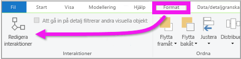
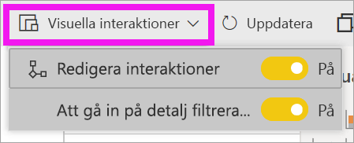

# Ändra hur visuella objekt interagerar i en Power BI-rapport
Om du har redigeringsbehörighet för en rapport kan du använda **Visuella interaktioner** för att ändra hur visualiseringar på en rapportsida påverkar varandra. 

## Introduktion till visuella interaktioner
Som standard kan visualiseringar på en rapportsida användas för korsfilter och korsmarkeringar i andra visualiseringar på sidan.
Du kan till exempel välja ett tillstånd i en kartvisualisering som visar kolumndiagrammet och filtrerar linjediagrammet till de data som gäller för detta tillstånd.
Se [Om filtrering och markering](power-bi-reports-filters-and-highlighting.md). Om du har en visualisering som stöder [detaljgranskning](../consumer/end-user-drill.md) så har detaljgranskning av en visualisering som standard ingen inverkan på andra visualiseringar på rapportsidan. Båda de här standardbeteendena kan åsidosättas och interaktioner kan anges per visualisering.

Den här artikeln visar hur du använder **visuella interaktioner** i Power BI Desktop. Processen är likadan i Power BI-tjänstens [Redigeringsvy](service-interact-with-a-report-in-editing-view.md). Om du bara har åtkomst till läsvyn eller om rapporten har delats med dig, kan du inte ändra inställningarna för visuella interaktioner.

Termerna *korsfiltrera* och *korsmarkera* används för att särskilja det beteende som beskrivs här från vad som händer när du använder fönstret **Filter** till att *filtrera* och *markera* visualiseringar.  

> [!NOTE]
> I den här videon används äldre versioner av Power BI Desktop och Power BI-tjänsten. 
>
>

<iframe width="560" height="315" src="https://www.youtube.com/embed/N_xYsCbyHPw?list=PL1N57mwBHtN0JFoKSR0n-tBkUJHeMP2cP" frameborder="0" allowfullscreen></iframe>

## Aktivera kontroller för visuell interaktion
Om du har redigeringsbehörighet i en rapport kan du aktivera de visuella interaktionskontrollerna och sedan anpassa hur visualiseringarna på rapportsidan filtrerar och markerar varandra. 

1. Välj en visualisering för att aktivera den.  
2. Visa alternativen för **Visuella interaktioner**.
    

    - På skrivbordet väljer du **Format > Interaktioner**.

        

    - Öppna rapporten i redigeringsvyn i Power BI-tjänsten och välj listrutan i rapportens menyrad.

        

3. Välj **Redigera interaktioner** för att se kontrollerna för visualiseringsinteraktion. Power BI lägger till ikoner för filtrering och markering i alla andra visualiseringar på rapportsidan. Vi kan se att trädkartan korsfiltrerar linjediagrammet och kartan, och att det korsmarkerar stapeldiagrammet. Nu kan du ändra hur den valda visualiseringen interagerar med andra visualiseringar på rapportsidan.
   
    

## Ändra interaktionsbeteende
Bekanta dig med hur visualiseringarna interagerar genom att välja en visualisering i taget på rapportsidan.  Välj en datapunkt, en stapel eller en figur och se hur det påverkar de andra visualiseringarna. Om du inte får önskat beteende kan du ändra interaktionerna. Ändringarna sparas i rapporten så du och dina rapportanvändare får samma visuella interaktionsupplevelse.

Börja med att välja en visualisering, så att den aktiveras.  Observera att alla övriga visualiseringar på sidan nu visar interaktionsikoner. Den fetstilta ikonen är den som används. Bestäm därefter vilken effekt den **valda visualiseringen** ska ha på de andra visualiseringarna.  Du kan också upprepa detta för alla andra visualiseringar på rapportsidan.

Om den valda visualiseringen ska:
   
   * korsfiltrera en av de andra visualiseringarna på sidan, så välj ikonen **Filter** i det övre högra hörnet av den visualiseringens .
   * korsmarkera en av de andra visualiseringarna på sidan, så välj **markeringsikonen**.
   * inte ska ha någon inverkan på någon av de andra visualiseringarna på sidan, så välj ikonen **ingen effekt**.

## Ändra interaktioner för visualiseringar som går att detaljgranska
[Vissa Power BI-visualiseringar kan detaljgranskas](../consumer/end-user-drill.md). När du ökar detaljnivån i en visualisering påverkar det som standard inte andra visualiseringar på rapportsidan. Men du kan ändra detta. 

> [!TIP]
> Prova själv med [PBIX-filen Exempel på personalfrågor](https://download.microsoft.com/download/6/9/5/69503155-05A5-483E-829A-F7B5F3DD5D27/Human%20Resources%20Sample%20PBIX.pbix). Där finns ett stapeldiagram med ökad detaljnivå på fliken **Nya anställningar**.
>

1. Välj det visuella objektet för att aktivera det. 

2. Öka detaljnivån genom att välja ikonen för ökad detaljnivå.

    

2. I menyraden väljer du **Format** > **Att gå in på detalj filtrerar andra visuella objekt**.  Nu när du ökar detaljnivån i en visualisering ändras de andra visualiseringarna på rapportsidan för att återspegla din aktuella detaljgranskningsmarkering. 

    

3. Om du inte får det beteende du vill ha, så kan du ändra interaktionerna [så som beskrivs ovan](#change-the-interaction-behavior).

## Överväganden och felsökning
Om du skapar en matris med fält från olika tabeller och försöker korsmarkera genom att markera flera objekt i flera nivåer i hierarkin så får du fel i de andra visuella objekten. 

    
## Nästa steg
[Filtrera och markera i Power BI-rapporter](power-bi-reports-filters-and-highlighting.md)