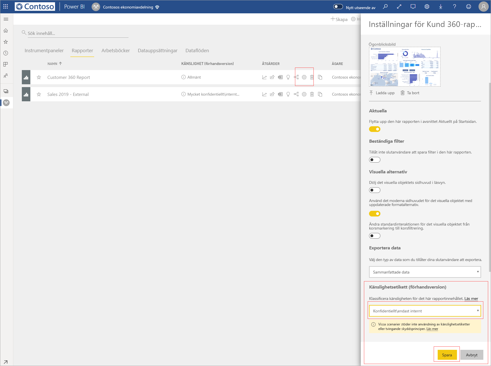

# Använda känslighetsetiketter för data i Power BI (förhandsversion)

När du aktiverar känslighetsetiketter i Power BI-tjänsten kan du skydda dina instrumentpaneler, rapporter, datamängder och dataflöden mot obehörig åtkomst och läckage genom att fästa datakänslighetsetiketter vid dem. När du märker upp dina data med rätt känslighetsetiketter ser du till att endast behöriga användare kan komma åt dem.

När du aktiverar dataskydd ser du känslighetsetiketter i känslighetskolumnen i listvyn för instrumentpaneler, rapporter, datamängder och dataflöden.

> [!NOTE]
> Du behöver särskilda licenser och behörighet för att kunna använda känslighetsetiketter för instrumentpaneler, rapporter, datamängder och dataflöden i Power BI. Mer information finns i [Använda känslighetsetiketter](#applying-sensitivity-labels).

## Använda känslighetsetiketter

Om du ska kunna använda känslighetsetiketter i Power BI måste du och din organisation uppfylla följande förutsättningar:

* Organisationen måste ha definierat känslighetsetiketter antingen i [säkerhetscentret för Microsoft 365](https://security.microsoft.com/) eller i [efterlevnadscentret för Microsoft 365](https://compliance.microsoft.com/).
* Du måste tillhöra en säkerhetsgrupp som har behörighet att använda känslighetsetiketter för data, enligt beskrivningen i artikeln [Aktivera känslighetsetiketter för data i Power BI (förhandsversion)](../admin/service-security-enable-data-sensitivity-labels.md#enable-data-sensitivity-labels).
* Du måste ha en Power BI Pro-licens och redigeringsbehörighet för de resurser du vill märka upp. 
* Du måste ha antingen licensen Premium P1 eller Premium P2 för Azure Information Protection. Du kan antingen köpa Microsoft Azure Information Protection separat eller via något av Microsofts licenspaket. Läs mer i [Prissättning för Azure Information Protection](https://azure.microsoft.com/pricing/details/information-protection/).

Om du vill tillämpa eller ändra en känslighetsetikett för en rapport klickar du på ikonen för rapportinställningar i arbetsytans listobjekt och går sedan till avsnittet för datakänslighet i sidopanelen med inställningar. Välj lämplig känslighetsetikett och spara inställningarna.

Du ser den uppdaterade känslighetsetiketten i känslighetskolumnen. 

Du kan tillämpa eller ändra en känslighetsetikett för en instrumentpanel på samma sätt som för rapporter. 

Du kan också ange känslighetsetiketter för datamängder och dataflöden. I den här bilden ser du hur du anger en känslighetsetikett för en datamängd. Stegen för dataflöden är liknande.

Om du vill ange en känslighetsetikett för en datamängd väljer du fliken Datamängder, klickar på de tre punkterna för datamängden du vill märka upp och väljer **Inställningar**.

På sidan Inställningar för datamängden går du till avsnittet för känslighetsetiketter, väljer önskad etikett och klickar på **Använd**.

Du kan tillämpa eller ändra en känslighetsetikett för ett dataflöde på samma sätt som för datamängder.

## Ta bort känslighetsetiketter
Om du vill ta bort en känslighetsetikett från en rapport, en instrumentpanel, en datamängd eller ett dataflöde följer du [samma procedur som används för att tillämpa etiketter](#applying-sensitivity-labels) men väljer **(Ingen)** när du uppmanas att klassificera känsligheten för data. 

## Dataskydd i exporterade filer

När du [exporterar data från en rapport](https://docs.microsoft.com/power-bi/consumer/end-user-export) som har en känslighetsetikett ärvs känslighetsetiketten av den genererade filen (Excel, PowerPoint och PDF, CSV stöds inte). Känslighetsetiketten syns i filen och åtkomsten till filen begränsas till de som har tillräcklig behörighet.

## Överväganden och begränsningar

Tänk på följande när du ska använda känslighetsetiketter för data:

* När du ska använda och visa känslighetsetiketter från Microsoft Information Protection i Power BI behöver du någon av licenserna Premium P1 eller Premium P2 för Azure Information Protection. Du kan antingen köpa Microsoft Azure Information Protection separat eller via något av Microsofts licenspaket. Läs mer i [Prissättning för Azure Information Protection](https://azure.microsoft.com/pricing/details/information-protection/).
* Du kan bara tillämpa känslighetsetiketter på instrumentpaneler, rapporter, datamängder och dataflöden.
* Arv av etiketter och skydd för exporterade filer stöds bara för Excel, PowerPoint och PDF-filer. Etiketter och skydd tillämpas inte när data exporteras till .CSV-filer, i e-postprenumerationer, för inbäddade visuella objekt eller vid utskrift.
* Användare som exporterar en fil från Power BI har behörighet att komma åt och redigera filen enligt inställningarna för känslighetsetiketten. Användaren som exporterar data får inte ägarbehörighet till filen. 
* Känslighetsetiketter är för närvarande inte tillgängliga för [sidnumrerade rapporter]( https://docs.microsoft.com/power-bi/paginated-reports-report-builder-power-bi) eller för arbetsböcker. 
* Känslighetsetiketter för Power BI-tillgångar visas bara i arbetsytelistan och i ursprungsvyn. Etiketter visas för närvarande inte i vyn Favoriter, Delas med mig, Nyheter eller Appar. Men även om du inte ser en etikett som tillämpats på en Power BI-tillgång så gäller den även efter export till Excel-, PowerPoint- eller PDF-format.
* Känslighetsetiketten *inställning för filkryptering*, som konfigureras antingen i [säkerhetscentret för Microsoft 365](https://security.microsoft.com/) eller i [efterlevnadscentret för Microsoft 365](https://compliance.microsoft.com/) gäller endast för filer som *exporteras från* Power BI, inte *inom* Power BI.
* [HYOK-skydd](https://docs.microsoft.com/azure/information-protection/configure-adrms-restrictions) stöds inte för de etiketter du använder i Power BI.
* Det finns [licenskrav](https://docs.microsoft.com/microsoft-365/compliance/sensitivity-labels-office-apps#subscription-and-licensing-requirements-for-sensitivity-labels) för att visa och använda etiketter i Office-appar.
* Känslighetsetiketter stöds bara för klientorganisationer i det globala (offentliga) molnet. Känslighetsetiketter stöds inte för klientorganisationer i andra moln.
* Känslighetsetiketter stöds inte för [externa användare (Azure Active Directory B2B-gästanvändare)](../service-admin-azure-ad-b2b.md). Det innebär att externa användare inte kan visa etiketter och att de blockeras från att exportera data till filer med formaten Excel, PDF och PPTX. [Ta bort etiketten](#removing-sensitivity-labels) om du vill att externa användare ska kunna exportera data till dessa filtyper.

## Nästa steg

I den här artikeln beskrivs hur du använder känslighetsetiketter för data i Power BI. De här artiklarna innehåller mer information om dataskydd i Power BI. 

* [Översikt över dataskydd i Power BI](../admin/service-security-data-protection-overview.md)
* [Aktivera känslighetsetiketter för data i Power BI](../admin/service-security-enable-data-sensitivity-labels.md)
* [Använda Microsoft Cloud App Security-kontroller i Power BI](../admin/service-security-using-microsoft-cloud-app-security-controls.md)