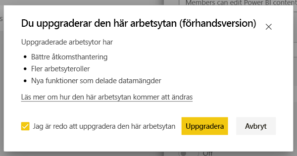
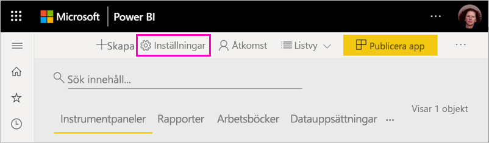
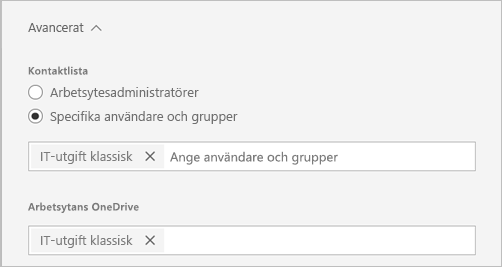
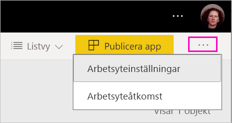
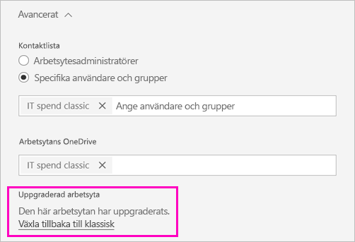

# Uppgradera klassiska arbetsytor till de nya arbetsytorna i Power BI

Den här artikeln beskriver hur du uppgraderar en klassisk arbetsyta till den nya arbetsytan. Du kan uppgradera vilken klassisk arbetsyta som helst. De nya arbetsytorna har mer detaljerade arbetsyteroller, vilket gör det enklare att hantera åtkomsten till innehåll. Du har mer flexibilitet när du hanterar uppgraderade arbetsytor, eftersom de är mer löst kopplade till sin ursprungliga Office 365-grupp. Lär dig mer om den [nya arbetsytan](../service-new-workspaces.md). 

>[!NOTE]
>Den här dokumentationen är en förhandsversion och beskriver en funktion som ännu inte är tillgänglig. Vi har publicerat detta för att du ska kunna förbereda dig för den nya funktionen och få svar på eventuella frågor som du har före lanseringen.  

Det kan dock finnas ändringar på din arbetsyta som du måste känna till och planera för. Innehållspaket stöds t.ex. inte på den nya arbetsytan. Se avsnittet [Uppgraderingsöverväganden och begränsningar](#upgrade-considerations-and-limitations) längre fram i den här artikeln.

## Saker att göra efter uppgraderingen

Du bör göra flera saker *när du har* uppgraderat. Det kan vara bra att planera detta *innan* du uppgraderar:
- Granska åtkomstlistan och förstå [behörigheterna efter uppgraderingen](#permissions-after-upgrade).
- Granska [kontaktlistan](#modify-the-contact-list) och se till att den är konfigurerad som du vill.
- Lär dig mer [om den nya arbetsytan](../service-new-workspaces.md) om du behöver det.

## Uppgradera en klassisk arbetsyta

Alla som är administratörer för arbetsytan kan uppgradera den. För klassiska arbetsytor måste du vara ägare till den underliggande Office 365-gruppen för att kunna vara administratör för arbetsytan. Följ nedanstående steg om du vill uppgradera en arbetsyta.

1. I arbetsytans innehållslista väljer du **Fler alternativ** ( **...** ) > **Redigera den här arbetsytan**.

    

1. Expandera **Avancerat** och välj **Uppgradera nu**.

    

1. Läs informationen i dialogrutan. Varningar visas om du har publicerat eller installerat innehållspaket i arbetsytan. När du är klar markerar du **Jag är redo att uppgradera den här arbetsytan**. Välj sedan **Uppgradera**.

    

2. Under uppgraderingen visas meddelandet **Uppgraderar**. Det tar vanligtvis mindre än en minut att uppgradera en arbetsyta.

1. När uppgraderingen är klar visas dialogrutan **Slutfört**. Vi rekommenderar att du läser [Organisera arbete på de nya arbetsytorna i Power BI](../service-new-workspaces.md), så att du vet hur nya arbetsytor skiljer sig från klassiska arbetsytor.

### Påverkan på andra användare av arbetsytan

Vi rekommenderar att du uppgraderar under en tid när få användare aktivt visar eller redigerar objekt i arbetsytan.

Användare som aktivt använder arbetsytan uppmanas att uppdatera sin webbläsare. Användare som redigerar en rapport får möjlighet att spara innan de uppdaterar.

## Överväganden och begränsningar vid uppgradering

- URL:er och ID:n för arbetsytan, innehållet som finns där och appen som publicerats från arbetsytan ändras inte. Innehåll från innehållspaket som är installerade på din arbetsyta hanteras separat. Mer information finns i [Innehållspaket under uppgradering](#content-packs-during-upgrade) i den här artikeln.
- Innehållspaket stöds inte på den nya arbetsytan. Läs avsnitten om [publicerade innehållspaket](#published-content-packs) eller [installerade innehållspaket](#installed-content-packs) för att lära dig mer om hur de hanteras under uppgraderingen. Vi rekommenderar att du tar bort innehållspaket som är installerade eller publicerade på din arbetsyta innan du uppgraderar.
- Office 365-gruppen för den klassiska arbetsytan påverkas inte av arbetsytans uppgradering i Power BI. Team, SharePoint-webbplatser, postlådor eller andra resurser som hanteras av Office 365 ändras inte. De förblir oförändrade när du har uppgraderat Power BI-arbetsytan. Office 365-gruppen finns kvar som tidigare.
- Det finns ändringar i hur din arbetsyta skyddas efter uppgraderingen. Mer information finns i avsnittet [Arbetsytans behörigheter efter uppgraderingen](#permissions-after-upgrade).
- Det finns en möjlighet att **gå tillbaka till en klassisk arbetsyta** om du behöver det. Men det går inte att återställa alla delar av arbetsytan till hur den var innan den uppgraderades. Om du börjar använda funktioner som endast finns i den nya arbetsytan, kan du inte göra någon återställning. Alternativet för återställning är tillgängligt i 30 dagar efter att du har uppgraderat.

## Behörigheter efter uppgraderingen

Välj **Åtkomst** på menyraden överst i arbetsytans innehållslista för att granska behörigheter efter uppgraderingen.

Varje Office 365-gruppägare läggs till individuellt i administratörsrollen för den uppgraderade arbetsytan. Själva Office 365-gruppen läggs till i en arbetsyteroll. Vilken roll den läggs till i beror på om den klassiska arbetsytan är *skrivskyddad* eller *inte skrivskyddad*:

- När arbetsytan är inställd på **Medlemmar kan redigera Power BI-innehåll** efter uppgraderingen, läggs Office 365-gruppen till i arbetsytans åtkomstlista med rollen **Medlem**.
- När arbetsytan är inställd på **Medlemmar kan bara läsa Power BI-innehåll** efter uppgraderingen, läggs Office 365-gruppen till i arbetsytans åtkomstlista med rollen **Läsare**.

Eftersom Office 365-gruppen tilldelas en roll i arbetsytan, kommer alla användare som läggs till i Office 365-gruppen efter uppgraderingen att ha den rollen i arbetsytan. Men om du lägger till nya ägare i Office 365-gruppen efter uppgraderingen, får de inte administratörsrollen för arbetsytan.

### Skillnader i roller före och efter uppgraderingen

Arbetsytans roller skiljer sig åt i de klassiska och nya arbetsytorna. I den nya arbetsytan kan du ge arbetsytans roller till Office 365-grupper, säkerhetsgrupper och distributionslistor.

- **Medlemmar** kan dela enskilda objekt och ge åtkomst till hela arbetsytan via rollerna Medlem, Deltagare eller Läsare
- **Läsare** kan bara se innehåll och kan inte exportera underliggande data eller analysera några datamängder från arbetsytan i Excel, såvida de inte har behörigheten Skapa.

Alla användare som har åtkomst till objekt i arbetsytan via delning eller appbehörighet fortsätter att ha åtkomst till dessa objekt. Alla som har åtkomst till arbetsytan har även åtkomst till appen som publicerats från arbetsytan. Dessa användare finns inte med i appens åtkomstlista.

Vi rekommenderar att du utvärderar om den nya rollen Deltagare bör användas. Efter uppgraderingen kan du ändra Office 365-gruppen till att få rollen Deltagare i åtkomstfönstret.

Efter uppgraderingen kan du skapa en säkerhets- eller Office 365-grupp eller en distributionslista för arbetsytans administratörer, i stället för att hantera åtkomst genom rolltilldelningar till enskilda användare.

Läs mer om [roller i de nya arbetsytorna](../service-new-workspaces.md#roles-in-the-new-workspaces).

## Licensiering efter uppgraderingen

Användare i rollerna Administratör, Medlem eller Deltagare måste ha en Power BI Pro-licens för att få åtkomst till arbetsytan.

Om arbetsytan finns i en delad kapacitet måste även användare i rollen Läsare ha en Power BI Pro-licens för att få åtkomst till arbetsytan. Om arbetsytan däremot finns i en Premium-kapacitet behöver användare i rollen Läsare ingen Pro-licens för att få åtkomst till arbetsytan.

## Andra funktioner i den nya arbetsytan

Den nya arbetsytan innehåller funktioner som de klassiska arbetsytorna saknar. En skillnad är möjligheten att ange en kontaktlista som skiljer sig från arbetsytans administratörer eller ägare. En likhet är att den fortfarande är ansluten till Office 365-gruppens SharePoint-dokumentbibliotek. 

### Ändra kontaktlistan

1. Välj **Inställningar** på menyraden överst i arbetsytans innehållslista för att få åtkomst till arbetsytans inställningar.

    

2. Under **Avancerat** är arbetsytans **Kontaktlista** konfigurerad som den Office 365-grupp som arbetsytan har uppgraderats från. Du kan lägga till fler användare eller grupper i kontaktlistan, eller byta till arbetsytans administratörer.

    

### Arbetsytans OneDrive 

Efter uppgraderingen är arbetsytans **OneDrive** ansluten till Office 365-gruppens SharePoint-dokumentbibliotek. Det här dokumentbiblioteket visas som alternativet **OneDrive** i **Hämta data > Filer**. Tänk på att det kan finnas användare av arbetsytan som saknar behörighet till det dokumentbiblioteket, om de inte är med i Office 365-gruppen.

## Innehållspaket under uppgraderingen

Den nya arbetsytan har inte något stöd för innehållspaket. I stället används appar och delade datamängder till att distribuera innehåll i arbetsytan. Vi rekommenderar att du tar bort publicerade eller installerade innehållspaket från arbetsytan innan du uppgraderar. Om det finns publicerade eller installerade innehållspaket när du uppgraderar, försöker uppgraderingsprocessen att bevara innehållet, enligt beskrivningen nedan.  Det går inte att återställa innehållspaket eller associationen för innehåll till innehållspaketet efter uppgraderingen.

### Publicerade innehållspaket

Innehållspaket som publicerats från arbetsytan tas bort under uppgraderingen. Du kan inte publicera eller uppdatera dem efter uppgraderingen, även om du återgår tillbaka till den klassiska arbetsytan. Om andra personer har installerat ditt innehållspaket i sina egna arbetsytor, ser de efter uppgraderingen en kopia av innehållspaketets innehåll i sina arbetsytor. Mer information finns i avsnittet om **installerade innehållspaket**.

### Installerade innehållspaket

När du uppgraderar din arbetsyta, eller om den arbetsyta som innehållspaketet publicerades från uppgraderas, sker viktiga ändringar i de installerade innehållspaketen. Efter uppgraderingen innehåller din arbetsyta en kopia av innehållet i innehållspaketet. Den är kopplad till den ursprungliga datamängden på den ursprungliga arbetsytan.

Det finns dock viktiga ändringar:

- Innehållet uppdateras inte längre om innehållspaketet uppdateras.
- URL:er och objektidentifierare ändras och kräver att bokmärken eller länkar som du har delat med andra uppdateras.
- Alla användaranpassningar av det ursprungliga innehållspaketet från din arbetsyta går förlorade. Anpassningar kan vara prenumerationer, aviseringar, personliga bokmärken, beständiga filter och favoriter.
- Det är inte säkert att nya användare har åtkomst till de datamängder som fanns i innehållspaketet. Du behöver kontakta datamängdens ägare för att se till att arbetsytans användare har åtkomst till datan.

## Gå tillbaka till en klassisk arbetsyta

Som en del av uppgraderingen har du möjlighet att gå tillbaka till en klassisk arbetsyta i 30 dagar efter uppgraderingen. Den här funktionen återställer associationen av arbetsytans innehåll till den ursprungliga Office 365-gruppen. Detta kan vara användbart om din organisation upplever större problem vid användningen av den nya arbetsytan. Det finns dock begränsningar. Läs [Att tänka på när du växlar tillbaka till klassiskt läge](#considerations-for-switching-back-to-classic) i den här artikeln först.

För att kunna gå tillbaka måste du vara ägare till Office 365-gruppen som arbetsytan var associerad med innan den uppgraderades. Gör så här:

1. I arbetsytans innehållslista väljer du **Fler alternativ** ( **...** ) > **Inställningar för arbetsyta**.

    

1. Expandera **Avancerat** och välj **Växla tillbaka till klassisk**. Om det här alternativet inte är tillgängligt kan du läsa [Att tänka på när du växlar tillbaka till klassiskt läge](#considerations-for-switching-back-to-classic) i den här artikeln.

    

1. När du är klar markerar du kryssrutan **Jag är redo att gå tillbaka till klassisk** och väljer **Växla till klassisk**. Varningar eller blockerare kan visas i den här dialogrutan. Läs [Överväganden för att växla tillbaka](#considerations-for-switching-back-to-classic) i den här artikeln om du stöter på de här problemen.

    

1. När växlingen är klar visas en bekräftelsedialogruta.

    

### Att tänka på när du växlar tillbaka till klassiskt läge

Du kan inte växla tillbaka om något av följande påståenden om din arbetsyta stämmer:

- Office 365-gruppen har tagits bort.
- Det har gått mer än 30 dagar sedan du uppgraderade.
- Datamängder i arbetsytan används av rapporter eller instrumentpaneler i andra arbetsytor. Varför händer detta? Anta att du har publicerat ett innehållspaket från arbetsytan före uppgraderingen och att någon har installerat innehållspaketet på en annan arbetsyta. Omedelbart efter uppgraderingen används datamängderna av rapporter och instrumentpaneler i det innehållspaketet.
- Arbetsytan ingår i en pipeline för livscykelhantering av program.
- Arbetsytan används för mallappar.
- Arbetsytan använder funktionen för stora modeller.
- Arbetsytan använder funktionen för nya användningsmått.

När du växlar tillbaka till en klassisk arbetsyta återställer du inte en exakt kopia av den ursprungliga arbetsytan. Följande ändringar inträffar:

- Behörigheter för arbetsytan anges av Office 365-gruppen som den uppgraderade arbetsytan ursprungligen var kopplad till.
  - Alla administratörer av Office 365-gruppen blir administratörer för den klassiska arbetsytan.
  - Alla medlemmar i Office 365-gruppen blir medlemmar i den klassiska arbetsytan. Om den klassiska arbetsytan var inställd på **Medlemmar kan bara läsa Power BI-innehåll**, återställs den här inställningen.
  - Alla användare eller användargrupper som har lagts till i arbetsytan efter att uppgraderingen har slutförts (utanför Office 365-gruppen) förlorar åtkomsten till arbetsytan. Lägg till dem i Office 365-gruppen för att ge dem åtkomst. Observera att Office 365-grupper inte tillåter kapsling av säkerhets- eller distributionsgrupper i medlemskapet.
  - Användare som har fått åtkomst till appen för arbetsytan fortsätter att ha åtkomst till appen.
  - Användare som har fått åtkomst till objekt i arbetsytan via delning fortsätter att ha åtkomst till dem.
- Innehållspaket som har publicerats från den klassiska arbetsytan före uppgraderingen återställs inte.
- Innehållspaket som har installerats på den klassiska arbetsytan före uppgraderingen återställs inte.
- Prenumerationer som har skapats av användare i arbetsytan efter uppgraderingen tas bort. Prenumerationer som fanns före uppgraderingen fortsätter att fungera som förväntat.
- Dataaviseringar bevaras inte. De tas bort.
- Om du har bytt namn på arbetsytan efter uppgraderingen återställs namnet på arbetsytan så att det matchar namnet på Office 365-gruppen.
- Pågående åtgärder som t.ex. uppdateringar påverkas inte av arbetsytans uppgradering.

## Hantera migrering till de nya arbetsytorna för din klientorganisation 

Vissa organisationer vill flytta många eller alla arbetsytor till den nya arbetsytan. Verktyget för uppgradering av arbetsytor är fokuserat på att arbetsytans administratörer ska kunna uppgradera. Organisationer som vill hantera en sådan process kan utföra följande steg.

1. I listan med arbetsytor i Power BI-administrationsportalen och motsvarande API finns alla arbetsytor i Power BI. Klassiska arbetsytor visas som typen Grupp i listan.
2. Uppgradera arbetsytorna tillsammans med enskilda Office 365-gruppägare, eller med din Office 365-administratör. Om du vill uppgradera arbetsytan måste du vara ägare till gruppen.

Uppgraderingsfunktionen för arbetsytan innehåller inte några verktyg för massuppdatering eller programmatisk uppdatering. Dessutom kommer nya Office 365-grupper som skapats i din organisation fortsätta att visas i Power BI. 
    

## Nästa steg
* [Skapa de nya arbetsytorna i Power BI](../service-create-the-new-workspaces.md)
* [Skapa klassiska arbetsytor](../service-create-workspaces.md)
* Har du några frågor? [Fråga Power BI Community](https://community.powerbi.com/)
