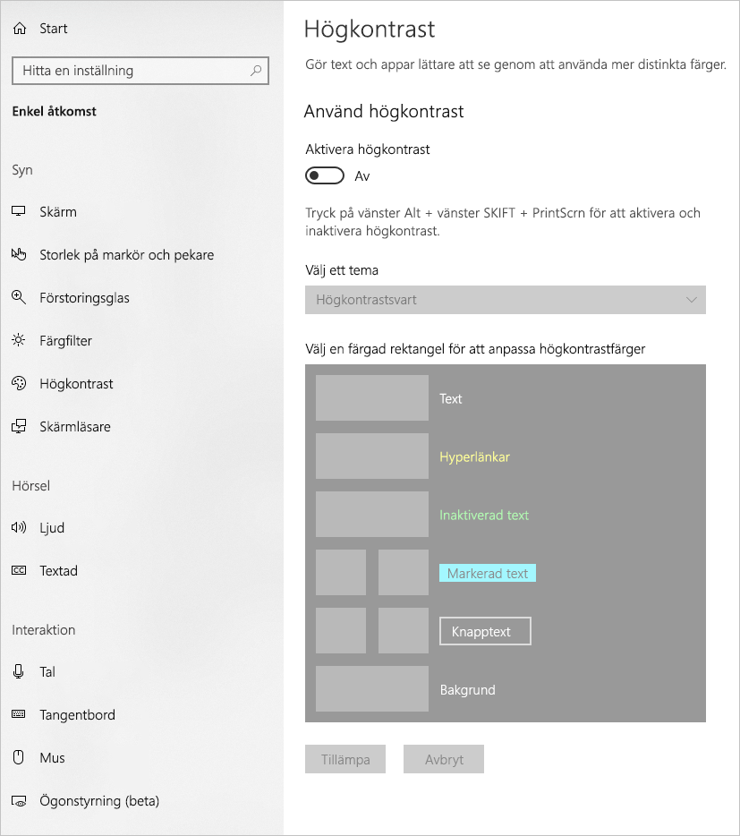
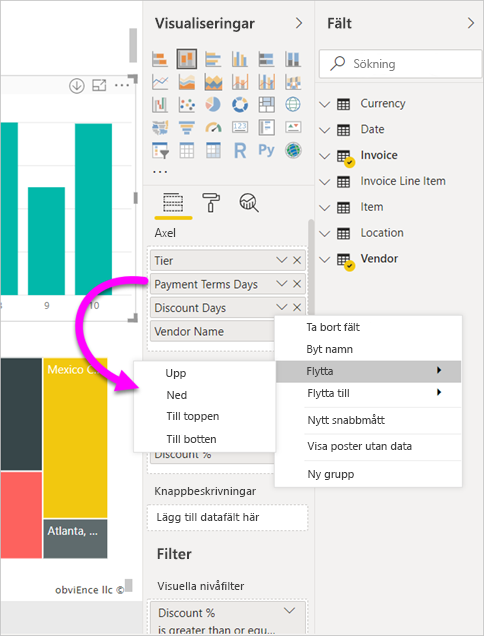
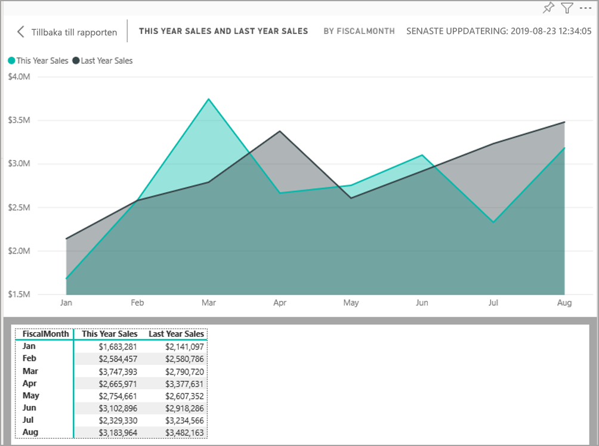

# Designa Power BI-rapporter med hjälpmedel
Du kan utforma och skapa engagerande rapporter som även är så tillgängliga som möjligt. Oavsett vilken målgrupp du skapar rapporten för så bör du se till att de kan användas av så många personer som möjligt, utan att de måste anpassas för en viss typ av specialdesign.

I den här artikeln beskrivs hjälpmedelsfunktionerna och verktygen för att skapa tillgängliga rapporter i Power BI.

I allmänhet rekommenderar vi att du aktiverar skanningsläge eller bläddrar bort när du använder Power BI med en skärmläsare.

Det finns en snabbmeny som förbättrar processen med att skapa rapporter med skärmläsare. Menyn gör att fält i brunnen kan flyttas uppåt och nedåt i listan **Fält**. På menyn går det även att flytta fältet till andra brunnar såsom **Förklaring** eller **Värde** eller andra.

## Typer av hjälpmedelsfunktioner

Power BI har funktioner för att skapa tillgängliga rapporter, men det är upp till dig som rapportförfattare att använda dem i dina rapporter. I den här artikeln beskrivs tre typer av hjälpmedelsfunktioner:

* Inbyggda hjälpmedelsfunktioner (som inte måste konfigureras)
* Inbyggda hjälpmedelsfunktioner (som måste konfigureras)
* Andra tips och överväganden

Vi går igenom var och en av de här kategorierna i följande avsnitt.

## Inbyggda hjälpmedelsfunktioner

Power BI har inbyggda hjälpmedelsfunktioner som rapportförfattaren inte behöver konfigurera. Här är en lista med funktionerna:

* Tangentbordsnavigering
* Kompatibilitet med skärmläsare
* Visning med högkontrastfärger
* Fokusläge
* Visa datatabell

Det finns också funktioner som underlättar användningen av rapporter. Du hittar artiklar som beskriver de här funktionerna i avsnittet [Nästa steg](#next-steps) i slutet av den här artikeln.

Nu ska vi gå igenom de olika inbyggda hjälpmedelsfunktionerna. 

### Tangentbordsnavigering

Som rapportförfattare behöver du inte tänka på om användarna kan använda tangentbordet till att navigera i en rapport. Det går att navigera i alla visuella Power BI-objekt med tangentbordet. Rapportanvändarna kan stega igenom datapunkter i visuella objekt, växla mellan sidflikar och komma åt interaktiva funktioner som korsmarkering, filtrering och utsnitt.

När en rapportanvändare navigerar i en rapport visas en fokusmarkering som anger var användaren befinner sig i rapporten. Beroende på vilken webbläsare som används kan fokusläget se annorlunda ut.

Du kommer åt de vanligaste kortkommandona genom att trycka på *?* för att visa en dialogruta med kortkommandon. Du kan läsa mer om tillgänglig användning och kortkommandon i avsnittet [Nästa steg](#next-steps) i slutet av den här artikeln.

### Kompatibilitet med skärmläsare

I allmänhet är alla objekt i Power BI som har tangentbordsnavigering också kompatibla med skärmläsare. När en rapportanvändare navigerar till ett visuellt objekt läser skärmläsaren upp rubriken, typen av visualisering och eventuell alternativ text om den har ställts in.

### Visning med högkontrastfärger

Power BI har stöd för hög kontrast i rapporter Om du använder ett högkontrastläge i Windows identifierar Power BI Desktop automatiskt vilket tema som används så att samma inställningar används i dina rapporter. Dessa högkontrastfärger följer med rapporten när den publiceras i Power BI-tjänsten eller någon annanstans.

Power BI-tjänsten försöker också identifiera högkontrastinställningarna som valts i Windows, men hur effektiv och korrekt identifieringen är beror på vilken webbläsare som används för Power BI-tjänsten. Om du vill ställa in temat manuellt i Power BI-tjänsten kan du välja **Visa > Högkontrastfärger** uppe till höger och sedan välja det tema du vill använda i rapporten.

### Fokusläge
Om en rapportanvändare tittar på ett visuellt objekt på en instrumentpanel kan de expandera det visuella objektet så att det tar upp större del av skärmen, genom att öppna snabbmenyn för objektet och välja **Öppna i fokusläge**.

### Visa datatabell
Rapportanvändare kan också visa data i ett visuellt objekt i tabellformat genom att trycka på **Alt + Skift + F11**. Den här tabellen fungerar ungefär som när du trycker på **Visa data** i snabbmenyn för det visuella objektet, men tabellen är anpassad för skärmläsare.

## Inbyggda hjälpmedelsfunktioner som måste konfigureras

Power BI har ett antal inbyggda hjälpmedelsfunktioner som rapportförfattaren måste konfigurera.  Här är några av funktionerna:

* Alternativtext
* Tabbordning
* Rubriker och etiketter
* Markörer
* Rapportteman

## Alternativtext

Alternativtext (alternativa textbeskrivningar) används till att beskriva hur visuella objekt och bilder på olika rapportsidor ser ut och fungerar. Rapportförfattare bör lägga till alternativ text för alla objekt som förmedlar meningsfull information i en rapport. Med hjälp av alternativtext kan alla som använder rapporten förstå vad du försöker förmedla med ett visuellt objekt, även om de inte kan se det visuella objektet, bilden, formen eller textrutan. Du kan ange alternativtext för alla objekt i en Power BI Desktop-rapport genom att markera objektet (till exempel ett visuellt objekt, en form eller liknande) och i rutan **Visualiseringar** välja avsnittet **Format**, expandera **Allmänt**, bläddra längst ned och fylla i textrutan **Alternativtext**. Text rutan **Alternativtext** har en övre gräns på 250 tecken.

Alternativtexten ska beskriva vilka insikter du vill att rapportanvändaren ska få av ett visuellt objekt. Eftersom en skärmläsare läser upp rubriken och det visuella objektets typ behöver du bara fylla i beskrivningen. Här är ett exempel på alternativtext för följande visuella objekt: *Nätanvändares nöjdhet per den sålda varans färg, med ytterligare uppdelning i klasser av produkter.*

Tänk på att det inte alltid är så bra att ta med specifika insikter eller datapunkter i alternativtexten, eftersom data i Power BI är dynamiska. Om du vill använda dynamisk alternativtext kan du läsa nästa avsnitt, som beskriver villkorsstyrd formatering för alternativtexten.

### Villkorsstyrd formatering för alternativtext

En av funktionerna som gör att Power BI sticker ut är att data i programmet är dynamiska. Du kan använda DAX-mått och villkorsstyrd formatering till att skapa dynamisk alternativtext. Skärmläsare kan då läsa upp värden som är specifika för de data som rapportanvändaren visar.

### Tabbordning
Genom att ställa in tabbordningen kan tangentbordsanvändare navigera i rapporten i en ordning som matchar hur visuella användare tar in objekten i rapporten. Om du har med dekorativa former och bilder i rapporten bör du ta bort dem från tabbordningen. 

Du ställer in tabbordningen genom att välja fliken **Vy** i menyfliksområdet och sedan knappen **Markeringsfönstret**.

I **Markeringsfönstret** väljer du **Tabbordning** så att du ser rapportens aktuella tabbordning. Du kan välja ett objekt och sedan använda upp- och nedåtpilarna till att flytta objektet i hierarkin, eller så kan du välja ett objekt med musen och dra det till den plats där du vill ha det i listan. Om du klickar på siffran bredvid ett objekt döljs objektet i tabbordningen.

### Rubriker och etiketter
Det är viktigt med rubriker för visuella objekt och rapportsidor så att rapportanvändarna kan orientera sig. Undvik att använda förkortningar eller jargong i rapportrubrikerna. Om du delar rapporten med en ny användare eller någon utanför organisationen kanske inte personen vet vad dina termer eller förkortningar betyder. I den här bilden ser du ett visuellt objekt med en förkortning i rubriken (till vänster), och en tydligare rubrik för det visuella objektet till höger.

Se till att alla rubriker, axeletiketter, förklaringar och dataetiketter i dina visuella objekt är lätta att läsa och förstå. Jämför de här bilderna, där den första bilden har ett litet antal siffror och databeskrivningar medan den andra har många.

När det gäller dataetiketter kan du till och med välja att aktivera eller inaktivera etiketterna för varje serie i ditt visuella objekt, eller placera dem ovanför eller under en serie. Power BI försöker placera dataetiketter ovanför eller under en rad, men ibland blir det inte särskilt tydligt. I det här visuella objektet är dataetiketterna hopblandade och inte särskilt lätta att läsa.

Det kan hjälpa att placera dataetiketterna ovanför eller under serien, särskilt om du använder ett linjediagram med flera linjer. Med några få justeringar ser dataetiketterna mycket bättre ut.

### Markörer

Ett bra tips är att inte endast förmedla information med hjälp av färger (inklusive villkorsstyrd formatering av funktioner). I stället kan du använda markörer till att utmärka olika serier.

För linjediagram, ytdiagram, visuella kombinationsobjekt, punktdiagram och bubbeldiagram kan du aktivera markörer och använda olika markörer för varje linje.

Aktivera markörer genom att välja området Format i fönstret Visualiseringar, expandera området **Former**, rulla ned till reglaget **Markörer** och ändra det till **På** som i följande bild. 

Du kan också använda **Anpassa serier** och välja namnet på varje rad (eller område om du använder ett ytdiagram) från listrutan i avsnittet Former. Under listrutan kan du justera många aspekter av markören för den valda linjen, inklusive dess form, färg och storlek.

Även om vi rekommenderar att rapportförfattare använder dataetiketter och markörer så kan det vara störande och göra rapporten mindre tillgänglig om du använder de här funktionerna för samtliga visuella objekt. I följande bild kan du jämföra ett visuellt objekt med dataetiketter och markörer aktiverade, och sedan en mer begriplig version utan dataetiketter.

Om du inte är säker på om det visuella objektet eller rapporten sinkas av dataetiketterna kan du prova att göra ett [kisningstest](https://chrome.google.com/webstore/detail/the-squint-test/gppnipfbappicilfniaimcnagbpfflpg).  Om ögonen dras mer till etiketterna än till datapunkterna så ska du stänga av dataetiketterna.

### Teman, kontrast och färger anpassade för färgblinda

Du bör se till att dina rapporter har tillräcklig kontrast mellan texten och eventuella bakgrundsfärger. I villkor 1.4.3 i WCAG 2.1 anges att text och bakgrundsfärg ska ha ett kontrastförhållande på minst 4,5:1. Det finns flera verktyg, som [Color Contrast Analyzer](https://developer.paciellogroup.com/resources/contrastanalyser/), [WebAIM](https://webaim.org/resources/contrastchecker/) och [Accessible Colors](https://accessible-colors.com/), som du kan använda till att kontrollera färgerna i rapporten.

Tänk också på att vissa rapportanvändare kan ha problem med färgseendet. Verktyg som [Coblis](https://www.color-blindness.com/coblis-color-blindness-simulator/) och [Vischeck](https://www.vischeck.com/vischeck/vischeckImage.php) simulerar vad rapportanvändare med olika typer av färgnedsättning ser.  Om du använder färre färger eller en monokrom palett i rapporten kan du undvika att skapa rapporter som inte är tillgängliga.

Vissa färgkombinationer är särskilt svåra att urskilja för användare som har problem med färgseendet. Här är några sådana kombinationer: 

* grönt och rött
* grönt och brunt
* blått och lila
* grönt och blått
* ljusgrönt och gult
* blått och grått
* grönt och grått
* grönt och svart

Undvik att använda dessa färger i samma diagram eller på samma rapportsida. Power BI har några inbyggda teman som hjälper dig att göra rapporten mer tillgänglig, men det är även bra om du kontrollerar rapporten i några av verktygen som föreslås i den här artikeln.

## Tips och överväganden
Det här avsnittet innehåller vägledning, tips och överväganden som du bör ha i åtanke när du skapar tillgängliga rapporter.

### Förstå vad målgruppen vill ha

Att skapa en rapport är en iterativ process. Innan du börjar placera ut visuella objekt på sidan kan du prata med några av rapportanvändarna så att du får bättre förståelse för vilken information de vill få ut av rapporten, och hur de vill se den.  

Att bygga in hjälpmedel bör ingå i den här processen. Du kanske får veta att din vision inte stämmer med rapportanvändarnas. När du har förberett ett första utkast till rapporten kan du visa det för en rapportanvändare och samla in mer feedback. Om du samlar in feedback som rapportförfattare kan du undvika att missnöjda användare överhopar dig med förslag på ändringar senare.

### Håll rapporten enkel och konsekvent

Håll rapporten så enkel som möjligt. Det är vanligt att försöka få in så mycket information som möjligt i ett visuellt objekt. Det blir ofta enklare att ta till sig informationen om du delar upp den i flera visuella objekt. Överväg att använda flera visuella objekt om de visar upp olika aspekter av dina data, och skapa en rikare upplevelser med hjälp av filter och visuella interaktioner. Samtidigt bör du hålla antalet visuella objekt på en och samma sida till ett minimum. Försök att undvika onödig redundans och plottriga sidor. Du behöver inte två visuella objekt som egentligen visar samma sak. Rapportanvändarna kan bli överväldigade av att försöka ta in mängder av information från för många visuella objekt, eller så kan uppmärksamheten bli lidande så att de distraheras. Det här gör inte bara rapporten enklare att använda, men om du har för många visuella objekt på samma sida kan även rapportens prestanda försämras.

Håll rapporten konsekvent genom att använda samma teckenfärg och format för de visuella elementen i rapporten. Använd samma teckenstorlek för alla visuella titlar, precis som du bör göra för dataetiketter och axelrubriker. Om du använder utsnitt på flera rapportsidor behåller du dem på samma plats på varje sida i rapporten.

### Testa för nedsatt syn

Ett snabbt sätt att testa hur en rapport skulle se ut för användare med nedsatt syn är att sänka ljusstyrkan på skärmen eller din mobila enhet.  Det finns tillägg för webbläsare som du kan använda för att göra kisningstest.

## Checklista för hjälpmedel i rapporter

Förutom verktyg och funktioner för tillgänglighet så har Power BI följande checklista som du kan använda när du skapar rapporter. Den här checklistan hjälper dig att se till att dina rapporter är tillgängliga för så många som möjligt innan du publicerar dem. 

### Alla visuella objekt

* Se till att färgkontrasten mellan bakgrunden och texten i rubriker, axeletiketter och dataetiketter är minst 4,5:1.
* Undvik att endast förmedla information med hjälp av färger. Använd text eller ikoner för att komplettera eller ersätta färgerna.
* Undvik onödig jargong och förkortningar.
* Lägg till **alternativtext** för alla informativa visuella objekt på sidan.
* Kontrollera att rapportsidan fungerar för användare med sämre färgseende.

### Utsnitt
* Om du har en samling med flera utsnitt på rapportsidorna ser du till att designen är konsekvent mellan olika sidor. Använd samma teckensnitt, färger och avstånd där det är möjligt.

### Textruta
* Se till att färgkontrasten mellan teckensnitt och bakgrund är minst 4,5:1.
* Lägg till innehåll i rutan **alternativtext** så att skärmläsare kan läsa dem.

### Visuella interaktioner
* Är viktig information endast tillgänglig via en interaktion? I så fall bör du ordna om dina visuella objekt så att de förfiltreras och de viktiga slutsatserna framgår tydligare.
* Använder du bokmärken för navigering? Försök att navigera i rapporten med ett tangentbord för att se till att upplevelsen är acceptabel för användare som endast använder tangentbord.

### Sorteringsordning
* Har du ställt in sorteringsordningen för varje visuellt objekt på sidan? I den tillgängliga tabellen **Visa data** ser du sorteringsordningen du har angett för det visuella objektet.

### Knappbeskrivningar
* Förmedla inte viktig information i knappbeskrivningar. Användare med motoriska problem och användare som inte använder mus har svårare att komma åt dem.
* Lägg till knappbeskrivningar i diagram som extrainformation. Sådan information finns med i den tillgängliga tabellen **Visa data** för varje visuellt objekt.

### Video
* Undvik video som startar automatiskt när sidan återges.
* Se till att videon har undertexter eller en transkription.

### Ljud
* Undvik ljud som startar automatiskt när sidan återges.
* Tillhandahåll en transkription för alla ljuduppspelningar.

### Former
* Se till att alla dekorativa former är markerade som dolda i tabbordningen, så att skärmläsare inte läser upp dem.
* Använd inte för många dekorativa former, de kan lätt bli störande.
* När du använder former till att framhäva datapunkter ska du använda **alternativtext** till att förklara vad som framhävs.

### Bilder
* När du använder bilder till att framhäva datapunkter ska du använda **alternativtext** till att förklara vad som framhävs.
* Se till att alla dekorativa bilder är markerade som dolda i tabbordningen, så att skärmläsare inte läser upp dem.
* Använd inte för många dekorativa bilder, de kan lätt bli störande.

### Visuella objekt för Power BI
* Kontrollera visuella Power BI-objekt i den tillgängliga tabellen **Visa data**. Om informationen som visas inte räcker kan du leta efter ett annat visuellt objekt.
* Om du använder det anpassade visuella objektet *Uppspelningsaxel* ska du se till att den inte spelas upp automatiskt. Gör det uppenbart att användaren måste trycka på knappen Spela upp/pausa för att starta/stoppa uppspelningen av värdena.

### Över visuella objekt på sidan
* Ställ in tabbordningen och stäng av tabbordningen för dekorativa objekt (markera dem som dolda).

## Överväganden och begränsningar
Det finns några kända problem och begränsningar hos hjälpmedelsfunktionerna. Beskrivningar av dessa problem och begränsningar finns i följande lista:

* När du använder skärmläsare med **Power BI Desktop** får du bästa möjliga upplevelse om du öppnar skärmläsaren innan du öppnar filer i **Power BI Desktop**.

## Nästa steg

Här är samlingen med artiklar om hjälpmedel i Power BI:

* [Översikt över hjälpmedel i Power BI](desktop-accessibility-overview.md) 
* [Använda Power BI-rapporter med hjälpmedel](desktop-accessibility-consuming-tools.md)
* [Skapa Power BI-rapporter med hjälpmedel](desktop-accessibility-creating-tools.md)
* [Kortkommandon för hjälpmedel i Power BI-rapporter](desktop-accessibility-keyboard-shortcuts.md)
* [Checklista för hjälpmedel i rapporter](#report-accessibility-checklist)
