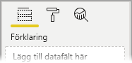
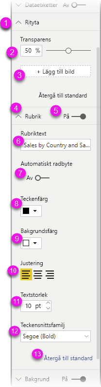
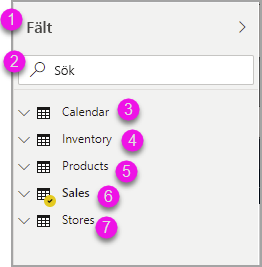
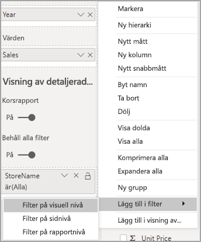
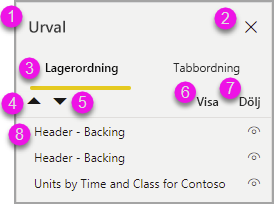

# Skapa rapporter i Power BI med hjälpmedel

Det finns många inbyggda hjälpmedelsverktyg i Power BI som hjälper dig att skapa rapporter.

I den här artikeln beskrivs de många hjälpmedelsverktyg som är tillgängliga när du ska skapa rapporter i Power BI Desktop.

## Navigering på appnivå
När du navigerar i Power BI Desktop kan du flytta fokus till appens olika huvudområden genom att trycka på **Ctrl + F6**. Växlingen av fokusområden i Power BI Desktop sker i följande ordning:

1. Objekt på arbetsytan
2. Sidflikar
3. Fönster (vart och ett separat, och från vänster till höger för de som är öppna)
4. Vynavigatören
5. Sidfot
6. Logga in
7. Gult fält för varningar/fel/uppdateringar

I de flesta fall använder du **Enter** till att välja eller aktivera ett område och sedan **Esc** till att lämna det i Power BI.

## Navigering i menyfliksområden

Tryck på **Alt** för att se de små rutorna som kallas *tangenttips* över de kommandon som är tillgängliga i den aktuella vyn i menyfliksområdet. Sedan kan du trycka på den bokstav som visas i *tangenttipset* över det kommando du vill använda. 

I den här bilden har användaren tryckt på knappen **Alt** för att visa tangenttips med bokstäver för de tillgängliga kommandona. Om du skulle trycka på **M** öppnas fliken **Modellering** i menyfliksområdet.

Beroende på vilken bokstav du trycker på kan du se ytterligare tangenttips. Om till exempel fliken **Start** är aktiv och du trycker på **W** visas fliken **Visa** tillsammans med tangenttipsen för grupperna i menyfliksområdet **Visa**. Du kan fortsätta att trycka på bokstäverna som visas i tangenttipsen tills du trycker på bokstaven för det kommando du vill använda. Tryck på **Esc** för att gå till föregående uppsättning tangenttips. Om du vill avbryta åtgärden och dölja tangenttipsen igen trycker du på **Alt**.

## Navigering i fönster med visuella objekt

För att navigera i fönstret **Visualiseringar** måste du först se till att fokus är i fönstret genom att trycka på **Ctrl + F6** tills du når fönstret. När en användare navigerar till fönstret Visualiseringar hamnar fokus först på rubriken. Flikordningen visas i följande bild med början uppifrån:

1. Rubriken
2. Symbolen för expandering/komprimering
3. Den första visuella ikonen

När du kommer till visualiseringarna kan du navigera till ett visst visuellt objekt med piltangenterna och trycka på **Enter** för att välja det. Om du använder en skärmläsare talar den om ifall du har skapat ett nytt diagram och vilken typ det är, eller om du har ändrat ett diagram av en viss typ till en annan typ av diagram. 

Efter avsnittet med visuella objekt i fönstret flyttas fokus sedan till pivoteringarna som i följande bild.

När fokus är på pivoteringarna leder tabbning bara till ikonen för det valda fönstret. Använd piltangenterna om du vill växla till andra fönster.

## Fältkälla

När fokus är på pivoteringarna i fönstret, så som beskrivs i föregående avsnitt, flyttar du fokus till **fältkällan** när du trycker på Tabb. 

I **fältkällan** är fokusordningen så här:

* varje källas rubrik (första)
* följt av ett angivet fält i varje källa (nästa)
* listruteknappen för att öppna fältmenyn (efter det)
* sedan borttagningsknappen (sista)

Du ser fokusordningen i den här bilden.

En skärmläsare skulle läsa upp källans namn och knappbeskrivning. För varje fält i en källa läser skärmläsaren upp fältnamnet och dess knappbeskrivning. Om en källa är tom ska fokus hamna på hela den tomma källan. Skärmläsaren ska då läsa upp källans namn, knappbeskrivning och att den är tom.

När fältmenyn är öppen kan du navigera i den med hjälp av **Tabb** och **Skift + Tabb**, eller **upp-**  / **nedpilarna**. En skärmläsare skulle läsa upp alternativnamnen.

Om du vill flytta ett fält från en bucket i fältkällan till en annan bucket kan du använda tangentbordet och alternativet **Flytta** på menyn för fältkällan, som du ser i bilden.

## Formatfönstret

Fokus ordningen för fönstret **Formatering** är uppifrån och ned i kortordningen. Fokus hamnar på kortets namn och sedan på **på/av**-knappen om kortet har en sådan. När fokus är på kortnamnet skulle en skärmläsare läsa upp kortets namn och om kortet är expanderat eller komprimerat. Du kan trycka på **Enter** för att expandera eller komprimera kortet. Du kan också använda **Enter** till att ange **På** eller **Av**.

Om ett kort är öppet använder du **Tabb** till att växla mellan kortets kontroller innan du fortsätter till nästa kort. För kontroller i ett kort skulle en skärmläsare läsa upp rubriken, det aktuella värdet och kontrollens typ.  

## Navigering i listan Fält

Du kan trycka på **Tabb** för att navigera i listan **Fält**. Om tabellerna är komprimerade växlar fokusordningen så här, ungefär som i fönstret Formatering:

1. Rubriken i listan **Fält**
2. Sökfältet
3. Respektive tabellnamn

Om du vill expandera alla tabeller i **fältkällan** trycker du på **Alt + Skift + 9**. Om du vill komprimera alla tabeller trycker du på **Alt + Skift + 1**. Om du vill expandera en enskild tabell trycker du på **högerpil**. Om du vill expandera en enskild tabell trycker du på **vänsterpil**. Om en tabell är expanderad kan du tabba för att navigera mellan de fält som visas i listan, ungefär som i fönstret Formatering. En skärmläsare skulle läsa upp om en tabell är expanderad eller komprimerad.

Du kan markera ett fält genom att gå till det önskade fältet och trycka på **Enter**.   En skärmläsare skulle läsa upp vilket fält som är i fokus och om fältet är markerat eller omarkerat.

De som använder mus drar och släpper normalt fält till arbetsytan eller till önskad filterbucket. Om du vill använda tangentbordet kan du lägga till ett fält i en filterbucket genom att trycka på **Skift + F10** för att öppna fältets snabbmeny, använda piltangenterna för att navigera till **Lägg till i filter** och sedan trycka på **Enter** för den typ av filter som du vill lägga till fältet i.

## Navigering i fönstret Urval
Fönstret **Urval** har följande fokusordning:

1. Rubriken
2. Knappen Avsluta
3. Växlaren för lager-/tabbordning
4. Knappen Flytta upp i lager
5. Knappen Flytta ned i lager
6. Knappen Visa
7. Knappen Dölj
8. Objekt

Du kan tabba genom fokusordningen och trycka på **Enter** för att välja elementen du är intresserad av.  

När du kommer till växlaren för lager-/tabbordning använder du vänster och höger pilknapp till att växla mellan lagerordning och tabbordning.

När du kommer till objekten i fönstret **Urval** trycker du på **F6** för att aktivera fönstret **Urval**. När du har aktiverat fönstret **Urval** kan du använda navigera mellan objekten i fönstret **Urval** med upp- och nedpilen.
När du har navigerat till önskat objekt kan du utföra några olika åtgärder:

* Tryck på **Ctrl + Skift + S** för att dölja/visa ett objekt
* Tryck på **Ctrl + Skift + F** för att flytta ett objekt uppåt i lagerordningen
* Tryck på **Ctrl + Skift + B** för att flytta ett objekt nedåt i lagerordningen
* Tryck på **Ctrl + blanksteg** för att välja flera objekt

## Dialogrutor i Power BI Desktop

Alla dialogrutor i Power BI Desktop kan öppnas via tangentbordet och fungerar med skärmläsare.

Här är några av dialogrutorna i Power BI Desktop:

* Dialogrutan Snabbmått
* Dialogrutan Villkorsstyrd formatering och datastaplar
* Dialogruta för Frågor och svar-utforskaren
* Dialogruta för Komma igång
* Dialogruta för Arkiv-menyn och Om
* Varningsfältet
* Dialogrutan för Filåterställning
* Dialogrutan för Frowns

## Stöd för hög kontrast

När du använder högkontrastlägen i Windows används dessa inställningar och paletten du väljer även i rapporter i Power BI Desktop.

Power BI Desktop identifierar automatiskt vilket högkontrasttema som används i Windows och tillämpar de inställningarna i dina rapporter. Dessa högkontrastfärger följer med rapporten när den publiceras till Power BI-tjänsten, eller någon annanstans.

## Nästa steg

Här är samlingen med artiklar om hjälpmedel i Power BI:

* [Översikt över hjälpmedel i Power BI](desktop-accessibility-overview.md) 
* [Skapa tillgängliga Power BI-rapporter](desktop-accessibility-creating-reports.md) 
* [Använda rapporter i Power BI med hjälpmedel](desktop-accessibility-consuming-tools.md)
* [Kortkommandon för hjälpmedel i Power BI-rapporter](desktop-accessibility-keyboard-shortcuts.md)
* [Checklista för hjälpmedel i rapporter](desktop-accessibility-creating-reports.md#report-accessibility-checklist)

