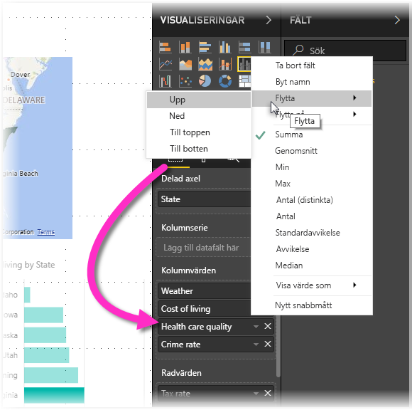

# Hjälpmedel i Power BI Desktop-rapporter
Power BI har funktioner som gör att personer med funktionshinder enklare kan använda och interagera med Power BI-rapporter. Dessa funktioner omfattar att använda en rapport med tangentbordet eller en skärmläsare, använda tabbtangenten för att fokusera på olika objekt på en sida och en medveten användning av markörer i visuella objekt.

## Använda en Power BI Desktop-rapport med ett tangentbord eller en skärmläsare
Från och med **Power BI Desktop**-versionen från september 2017 kan du trycka på tangenten **?** för att visa ett fönster som beskriver tillgängliga kortkommandon i **Power BI Desktop**.

Med hjälpmedelsförbättringar kan du använda en Power BI-rapport med ett tangentbord eller en skärmläsare med följande metoder:

När du visar en rapport bör du stänga av skanningsläget.

Du kan växla mellan flikar i rapporten eller objekt på en viss rapportsida med **Ctrl + F6**.

* När fokus ligger på *flikar i rapporten* kan du använda *tabb-* eller *pil*tangenterna för att flytta fokus från en rapport till nästa. Rubriken på rapportsidan och om den är markerad kan läsas av skärmläsaren. Om du vill läsa in sidan för närvarande under fokus, använder du tangenten *Retur* eller *Blanksteg*.
* När fokus är på en laddad *rapportsida* använder du *tabbtangenten* för att byta fokus på varje objekt på sidan, vilket omfattar alla textrutor, former och diagram. Skärmläsaren läser typen av objekt, objektets rubrik om det har en och en beskrivning av objektet om det har tillhandahållits av rapportens författare. 

Om du vill interagera med visuella objekt ytterligare när du navigerar mellan dem trycker du på **Alt + Skift + F10** för att flytta fokus till rubriken som innehåller olika alternativ som t.ex. sortering, exportering av data bakom diagrammet och fokusläge. 

Du kan trycka på **Alt + Skift + F11** för att presentera en tillgänglig version av fönstret *Visa data*. Det gör att du kan utforska de data som används i det visuella objektet i en HTML-tabell med hjälp av samma kortkommandon som du vanligtvis använder i skärmläsaren. 

> [!NOTE]
> Funktionen Visa data är bara tillgängligt för en skärmläsare via det här kortkommandot. Om du öppnar Visa data via alternativet i sidhuvudet för visuella objekt kommer det inte att vara tillgängligt för en skärmläsare. När du använder Visa data aktiverar du skanningsläget och drar nytta av alla skärmläsarens snabbtangenter.

Från och med juli 2018-versionen av **Power BI Desktop** har utsnitt också inbyggda funktioner för tillgänglighet. När du väljer ett utsnitt kan du ändra utsnittets värde genom att använda CTRL + högerpil (kontroll plus högerpilen) om du vill flytta mellan de olika kontrollerna i utsnittet. När du t.ex. först trycker på CTRL+högerpil hamnar fokus på suddgummit, och om du trycker på blankstegstangenten ger det samma resultat som att klicka på suddgummit, varvid utsnittets alla värden raderas. 

Du kan flytta mellan kontrollerna i ett utsnitt genom att trycka på tabbtangenten. Om du trycker på tabbtangenten på suddgummit flyttas du till den nedrullningsbara knappen. Om du trycker på tabbtangenten en gång till flyttas du till det första värdet i utsnittet (om det finns flera värden för utsnittet, t.ex. ett intervall). 

Dessa hjälpmedelstillägg har skapats så att användarna kan använda Power BI-rapporter fullständigt med hjälp av skärmläsare och tangentbordet.

## Tips för att skapa rapporter med hjälpmedel
Följande tips kan hjälpa dig att skapa mer tillgängliga **Power BI Desktop**-rapporter.

### Allmänna tips för rapporter med hjälpmedel

* För **linjediagram**, **ytdiagram**, och **kombinationsdiagram** visuella, samt **punktdiagram** och **bubbeldiagram** kan du aktivera markörer och använda olika *markörer* för varje rad.
  
  * Aktivera *markörer* genom att välja området **Format** i rutan**Visuella objekt**, expandera området **Former** och rulla ned till **Markörer** och ändra dem till *På*.
  * Välj sedan namnet på varje rad (eller område om du använder ett **yt**diagram) från listrutan i avsnittet **Former**. Under listrutan kan du justera många aspekter av markören för den valda linjen, inklusive dess form, färg och storlek.
  
  
  
  * Med hjälp av en annan *Markör* för varje linje är det enklare för rapportanvändare att skilja linjer (eller områden) från varandra.
* Som uppföljning till den tidigare punkten bör du inte använda färg för att förmedla information. Förutom att använda former i rad-och punktdiagram bör du inte använda villkorsstyrd formatering för att tillhandahålla insikter i tabeller och matriser. 
* Välj en avsiktlig sorteringsordning för varje visuellt objekt i rapporten. När användaren av skärmläsaren navigerar bland data bakom diagrammet väljer den samma sorteringsordning som det visuella objektet.
* Välj ett *tema* med hög kontrast och som är anpassat för färgblinda från temagalleriet och importera det med förhandsversionsfunktionen [**Teman**](desktop-report-themes.md).
* Ange en *alternativtext* för varje objekt i en rapport. På så sätt kan användare av din rapport förstå vad du försöker kommunicera med ett visuellt objekt, även om de inte kan se det visuella objektet, bilden, formen eller textrutan. Du kan ange *Alternativtext* för alla objekt på en **Power BI Desktop**-rapport genom att markera objektet (till exempel ett visuellt objekt, en form o.s.v.) och i rutan **Format** välja **Visualiseringar**, expandera **Allmänt**, bläddra längst ned och fylla i textrutan **Alternativtext**.
  
  
* Kontrollera att dina rapporter har tillräcklig kontrast mellan texten och alla bakgrundsfärger. Det finns flera verktyg som t.ex. [Färgkontrastanalys](https://developer.paciellogroup.com/resources/contrastanalyser/) som du kan använda för att kontrollera färgerna i rapporten. 
* Använd textstorlek och teckensnitt som enkelt kan läsas. Liten textstorlek eller teckensnitt som kan vara svåra att läsa är olämpliga för hjälpmedel.
* Inkludera en rubrik, axeletiketter och dataetiketter i all visuell information.
* Använd beskrivande rubriker för alla rapportsidor.
* Undvik dekorativa former och bilder i rapporten om det är möjligt, eftersom de ingår i rapportens tabbordning. Om du behöver inkludera dekorativa objekt i rapporten kan du uppdatera objektets alternativa text så att användare av skärmläsare vet att de används i dekorationssyfte.

### Ordna objekt i Fält-buckets
Från och med oktober 2018-versionen av **Power BI Desktop**, kan brunnen **fält** även navigeras i med ett tangentbord och interagerar med skärmläsare. 

För att förbättra processen med att skapa rapporter med skärmläsare, är en snabbmeny tillgänglig för att tillåta flyttning av fält i brunnen uppåt eller nedåt i listan **fält** eller flytta fältet till andra källor, till exempel **förklaring**eller **värde** eller andra.

## Stöd för hög kontrast med rapporter

När du använder högkontrastlägen i Windows används dessa inställningar och paletten som du väljer även i rapporter i **Power BI Desktop**. 

**Power BI Desktop** identifierar automatiskt vilket högkontrasttema som används i Windows och tillämpar dessa inställningar på dina rapporter. Dessa högkontrastfärger följer med rapporten när den publiceras till Power BI-tjänsten, eller någon annanstans.

Power BI-tjänsten försöker också identifiera högkontrastinställningarna som valts i Windows, men hur effektiv och korrekt identifieringen är beror på vilken webbläsare som används för Power BI-tjänsten. Om du vill ange temat manuellt i Power BI-tjänsten kan du välja **Visa > Högkontrastfärger** och sedan välja det tema som du vill använda för rapporten.

När du arbetar i **Power BI Desktop** kan du se att vissa områden, t.ex. **Visualiseringar** och **Fält**, inte matchar de Windows-scheman med högkontrastfärger som du valt.

## Överväganden och begränsningar
Det finns några kända problem och begränsningar hos hjälpmedelsfunktionerna som beskrivs i följande lista:

* När du använder skärmläsare med **Power BI Desktop** får du bästa möjliga upplevelse om du öppnar skärmläsaren innan du öppnar filer i Power BI Desktop.
* Om du använder Skärmläsaren finns vissa begränsningar när du bläddrar i Visa data som en HTML-tabell.

## Kortkommandon
Kortkommandon är till hjälp för att flytta runt i Power BI-rapporter med hjälp ett tangentbord. Följande tabeller beskriver genvägar som finns tillgängliga i en Power BI-rapport. Förutom att använda de här kortkommandona i Power BI Desktop så fungerar de även i följande upplevelser:

* Dialogruta för Frågor och svar-utforskaren
* Dialogruta för Komma igång
* Dialogruta för Arkiv-menyn och Om
* Varningsfältet
* Dialogrutan för Filåterställning
* Dialogrutan för Frowns

I vår fortsatta strävan efter att förbättra hjälpmedel så stöder även den tidigare listan med upplevelser även stöd för skärmläsare och högkontrastinställningar.

### Vanliga kortkommandon
| Gör så här:           | Tryck på                |
| :------------------- | :------------------- |
| Flytta fokus mellan avsnitt  | Ctrl + F6 |
| Flytta fokus framåt i avsnittet | Tab         |
| Flytta fokus bakåt i avsnittet | Skift + Tabb |
| Markera eller avmarkera ett objekt | Retur eller blanksteg |
| Flerval av objekt | Ctrl + blanksteg |

### På det visuella objektet
| Gör så här:           | Tryck på                |
| :------------------- | :------------------- |
| Flytta fokus till menyn för det visuella objektet | Alt + Skift + F10 |
| Visa data | Alt + Skift + F11  |

### Fönsternavigering
| Gör så här:           | Tryck på                |
| :------------------- | :------------------- |
| Öppna en snabbmeny | <ul><li>Windows-tangentbordet: Windows-menytangenten + F10.  Windows-menytangenten ligger mellan den vänstra Alt-tangenten och Vänsterpil-tangenten</li><li>Annat tangentbord: Skift + F10</li></ul> |

### Utsnitt
| Gör så här:           | Tryck på                |
| :------------------- | :------------------- |
| Interagera med ett utsnitt | Ctrl + Högerpil-tangenten |

### Markeringsfönstret
| Gör så här:           | Tryck på                |
| :------------------- | :------------------- |
| Aktivera markeringsfönstret | F6 |
| Flytta upp ett objekt i lagringen | Ctrl + Skift + F |
| Flytta ned ett objekt i lagringen | Ctrl + Skift + B |
| Dölj / visa (växla) ett objekt | Ctrl + Skift + S |

### DAX-redigerare
| Gör så här:           | Tryck på                |
| :------------------- | :------------------- |
| Flytta raden upp / ned | Alt + Uppåtpil-tangenten / Nedåtpil-tangenten |
| Kopiera rad upp / ned | Skift + Alt + Uppåtpil-tangenten / Nedåtpil-tangenten |
| Infoga linje nedan | Ctrl + Retur |
| Infoga linje ovan | Ctrl + Skift + Retur |
| Gå till matchande hakparentes | Ctrl + Skift + \ |
| Dra in / dra ut rad | Ctrl + ] / [ |
| Infoga markören | Alt + klicka |
| Välj aktuell rad | Ctrl + I |
| Välj alla förekomster av aktuellt val | Ctrl + Skift + L |
| Välj alla förekomster av aktuellt ord | Ctrl + F2 |

## Nästa steg
* [Använda rapportteman i Power BI Desktop (förhandsversion)](desktop-report-themes.md)

