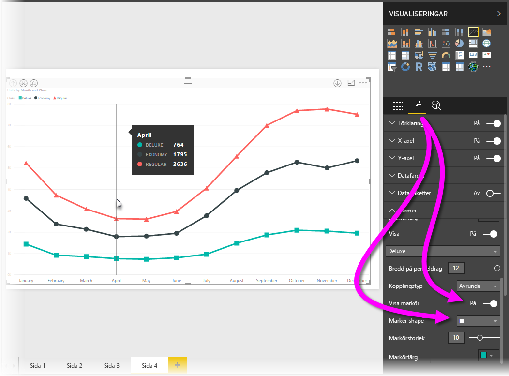
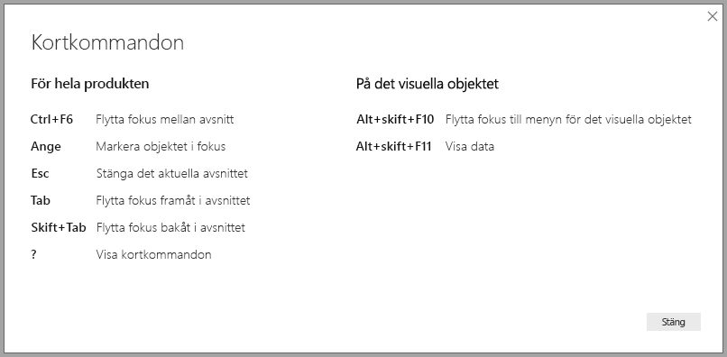
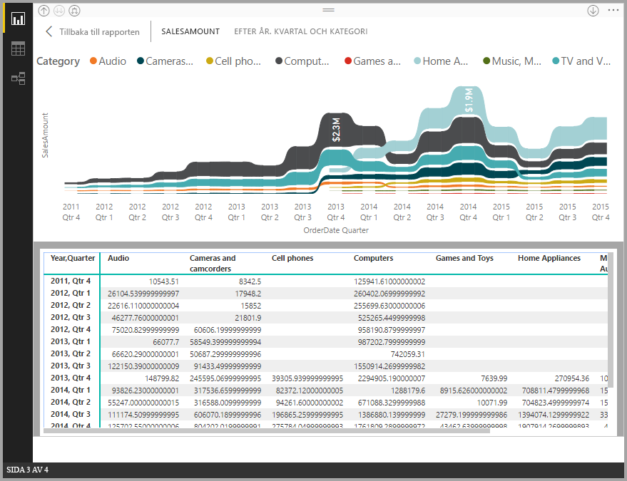
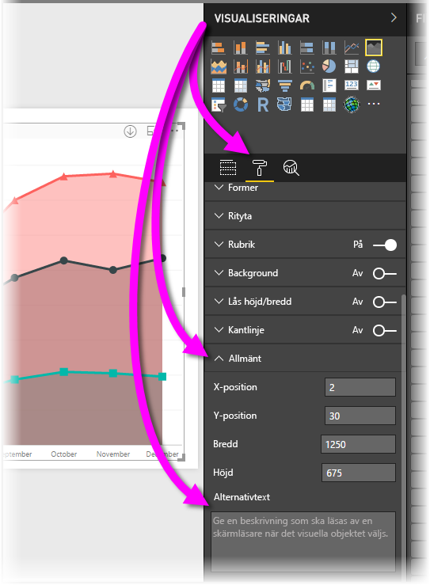

# Hjälpmedel i Power BI Desktop-rapporter
**Power BI Desktop** har funktioner som gör att personer med funktionshinder enklare kan använda och interagera med **Power BI Desktop**-rapporter. Dessa funktioner omfattar att använda en rapport med tangentbordet eller en skärmläsare, använda tabbtangenten för att fokusera på olika objekt på en sida och en medveten användning av markörer i visuella objekt.

> [!NOTE]
> Dessa hjälpmedelsfunktioner medföljer **Power BI Desktop**-versionen från juni 2017 och senare versioner. Ytterligare funktioner för tillgänglighet planeras för framtida lanseringar.
> 
> 

## Använda en Power BI Desktop-rapport med ett tangentbord eller en skärmläsare
Från och med **Power BI Desktop**-versionen från september 2017 kan du trycka på tangenten **?** för att visa ett fönster som beskriver tillgängliga kortkommandon i **Power BI Desktop**.

Med hjälpmedelsförbättringar kan du använda en **Power BI Desktop**-rapport med ett tangentbord eller en skärmläsare med följande metoder:

Du kan växla mellan flikar i rapporten eller objekt på en viss rapportsida med **Ctrl + F6**.

* När fokus ligger på *flikar i rapporten* kan du använda *tabb-* eller *pil*tangenterna för att flytta fokus från en rapport till nästa. Rubriken på rapportsidan och om den är markerad kan läsas av skärmläsaren. Om du vill läsa in sidan för närvarande under fokus, använder du tangenten *Retur* eller *Blanksteg*.
* När fokus är på en laddad *rapportsida* använder du *tabbtangenten* för att byta fokus på varje objekt på sidan, vilket omfattar alla textrutor, former och diagram. Skärmläsaren läser typen av objekt och en beskrivning av objektet som tillhandahålls av författaren. 

Du kan trycka på **Alt-Shift+F10** för att flytta fokus till en visuell meny.

Du kan trycka på **Alt + Skift + F11** för att presentera en tillgänglig version av fönstret *Se data*.

Dessa hjälpmedelstillägg har skapats så att användarna kan använda **Power BI Desktop** rapporter fullständigt med hjälp av skärmläsare och tangentbordet.

## Tips för att skapa rapporter med hjälpmedel
Följande tips kan hjälpa dig att skapa mer tillgängliga **Power BI Desktop**-rapporter.

* För **linjediagram**, **ytdiagram**, och **kombinationsdiagram** visuella, samt **punktdiagram** och **bubbeldiagram** kan du aktivera markörer och använda olika *markörer* för varje rad.
  
  * Aktivera *markörer* genom att välja området **Format** i rutan**Visuella objekt**, expandera området **Former** och rulla ned till **Markörer** och ändra dem till *På*.
  * Välj sedan namnet på varje rad (eller område om du använder ett **yt**diagram) från listrutan i avsnittet **Former**. Under listrutan kan du justera många aspekter av markören för den valda linjen, inklusive dess form, färg och storlek.
  
  
  
  * Med hjälp av en annan *Markör* för varje linje är det enklare för rapportanvändare att skilja linjer (eller områden) från varandra.
* Som uppföljning till den tidigare punkten bör du inte använda färg för att förmedla information. Det är praktiskt att använda former på linjerna (markörer, enligt beskrivningen i föregående punkter).
* Välj ett *tema* med hög kontrast och som är anpassat för färgblinda från temagalleriet och importera det med förhandsversionsfunktionen [**Teman**](desktop-report-themes.md).
* Ange en *alternativtext* för varje objekt i en rapport. På så sätt kan användare av din rapport förstå vad du försöker kommunicera med ett visuellt objekt, även om de inte kan se det visuella objektet, bilden, formen eller textrutan. Du kan ange *Alternativtext* för alla objekt på en **Power BI Desktop**-rapport genom att markera objektet (till exempel ett visuellt objekt, en form o.s.v.) och i rutan **Format** välja **Visualiseringar**, expandera **Allmänt**, bläddra längst ned och fylla i textrutan **Alternativtext**.
  
  
* Kontrollera att dina rapporter har tillräcklig kontrast mellan texten och alla bakgrundsfärger.
* Använd textstorlek och teckensnitt som enkelt kan läsas. Liten textstorlek eller teckensnitt som kan vara svåra att läsa är olämpliga för hjälpmedel.
* Inkludera en rubrik, axeletiketter och dataetiketter i all visuell information.

## Överväganden och begränsningar
Det finns några kända problem och begränsningar hos hjälpmedelsfunktionerna som beskrivs i följande lista:

* JAWS stöds i rapporter som visas i **Power BI-tjänsten**, inklusive inbäddade rapporter. JAWS stöds även i **Power BI Desktop**, men du måste öppna skärmläsaren innan du öppnar **Power BI Desktop**-filer för att skärmläsningen ska fungera korrekt.

## Nästa steg
* [Använda rapportteman i Power BI Desktop (förhandsversion)](desktop-report-themes.md)

