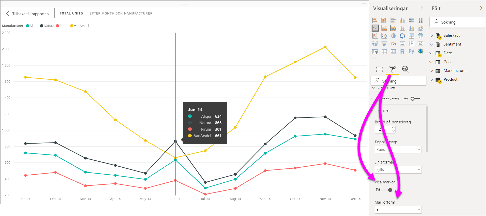
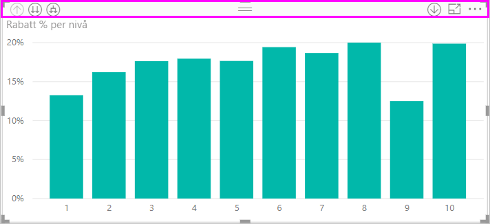
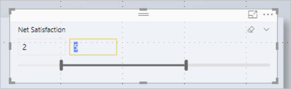
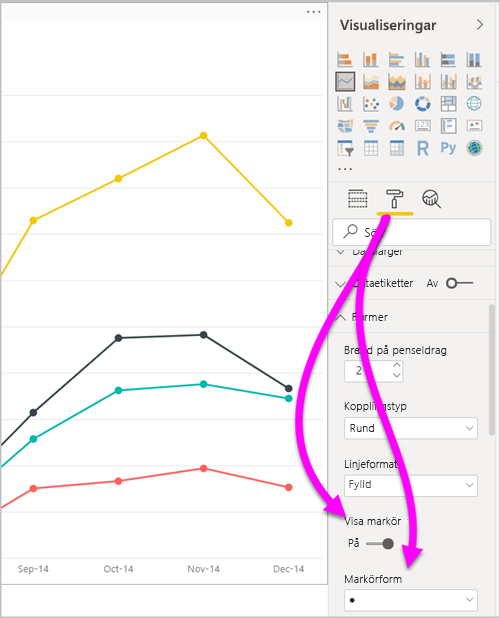
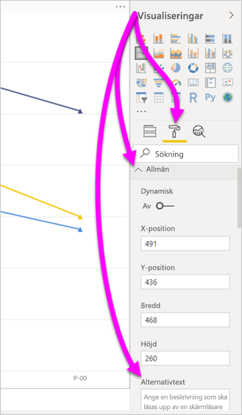
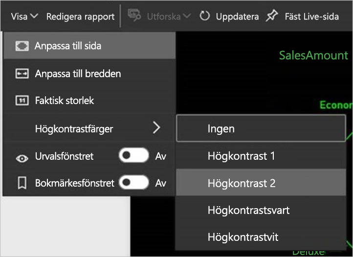

# Hjälpmedel i Power BI Desktop-rapporter
Power BI har funktioner som gör att personer med funktionshinder enklare kan använda och interagera med Power BI-rapporter. Dessa funktioner omfattar att använda en rapport med tangentbordet eller en skärmläsare, använda tabbtangenten för att fokusera på olika objekt på en sida och en medveten användning av markörer i visuella objekt.

## Använda en Power BI Desktop-rapport med ett tangentbord eller en skärmläsare
Från och med **Power BI Desktop**-versionen från september 2017 kan du trycka på tangenterna **Skift + ?** för att visa ett fönster som beskriver kortkommandon för hjälpmedel i **Power BI Desktop**.

Med hjälpmedelsförbättringar kan du använda en Power BI-rapport med ett tangentbord eller en skärmläsare med följande metoder:

> [!NOTE]
> När du visar en rapport bör du stänga av skanningsläget.

Du kan växla fokus mellan flikar på rapportsidor eller objekt på en viss rapportsida med **Ctrl + F6**.

* När fokus ligger på flikar på rapportsidor använder du **Tabb** eller **piltangenterna** för att flytta fokus från en rapportsida till nästa. Skärmläsaren läser upp rapportsidans rubrik och huruvida den är markerad. Om du vill läsa in den rapportsida som för närvarande är i fokus använder du tangenten **Retur** eller Blanksteg.
* När fokus ligger på en inläst rapportsida använder du tangenten **Tabb** för att växla fokus till varje objekt på sidan, vilket omfattar alla textrutor, bilder, former och diagram. Skärmläsaren läser upp objekttypen och objektets rubrik (om det finns en sådan). Skärmläsaren läser även upp en beskrivning av det objektet om en sådan tillhandahålls av rapportens författare. 

När du navigerar mellan visuella objekt kan du trycka på **Alt + Skift + F10** för att flytta fokus till det visuella objektets rubrik. Det visuella objektets rubrik innehåller olika alternativ, till exempel sortering, export av diagrammets underliggande data samt fokusläge. 

Du kan trycka på **Alt + Skift + F11** för att presentera en version av fönstret **Visa data** som har hjälpmedelsfunktioner. Med det här fönstret kan du utforska de data som används i det visuella objektet med hjälp av en HTML-tabell med hjälp av samma kortkommandon som du vanligtvis använder i skärmläsaren. 

> [!NOTE]
> Funktionen **Visa data** är bara tillgänglig för en skärmläsare via det här kortkommandot. Om du öppnar **Visa data** via alternativet i det visuella objektets rubrik kommer det inte att vara tillgängligt för en skärmläsare. När du använder **Visa data** aktiverar du skanningsläget och drar nytta av alla skärmläsarens snabbtangenter.

Från och med juli 2018-versionen av **Power BI Desktop** har utsnitt också inbyggda funktioner för tillgänglighet. När du väljer ett utsnitt kan du ändra utsnittets värde genom att använda **Ctrl + högerpil** (kontroll plus höger piltangent) för att flytta mellan de olika kontrollerna i utsnittet. När du till exempel trycker på **Ctrl + högerpil** första gången ligger fokus på radergummit. Om du sedan trycker på Blanksteg sker samma sak som om du trycker på radergummit, vilket raderar alla värden i utsnittet. 

Du kan flytta mellan kontrollerna i ett utsnitt genom att trycka på tangenten **Tabb**. Om du trycker på tangenten **Tabb** på radergummit flyttas du till listruteknappen. Om du trycker på tangenten **Tabb** en gång till flyttas du till det första värdet i utsnittet (om det finns flera värden för utsnittet, till exempel ett intervall). 

Dessa hjälpmedelstillägg gör att användarna kan gå igenom Power BI-rapporter fullständigt med hjälp av skärmläsare och tangentbordet.

## Tips för att skapa rapporter med hjälpmedel
Följande tips kan hjälpa dig att skapa mer tillgängliga **Power BI Desktop**-rapporter.

### Allmänna tips för rapporter med hjälpmedel

* För de visuella objekten **Linje**, **Område** och **Kombination** samt **Punkt** och **Bubbla** kan du aktivera **Visa markörer** och använda olika **Markörform** för varje rad.
  
  * Om du vill aktivera **Visa markörer** väljer du avsnittet **Format** i fönstret **Visualiseringar** och expanderar avsnittet **Former**. Rulla nedåt till växeln för **Visa markörer** och ändra den till **På**.
  * Om du vill anpassa enskilda rader letar du upp **Anpassa serie** och ändrar det till **På**. Välj sedan namnet på varje rad (eller område om du använder ett **yt**diagram) från listrutan i avsnittet **Former**. Under listrutan kan du justera många aspekter av markören för den valda linjen, inklusive dess form, färg och storlek.
  
    
  
  * Med hjälp av en annan **Markör** för varje linje är det enklare för rapportanvändare att skilja linjer (eller områden) från varandra.
* Som uppföljning till den tidigare punkten bör du inte använda färg för att förmedla information. Vid användning av former i rad- och punktdiagram bör du inte använda villkorsstyrd formatering för att tillhandahålla insikter i tabeller och matriser. 
* Välj en avsiktlig sorteringsordning för varje visuellt objekt i rapporten. När skärmläsaranvändaren navigerar bland data bakom diagrammet används samma sorteringsordning som i det visuella objektet.
* Välj ett tema med hög kontrast och som är anpassat för personer med defekt färgseende från temagalleriet. Importera det med hjälp [**Teman**-förhandsgranskningsfunktionen](desktop-report-themes.md).
* Ange en alternativtext för varje objekt i en rapport. Detta säkerställer att användarna av din rapport förstår vad du vill förmedla med ett visuellt objekt. Det är till hjälp även om de inte kan se det visuella objektet, bilden, formen eller textrutan. Du kan ange alternativtext för alla objekt i en **Power BI Desktop**-rapport genom att markera objektet (till exempel ett visuellt objekt, en form osv.) och i fönstret **Visualiseringar** välja avsnittet **Format**. Expandera sedan **Allmänt**, rulla längst ned och fyll i textrutan **Alternativtext**.
  
  
* Kontrollera att dina rapporter har tillräcklig kontrast mellan texten och alla bakgrundsfärger. Det finns flera verktyg som t.ex. [Färgkontrastanalys](https://developer.paciellogroup.com/resources/contrastanalyser/) som du kan använda för att kontrollera färgerna i rapporten. 
* Använd textstorlek och teckensnitt som enkelt kan läsas. Liten textstorlek eller teckensnitt som kan vara svåra att läsa är olämpliga för hjälpmedel.
* Inkludera en rubrik, axeletiketter och dataetiketter i all visuell information.
* Använd beskrivande rubriker för alla rapportsidor.
* Undvik dekorativa former och bilder i rapporten om det är möjligt, eftersom de ingår i rapportens tabbordning. Om du behöver inkludera dekorativa objekt i rapporten kan du uppdatera objektets alternativa text så att användare av skärmläsare vet att de används i dekorationssyfte.

### Ordna objekt i Fält-buckets
Från och med **Power BI Desktop**-versionen från oktober 2018 kan du navigera i **Fält**-brunnen med ett tangentbord, och den interagerar med skärmläsare. 

Det finns en snabbmeny som förbättrar processen med att skapa rapporter med skärmläsare. Menyn gör att fält i brunnen kan flyttas uppåt och nedåt i listan **Fält**. På menyn går det även att flytta fältet till andra brunnar såsom **Förklaring** eller **Värde** eller andra.

## Stöd för hög kontrast med rapporter

När du använder högkontrastlägen i Windows används dessa inställningar och paletten som du väljer även i rapporter i **Power BI Desktop**. 

**Power BI Desktop** identifierar automatiskt vilket högkontrasttema som används i Windows och tillämpar de inställningarna på dina rapporter. Dessa högkontrastfärger följer med rapporten när den publiceras till Power BI-tjänsten, eller någon annanstans.

Power BI-tjänsten försöker också identifiera de inställningar för hög kontrast som valts för Windows. Effektiviteten och noggrannheten i identifieringen beror på den webbläsare som visar Power BI-tjänsten. Om du vill ange temat manuellt i Power BI-tjänsten kan du välja **Visa** > **Högkontrastfärger** och sedan välja det tema som du vill använda för rapporten.

## Överväganden och begränsningar
Det finns några kända problem och begränsningar hos hjälpmedelsfunktionerna. Beskrivningar av dessa problem och begränsningar finns i följande lista:

* När du använder skärmläsare med **Power BI Desktop** får du bästa möjliga upplevelse om du öppnar skärmläsaren innan du öppnar filer i **Power BI Desktop**.
* Om du använder Skärmläsaren finns vissa begränsningar när du bläddrar i **Visa data** som en HTML-tabell.

## Kortkommandon
Kortkommandon är till hjälp för att flytta runt i Power BI-rapporter med hjälp ett tangentbord. Följande tabeller beskriver genvägar som finns tillgängliga i en Power BI-rapport. Utöver att kortkommandona fungerar i **Power BI Desktop** så fungerar de även i följande upplevelser:

* Dialogrutan för **Frågor och svar-utforskaren**
* Dialogrutan **Komma igång**
* **Arkiv**-menyn och dialogrutan **Om**
* **Varningsfältet**
* Dialogrutan **Filåterställning**
* Dialogrutan för **Frowns**

I vår fortsatta strävan efter att förbättra hjälpmedel så stöder även den tidigare listan med upplevelser även stöd för skärmläsare och högkontrastinställningar.

### Vanliga kortkommandon
| Så här utför du den här åtgärden           | Tryck på                |
| :------------------- | :------------------- |
| Flytta fokus mellan avsnitt  | **Ctrl + F6** |
| Flytta fokus framåt i avsnittet | **Tabb**         |
| Flytta fokus bakåt i avsnittet | **Skift + Tabb** |
| Markera eller avmarkera ett objekt | **Retur** eller **Blanksteg** |
| Flerval av objekt | **Ctrl + Blanksteg** |

### På det visuella objektet
| Så här utför du den här åtgärden           | Tryck på                |
| :------------------- | :------------------- |
| Flytta fokus till menyn för det visuella objektet | **Alt + Skift + F10** |
| Visa data | **Alt + Skift + F11**  |
| Ange ett visuellt objekt | **Ctrl + högerpil** |
| Ange ett lager | **Retur** |
| Avsluta ett lager eller ett visuellt objekt | **Esc** |
| Markera eller avmarkera en datapunkt | **Retur** eller **Blanksteg** |
| Flera markeringar | **Ctrl + Retur** eller **Ctrl + Blanksteg** |
| Högerklicka | <ul><li>Windows-tangentbordet: **Windows-menytangent + F10**. Windows-menytangenten ligger mellan den vänstra Alt-tangenten och Vänsterpil-tangenten</li><li>Andra tangentbord: **Skift + F10**</li></ul> |
| Rensa val | **Ctrl + Skift + C** |

### Navigering för tabell och matris
| Så här utför du den här åtgärden          | Tryck på                |
| :------------------- | :------------------- |
| Flytta fokus uppåt/nedåt en cell (i alla celler i alla områden)  | **Uppåtpil-tangenten** / **Nedåtpil-tangenten** |
| Flytta fokus vänster/höger en cell (i alla celler i alla områden)  | **Vänster piltangent** / **Höger piltangent** |

### Fönsternavigering
| Så här utför du den här åtgärden           | Tryck på                |
| :------------------- | :------------------- |
| Flera markeringar | **Ctrl + Blanksteg** |
| Dölj en enskild tabell | **Vänster piltangent** |
| Utöka en enskild tabell | **Höger piltangent** |
| Dölj alla tabeller | **Alt + Skift + 1** |
| Visa alla tabeller | **Alt + Skift + 9** |
| Öppna en snabbmeny | <ul><li>Windows-tangentbordet: **Windows-menytangent + F10**.  Windows-menytangenten ligger mellan den vänstra Alt-tangenten och Vänsterpil-tangenten</li><li>Andra tangentbord: **Skift + F10**</li></ul> |

### Utsnitt
| Så här utför du den här åtgärden         | Tryck på                |
| :------------------- | :------------------- |
| Interagera med ett utsnitt | **Ctrl + Höger piltangent** |

### Urvalsfönstret
| Så här utför du den här åtgärden           | Tryck på                |
| :------------------- | :------------------- |
| Aktivera markeringsfönstret | **F6** |
| Flytta upp ett objekt i lagringen | **Ctrl + Skift + F** |
| Flytta ned ett objekt i lagringen | **Ctrl + Skift + B** |
| Dölj / visa (växla) ett objekt | **Ctrl + Skift + S** |

### DAX-redigerare
| Så här utför du den här åtgärden          | Tryck på                |
| :------------------- | :------------------- |
| Flytta raden upp / ned | **Alt + Uppåtpil-tangenten** / **Nedåtpil-tangenten** |
| Kopiera rad upp / ned | **Skift + Alt + Uppåtpil-tangenten** / **Nedåtpil-tangenten** |
| Infoga linje nedan | **Ctrl + Retur** |
| Infoga linje ovan | **Ctrl + Skift + Retur** |
| Gå till matchande hakparentes | **Ctrl + Skift +**  \ |
| Dra in rad/Utöka rad till marginalen | **Ctrl + ]**  /  **[** |
| Infoga markören | **Alt + klicka** |
| Välj aktuell rad | **Ctrl + I** |
| Välj alla förekomster av aktuellt val | **Ctrl + Skift + L** |
| Välj alla förekomster av aktuellt ord | **Ctrl + F2** |

### Ange data
| Så här utför du den här åtgärden           | Tryck på                |
| :------------------- | :------------------- |
| Avsluta redigerbart rutnät | **Ctrl + Tabb** |

## Nästa steg
* [Använda rapportteman i Power BI Desktop (förhandsversion)](desktop-report-themes.md)

