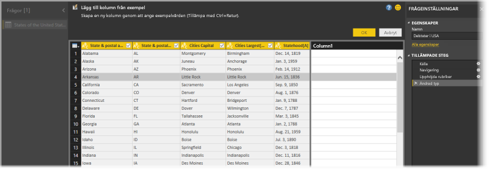
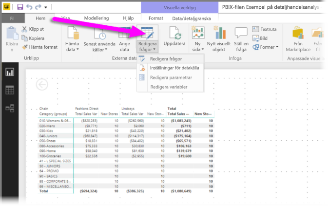
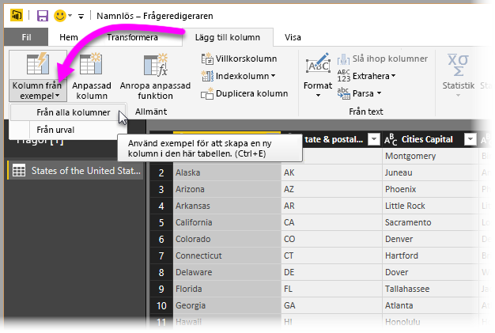
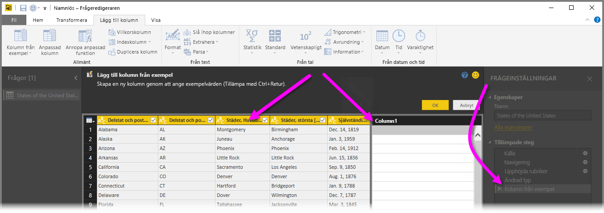
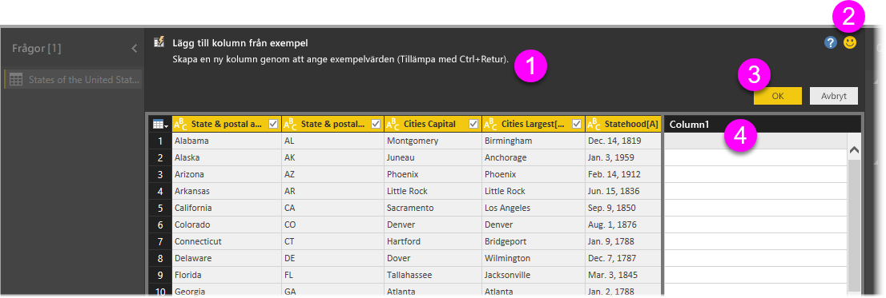
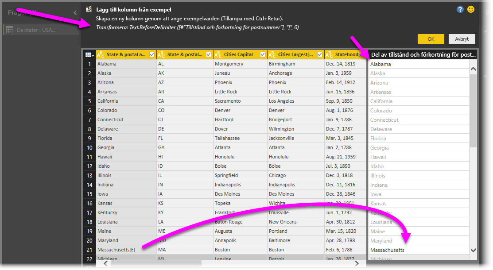

# Lägga till en kolumn från ett exempel i Power BI Desktop
Från och med april 2017-versionen av **Power BI Desktop** kan du lägga till nya datakolumner i modellen med **Query Editor**, genom att helt enkelt ange ett eller flera exempelvärden i den nya kolumnen. Du kan skapa ett nytt kolumnexempel från aktuellt urval eller ange indata som baseras på alla (eller valda) kolumner i en viss tabell.

Detta hjälper dig att snabbt och enkelt skapa nya kolumner och är perfekt i följande situationer:

* Du vet vilket dataresultat du vill ha i den nya kolumnen, men du är inte säker på vilken transformering (eller samling av transformeringar) som tar dig dit.
* Du vet redan vilka transformeringar du behöver men du vet inte var du ska klicka eller välja i användargränssnittet för att det ska hända.
* Du vet allt om vilka transformeringar du behöver med uttrycket *Anpassad kolumn* i **M**, men ett (eller flera) av dessa uttryck går inte att klicka på eller lägga till i användargränssnittet.

Att använda funktionen **Lägg till kolumn från exempel** är enkelt. I kommande avsnitt visar vi hur enkelt det är.

## Använda Query Editor för att lägga till en ny kolumn från exempel
Skapa en ny kolumn från ett exempel genom att först starta **Query Editor**. Du gör detta genom att välja **Redigera frågor** från menyfliksområdet **Start** i **Power BI Desktop**.

Om du vill hämta data från en webbsida går du till fliken **Start**, klickar på **Hämta data > Webb** och klistrar sedan in webbadressen i dialogrutan som öppnas. Den här artikeln använder data från en Wikipedia-artikel. Du kan klicka på länken nedan för att hämta dessa data själv och följa med:

* [**Lista med stater och territorier i USA**](https://wikipedia.org/wiki/List_of_states_and_territories_of_the_United_States)

När **Query Editor** har startats och du har läst in vissa data, kan du börja lägga till en kolumn från exemplen. Lägg till en ny kolumn genom att i **Query Editor** välja fliken **Lägg till kolumn** i menyfliksområdet och sedan **Kolumn från exempel**. Om du väljer listrutan kan du antingen välja **Från alla kolumner** (det är standard om du valde knappen i stället för listrutan) eller **Från urval**. I den här artikeln visar vi hur du väljer **Från alla kolumner**.

## Fönstret Lägg till kolumn från exempel
När du väljer att lägga till en ny kolumn från exempel, visas ett nytt fönster med kolumnerna i aktuell tabell (du kan behöva bläddra för att se alla). Nya **Kolumn1** visas också till höger, vilket är den kolumn som **Power BI Desktop** skapar baserat på dina exempel. Under den nya rubriken **Kolumn1** finns tomma celler där du kan skriva de exempel som Power BI använder för att skapa regler och transformeringar som matchar ditt exempel.

Observera att detta är ett **Tillämpat steg** i fönstret**Frågeinställningar**. Som alltid kommer **Query Editor** registrera dina transformeringssteg och tillämpa dem på frågan i ordning.

Detta fönster kallas **Lägg till kolumner från exempel** och består av fyra huvudsakliga områden:

1. **Kommandofält** som innehåller en kort beskrivning av funktionen eller transformeringen.
2. Alternativet **Skicka feedback** som hjälper Power BI förbättra funktionen.
3. Knapparna **OK** och **Cancel** som låter dig genomföra dina transformeringar, lägga till kolumnen eller avbryta.
4. Det nya kolumnområdet där du kan skriva dina exempelvärden på någon av raderna (för att Power BI ska få ditt exempel) och som relaterar till andra kolumner på raden.

När du skriver exemplet i den nya kolumnen visar Power BI en förhandsgranskning av hur kolumnen den skapar kommer att se ut, baserat på de transformeringar den hittar. Om du exempelvis skriver *Alabama* på den första raden motsvarar det värdet *Alabama* i den första tabellkolumnen. Så snart du trycker på *Retur* fyller Power BI i kolumnen baserat på det värdet.

Men tänk dig sedan att du går till raden som innehåller *Massachusetts[E]* och tar bort den sista delen *[E]* (eftersom du inte vill ha det längre). Power BI identifierar ändringen och använder exemplet för att skapa en transformering. Lägg märke till förklaringen av transformeringen i det övre fönstret i mitten.

När du fortsätter att ge exempel lägger **Query Editor** till dem i transformeringarna. När du är nöjd kan du välja **OK** för att genomföra ändringarna.

## Se användningen av Lägg till kolumn från exempel
Vill du se hur det fungerar? I följande video visas hur funktionen används med den datakälla som visades innan i exemplet. Ta en titt och följ med själv!

<iframe width="560" height="315" src="https://www.youtube.com/embed/-ykbVW9wQfw" frameborder="0" allowfullscreen></iframe>

## Överväganden och begränsningar
Det finns många tillgängliga transformeringar när du använder **Lägg till kolumn från exempel**, men alla transformeringar ingår inte. I följande lista finns alla transformeringar som stöds.

* **Referens**
  
  * Referens till en viss kolumn (inklusive transformeringarna trimma, rensa och skiftläge)

* **Texttransformeringar**
  
  * Kombinera (stöder kombinationen av literala strängar och hela kolumnvärden)
  * Ersätt
  * Längd
  * Extrahera   
    * Första tecken
    * Sista tecken
    * Intervall
    * Text före avgränsare
    * Text efter avgränsare
    * Text mellan avgränsare
    * Längd

* Följande **texttransformeringar** som stöds är tillgängliga fr.o.m. november 2017-versionen av **Power BI Desktop**:
    
  * Ta bort tecken
  * Behåll tecken

> [!NOTE]
> Alla transformeringar av *Text* räknar med det potentiella behovet att trimma, rensa eller tillämpa skiftlägestransformeringar på kolumnvärdet.
> 
> 

* **Datumtransformeringar**
  
  * Dag
  * Dag i veckan
  * Namn på veckodag
  * Dag på året
  * Månad
  * Namn på månad
  * Kvartal på året
  * Vecka i månad
  * Vecka på året
  * År
  * Ålder
  * Årets start
  * Årets slut
  * Månadens start
  * Månadens slut
  * Kvartalets start
  * Dagar i månad
  * Kvartalets slut
  * Veckans start
  * Veckans slut
  * Dag i månaden
  * Dagens början
  * Dagens slut

* **Tidstransformeringar**
  
  * Timme
  * Minut
  * Sekund  
  * Till lokal tid

> [!NOTE]
> Alla *Datum*- och *Tids*transformeringar räknar med ett potentiellt behov att konvertera kolumnvärdet till *Datum*, *Tid* eller *DateTime*.
> 
> 

* **Taltransformeringar** 

  * Absolut värde
  * Arccosinus
  * Arcsinus
  * Arctangens
  * Konvertera till tal
  * Cosinus
  * Kub
  * Dividera
  * Exponent
  * Fakultet
  * Heltalsdivision
  * Är jämnt
  * Är udda
  * Ln
  * 10-logaritm
  * Modulo
  * Multiplicera
  * Avrunda nedåt
  * Avrunda uppåt
  * Tecken
  * Sin
  * Kvadratrot
  * Kvadrat
  * Subtrahera
  * Summa
  * Tangens

* Följande **taltransformering** som stöds är tillgänglig fr.o.m. november 2017-versionen av **Power BI Desktop**:

  * Behållare/intervall

* **Allmänt**
  
  * Villkorskolumn