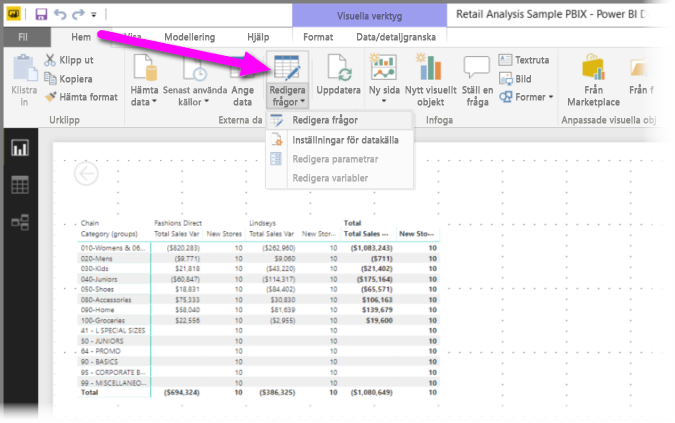
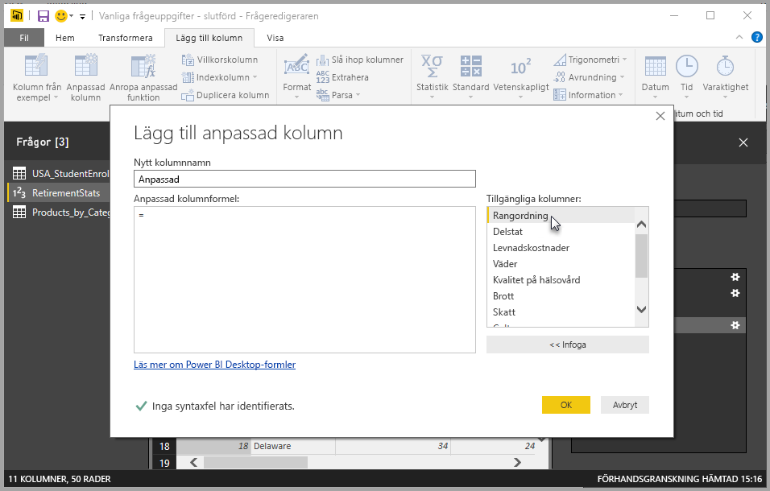
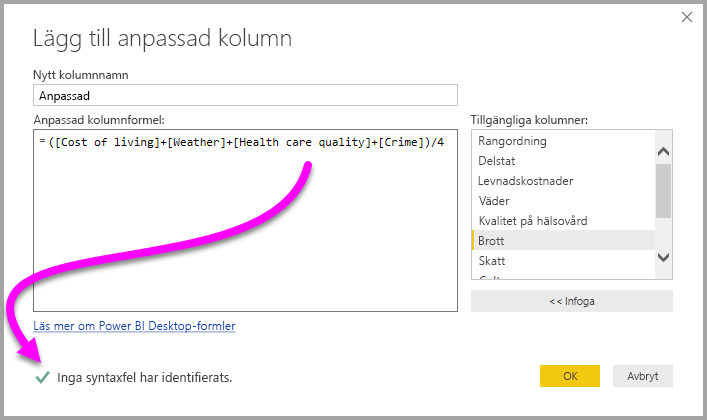

# Lägg till en anpassad kolumn i Power BI Desktop
Du kan enkelt lägga till en ny anpassad kolumn med data till din modell med hjälp av **Frågeredigeraren** i **Power BI Desktop**. Du kan skapa och ändra namn på din anpassade kolumn med enkla knappar för att skapa [M-formler](https://msdn.microsoft.com/library/mt270235.aspx) som definierar din anpassade kolumn. M-formeln har en [omfattande innehållsuppsättning med funktionsreferenser](https://msdn.microsoft.com/library/mt779182.aspx). 

Att skapa en anpassad kolumn är ett annat **tillämpat steg** till den fråga du skapar i **Frågeredigeraren**, vilket innebär att den kan förändras, flyttas tidigare eller senare, eller modifieras när som helst.

## Använd Frågeredigeraren för att lägga till en ny anpassad kolumn
Om du vill skapa en ny anpassad kolumn, startar du **Frågeredigeraren**. Du gör detta genom att välja **Redigera frågor** från menyfliksområdet **Start** i **Power BI Desktop**.

När **Frågeredigeraren** har startats och du har läst in lite data, kan du lägga till en anpassad kolumn genom att välja fliken **Lägg till kolumn** i menyfliksområdet och sedan välja **anpassad kolumn**.

Fönstret **Lägg till anpassad kolumn** visas, vilket beskrivs i följande avsnitt.

## Fönstret Lägg till anpassad kolumn
I fönstret **Lägg till anpassad kolumn** visas listan med tillgängliga fält i rutan till höger, namnet på din anpassade kolumn längst upp (du kan byta namn på den genom att skriva ett nytt namn i textrutan) och [**M**-formeln](https://msdn.microsoft.com/library/mt779182.aspx) som du skapar (eller skriver) baserat på att lägga till fält från höger, lägga till operatorer och på annat sätt skapa den formel som kommer att definiera din nya anpassade kolumn. 

## Skapa formler för din anpassade kolumn
Du kan välja ett fält från listan **Tillgängliga kolumner:** till höger och välja **<< Infoga** för att lägga till dem i formeln för den anpassade kolumnen. Du kan även helt enkelt dubbelklicka på en kolumn i listan om du vill lägga till den.

När du skriver in formeln och skapar din kolumn ser du längst ned i fönstret en indikator som visar dig i realtid (när du skriver) om några syntaxfel har identifierats. Om allt är bra visas en grön bockmarkering.

Men om det finns någon typ av fel i din syntax visas en gul varningsikon, tillsammans med det fel som identifierats och en länk som placerar pekaren (i din formel) där felet identifierats.

När du väljer **Ok**, läggs din anpassade kolumn till i modellen och steget **Lade till anpassad** läggs till i din frågas **Tillämpade steg**.

Om du dubbelklickar på steget **Lade till anpassat** i rutan **Tillämpade steg** så visas fönstret **Lägg till anpassad kolumn** igen, med den anpassade kolumnformeln som du skapat redan inläst och klar för dig att modifiera vid behov.

## Använd Avancerad redigerare för anpassade kolumner
Du kan också skapa en anpassad kolumn (och modifiera valfritt steg i din fråga) med hjälp av **Avancerad redigerare**. I **Frågeredigeraren**, väljer du fliken **Visa** och markerar sedan **Avancerad redigerare** för att visa den **Avancerade redigeraren**.

**Avancerad redigerare** ger dig fullständig kontroll över din fråga.

## Nästa steg
Det finns andra sätt att skapa en anpassad kolumn, inklusive att skapa en kolumn baserad på exempel du anger till **Frågeredigeraren**. Se följande artikel för mer information om hur du skapar anpassade kolumner från exempel:

* [Lägg till en kolumn från ett exempel i Power BI Desktop](desktop-add-column-from-example.md)
* [Introduktion till M-formelspråket](https://msdn.microsoft.com/library/mt270235.aspx)
* [M-funktionsreferens](https://msdn.microsoft.com/library/mt779182.aspx)  

