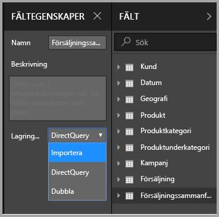
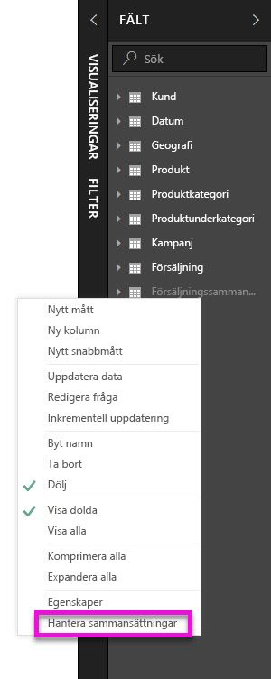
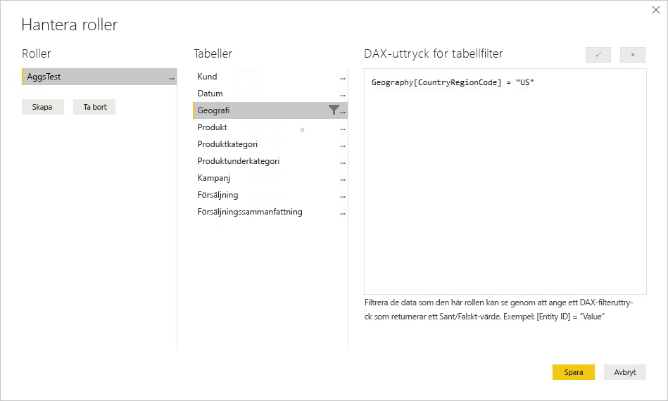
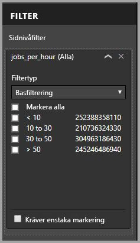

# Aggregeringar i Power BI Desktop

Användning av **sammansättningar** i Power BI tillåter interaktiv analys över stordata på sätt som tidigare inte var möjligt. Med **sammansättningar** kan du drastiskt minska kostnaderna för att låsa upp stora datauppsättningar för beslutsfattande.

Följande lista innehåller fördelar med att använda **sammansättningar**:

* **Frågeprestanda för stordata** – när användare interagerar med visuella objekt i Power BI-rapporter skickas DAX-frågor till datauppsättningen. Kör frågor snabbare genom att cachelagra data på den aggregerade nivån med en bråkdel av de resurser som krävs på detaljnivån. Lås upp stordata på ett sätt som annars inte skulle vara möjligt.
* **Datauppdateringsoptimering** – Minska cachestorlekar och uppdateringshastigheter genom att cachelagra data på den aggregerade nivån. Gör data tillgängliga för användare snabbare.
* **Få balanserad arkitektur** – Gör det möjligt för den minnesinterna cachelagringen i Power BI att hantera aggregerade frågor, vilket görs på ett effektivt sätt. Begränsa frågor som skickas till datakällan i DirectQuery-läge, vilket gör det lättare att hålla sig inom samtidighetsgränserna. Frågor som passerar igenom brukar vara filtrerade frågor på transaktionsnivå som informationslager och stordatasystem vanligtvis hanterar väl.

### Lagring på tabellnivå
Lagring på tabellnivå används normalt med sammansättningsfunktionen. Läs artikeln [lagringsläge i Power BI Desktop](desktop-storage-mode.md) för mer information.

### Typer av datakälla
Sammansättningar används tillsammans med datakällor som representerar dimensionsmodeller, till exempel informationslager, data mart och Hadoop-baserade stordatakällor. Den här artikeln beskriver vanliga modelleringsskillnader i Power BI för varje typ av datakälla.

Alla Power BI Import- (icke-flerdimensionella) och DirectQuery-källor fungerar med sammansättningar.

## Sammansättningar som baseras på relationer

**Sammansättningar** som baseras på relationer används vanligtvis med dimensionella modeller. Power BI-datauppsättningar som använder informationslager och data mart som källor liknar star/snowflake-scheman med relationer mellan dimensionstabeller och faktatabeller.

Fundera på följande modell, som är från en enskild datakälla. Vi antar att alla tabeller till att börja med använder DirectQuery. Faktatabellen **Sales** innehåller flera miljarder rader. Att konfigurera lagringsläge för **Sales** till **Import** för cachelagring skulle förbruka mycket minne och administrationskostnader.

Istället skapar vi tabellen **Sales Agg** som en sammansättningstabell. Den är mer detaljerad än **Sales** så den kommer innehålla mycket färre rader. Antalet rader ska vara lika med summan av **SalesAmount** som grupperats efter **CustomerKey**, **Datekey** och **ProductSubcategoryKey**. Istället för flera miljarder rader kan det röra sig om miljontals rader, vilket är mycket enklare att hantera.

Anta att följande dimensionstabeller är vanligast för frågor med högt affärsvärde. De är tabeller som kan filtrera **Sales Agg** med *en-till-många* (eller *många-till-en*)-relationer.

* Geografi
* Kund
* Datum
* Produktunderkategori
* Produktkategori

Följande bild visar den här modellen.

> [!NOTE]
> Tabellen **Sales Agg** är en helt vanlig tabell, så den kan läsas in på en mängd olika sätt. Till exempel kan sammansättning utföras i källdatabasen med hjälp av ETL/ELT-processer eller med [M-uttrycket](/powerquery-m/power-query-m-function-reference) för tabellen. Den kan använda läget Importera lagring med eller utan [Inkrementell uppdatering i Power BI Premium](service-premium-incremental-refresh.md), eller vara DirectQuery och vara optimerad för snabba frågor med hjälp av [kolumnlagringsindex](https://docs.microsoft.com/sql/relational-databases/indexes/columnstore-indexes-overview). Den här flexibiliteten gör det möjligt för balanserade arkitekturer att sprida frågebelastningen och undvika flaskhalsar.

### Lagringsläge 
Vi fortsätter med exemplet som vi använder. Vi ställer in lagringsläget för **Sales Agg** på **Import** för att snabba på frågorna.

När vi gör det så visas följande dialogruta som informerar oss om att de relaterade dimensionstabellerna kan anges till lagringsläget **Dubbla**. 

Om du ställer in dem på **Dubbla** kan relaterade dimensionstabeller fungera som Import eller DirectQuery beroende på underfrågan.

* Frågor som aggregerar mätvärden från tabellen **Sales Agg**, som är Import och grupperas efter attribut från de relaterade dubbeltabellerna kan returneras från den minnesinterna cachen.
* Frågor som aggregerar mätvärden i tabellen **Sales**, som är DirectQuery och grupperas efter attribut från de relaterade dubbeltabellerna kan returneras i DirectQuery-läget. Frågans logik, inklusive gruppering efter åtgärd, skickas till källdatabasen.

Mer information om lagringsläget **Dubbla** finns i artikeln [lagringsläge](desktop-storage-mode.md).

### Starka kontra svaga relationer
Sammanställningsträffar baserat på relationer kräver starka relationer.

Starka relationer omfattar följande kombinationer där båda tabellerna är från en *enda källa*.

| Tabell på *många sidorna | Tabellen på *1*-sidan |
| ------------- |----------------------| 
| Dubbla          | Dubbla                 | 
| Importera        | Import eller Dubbla       | 
| DirectQuery   | DirectQuery eller Dubbla  | 

Det enda fallet där en *korskälla*-relation anses stark om bägge tabellerna är Importera. Många-till-många-relationer anses alltid vara svaga.

För *korskälla*-sammansättningsträffar som inte är beroende av relationer kan du se avsnittet nedan på sammansättningar baserade på gruppera efter-kolumner.

### Aggregeringstabeller är inte adresserbara
Användare med skrivskyddad åtkomst till datamängden kan inte köra frågor mot aggregeringstabeller. Detta förhindrar säkerhetsproblem vid användning med RLS. Konsumenter och frågor refererar till detaljtabellen, inte till sammansättningstabellen. De behöver inte ens veta att sammansättningstabellen finns.

Av den här anledningen bör tabellen **Sales Agg** vara dold. Om den inte är det kommer dialogrutan Hantera aggregeringar att dölja den när du klickar på knappen Tillämpa alla.

### Hantera dialogrutan sammansättningar
Sedan definierar vi sammansättningarna. Välj snabbmenyn **Hantera sammansättningar** för tabellen **Sales Agg** genom att högerklicka på tabellen.

Dialogrutan **Hantera sammansättningar** visas. Det visas en rad för varje kolumn i tabellen **Sales Agg** där vi kan ange sammansättningsbeteendet. Frågor som skickats till Power BI-datauppsättningen som refererar till tabellen **Sales** dirigeras om internt till tabellen **Sales Agg**. Datauppsättningskonsumenter behöver inte ens veta att tabellen **Sales Agg** finns.

I följande tabell visas sammansättningar för tabellen **Sales Agg**.

#### Sammanfattningsfunktion

I listrutan för sammanfattning kan du välja mellan följande.
* Antal
* GroupBy
* Max
* Min
* Summa
* Antal tabellrader

#### Valideringar

Följande viktiga valideringar tillämpas av dialogrutan:

* Informationskolumnen som har valts måste ha samma datatyp som sammansättningskolumnen förutom sammanfattningsfunktioner för Antal och Antal tabellrader. Antal och Antal tabellrader erbjuds endast för heltalskolumner för sammansättning och kräver inte en matchande datatyp.
* Länkade sammansättningar som omfattar tre eller flera tabeller är inte tillåtna. Det går till exempel inte att ställa in sammansättningar i **Tabell A** som refererar till **Tabell B** som har sammansättningar som refererar till **Tabell C**.
* Duplicerade sammansättningar där två poster använder samma sammanfattningsfunktion och hänvisar till samma informationstabell/kolumn är inte tillåtna.
* Informationstabellen måste vara DirectQuery, inte Import.

De flesta valideringar tillämpas genom att inaktivera listrutevärden och visa förklarande text i knappbeskrivningen, vilket visas i följande bild.

### Gruppera efter kolumner

I det här exemplet är de tre GroupBy-posterna valfria. De påverkar inte sammansättningsbeteendet (förutom för exempelfrågan DISTINCTCOUNT, vilket visas på nästa bild). De ingår för att förbättra läsbarheten. Utan dessa GroupBy-poster skulle sammansättningarna fortfarande användas utifrån relationer. Det här är annorlunda jämfört med att använda sammansättningar utan relationer, vilket visas i exemplet med stordata som tas upp senare i den här artikeln.

### Inaktiva relationer
Gruppering efter en sekundärnyckelkolumn som används av en inaktiv relation och förlitar sig på USERELATIONSHIP-funktionen för aggregeringsträffar stöds inte.

### Identifiera om sammansättningar används eller missas av frågor

Mer information om hur du identifierar om frågor returneras från den minnesinterna cachen (lagringsmotor) eller DirectQuery (skickas till datakällan) med SQL Profiler finns i artikeln om [lagringsläget](desktop-storage-mode.md). Den här processen kan även användas för att identifiera om sammansättningar används.

Dessutom tillhandahålls följande utökade händelser i SQL Profiler.

    Query Processing\Aggregate Table Rewrite Query

Följande JSON-kodfragment visar ett exempel på utdata från händelsen när en sammansättning används.

* **matchingResult** visar att en sammansättning användes för underfrågan.
* **dataRequest** visar gruppera efter-kolumner och sammansatta kolumner som används av underfrågan.
* **mappning** visar kolumnerna i sammansättningstabellen som det mappats till.

### Frågeexempel
Följande fråga använder sammansättningen eftersom kolumner i tabellen *Date* har den kornighet som kan använda sammansättningen. Sammansättningen **Sum** används för **SalesAmount**.

Följande fråga träffar inte sammansättningen. Trots att summan av **SalesAmount** begärs så utför den en gruppera efter-åtgärd på en kolumn i **Produkt**-tabellen, som inte har den kornighet som kan träffa sammansättningen. Om du ser relationerna i modellen kan en produktunderkategori ha flera **Produkt**-rader. Frågan kan inte avgöra vilka produkter som den ska sammanställa till. I det här fallet återgår frågan till DirectQuery och skickar en SQL-fråga till datakällan.

Sammansättningar är inte bara till för enkla beräkningar som ger en tydlig summa. Även komplexa beräkningar kan utföras. En komplex beräkning är konceptuellt uppdelad i underfrågor för varje SUM, MIN, MAX och COUNT och varje underfråga utvärderas för att avgöra om sammansättningen kan användas. Den här logiken gäller inte i alla fall på grund av frågeplansoptimering, men generellt sett bör den stämma. I följande exempel används i sammansättningen:

Funktionen COUNTROWS kan utnyttja sammansättningar. Följande fråga träffar sammansättningen eftersom en sammansättning för tabellraderna **Antal** har definierats för tabellen **Sales**.

Funktionen AVERAGE kan använda sammansättningar. Följande fråga träffar sammansättningen eftersom AVERAGE internt viks till en SUM som delats med en COUNT. Sammansättningen används eftersom kolumnen **UnitPrice** har sammansättningar som definieras för både SUM och COUNT.

I vissa fall kan funktionen DISTINCTCOUNT använda sammansättningar. Följande fråga träffar sammanställningen eftersom det finns en GroupBy-post för **CustomerKey** som behåller tydligheten för **CustomerKey** i sammanställningstabellen. Den här tekniken omfattas fortfarande av prestandatröskelvärdet där mer än två till fem miljoner distinkta värden kan påverka frågeprestandan. Men den kan vara användbar i scenarier där det finns miljarder rader i informationstabellen och två till fem miljoner distinkta värden i kolumnen. I det här fallet kan antalet distinkta värden prestera snabbare än om du söker i tabellen som innehåller flera miljarder rader, även om de har cachelagrats i minnet.

### RLS
RLS-uttryck (säkerhet på radnivå) bör filtrera både aggregeringstabellen och detaljtabellen för att fungera korrekt. Enligt exemplet fungerar ett RLS-uttryck i tabellen **Geografi** eftersom Geografi är på filtreringssidan för relationer med både tabellen **Försäljning** och tabellen **Försäljningssammanfattning**. RLS tillämpas korrekt på frågor som träffar aggregeringstabellen och dem som inte gör det.

Ett RLS-uttryck i tabellen **Produkt** skulle endast filtrera tabellen **Försäljning**, inte tabellen **Sales Agg**. Detta rekommenderas ej. Frågor som skickats av användare som kommer åt datamängden via den här rollen tar inte del av aggregeringsträffar. Eftersom aggregeringstabellen är en annan representation av samma data i detaljtabellen skulle det inte vara säkert att besvara frågor från aggregeringstabellen eftersom RLS-filtret inte kan tillämpas.

Ett RLS-uttryck i själva tabellen **Sales Agg** skulle endast filtrera aggregeringstabellen, inte detaljtabellen. Detta är inte tillåtet.

## Sammansättningar som baseras på gruppera-efter-kolumner 

Hadoop-baserade modeller för stordata har andra egenskaper än dimensionella modeller. För att undvika kopplingar mellan stora tabeller, förlitar de sig ofta inte på relationer. Istället är dimensionsattribut ofta avnormaliserade till faktatabeller. Sådana modeller för stordata kan låsas upp för interaktiv analys med hjälp av **sammansättningar** som baseras på gruppera efter-kolumner.

Följande tabell innehåller den numeriska kolumnen **Rörelse** som ska aggregeras. Alla andra kolumner är attribut till Gruppera efter. Den innehåller IoT-data och ett stort antal rader. Lagringsläget är DirectQuery. Frågor på datakällan som aggregerar över hela datauppsättningen är långsamma på grund av den stora volymen.

Om du vill aktivera interaktiv analys för den här datauppsättningen lägger vi till en sammansättningstabell som kan sorteras efter de flesta attribut, men inte attribut med hög kardinalitet som longitud och latitud. Den minskar antalet rader avsevärt och är tillräckligt liten för att passa en minnesintern cache. Lagringsläget för **Driver Activity Agg** är Import.

Nu ska vi definiera sammansättningsmappningarna i dialogrutan **Hantera sammansättningar**. Den visar en rad för varje kolumn i tabellen **Driver Activity Agg** där vi kan ange sammansättningsbeteendet.

I följande tabell visas sammansättningar för tabellen **Driver Activity Agg**.

### Gruppera efter kolumner

I det här exemplet är **GroupBy**-posterna **inte valfria**. Utan dem kan sammansättningarna inte träffas. Det här är inte detsamma som att använda sammansättningar som baseras på relationer, vilket visades i exemplet med den dimensionella modellen tidigare i den här artikeln.

### Frågeexempel

Följande fråga träffar sammansättningen eftersom kolumnen **Aktivitetsdatum** omfattas av sammansättningstabellen. Sammansättningen för tabellen Antal rader används av funktionen COUNTROWS.

Det är en bra idé att använda sammansättningar för tabellen Antal rader för modeller som innehåller filterattribut i faktatabeller. Power BI kan skicka frågor till datauppsättningen med COUNTROWS då det inte uttryckligen krävs av användaren. Till exempel visar filterdialogrutan antal rader för varje värde.

### RLS

Samma RLS-regler som beskrivs ovan för aggregeringar baserade på relationer, angående huruvida ett RLS-uttryck kan filtrera aggregeringstabellen, detaljtabellen eller båda, gäller även för aggregeringar som baseras på gruppering efter kolumner. I exemplet kan ett RLS-uttryck som tillämpas på tabellen **Driver Activity** användas för att filtrera tabellen **Driver Activity Agg** eftersom alla grupperingar efter kolumner i aggregeringstabellen omfattas av detaljtabellen. Däremot kan inte ett RLS-filter i tabellen **Driver Activity Agg** tillämpas på tabellen **Driver Activity**, och detta är därför inte tillåtet.

## Sammansättningsprioritet

Med sammansättningsprioritet kan flera sammansättningstabeller övervägas av en enda underfråga.

Se följande exempel. Det är en [sammansatt modell](desktop-composite-models.md) som innehåller flera DirectQuery-källor.

* Importtabellen **Driver Activity Agg2** har hög kornighet på grund av få gruppera-efter-attribut och låg kardinalitet. Antalet rader kan vara så lågt som tusentals, så det kan enkelt anpassas till en minnesintern cache. Dessa attribut används av en viktig instrumentpanel, så frågor som refererar till dem bör kunna utföras så snabbt som möjligt.
* Tabellen **Driver Activity Agg** är en mellanliggande sammansättningstabell i DirectQuery-läge. Den innehåller fler än en miljard rader i Azure SQL Data Warehouse och optimeras vid källan med hjälp av kolumnlagringsindex.
* Tabellen **Driver Activity** är DirectQuery och innehåller över en biljon rader med IoT-data som kommer från ett system för stordata. Den använder detaljerade frågor för att visa enskilda IoT-avläsningar i kontexter som kontrolleras av filter.

> [!NOTE]
> DirectQuery-aggregeringstabeller som använder en annan datakälla till detaljtabellen stöds endast om aggregeringstabellen kommer från en SQL Server-, Azure SQL- eller Azure SQL Data Warehouse-källa.

Fotavtrycket för minnesanvändning för den här modellen är relativt litet, men det låser upp en stor datauppsättning. Den representerar en balanserad arkitektur eftersom den sprider frågebelastningen över komponenter i arkitekturen och använder dem utifrån deras styrkor.

Dialogrutan **Hantera sammansättningar** för **Driver Activity Agg2** visar att fältet *Prioritet* är 10, vilket är högre än **Driver Activity Agg** och innebär att den kommer att anses vara viktigast av de frågor som använder sammansättningar. Underfrågor som inte har den kornighet som kan besvaras av **Driver Activity Agg2** överväger **Driver Activity Agg** istället. Informationsfrågor som inte kan besvaras av sammansättningstabellerna dirigeras om till **Driver Activity**.

Tabellen som anges i kolumnen **Informationstabell** är **Driver Activity**, inte **Driver Activity Agg** eftersom länkade sammansättningar inte tillåts (se [ valideringar](#validations) tidigare i den här artikeln).

I följande tabell visas sammansättningar för tabellen **Driver Activity Agg2**.

## Sammansättningar som baseras på gruppera-efter-kolumner kombinerat med relationer

Du kan även kombinera de två metoderna för sammansättningar som beskrivs tidigare i den här artikeln. För **sammansättningar** som baseras på relationer kan det krävas att de avnormaliserade dimensionstabellerna delas upp i flera tabeller. Om det är dyrt eller opraktiskt för vissa dimensionstabeller kan de nödvändiga attributen replikeras i sammansättningstabellen för vissa dimensioner och relationer som används för andra.

Följande modell replikerar *Månad*, *Kvartal*, *Termin* och *År* i tabellen **Sales Agg**. Det finns ingen relation mellan tabellerna **Sales Agg** och **Datum**. Det finns relationer till **Kund** och **Produktunderkategori**. Lagringsläget för **Sales Agg** är Import.

I följande tabell visas posterna som konfigurerats i dialogrutan **Hantera sammansättningar** för tabellen **Sales Agg**. GroupBy-poster där **Datum** är informationstabellen är obligatoriskt för att använda sammansättningar för frågor som grupperas efter datum-attribut. Som i föregående exempel påverkar GroupBy-poster för CustomerKey och ProductSubcategoryKey inte sammansättningsträffar på grund av förekomsten av relationer (återigen med undantag för DISTINCTCOUNT).

### Frågeexempel

Följande fråga använder sammansättningen eftersom CalendarMonth omfattas av sammansättningstabellen och CategoryName kan nås via en-till-många-relationer. Sammansättningen Summa används för **SalesAmount**.

Följande fråga träffar inte sammanställningen eftersom CalendarDay inte omfattas av sammansättningstabellen.

Följande fråga för tidsinformation använder inte sammansättningen eftersom funktionen DATESYTD genererar en tabell med CalendarDay-värden som inte omfattas av sammansättningstabellen.

## Cacheminnen bör hållas synkroniserade

**Sammansättningar** som kombinerar DirectQuery och Import och/eller dubbelt lagringsläge kan returnera olika data om den minnesinterna cachen inte är synkroniserad med källdata. Frågekörningen försöker inte maskera dataproblem genom att t.ex. filtrera DirectQuery-resultat för att matcha cachelagrade värden. Dessa funktioner är för prestandaoptimering och bör endast användas på sätt som inte äventyrar möjligheten att uppfylla verksamhetskraven. Det är ditt ansvar att känna till dina dataflöden, så kontrollera utformningen. Det finns etablerade tekniker för att hantera sådana problem vid källan, om så behövs.

## Nästa steg

Följande artiklar beskriver mer om sammansatta modeller och beskriver DirectQuery i detalj.

* [Sammansatta modeller i Power BI Desktop](desktop-composite-models.md)
* [Många-till-många-relationer i Power BI Desktop](desktop-many-to-many-relationships.md)
* [Lagringsläge i Power BI Desktop](desktop-storage-mode.md)

DirectQuery-artiklar:

* [Använd DirectQuery i Power BI](desktop-directquery-about.md)
* [Datakällor som stöds av DirectQuery i Power BI](desktop-directquery-data-sources.md)