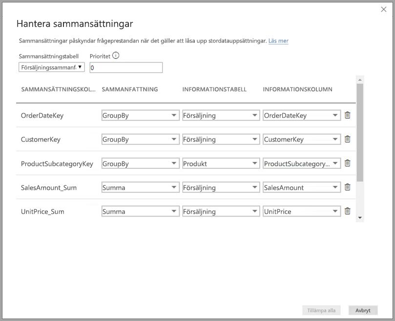
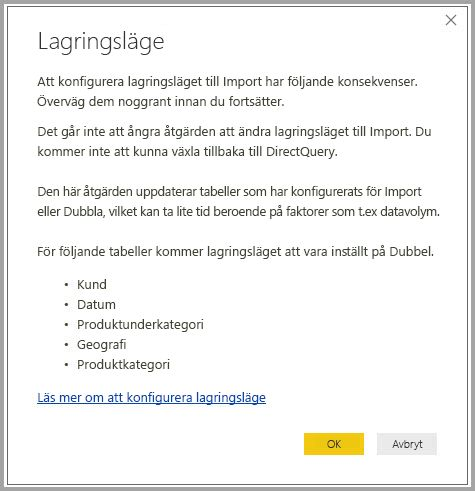
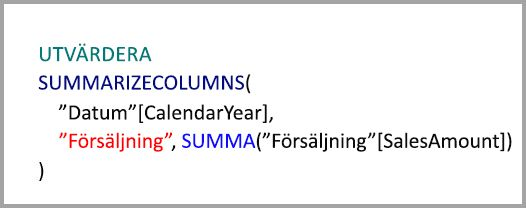
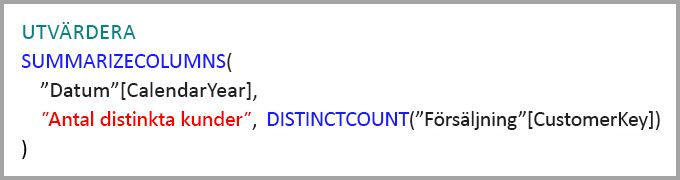
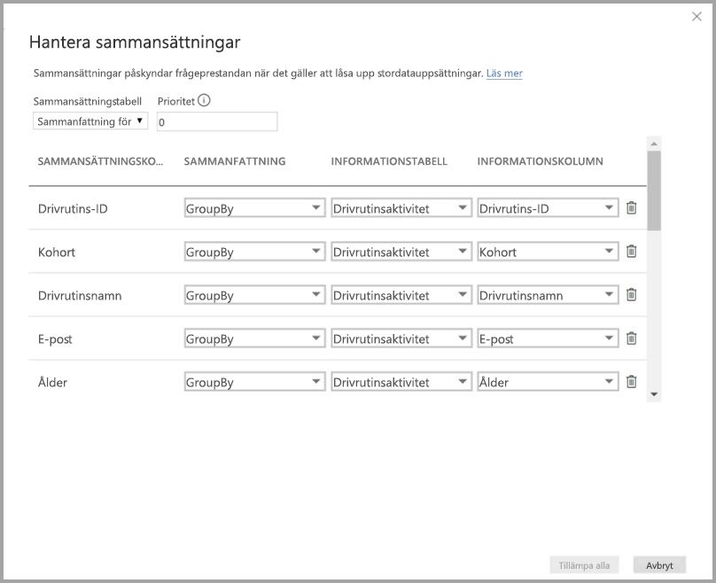
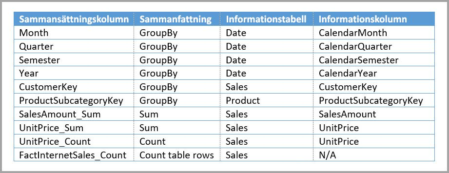
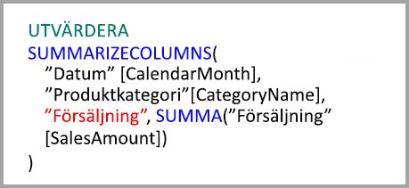
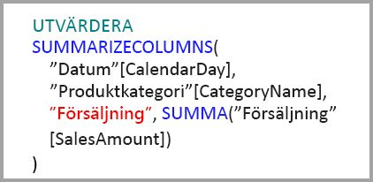
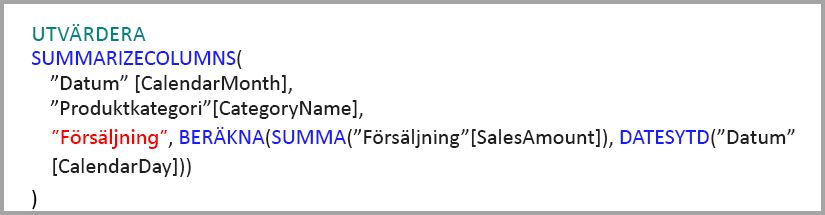

# Använda sammansättningar i Power BI Desktop

*Med sammansättningar* i Power BI kan du minska tabellstorlekarna så att du kan fokusera på viktiga data och förbättra frågans prestanda. Sammansättningar möjliggör interaktiv analys av stordata på ett sätt som inte är möjligt, och kan avsevärt minska kostnaderna för att låsa upp stora datamängder för beslutsfattande.

Några fördelar med att använda sammansättningar är:

- **Bättre prestanda för frågor över stordata**. Varje interaktion med visuella objekt i Power BI skickar DAX-frågor till datamängden. Cachelagrade sammanställda data använder en bråkdel av de resurser som krävs för detaljdata, så att du kan låsa upp stordata som annars skulle bli otillgängliga.
- **Optimerad datauppdatering.** Mindre cachestorlek minskar uppdateringstiderna så att data kommer till användarna snabbare.
- **Balanserade arkitekturer**. Den minnesinterna cachen i Power BI kan hantera sammanställda frågor, begränsa frågor som skickas i DirectQuery-läge och hjälpa dig att uppfylla samtidighetsgränser. Återstående frågor på detaljnivå brukar vara filtrerade frågor på transaktionsnivå som informationslager och stordatasystem vanligtvis hanterar väl.

Dimensionella datakällor, t. ex. informationslager och dataförråd, kan använda [relation-baserade sammansättningar](#aggregation-based-on-relationships). Hadoop-baserade stordatakällor [baserar ofta sammansättningar på GroupBy-kolumner](#aggregation-based-on-groupby-columns). Den här artikeln beskriver vanliga modelleringsskillnader i Power BI för varje typ av datakälla.

## Skapa en sammansättningstabell

Så här skapar du en sammansättningstabell:
1. Skapa en ny tabell med de fält du vill ha, beroende på din datakälla och modell. 
1. Definiera sammansättningarna med hjälp av dialogrutan **Hantera sammansättningar**.
1. Om det är tillämpligt ändrar du [lagringsläge](#storage-modes) för sammansättningstabellen. 

### Hantera sammansättningar

När du har skapat den nya tabellen med de fält du vill ha högerklickar du på tabellen i fönstret **Fält** i valfri Power BI Desktop-vy och väljer **Hantera sammansättningar**.

I dialogrutan **Hantera sammansättningar** visas en rad för varje kolumn i tabellen där du kan ange sammansättningsbeteendet. I följande exempel kommer frågor till detaljtabellen **Sales** att omdirigeras internt till sammansättningstabellen **Sales Agg**. 

Listrutan **Sammanfattning** i dialogrutan **Hantera sammansättningar** innehåller följande värden:
- Antal
- GroupBy
- Max
- Min
- Summa
- Antal tabellrader

I det här relationsbaserade agg sammansättningsexemplet är GroupBy-poster valfria. Förutom för DISTINCTCOUNT påverkar de inte sammansättningens beteende och är främst för läsbarhet. Utan dessa GroupBy-poster skulle sammansättningarna fortfarande användas utifrån relationer. Detta skiljer sig från [exemplet för stordata](#aggregation-based-on-groupby-columns) längre fram i den här artikeln, där GroupBy-poster krävs.

När du har definierat de sammansättningar du vill ha väljer du **Tillämpa alla**. 

### Valideringar

Dialogrutan **Hantera sammansättningar** tillämpar följande viktiga verifieringar:

- **Informationskolumnen** som har valts måste ha samma datatyp som **sammansättningskolumnen** förutom **sammanfattningsfunktioner** för Antal och Antal tabellrader. Antal och Antal tabellrader är endast tillgängliga för heltalskolumner för sammansättning och kräver inte en matchande datatyp.
- Länkade sammansättningar som omfattar tre eller flera tabeller är inte tillåtna. Sammansättningar i **Tabell A** kan till exempel inte hänvisa till en **Tabell B** som innehåller sammansättningar som refererar till en **Tabell C**.
- Duplicerade sammansättningar där två poster använder samma **sammanfattningsfunktion** och hänvisar till samma **informationstabell** och **informationskolumn** är inte tillåtna.
- **Informationstabellen** måste använda DirectQuery-lagringsläget, och inte Importera.
- Du kan inte gruppera efter en sekundärnyckelkolumn som används i en inaktiv relation och där funktionen USERELATIONSHIP används för sammansättningsträffar.

De flesta valideringar tillämpas genom att inaktivera listrutevärden och visa förklarande text i knappbeskrivningen, vilket visas i följande bild.

### Sammansättningstabeller är dolda

Användare med skrivskyddad åtkomst till datamängden kan inte köra frågor mot aggregeringstabeller. Detta förhindrar säkerhetsproblem vid *säkerhet på radnivå (RLS)* . Konsumenter och frågor refererar till informationstabellen, inte till sammansättningstabellen. De behöver inte veta att sammansättningstabellen finns.

Därför är sammansättningstabeller dolda från **rapportvyn**. Om tabellen inte redan är dold kommer dialogrutan **Hantera sammansättningar** att vara dold när du väljer **Tillämpa alla**.

### Lagringslägen
Sammansättningsfunktionen interagerar med lagringslägen på tabellnivå. Power BI-tabeller kan använda lagringslägena *DirectQuery*, *Importera*eller *Dubbla*. DirectQuery frågar serverdelen direkt, medan Import cachelagrar data i minnet och skickar frågor till cachelagrade data. Alla Power BI Import- och icke-flerdimensionella DirectQuery-datakällor fungerar med sammansättningar. 

Om du vill ställa in lagringsläget för en sammansättningstabell på Import för att snabba upp frågor väljer du sammansättningstabellen i Power BI Desktops **modellvy**. I fönstret **Egenskaper** expanderar du **Avancerat**, väljer **Lagringsläge** på den nedrullningsbara menyn och väljer **Import**. Notera att den här åtgärden inte kan ångras. 

Mer information om tabellagringsläget finns i [Hantera lagringsläge i Power BI Desktop](desktop-storage-mode.md).

### RLS för sammansättningar

För att RLS-uttryck ska fungera korrekt för sammansättningar bör de filtrera både sammansättningstabellen och informationstabellen. 

I följande exempel fungerar ett RLS-uttryck i tabellen **Geografi** för sammansättningar eftersom Geografi är på filtreringssidan för relationer med både tabellen **Försäljning** och tabellen **Försäljningssammanfattning**. RLS tillämpas korrekt på frågor som träffar sammansättningstabellen och dem som inte gör det.

Ett RLS-uttryck i tabellen **Produkt** skulle endast filtrera tabellen **Sales**, inte sammansättningstabellen **Sales Agg**. Eftersom sammansättningstabellen är en annan representation av data i detaljtabellen skulle det inte vara säkert att besvara frågor från sammansättningstabellen om RLS-filtret inte kan tillämpas. Filtrering av enbart informationstabellen rekommenderas inte, eftersom användarfrågor från den här rollen inte drar nytta av sammansättningsträffar. 

Ett RLS-uttryck i tabellen **Sales Agg** som endast skulle filtrera sammansättningstabellen och inte **Sales**-informationstabellen är inte tillåtet.

För [sammansättningar som baseras på GroupBy-kolumner](#aggregation-based-on-groupby-columns) kan ett RLS-uttryck som tillämpas på informationstabellen användas för att filtrera sammansättningstabellen, eftersom alla GroupBy-kolumner i sammansättningstabellen omfattas av infomationstabellen. Å andra sidan går det inte att använda RLS-filtret i sammansättningstabellen i informationstabellen, så det är inte tillåtet.

## Sammansättningar som baseras på relationer

*Sammansättningar som baseras på relationer* används vanligtvis med dimensionella modeller. Power BI-datauppsättningar som använder informationslager och dataförråd liknar star/snowflake-scheman med relationer mellan dimensionstabeller och faktatabeller.

I följande modell från en enda datakälla använder tabellerna DirectQuery-lagringsläge. Faktatabellen **Sales** innehåller flera miljarder rader. Att konfigurera lagringsläge för **Sales** till Importera för cachelagring skulle förbruka mycket minne och administrationskostnader.

Skapa i stället sammansättningstabellen **Sales Agg**. I tabellen **Sales Agg** ska antalet rader vara lika med summan av **SalesAmount** som grupperats efter **CustomerKey**, **DateKey** och **ProductSubcategoryKey**. **Sales Agg**-tabellen har en högre kornighet än **Sales**, så i stället för miljarder kan det innehålla miljontals rader, vilket är mycket enklare att hantera.

Om följande dimensionella tabeller är de vanligaste för frågorna med högt affärsvärde kan de filtrera **Sales Agg**med *en-till-många*- eller *många-till-en*-relationer.

- Geografi
- Kund
- Datum
- Produktunderkategori
- Produktkategori

Följande bild visar den här modellen.

I följande tabell visas sammansättningar för tabellen **Sales Agg**.

> [!NOTE]
> Tabellen **Sales Agg** är en helt vanlig tabell, så den kan läsas in på en mängd olika sätt. Sammansättning kan utföras i källdatabasen med hjälp av ETL/ELT-processer eller med [M-uttrycket](/powerquery-m/power-query-m-function-reference) för tabellen. Sammansättningstabellen kan använda läget Importera lagring med eller utan [Inkrementell uppdatering i Power BI Premium](service-premium-incremental-refresh.md), eller så kan den använda DirectQuery och vara optimerad för snabba frågor med hjälp av [kolumnlagringsindex](/sql/relational-databases/indexes/columnstore-indexes-overview). Den här flexibiliteten gör det möjligt för balanserade arkitekturer att sprida frågebelastningen och undvika flaskhalsar.

Om du ändrar lagringsläget för den sammansatta tabellen **Sales Agg** till **Import** öppnas en dialogruta som anger att de relaterade dimensionella tabellerna kan ställas in på lagringsläget *Dubbla*. 

Om du ställer in relaterade dimensionstabeller på Dubbla kan de fungera som Importera eller DirectQuery beroende på underfrågan. I exemplet:

- Frågor som sammanställer mätvärden från importläget **Sales Agg** och grupperas efter attribut från de relaterade dubbeltabellerna kan returneras från den minnesinterna cachen.
- Frågor som aggregerar mätvärden i DirectQuery-tabellen **Sales** och som grupperas efter attribut från de relaterade dubbeltabellerna kan returneras i DirectQuery-läget. Frågans logik, inklusive gruppering efter åtgärd, skickas till källdatabasen.

Mer information om lagringsläget Dubbla finns i [Hantera lagringsläge i Power BI Desktop](desktop-storage-mode.md).

### Starka kontra svaga relationer

Sammanställningsträffar baserat på relationer kräver starka relationer.

Starka relationer omfattar följande kombinationer av lagringslägen där båda tabellerna är från en enda källa:

| Tabell på de *många* sidorna | Tabellen på *1*-sidan |
| ------------- |----------------------| 
| Dubbla          | Dubbla                 | 
| Importera        | Import eller Dubbla       | 
| DirectQuery   | DirectQuery eller Dubbla  | 

Det enda fallet där en relation *mellan olika källor* anses stark om bägge tabellerna är inställda på Importera. Många-till-många-relationer anses alltid vara svaga.

För sammansättningsträffar *mellan olika källor* som inte är beroende av relationer kan du se avsnittet om [Aggregations based on GroupBy columns](#aggregation-based-on-groupby-columns) (Sammansättningar baserat på GroupBy-kolumner). 

### Exempel på relationsbaserade sammansättningsfrågor

Följande fråga använder sammansättningen eftersom kolumner i tabellen **Date** har den kornighet som kan använda sammansättningen. Kolumnen **SalesAmount** använder sammansättningen **Sum**.

Följande fråga träffar inte sammansättningen. Trots att summan av **SalesAmount** begärs så utför frågan en gruppera efter-åtgärd på en kolumn i tabellen **Produkt**, som inte har den kornighet som kan träffa sammansättningen. Om du observerar relationerna i modellen kan en produkts underkategori ha flera **produktrader**. Frågan kunde inte avgöra vilken produkt som skulle sammanställas. I det här fallet återgår frågan till DirectQuery och skickar en SQL-fråga till datakällan.

Sammansättningar är inte bara till för enkla beräkningar som ger en tydlig summa. Även komplexa beräkningar kan utföras. En komplex beräkning är konceptuellt uppdelad i underfrågor för varje SUM, MIN, MAX och COUNT och varje underfråga utvärderas för att avgöra om sammansättningen kan användas. Den här logiken gäller inte i alla fall på grund av frågeplansoptimering, men generellt sett bör den stämma. I följande exempel används i sammansättningen:

Funktionen COUNTROWS kan utnyttja sammansättningar. Följande fråga träffar sammansättningen eftersom en sammansättning för tabellraderna **Antal** har definierats för tabellen **Sales**.

Funktionen AVERAGE kan använda sammansättningar. Följande fråga träffar sammansättningen eftersom AVERAGE internt viks till en SUM som delats med en COUNT. Sammansättningen används eftersom kolumnen **UnitPrice** har sammansättningar som definieras för både SUM och COUNT.

I vissa fall kan funktionen DISTINCTCOUNT använda sammansättningar. Följande fråga träffar sammanställningen eftersom det finns en GroupBy-post för **CustomerKey** som behåller tydligheten för **CustomerKey** i sammanställningstabellen. Den här tekniken kan fortfarande omfattas av prestandatröskelvärdet där mer än två till fem miljoner distinkta värden kan påverka frågeprestanda. Men den kan vara användbar i scenarier där det finns miljarder rader i informationstabellen, men två till fem miljoner distinkta värden i kolumnen. I det här fallet kan DISTINCTCOUNT prestera snabbare än om du söker i tabellen som innehåller flera miljarder rader, även om de har cachelagrats i minnet.

## Sammansättning som baseras på GroupBy-kolumner 

Hadoop-baserade modeller för stordata har andra egenskaper än dimensionella modeller. För att undvika kopplingar mellan stora tabeller använder stora datamodeller ofta inte relationer, men avnormaliserar dimensionsattribut till faktatabeller. Du kan låsa upp sådana modeller för stordata för interaktiv analys med hjälp av *sammansättningar som baseras på GroupBy-kolumner*.

Följande tabell innehåller den numeriska kolumnen **Rörelse** som ska aggregeras. Alla andra kolumner är attribut till Gruppera efter. Tabellen innehåller IoT-data och ett stort antal rader. Lagringsläget är DirectQuery. Frågor på datakällan som aggregerar över hela datauppsättningen är långsamma på grund av den stora volymen. 

Om du vill aktivera interaktiv analys för den här datauppsättningen kan du lägga till en sammansättningstabell som kan sorteras efter de flesta attribut, men inte attribut med hög kardinalitet som longitud och latitud. Den minskar antalet rader avsevärt och är tillräckligt liten för att passa en minnesintern cache. 

Du definierar sammansättningsmappningarna för tabellen **Sammanfattning för drivrutinsaktivitet** i dialogrutan **Hantera sammansättningar**. 

I sammansättningar baserade på GroupBy-kolumner är **GroupBy**-poster valfria. Utan dem nås inte sammansättningar. Det här skiljer sig från att använda sammansättningar som baseras på relationer, där GroupBy-posterna är valfria.

I följande tabell visas sammansättningar för tabellen **Driver Activity Agg**.

Du kan ställa in lagringsläget för den sammanställda tabellen **Sammanfattning för drivrutinsaktivitet** på Import.

### Exempel på GroupBy-sammansättningsfråga

Följande fråga träffar sammansättningen eftersom kolumnen **Aktivitetsdatum** omfattas av sammansättningstabellen. Funktionen COUNTROWS använder sammansättningen **Antal tabellrader**.

Det är en bra idé att använda sammansättningar för tabellen **Antal tabellrader** för modeller som innehåller filterattribut i faktatabeller. Power BI kan skicka frågor till datauppsättningen med COUNTROWS då det inte uttryckligen krävs av användaren. Till exempel visar filterdialogrutan antal rader för varje värde.

## Kombinerade sammansättningstekniker

Du kan kombinera relationernas GroupBy-kolumnernas tekniker för sammansättning. För sammansättningar som baseras på relationer kan det krävas att de avnormaliserade dimensionstabellerna delas upp i flera tabeller. Om det är dyrt eller opraktiskt för vissa dimensionstabeller kan du replikera de nödvändiga attributen i sammansättningstabellen för de dimensionerna och använda relationer för andra.

Följande modell replikerar exempelvis **Månad**, **Kvartal**, **Termin** och **År** i tabellen **Sales Agg**. Det finns ingen relation mellan **Sales Agg** och **datumtabellen**, men det finns relationer för **Kund** och **Produktunderkategori**. Lagringsläget för **Sales Agg** är Import.

I följande tabell visas posterna som konfigurerats i dialogrutan **Hantera sammansättningar** för tabellen **Sales Agg**. GroupBy-poster där **Datum** är informationstabellen är obligatoriskt för att använda sammansättningar för frågor som grupperas efter **datum**-attribut. Som i föregående exempel påverkar **GroupBy**-poster för **CustomerKey** och **ProductSubcategoryKey** inte sammansättningsträffar, med undantag för DISTINCTCOUNT, på grund av förekomsten av relationer.

### Exempel på kombinerade sammansättningsfrågor

Följande fråga använder sammansättningen eftersom **CalendarMonth** omfattas av sammansättningstabellen och **CategoryName** kan nås via en-till-många-relationer. **SalesAmount** använder sammansättningen **SUM**.

Följande fråga träffar inte sammanställningen eftersom **CalendarDay** inte omfattas av sammansättningstabellen.

Följande fråga för tidsinformation använder inte sammansättningen eftersom funktionen DATESYTD genererar en tabell med **CalendarDay**-värden och sammansättningstabellen inte omfattas av **CalendarDay**.

## Sammansättningsprioritet

Med sammansättningsprioritet kan flera sammansättningstabeller övervägas av en enda underfråga.

Följande är en [sammansatt modell](desktop-composite-models.md) som innehåller flera källor:

- DirectQuery-tabellen **Driver Activity** innehåller över en biljon rader med IoT-data som kommer från ett system för stordata. Den använder detaljerade frågor för att visa enskilda IoT-avläsningar i kontexter som kontrolleras av filter.
- Tabellen **Driver Activity Agg** är en mellanliggande sammansättningstabell i DirectQuery-läge. Den innehåller fler än en miljard rader i Azure SQL Data Warehouse och optimeras vid källan med hjälp av kolumnlagringsindex.
- Importtabellen **Driver Activity Agg2** har hög kornighet på grund av få gruppera-efter-attribut och låg kardinalitet. Antalet rader kan vara så lågt som tusentals, så det kan enkelt anpassas till en minnesintern cache. Dessa attribut används av en viktig instrumentpanel, så frågor som refererar till dem bör kunna utföras så snabbt som möjligt.

> [!NOTE]
> DirectQuery-sammansättningstabeller som använder en annan datakälla från detaljtabellen stöds endast om sammansättningstabellen kommer från en SQL Server-, Azure SQL- eller Azure SQL Data Warehouse-källa.

Fotavtrycket för minnesanvändning för den här modellen är relativt litet, men det låser upp en stor datauppsättning. Den representerar en balanserad arkitektur eftersom den sprider frågebelastningen över komponenter i arkitekturen och använder dem utifrån deras styrkor.

I dialogrutan **Hantera sammansättningar** för **Sammanfattning för drivrutinsaktivitet2** är fältet **Prioritet** inställt på *10*, vilket är högre än för **Sammanfattning för drivrutinsaktivitet**. Den högre prioritetsinställningen innebär att frågor som använder sammansättningar kommer att överväga **Sammanfattning för drivrutinsaktivitet2** först. Underfrågor som inte har den kornighet som kan besvaras av **Driver Activity Agg2** överväger **Driver Activity Agg** istället. Informationsfrågor som inte kan besvaras av sammansättningstabellerna dirigeras om till **Driver Activity**.

Tabellen som anges i kolumnen **Informationstabell** är **Driver Activity**, inte **Driver Activity Agg** eftersom länkade sammansättningar inte tillåts.

I följande tabell visas sammansättningar för tabellen **Driver Activity Agg2**.

## Identifiera om frågor träffar ut eller saknar sammansättningar

SQL Profiler kan identifiera om frågor returneras från cacheminnet i minnet eller skickas till datakällan av DirectQuery. Du kan använda samma process för att identifiera om sammansättningar uppnås. Mer information finns i [Frågor som träffar eller missar i cacheminnet](desktop-storage-mode.md#queries-that-hit-or-miss-the-cache). 

SQL Profiler tillhandahåller också den utökade händelsen `Query Processing\Aggregate Table Rewrite Query`.

Följande JSON-kodfragment visar ett exempel på utdata från händelsen när en sammansättning används.

- **matchingResult** visar att en sammansättning användes för underfrågan.
- **dataRequest** visar GroupBy-kolumner och sammansatta kolumner som användes av underfrågan.
- **mappning** visar kolumnerna i sammansättningstabellen som det mappats till.

## Håll cacheminnen synkroniserade

Sammansättningar som kombinerar DirectQuery, Import och/eller dubbelt lagringsläge kan returnera olika data om den minnesinterna cachen inte är synkroniserad med källdata. Exempelvis försöker frågekörningen inte maskera dataproblem genom att filtrera DirectQuery-resultat för att matcha cachelagrade värden. Det finns etablerade tekniker för att hantera sådana problem vid källan, om så behövs. Prestandaoptimering bör endast användas på sätt som inte äventyrar möjligheten att uppfylla verksamhetskraven. Det är ditt ansvar att känna till dina dataflöden och att anpassa designen efter dem. 

## Nästa steg

Mer information om sammansatta modeller finns i:

- [Använda sammansatta modeller i Power BI Desktop](desktop-composite-models.md)
- [Använda många-till-många-relationer i Power BI Desktop](desktop-many-to-many-relationships.md)
- [Hantera lagringsläget i Power BI Desktop](desktop-storage-mode.md)

Du kan läsa mer om DirectQuery här:

- [Använda DirectQuery i Power BI](desktop-directquery-about.md)
- [Power BI-datakällor](desktop-directquery-data-sources.md)
