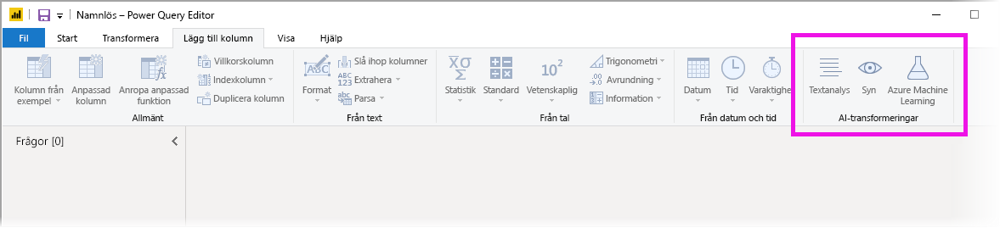

# Använda AI Insights i Power BI Desktop (förhandsversion)

I Power BI kan du använda Alla insikter för att få åtkomst till en samling maskininlärningsmodeller som har tränats i förväg för att förbättra dina dataförberedelser. Alla insikter används i **Power Query-redigeraren** och du når funktionerna via flikarna **Start** och **Lägg till kolumn** i **Power Query-redigeraren**. 

I den här artikeln beskrivs funktioner för Textanalys och Vision, som båda finns i Azure Cognitive Services. I artikeln finns också ett avsnitt som beskriver de anpassade funktionerna som är tillgängliga i Power BI från Azure Machine Learning.

## Så här aktiverar du Alla insikter

Alla insikter i Power BI är en förhandsgranskningsfunktion som måste vara aktiverad. Aktivera den genom att välja **Arkiv > Alternativ och inställningar > Alternativ** och sedan **Förhandsgranskningsfunktioner** i den vänstra kolumnen. I den högra rutan finns alternativet **Funktionsläsaren Alla insikter**. Markera kryssrutan bredvid **Funktionsläsaren Alla insikter** för att aktivera förhandsgranskningsfunktionen. Du måste starta om Power BI Desktop för att förhandsgranskningsfunktionen ska börja gälla.

## Använda Textanalys och Vision

Med Textanalys och Vision i Power BI kan du använda olika algoritmer från [Azure Cognitive Services](https://azure.microsoft.com/services/cognitive-services/) till att utöka dina data i Power Query.

De tjänster som stöds i dag är följande:

* [Attitydanalys](https://docs.microsoft.com/azure/cognitive-services/text-analytics/how-tos/text-analytics-how-to-sentiment-analysis)
* [Extrahering av diskussionsämne](https://docs.microsoft.com/azure/cognitive-services/text-analytics/how-tos/text-analytics-how-to-keyword-extraction)
* [Språkidentifiering](https://docs.microsoft.com/azure/cognitive-services/text-analytics/how-tos/text-analytics-how-to-language-detection)
* [Bildtaggning](https://docs.microsoft.com/azure/cognitive-services/computer-vision/concept-tagging-images). 

Omvandlingarna utförs i Power BI-tjänsten och kräver inte en Azure Cognitive Services-prenumeration. 

> [!IMPORTANT]
> 
> Du måste har Power BI Premium för att kunna använda funktionerna i Textanalys eller Vision.

### Aktivera Textanalys och Vision på Premium-kapaciteter

Cognitive Services stöds för Premium-kapacitetsnoderna EM2, A2, P1 eller senare. En separat AI-arbetsbelastning på kapaciteten används för att köra Cognitive Services. I den allmänt tillgängliga förhandsversionen (före juni 2019) var den här arbetsbelastningen inaktiverad som standard. Innan du använder Cognitive Services i Power BI, måste AI-arbetsbelastningen vara aktiverad i **kapacitetsinställningarna** i administratörsportalen. Du kan aktivera **AI-arbetsbelastningen** i avsnittet **arbetsbelastningar** och definiera den maximala mängd minne som arbetsbelastningen får använda. Den rekommenderade minnesstorleksgränsen är 20 %. Om den här gränsen överskrids kommer frågan att bli långsammare.

### Tillgängliga funktioner

Det här avsnittet beskriver de tillgängliga funktionerna i Cognitive Services i Power BI.

#### Identifiera språk

Funktionen för språkidentifiering utvärderar textinmatningen och returnerar språknamnet och ISO-ID för varje fält. Den här funktionen är användbar för datakolumner som samlar in godtycklig text där språket är okänt. Funktionen förväntar sig data i textformat som indata.

Textanalys kan identifiera upp till 120 språk. Mer information finns i [språk som stöds](https://docs.microsoft.com/azure/cognitive-services/text-analytics/text-analytics-supported-languages).

#### Extrahering av diskussionsämne

Funktionen **Extrahering av diskussionsämne** utvärderar ostrukturerad text och returnerar en lista med viktiga fraser för varje textfält. Funktionen kräver ett textfält som indata och godkänner en valfri inmatning för **Kulturinformation**.

Extrahering av diskussionsämne fungerar bäst när du har större mängder text att arbeta med. Det här är tvärtemot attitydanalys som presterar bäst på mindre block med text. För att få bästa resultat från båda åtgärderna kan du överväga omstrukturering av indata på lämpligt sätt.

#### Bedöma sentiment

Funktionen **Bedöma sentiment** utvärderar textinmatning och returnerar ett sentimentpoäng för varje dokument som sträcker sig från 0 (negativt) till 1 (positivt). Det här är användbart för att upptäcka positiva och negativa attityder i sociala medier, kundrecensioner och diskussionsforum.

Textanalys använder en klassificeringsalgoritm för maskininlärning för att generera ett sentimentpoäng mellan 0 och 1. Poäng närmare 1 anger positiv attityd, poäng närmare 0 indikerar negativ attityd. Modellen har tränats i förväg med en omfattande textmassa med attitydassociationer. Det är för närvarande inte möjligt att ange dina egna träningsdata. Modellen använder en kombination av metoder under textanalys, inklusive textbehandling, en del av tal-analys, ordplacering och ordassociationer. Läs mer om algoritmen i [Introduktion till textanalys](https://blogs.technet.microsoft.com/machinelearning/2015/04/08/introducing-text-analytics-in-the-azure-ml-marketplace/).

Attitydanalys utförs på hela indatafältet, till skillnad från att extrahera attityder för en viss entitet i texten. I praktiken är det en tendens för att bedöma precision för att förbättra när dokumenten innehåller en eller två meningar i stället för ett stort textblock. Under en fas med bedömning av objektivitet avgör modellen om ett inmatningsfält som helhet är objektivt eller innehåller sentiment. Ett indatafält som främst är objektivt går inte vidare till fasen för sentimentspårning, vilket resulterar i en poäng på 0,50 utan fortsatt bearbetning. För inmatningsfält som fortsätter i pipelinen, genererar nästa fas en poäng över eller under 0,50 beroende på graden av sentiment som identifierats i indatafältet.

Attitydanalys stöder för närvarande, engelska, tyska, spanska och franska. Andra språk finns i förhandsversionen. Mer information finns i [språk som stöds](https://docs.microsoft.com/azure/cognitive-services/text-analytics/text-analytics-supported-languages).

#### Tagga bilder

Funktionen **Tagga bilder** returnerar taggar som baseras på fler än tvåtusen identifierbara objekt, levande varelser, landskap och åtgärder. När taggar är tvetydiga eller inte allmänt kända, ges *tips* som förtydligar taggens innebörd i kontexten av en känd miljö. Taggar är inte ordnade som en taxonomi och inga arvshierarkier finns. En samling innehållstaggar utgör grunden för en *bildbeskrivning* som visas på ett mänskligt läsbart språk som är formaterat i fullständiga meningar.

När du laddar upp en bild eller anger en bild-URL, matar algoritmer för Visuellt innehåll ut taggar baserade på objekt, levande varelser och åtgärder som identifierats i bilden. Taggar är inte begränsat till huvudsubjektet, till exempel en person i förgrunden, utan innehåller även omgivningen (inom- eller utomhus), möbler, verktyg, anläggningar, djur, tillbehör, prylar och så vidare.

Den här funktionen kräver en bild-URL eller ett Base 64-fält som indata. För tillfället har bildtaggning stöd för engelska, spanska, japanska, portugisiska och kinesiska (förenklad). Mer information finns i [språk som stöds](https://docs.microsoft.com/rest/api/cognitiveservices/computervision/tagimage/tagimage#uri-parameters).

### Anropa Textanalys- eller Vision-funktioner i Power Query

Om du vill utöka dina data med funktionerna i Textanalys eller Vision, öppnar du **Power Query-redigeraren**. Det här exemplet beskriver sentimentsbedömningar av en text. Samma steg kan användas för att extrahera diskussionsämnen, identifiera språk och tagga bilder.

Välj knappen **Textanalys** i **Start** eller menyfliksområdet **Lägg till kolumn**. Du uppmanas att logga in.

När du har loggat in väljer du den funktion som du vill använda och den datakolumn som du vill transformera i popup-fönstret.

Power BI väljer en Premium-kapacitet där funktionen ska köras och skickar tillbaka resultatet till Power BI Desktop. Den valda kapaciteten används bara för Textanalys- och Vision-funktionen vid programuppdateringar i Power BI Desktop. När rapporten har publicerats körs uppdateringar på arbetsytans Premium- kapacitet som rapporten publicerades till. Du kan ändra kapaciteten som används för alla Cognitive Services i listrutan i det nedre vänstra hörnet i popup-fönstret.

**CultureInfo** är en valfri inmatning för att ange textens språk. Det här fältet är en ISO-kod. Du kan använda en kolumn som indata för Cultureinfo eller ett statiskt fält. I det här exemplet anges språket som engelska (en) för hela kolumnen. Om du lämnar fältet tomt identifierar Power BI språket automatiskt innan du tillämpar funktionen. Välj sedan **Tillämpa.**

Första gången du använder Alla insikter på en ny datakälla uppmanas du att ange sekretessnivån för dina data.

> [!NOTE]
> Uppdateringar av datamängden i Power BI fungerar bara för datakällor där sekretessnivån är inställd som offentlig eller organisation.

När du anropar funktionen läggs resultatet till som en ny kolumn i tabellen. Omvandlingen läggs också till som ett tillämpat steg i frågan.

Vid bildtaggning och extrahering av diskussionsämne kan resultaten returnera flera värden. Varje enskilt resultat returneras i en dubblett av den ursprungliga raden.

### Publicera en rapport med Textanalys- eller Vision-funktioner

När du redigerar i Power Query och utför uppdateringar i Power BI Desktop, kan Textanalys och Vision använda Premium-kapaciteten som valdes i Power Query-redigeraren. När du har publicerat rapporten till Power BI, använder den Premium-kapaciteten för arbetsytan där den publicerades.

Rapporter där Textanalys- och Vision-funktioner används ska publiceras till en arbetsyta som inte finns på en Premium-kapacitet, annars kommer uppdateringen av datamängden att misslyckas.

### Hantera påverkan på en Premium-kapacitet

I följande avsnitt beskrivs hur du kan hantera Textanalys- och Vision-påverkan på kapaciteter.

#### Välja en kapacitet

Rapportförfattare kan välja vilken Premium-kapacitet som Alla insikter ska köras på. Som standard väljer Power BI den först skapade kapaciteten som användaren har åtkomst till.

#### Övervakning med kapacitetsmåttappen

Premium-kapacitetsägare kan övervaka påverkan på Textanalys- och Vision-funktioner på en kapacitet med [kapacitetsmåttappen i Power BI Premium](service-admin-premium-monitor-capacity.md). Appen innehåller detaljerade mätvärden om hälsotillståndet för AI-arbetsbelastningar i din kapacitet. Det översta diagrammet visar minnesförbrukningen för AI-arbetsbelastningar. Premium-kapacitetsadministratörer kan ange en minnesgräns för AI-arbetsbelastningar per kapacitet. När minnesförbrukningen uppnår minnesgränsen kan du antingen öka minnesgränsen eller flytta vissa arbetsytor till en annan kapacitet.

### Jämförelse av Power Query och Power Query Online

Textanalys- och Vision-funktionerna som används i Power Query och Power Query Online är likadana. De enda skillnaderna är följande:

* Power Query har separata knappar för Textanalys, Vision och Azure Machine Learning. I Power Query Online kombineras dessa i en meny.
* I Power Query kan rapportförfattaren välja den Premium-kapacitet som ska användas för att köra funktionerna. Detta krävs inte i Power Query Online, eftersom dataflödet redan finns på en specifik kapacitet.

### Överväganden och begränsningar i Textanalys

Det finns några överväganden och begränsningar som du bör tänka på när du använder Textanalys.

* Stegvis uppdatering stöds, men kan orsaka prestandaproblem när det används i frågor med Alla insikter.
* DirectQuery stöds inte.

## Använda Azure ML

Många organisationer använder **Machine Learning**-modeller för bättre insikter och förutsägelser om verksamheten. Möjligheten att visualisera och anropa insikter från dessa modeller i dina rapporter och instrumentpaneler och andra analyser kan hjälpa att sprida dessa insikter till företagsanvändare som behöver dem som mest. Power BI gör det enkelt att införliva insikter från modeller som hanteras i Azure Machine Learning med hjälp av enkla peka och klicka-åtgärder.

Om du vill använda den här funktionen kan en datatekniker bevilja åtkomst till Azure ML-modellen till den BI-analytikern som använder Azure Portal. I början av varje session identifierar Power Query sedan alla Azure ML-modeller som användaren har åtkomst till och visar dem som dynamiska Power Query-funktioner. Användaren kan sedan anropa dessa funktioner genom att öppna dem i menyfliksområdet i Power Query-redigeraren, eller genom att anropa M-funktionen direkt. Power BI slår automatiskt ihop åtkomstbegäranden då Azure ML-modellen anropas för en uppsättning rader för att få bättre prestanda.

Den här funktionen stöds i Power BI Desktop, Power BI-dataflöden och för Power Query Online i Power BI-tjänsten.

Mer information om dataflöden finns i [Självbetjänad dataförberedelse i Power BI](service-dataflows-overview.md).

Om du vill veta mer om Azure Machine Learning kan du läsa följande artiklar:

- Översikt: [Vad är Azure Machine Learning?](https://docs.microsoft.com/azure/machine-learning/service/overview-what-is-azure-ml)
- Snabbstarter och självstudier för Azure Machine Learning: [Dokumentation om Azure Machine Learning](https://docs.microsoft.com/azure/machine-learning/)

### Bevilja åtkomst till en Azure ML-modell

För att komma åt Azure ML-modellen från Power BI, måste användaren ha **Läs**-åtkomst till Azure-prenumerationen. Dessutom måste följande finnas:

- För Machine Learning Studio-modeller (klassisk) behövs **Läs**-åtkomst till webbtjänsten för Machine Learning Studio (klassisk)
- För Machine Learning-modeller behövs **Läs**-åtkomst till Machine Learning-arbetsytan

Stegen i den här avsnittet beskriver hur du ger Power BI-användare åtkomst till en modell som finns i Azure ML-tjänsten, så att de får åtkomst till modellen som en Power Query-funktion. Mer information finns i [Hantera åtkomst med RBAC och Azure Portal](https://docs.microsoft.com/azure/role-based-access-control/role-assignments-portal).

1. Logga in på [Azure-portalen](https://portal.azure.com/).
2. Gå till sidan **Prenumerationer**. Du hittar sidan **Prenumerationer** i listan **Alla tjänster** i den vänstra navigeringsmenyn i Azure Portal.
3. Välj din prenumeration
4. Välj **Åtkomstkontroll (IAM)** och sedan knappen **Lägg till**.
5. Välj **Läsare** som rollen. Välj den Power BI-användare som du vill bevilja åtkomst till Azure ML-modellen för.
6. Välj **Spara**
7. Upprepa steg tre till sex för att bevilja **Läsar**-åtkomst till användaren för den specifika Machine Learning Studio-webbtjänsten (klassisk) *eller* den Machine Learning-arbetsyta som är värd för modellen.

### Identifiering av schema för Machine Learning-modeller

Dataforskare använder i första hand Python för att utveckla och distribuera även sina maskininlärningsmodeller för Machine Learning. Till skillnad från Machine Learning Studio (klassisk), som hjälper till att automatisera uppgiften med att skapa en schemafil för modellen, måste dataforskaren när det gäller Machine Learning uttryckligen skapa schemafilen med hjälp av Python.

Den här schemafilen måste inkluderas i den distribuerade webbtjänsten för Machine Learning-modeller. För att automatiskt generera schemat för webbtjänsten måste du ange ett exempel på indata/utdata i inmatningsskriptet för den distribuerade modellen. Se underavsnittet i tjänstdokumentationen om [(Valfritt) Automatisk generering av Swagger-schema för distribution av modeller med Azure Machine Learning](https://docs.microsoft.com/azure/machine-learning/service/how-to-deploy-and-where#optional-automatic-schema-generation). Länken innehåller exempelinmatningsskriptet med instruktionerna för schemagenerering.

Specifikt refererar funktionerna _@input\_schema_ och _@output\_schema_ i inmatningsskriptet till indata- och utdataexempelformaten i variablerna _input\_sample_ och _output\_sample_, samt använder dessa exempel för att generera en OpenAPI-specifikation (Swagger) för webbtjänsten under distributionen.

Dessa instruktioner för schemagenerering genom uppdatering av inmatningsskriptet måste även tillämpas på de modeller som skapas med hjälp av automatiserade maskininlärningsexperiment via Azure Machine Learning SDK.

> [!NOTE]
> Modeller som skapats med hjälp av det visuella gränssnittet i Azure Machine Learning stöder för närvarande inte schemagenerering, men kommer att göra det i senare versioner.
> 
### Anropa en Azure ML-modell i Power Query

Du kan anropa alla Azure ML-modeller som du har åtkomst till direkt från Power Query-redigeraren. Om du vill komma åt Azure ML-modellerna väljer du **Azure Machine Learning** i menyfliksområdet **Start** eller **Lägg till kolumn** i Power Query-redigeraren.

Alla Azure ML-modeller som du har åtkomst till visas här som Power Query-funktioner. Dessutom mappas automatiskt indataparametrarna för Azure ML-modellen som parametrar för motsvarande Power Query-funktion.

Du kan ange någon av den valda entitetens kolumner som indata från listrutan för att anropa en Azure ML-modell. Du kan också ange ett konstant värde som ska användas som indata genom att klicka på kolumnikonen till vänster om dialogrutan Indata.

Välj **OK** för att visa förhandsversionen av Azure ML-modellens utdata som en ny kolumn i entitetstabellen. Du kan även se modellanropet som ett tillämpat steg för frågan.

Om modellen returnerar flera utdataparametrar, grupperas de tillsammans som en post i utdatakolumnen. Du kan expandera kolumnen för att skapa enskilda utdataparametrar i separata kolumner.

### Överväganden och begränsningar för Azure ML

Följande överväganden och begränsningar gäller för Azure ML i Power BI Desktop.

* Modeller som skapats med hjälp av det visuella gränssnittet i Azure Machine Learning stöder för närvarande inte schemagenerering. Stödet för detta kommer att lanseras i senare versioner.
* Stegvis uppdatering stöds, men kan orsaka prestandaproblem när det används i frågor med Alla insikter.
* DirectQuery stöds inte.

## Nästa steg

Den här artikeln visade en översikt över integreringen av Machine Learning i Power BI Desktop. Följande artiklar kan också vara intressanta och användbara.

- [Självstudie: Anropa en Machine Learning Studio-modell (klassisk) i Power BI](service-tutorial-invoke-machine-learning-model.md)
- [Självstudie: Använda Cognitive Services i Power BI](service-tutorial-use-cognitive-services.md)
- [Cognitive Services i Power BI](service-cognitive-services.md)
- [Azure Machine Learning-integrering i Power BI](service-machine-learning-integration.md)
- [Övervaka Premium-kapaciteter med appen](service-admin-premium-monitor-capacity.md)
- [AI-mått i kapacitetsmåttappen för Premium](https://powerbi.microsoft.com/blog/ai-metrics-now-available-in-power-bi-premium-capacity-metrics-app/)
