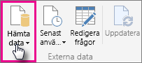
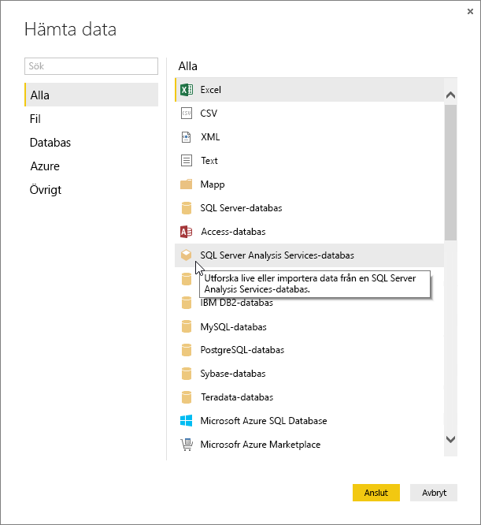
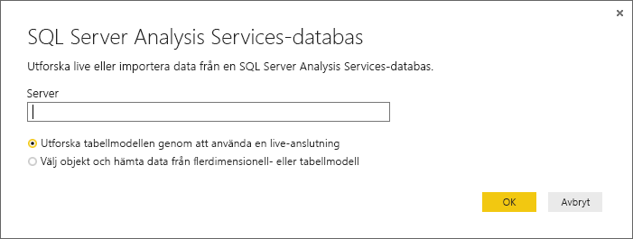
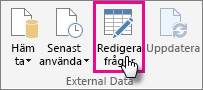
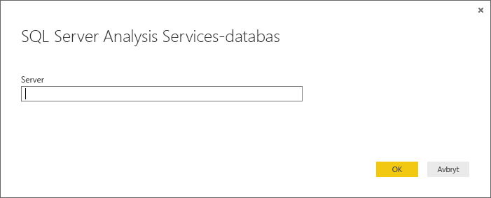

# Använda Analysis Services-tabelldata i Power BI Desktop
Med Power BI Desktop finns det två sätt att ansluta till och hämta data från SQL Server Analysis Services-tabellmodellerna: Utforska genom att använda en live-anslutning eller Välj objekt och importera till Power BI Desktop.

Låt oss ta en närmare titt.

**Utforska genom att använda en live-anslutning** – När du använder en live-anslutning kommer objekten i din tabellmodell eller ditt perspektiv, t.ex. tabeller, kolumner och mått, visas i listan med Power BI Desktop-fält. Du kan använda Power BI Desktops avancerade visualiserings- och rapportverktyg till att utforska din tabellmodell på nya interaktiva sätt.

När du ansluter live importeras inte några data från tabellmodellen till Power BI Desktop. Varje gång du interagerar med en visualisering frågar Power BI Desktop efter tabellmodellen och beräknar resultatet som visas. Du ser alltid de senaste data som är tillgängliga i tabellmodellen, antingen från den senaste bearbetningstiden eller från Direct Query-tabeller som är tillgängliga i tabellmodellen. 

Kom ihåg att tabellmodeller är mycket säkra. Vilka objekt som visas i Power BI Desktop beror på din behörighet för tabellmodellen du är ansluten till.

När du har skapat dynamiska rapporter i Power BI Desktop kan du dela dem genom att publicera dem på Power BI-webbplatsen. När du publicerar en Power BI Desktop-fil med en live-anslutning till en tabellmodell på Power BI-webbplatsen, måste en lokal datagateway vara installerad och konfigurerad av en administratör. Läs mer i [Lokal datagateway](service-gateway-onprem.md).

**Välj poster och importera till Power BI Desktop** – När du ansluter med det här alternativet kan du välja objekt som tabeller, kolumner och mått i tabellmodellen eller perspektivet och läsa in dem i en Power BI Desktop-modell. Du kan använda Power BI Desktops avancerade frågeredigerare till att ytterligare utforma som du vill. Du kan använda Power BI Desktops modelleringsfunktioner till att ytterligare modellera datan. Live-anslutning mellan Power BI Desktop och tabellmodellen behålls inte. Du kan sedan utforska din Power BI Desktop-modell offline eller publicera på Power BI-webbplatsen.

## Ansluta till en tabellmodell
1. I Power BI Desktop går du till fliken **Start** och klickar på **Hämta data**.
   
   
2. Klicka på **SQL Server Analysis Services-databas** och sedan på **Anslut**.
   
   
3. Ange namnet på servern och välj ett anslutningsläge. 
   
   
4. Det här steget beror på vilket anslutningsläge du har valt:

* Om du ansluter live i navigatören väljer du en tabellmodell eller ett perspektiv.
  
  
* Om du valde Välj objekt och hämta data i navigatören, väljer du en tabellmodell eller ett perspektiv. Du kan sedan välja att endast specifika tabeller eller kolumner ska läsas in. Klicka på Redigera om du vill öppna frågeredigeraren för att utforma dina data innan du läser in dem. När du är klar klickar du på Läs in för att importera data till Power BI Desktop.

  

## Vanliga frågor och svar
**Fråga:** Behöver jag en lokal datagateway?

**Svar:** Det beror på. Om du använder Power BI Desktop för att ansluta live till en tabellmodell, men inte har för avsikt att publicera till Power BI-webbplatsen behöver du inte någon gateway. Men om du tänker publicera på din Power BI-webbplats måste du ha en datagateway för att säkerställa skyddad kommunikation mellan Power BI-tjänsten och den lokala Analysis Services-servern. Kontakta administratören för Analysis Services-servern innan du installerar en datagateway.

Om du valde Välj objekt och hämta data importerar du tabellmodelldata till din Power BI Desktop-fil, så ingen gateway behövs.

**Fråga:** Vad är skillnaden mellan att ansluta live till en tabellmodell från Power BI-tjänsten och att ansluta live från Power BI Desktop?

**Svar:** När du ansluter live till en tabellmodell från webbplatsen i Power BI-tjänsten till en Analysis Services-databas lokalt i din organisation, måste du ha en lokal datagateway för att skydda kommunikationen mellan dem. När du ansluter live till en tabellmodell från Power BI Desktop krävs ingen gateway eftersom både Power BI Desktop och Analysis Services-servern som du ansluter till körs lokalt i din organisation. Men om du publicerar din Power BI Desktop-fil på Power BI-webbplatsen krävs en gateway.

**Fråga:** Om jag har skapat en live-anslutning kan jag ansluta till en annan datakälla i samma Power BI Desktop-fil?

**Svar:** Nej. Du kan inte utforska realtidsdata och ansluta till en annan typ av datakälla i samma fil. Om du redan har importerat data eller anslutit till en annan datakälla i Power BI Desktop-filen, måste du skapa en ny fil och utforska den live.

**Fråga:** Om jag har skapat en live-anslutning, kan jag redigera modellen eller frågan i Power BI Desktop?

**Svar:** Du kan skapa mått på rapportnivå i Power BI Desktop, men alla andra fråge- och modelleringsfunktioner inaktiveras när du utforskar realtidsdata.

**Fråga:** Om jag har skapat en live-anslutning, är den säker?

**Svar:** Ja. Dina aktuella Windows-autentiseringsuppgifter används för att ansluta till Analysis Services-servern. Du kan inte använda grundläggande eller lagrade autentiseringsuppgifter i Power BI-tjänsten eller Power BI Desktop när du utforskar live.

**Fråga:** I navigatören ser jag både en modell och ett perspektiv. Vad är skillnaden?

**Svar:** Ett perspektiv är en viss vy av en tabellmodell. Den kan innehålla enbart specifika tabeller, kolumner eller mått, beroende på det unika dataanalysbehovet. En tabellmodell innehåller alltid minst ett perspektiv, som kan omfatta allt i modellen. Om du är osäker vad du bör välja kan du kontrollera med administratören.

## Ändra servernamnet efter den första anslutningen
När du skapar en Power BI Desktop-fil med en utforskad live-anslutning kan det finnas tillfällen när du vill byta anslutning till en annan server. Exempelvis om du skapade din Power BI Desktop-fil när du anslöt till en utvecklingsserver och innan du publicerar till Power BI-tjänsten vill du byta anslutning till produktionsservern.

1. Välj **Redigera frågor** i menyfliksområdet.
   
   
2. Ange det nya servernamnet.
   
   
   
   
## Felsökning 
I följande lista beskrivs alla kända problem vid anslutning till SQL Server Analysis Services (SSAS) eller Azure Analysis Services. 

* **Fel: Det gick inte att läsa in modellschemat** – det här felet inträffar vanligtvis när användaren som ansluter till Analysis Services inte har åtkomst till databasen eller modellen.

