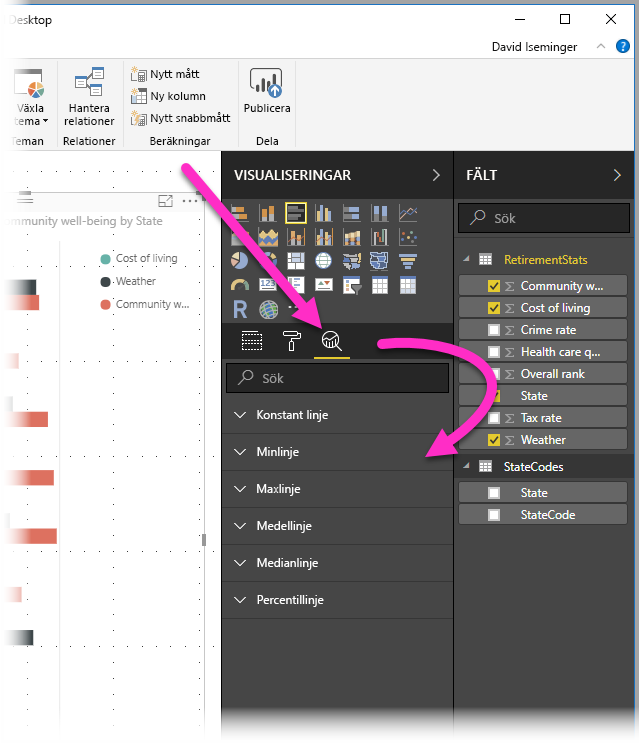
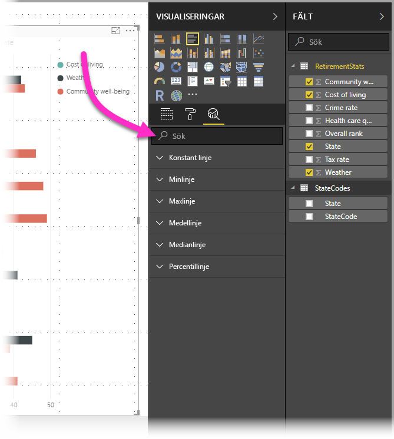
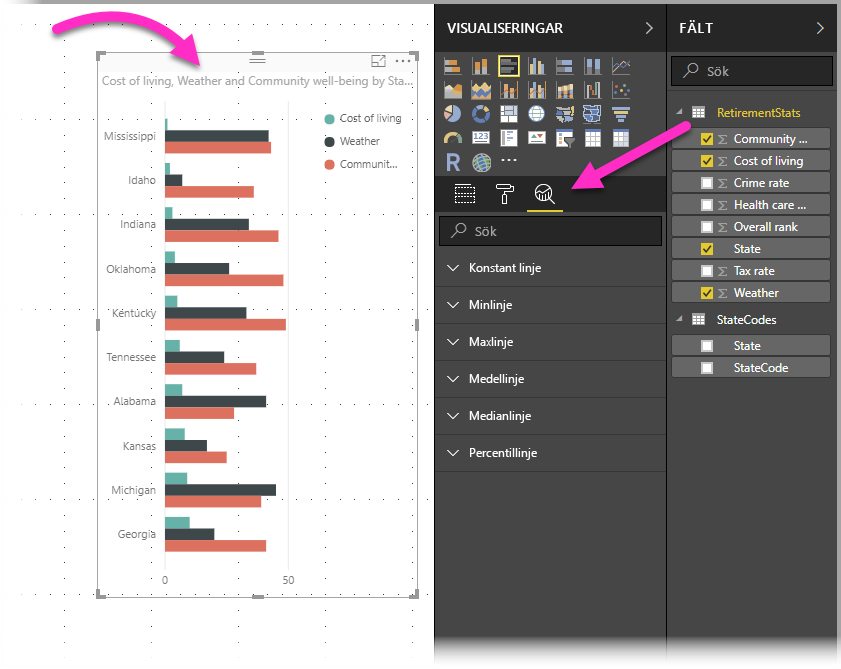
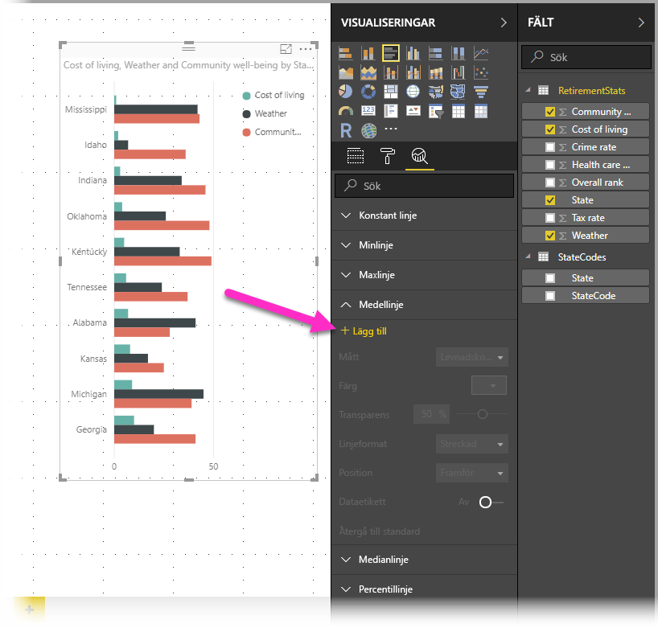
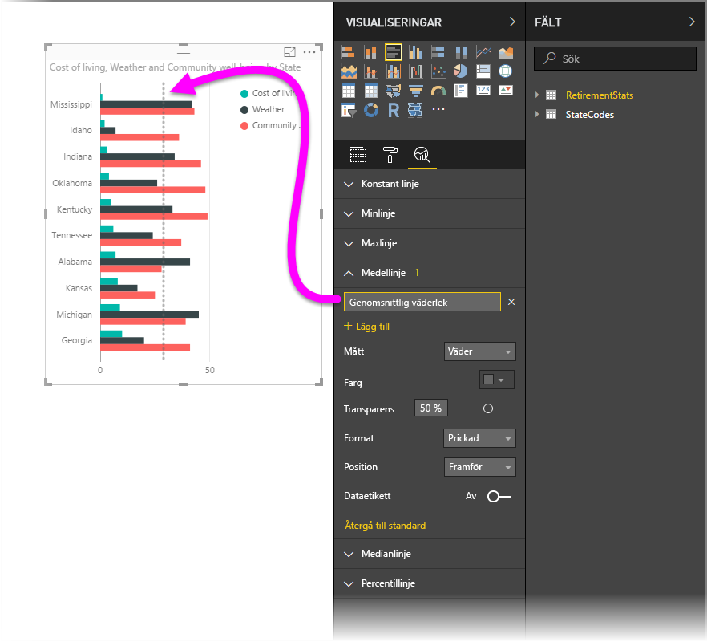
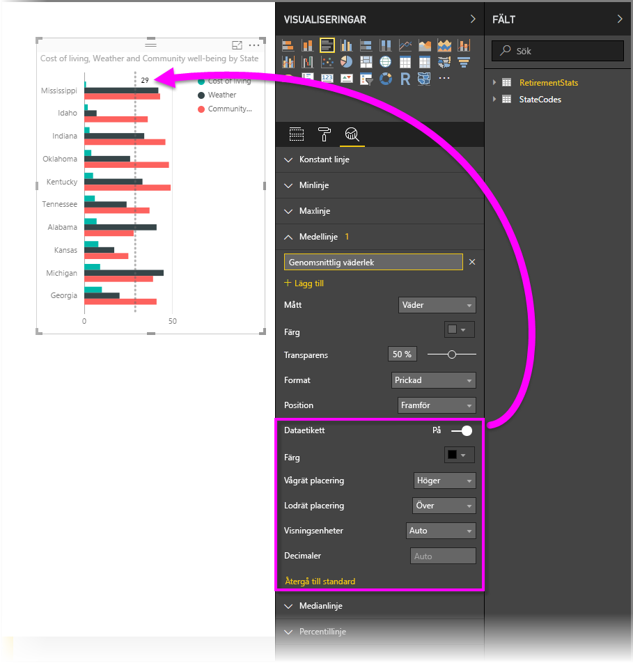
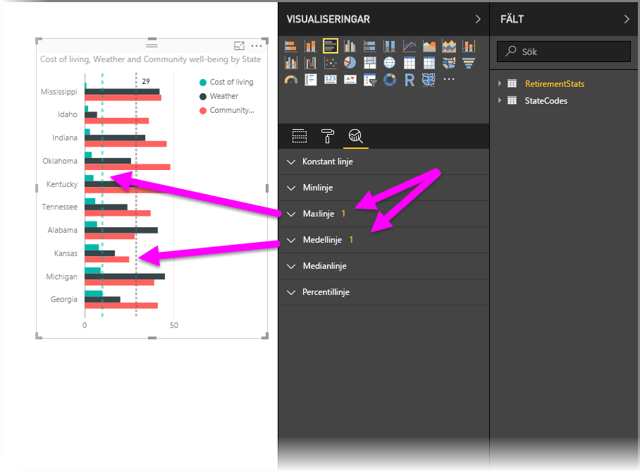
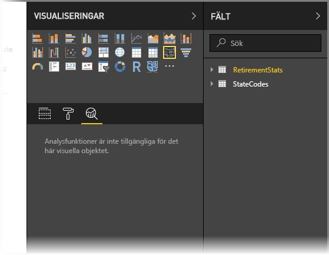
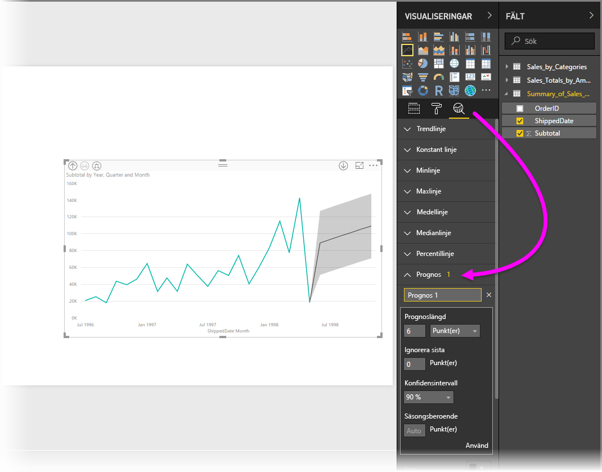

# Använda Analytics-fönstret i Power BI Desktop
Med fönstret **Analytics** i **Power BI Desktop** kan du lägga till dynamiska *referenslinjer* i visuella objekt och ange fokus för viktiga trender eller analyser. Fönstret **Analystics** finns i området **Visualiseringar** i Power BI Desktop.

> [!NOTE]
> Fönstret **Analytics** visas bara när du markerar ett visuellt objekt på arbetsytan för Power BI Desktop.

## Söka i fönstret Analytics
Från och med lanseringen av **Power BI Desktop** i februari 2018 (version 2.55.5010.201 eller senare), kan du söka i fönstret **Analytics**, vilket är en underdel av fönstret **Visualiseringar**. Såsom visas på bilden nedan, visas sökrutan när fönstret **Analytics** är markerat.

## Använda fönstret Analytics
I fönstret **Analytics** kan du skapa följande typer av dynamiska referenslinjer (alla rader är inte tillgängliga för alla typer av visuella objekt):

* X-axel konstant linje
* Y-axel konstant linje
* Minimilinje
* Maxlinje
* Medellinje
* Medianlinje
* Percentillinje

Följande avsnitt visar hur du kan använda fönstret **Analytics** och dynamiska referenslinjer i dina visualiseringar.

Följ dessa steg om du vill visa tillgängliga dynamiska referenslinjer för ett visuellt objekt:

1. Välj eller skapa ett visuellt objekt och välj sedan ikonen **Analytics** i avsnittet **Visualiseringar**.
   
   
2. Välj nedåtpilen för den typ av linje som du vill skapa för att visa dess alternativ. I det här fallet väljer vi **Medellinje**.
   
   
3. Om du vill skapa en ny linje väljer du **+ Lägg till**. Du kan sedan ange ett namn på linjen genom att dubbelklicka på textrutan och sedan skriva ditt namn.
   
   Det finns många typer av alternativ för linjer, till exempel att välja *färg*, *genomskinlighet*, *stil* och *position* (i förhållande till det visuella objektets dataelement), samt om du vill inkludera etiketten. Du kan dessutom välja vilka **Mått** i det visuella objektet som du vill att linjen ska baseras på genom att markera listrutan **Mått**, som fylls i automatiskt med dataelement från det visuella objektet. I det här fallet väljer vi *Väder*  som mått, märker den *Genomsnittligt väder* och anpassar några av de andra alternativen enligt nedan.
   
   
4. Om du vill visa dataetiketten flyttar du skjutreglaget **Dataetikett** till På. När du gör detta får du en mängd ytterligare alternativ för din dataetikett, enligt nedanstående bild.
   
   
5. Observera siffran som visas bredvid objektet **Medellinje** i fönstret **Analytics**. Det anger hur många dynamiska linjer som det för närvarande finns i ditt visuella objekt, samt vilken typ de är. Om vi lägger till en **Maxlinje** för *Levnadskostnader* kan du se att fönstret **Analytics** nu visar att vi också har en **Maxlinje** för den dynamiska referenslinje som tillämpas på det visuella objektet.
   
   

Om det visuella objekt som du har valt inte kan ha dynamiska referenslinjer (i det här fallet **Karta**), visas följande när du väljer fönstret **Analytics**.

Det finns många typer av intressanta analyser som du kan lyfta fram genom att skapa dynamiska referenslinjer i fönstret **Analytics**.

Vi planerar fler funktioner, inklusive fler visuella objekt som kan ha dynamiska referenslinjer, så håll ögonen öppna efter nyheter.

## Tillämpa prognostisering
Du kan använda funktionen **Prognos** genom att välja ett visuellt objekt och sedan expandera avsnittet **Prognos** i fönstret **Analytics**. Du kan ange många olika inmatningar för att ändra prognostiseringen, t.ex. *Prognoslängd*, *Konfidensintervall* med mera. Följande bild visar en grundlinje för det visuella objektet med prognostisering tillämpad, men du kan använda din fantasi (och testa funktionen för *prognostisering* på olika sätt) för att se hur den kan användas på dina modeller.

## Begränsningar
Möjligheten att använda dynamiska referenslinjer beror på vilken typ av visuellt objekt som används. I följande lista visas vilka dynamiska linjer som är tillgängliga för de olika visuella objekten:

Alla dynamiska linjer är tillgängliga i följande visuella objekt:

* Ytdiagram
* Linjediagram
* Punktdiagram
* Grupperat stående stapeldiagram
* Grupperat liggande stapeldiagram

Följande visuella objekt kan bara använda en *konstant linje* från fönstret **Analytics**:

* Staplad yta
* Liggande stapel
* Stående stapel
* 100 % liggande stapeldiagram
* 100 % stående stapeldiagram

För följande visuella objekt är *trendlinjen* för närvarande det enda alternativet:

* Ej staplad linje
* Grupperat stående stapeldiagram

Slutligen går det för närvarande inte att använda icke-kartesiska visuella objekt med dynamiska linjer från fönstret **Analytics**, till exempel:

* Matris
* Cirkeldiagram
* Ring
* Tabell

Percentilraden finns bara när du använder importerade data i **Power BI Desktop** eller när du är ansluten live till en modell på en server som kör **Analysis Service 2016** eller senare, **Azure Analysis Services**, eller en datauppsättning på Power BI-tjänsten. 

## Nästa steg
Det finns olika typer av saker som du kan göra med Power BI Desktop. Läs följande resurser för mer information om dess möjligheter:

* [Nyheter i Power BI Desktop](desktop-latest-update.md)
* [Ladda ned Power BI Desktop](desktop-get-the-desktop.md)
* [Komma igång med Power BI Desktop](desktop-getting-started.md)
* [Frågeöversikt med Power BI Desktop](desktop-query-overview.md)
* [Datatyper i Power BI Desktop](desktop-data-types.md)
* [Forma och kombinera data i Power BI Desktop](desktop-shape-and-combine-data.md)
* [Vanliga frågeuppgifter i Power BI Desktop](desktop-common-query-tasks.md)    

