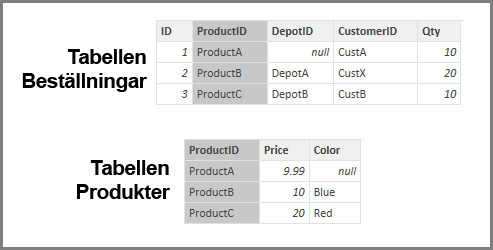

# Anta inställnings för referensintegritet i Power BI Desktop
När du ansluter till en datakälla med **DirectQuery** kan du använda valet **Förutsätt referensintegritet** för att göra körningen av dina frågor mot datakällan mer effektiv. Den här funktionen har några krav på underliggande data och är endast tillgänglig när du använder **DirectQuery**.

När du väljer **förutsätter referensintegritet** möjliggörs frågor på datakällan som ska använda **INNER JOIN**-instruktioner i stället **OUTER JOIN**, vilket förbättrar frågans effektiviteten.

## Krav för att använda Förutsätt referensintegritet
Detta är en avancerad inställning och aktiveras endast när du ansluter till data med hjälp av **DirectQuery**. Följande krav måste uppfyllas för att **Förutsätt referensintegritet** ska fungera korrekt:

* Data i kolumnen **Från** kolumnen i relationen får aldrig vara *Null* eller *Tom*
* För varje värde i kolumnen **Från** finns det ett motsvarande värde i kolumnen **Till**

I den här kontexten är **Från**-kolumnen värdet *Många* i en *en-till-många*-relation eller kolumnen i den första tabellen i en *en-till-en*-relation.

## Användningsexempel för Förutsätt referensintegritet
Exemplet nedan visar hur **Förutsätt referensintegritet** beter sig när det används i dataanslutningar. Exemplet ansluter till en datakälla som innehåller tabellerna **Beställningar**, **Produkter** och **Depåer**.

1. Följande bild visar tabellerna **Beställningar** och **Produkter**. Observera att det finns en referensintegritet mellan **Beställningar [ProductID]** och **Produkter [ProductID]**. Kolumnen **[ProductID]** i tabellen **Beställningar** är aldrig *Null* och varje värde visas också i tabellen **Produkter**. Därför ska **Förutsätt referensintegritet** anges för att få mer effektiva frågor (med den här inställningen inte ändras de värden som visas i visuella objekt).
   
   
2. I nästa bild kan du lägga märke till att det inte finns någon referensintegritet mellan **Beställningar [DepotID]** och **Depåer [DepotID]** eftersom **DepotID** är *Null*  för vissa *Beställningar*. Därför bör **Förutsätt referensintegritet** *inte* anges.
   
   
3. Slutligen förekommer ingen referensintegritet mellan **Beställningar [CustomerID]** och **Kunder [CustID]** i följande tabeller. **CustomerID** innehåller vissa värden (i det här fallet *CustX*) som inte finns i tabellen *Kunder*. Därför bör **Förutsätt referensintegritet** *inte* anges.
   
   

## Användningsexempel för Förutsätt referensintegritet
Om du vill aktivera den här funktionen ska du markera kryssrutan bredvid **Förutsätt referensintegritet**, vilket visas i följande bild.

När du väljer den här inställningen valideras den mot data så det inte finns några *Null* eller felmatchade rader. *Men*, i fall med ett mycket stort antal värden är denna kontroll ingen garanti för att det inte finns några problem med referensintegritet.

Kontrollen sker vid tidpunkten för redigering av relationen, och dessutom har *inte* återspeglar eventuella efterföljande ändringar av data.

## Vad händer om du anger Förutsätt referensintegritet av misstag?
Om du ställer in **Förutsätt referensintegritet** när problem med referensintegritet finns i dessa data leder det inte till fel. Men att det leder till tydliga inkonsekvenser i data. Till exempel, i fall med relationer i tabellen **Depåer** som beskrivs ovan uppstår följande resultat:

* Ett visuellt objekt visar det totala antalet *Beställningsantal* visas värdet 40
* Ett visuellt objekt med det totala *Beställningsantalet efter anläggningen Stad* skulle endast visa ett totalt värde på *30*, eftersom den inte innehåller beställnings-ID 1, där **DepotID** är *Null* .

## Nästa steg
Läs mer om [DirectQuery](desktop-use-directquery.md)

Hämta mer information om [Relationer i Power BI](desktop-create-and-manage-relationships.md)

Läs mer om [Relationsvy i Power BI Desktop](desktop-relationship-view.md).

